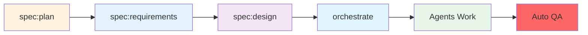

# Simplified Agent-Driven Development Methodology

This methodology leverages specialized AI agents to handle complex software development tasks while maintaining simplicity and quality.

## Core Philosophy

**"Let the experts handle the complexity"** - Use specialized agents for what they do best while keeping the command structure simple.

## Simplified Workflow



### Phase 1: Planning & Specification
1. **Plan** (`/spec:plan`) - Break down project into features
2. **Requirements** (`/spec:requirements`) - Define WHAT using EARS format
3. **Design** (`/spec:design`) - Define HOW technically

### Phase 2: Implementation
4. **Orchestrate** (`/orchestrate`) - Smart agent coordination
   - Analyzes user story
   - Selects needed agents automatically
   - Coordinates their work
   - Runs mandatory QA

### Phase 3: Quality Assurance
5. **QA** (`/qa`) - Automatic at end of orchestration
   - Code style fixes
   - Modernization
   - Test execution
   - Static analysis

## EARS Format (Easy Approach to Requirements Syntax)

### Templates
1. **Ubiquitous**: "The system SHALL [requirement]"
2. **Event-Driven**: "WHEN [trigger] THEN the system SHALL [response]"  
3. **State-Driven**: "WHILE [state] the system SHALL [requirement]"
4. **Conditional**: "IF [condition] THEN the system SHALL [requirement]"
5. **Optional**: "WHERE [feature included] the system SHALL [requirement]"

### Best Practices
- Use "SHALL" for mandatory requirements
- Be specific and measurable
- One requirement per statement
- Make requirements testable

## Available Expert Agents

The orchestrator automatically coordinates these specialists:

### Development Agents
- **domain-expert** - Domain modeling and DDD
- **maker-expert** - Code generation using DDD makers
- **tdd-expert** - Test-driven implementation
- **api-platform-expert** - REST API development
- **admin-ui-expert** - Admin interface creation

### Quality Agents
- **code-reviewer** - Code quality review
- **security-auditor** - Security checks
- **performance-optimizer** - Performance tuning
- **architecture-validator** - Architecture compliance

## What Changed?

### Old System (Complex)
- Multiple command hierarchies
- Manual task generation
- Separate implementation commands
- Complex workflows

### New System (Simple)
- Only 3 command groups
- Agents handle complexity
- Integrated workflows
- Automatic quality checks

## Quick Start

1. **Plan your feature**:
   ```bash
   /spec:plan "E-commerce platform"
   ```

2. **Define requirements**:
   ```bash
   /spec:requirements checkout-process
   ```

3. **Design the solution**:
   ```bash
   /spec:design
   ```

4. **Let agents implement**:
   ```bash
   /orchestrate checkout-process --context commerce
   ```

That's it! The agents handle all the complexity.

## Key Benefits

- **Simpler** - Only 3 command groups
- **Smarter** - Agents have expertise built-in
- **Faster** - Automatic coordination
- **Better** - Consistent quality

## Mandatory Quality Standards

Every feature MUST pass:
- ✅ Unit tests (PHPUnit)
- ✅ Functional tests (Behat)
- ✅ Code style (ECS)
- ✅ Static analysis (PHPStan)
- ✅ Modernization (Rector)
- ✅ Template formatting (Twig)

Quality checks run automatically at the end of orchestration.

---

Remember: Focus on your business requirements. Let the agents handle the technical complexity.