# Spec-Driven Agentic Development Methodology

This methodology provides a structured, iterative approach to software development with explicit approval gates and quality controls. It transforms complex feature development into a series of manageable, well-defined phases.

## Core Workflow

### Phase Structure
1. **Planning** - Break down a project goal into manageable features
2. **Requirements** - Define WHAT needs to be built for a feature using EARS
3. **Design** - Define HOW it will be built with technical specifications
4. **Tasks** - Break down into implementable steps with TDD methodology
5. **Implementation** - Code development following structured tasks
6. **Quality Assurance** - Mandatory automated validation and fixes

### Command-Driven Workflow
Use focused slash commands for reliable, efficient development:


1. **Planning Phase**:
   - Run `/spec:plan [project-description]` to break down the project into features.
   - This creates feature directories and basic `requirements.md` files.

2. **Requirements Phase**:
   - Run `/spec:requirements [feature-name]` to detail the EARS-formatted requirements for a feature.

3. **Design Phase**:
   - After requirements approval, run `/spec:design` to generate technical design
   - This creates design.md with architecture and implementation approach

4. **Tasks Phase**:
   - After design approval, run `/act` to break down into TDD tasks
   - This creates tasks.md with structured implementation plan

5. **Implementation Phase**:
   - Choose implementation approach (TDD, standard, collaborative, or self-implementation)
   - Follow the structured task breakdown

6. **Quality Assurance Phase** 🚨 **MANDATORY**:
   - Automatically executed at the end of `/agent:orchestrate`
   - Runs `/utils:qa fix all` to ensure code quality
   - No feature is complete without passing QA

### Key Benefits of Command Approach
- **Focused Commands**: Each command has a specific, well-defined purpose
- **Better Context Management**: Smaller, targeted operations reduce complexity
- **Iterative Refinement**: Easy to modify individual phases
- **User Control**: Clear approval gates between each phase
- **Tool Integration**: Leverages Claude Code's native slash command features

### Key Principles
- **Explicit Approval Gates**: Always request approval before proceeding to next phase
- **EARS Requirements**: Use structured requirement syntax for clarity and testability
- **Test-Driven Development**: Implement using Red-Green-Refactor cycle
- **Iterative Refinement**: Allow multiple iterations within each phase
- **User Control**: Maintain user oversight throughout the process

## EARS Format (Easy Approach to Requirements Syntax)

### Templates
1. **Ubiquitous**: "The system SHALL [requirement]"
2. **Event-Driven**: "WHEN [trigger] THEN the system SHALL [response]"  
3. **State-Driven**: "WHILE [state] the system SHALL [requirement]"
4. **Conditional**: "IF [condition] THEN the system SHALL [requirement]"
5. **Optional**: "WHERE [feature included] the system SHALL [requirement]"

### Best Practices
- Use active voice and "SHALL" for mandatory requirements
- Be specific and measurable (avoid "quickly", use "within 2 seconds")
- One requirement per statement
- Avoid ambiguous terms ("appropriate", "reasonable", "user-friendly")

### Examples
- "WHEN a user enters incorrect credentials three times THEN the system SHALL lock the account for 15 minutes"
- "WHILE processing a payment the system SHALL display a loading indicator"
- "IF inventory is insufficient THEN the system SHALL display an out-of-stock message"

## Test-Driven Development (TDD)

### Red-Green-Refactor Cycle
1. **Red**: Write a failing test for next functionality
2. **Green**: Write minimal code to make test pass
3. **Refactor**: Improve code while keeping tests green

### Benefits
- Requirements validation through executable tests
- Early design feedback and issue detection
- Built-in documentation through test scenarios
- Safe refactoring with comprehensive test coverage

### Implementation Flow
1. Start with acceptance criteria from tasks as test scenarios
2. Write unit tests for components and functions
3. Write integration tests for APIs and data operations
4. Implement code incrementally to satisfy tests
5. Refactor continuously while maintaining green tests

## Interactive Workflow Patterns

### Requirements Phase
- Agent creates requirements.md using EARS format
- Agent asks: "Do the requirements look good? Ready for design phase?"
- User reviews, approves, or requests changes

### Design Phase  
- Agent creates design.md addressing all requirements
- Agent asks: "Does this technical approach work? Ready for task breakdown?"
- User reviews technical decisions and approves/modifies

### Tasks Phase
- Agent creates tasks.md with TDD methodology
- Agent asks: "Do these implementation tasks look comprehensive? Ready to begin development?"
- User validates task breakdown and sequencing

### Implementation Phase
- Agent proposes TDD approach for implementation
- User chooses: TDD, standard implementation, self-implementation, or collaborative
- Agent follows chosen approach with regular check-ins

## Quality Gates

### Requirement Validation
- [ ] Uses proper EARS syntax
- [ ] Requirements are testable and specific
- [ ] All conditions clearly defined
- [ ] No ambiguous terms used
- [ ] Covers all user scenarios

### Design Validation  
- [ ] Addresses all requirements
- [ ] Technical approach is sound
- [ ] Scalability considerations included
- [ ] Security aspects addressed
- [ ] Integration points defined

### Task Validation
- [ ] Tasks are granular and actionable
- [ ] Proper sequencing and dependencies
- [ ] Test scenarios included
- [ ] Acceptance criteria defined
- [ ] Implementation approach clear

### Quality Assurance Validation 🚨 **MANDATORY**
- [ ] All unit tests pass (PHPUnit)
- [ ] All functional tests pass (Behat)
- [ ] Code style compliant (ECS)
- [ ] Static analysis passes (PHPStan)
- [ ] Code modernized (Rector)
- [ ] Templates formatted (Twig CS Fixer)

## File Structure

```
project/
├── CLAUDE.md                 # This methodology (Claude Code will reference)
├── .claude/
│   ├── commands/
│   │   ├── spec/             # Spec-driven methodology commands
│   │   │   ├── plan.md           # Plan project into features
│   │   │   ├── requirements.md   # Detail feature requirements
│   │   │   ├── design.md         # Generate design from requirements  
│   │   │   ├── tasks.md          # Break down design into tasks
│   │   │   ├── act.md            # TDD implementation
│   │   │   └── help.md           # Methodology help
│   │   ├── ddd/              # Domain-Driven Design commands
│   │   │   ├── entity.md         # Create domain entity
│   │   │   ├── aggregate.md      # Create aggregate root
│   │   │   ├── gateway.md        # Create application gateway
│   │   │   └── migration.md      # Create database migration
│   │   ├── api/              # API development commands
│   │   │   ├── resource.md       # Create API Platform resource
│   │   │   └── behat.md          # Create Behat tests
│   │   ├── workflow/         # Workflow management
│   │   │   ├── status.md         # Check workflow status
│   │   │   ├── help.md           # Get workflow help
│   │   │   └── qa.md             # Run quality assurance
│   │   └── utils/            # Utility commands
│   │       ├── debug.md          # Debug assistance
│   │       ├── adr.md            # Create ADR document
│   │       ├── prd.md            # Create PRD document
│   │       └── user-story.md     # Create user story
│   └── templates/            # Templates for code generation
│       ├── requirements.md       # Requirements template
│       ├── design.md             # Design document template
│       ├── tasks.md              # Task breakdown template
│       ├── domain-entity.md      # Domain entity template
│       ├── value-object.md       # Value object template
│       ├── gateway.md            # Gateway pattern template
│       ├── api-resource.md       # API resource template
│       └── behat-feature.md      # Behat feature template
└── features/
    └── [feature-name]/
        ├── requirements.md   # EARS-formatted requirements
        ├── design.md        # Technical design document
        └── tasks.md         # Implementation breakdown
```

## Usage with Claude Code

### Slash Commands

#### Spec-Driven Development
- `/spec:plan [project-description]` - Plan a new project and break it into features
- `/spec:requirements [feature-name]` - Detail the requirements for a new feature
- `/spec:design` - Generate design from existing requirements  
- `/spec:tasks` - Create implementation tasks from design
- `/act` - Begin TDD implementation with structured tasks
- `/spec:help` - Get help with spec-driven methodology

#### Domain-Driven Design
- `/code:hexagonal:value-object [context] [name] [template?]` - Create domain value object with validation
- `/code:hexagonal:entity [context] [entity-name]` - Create domain entity with repository interface
- `/code:hexagonal:aggregate [context] [aggregate-name]` - Create aggregate root with events
- `/code:hexagonal:gateway [context] [use-case]` - Create application gateway with middleware
- `/code:hexagonal:migration [context] [description]` - Create and manage Doctrine migrations

#### API Development
- `/api:resource [context] [resource-name]` - Create API Platform resource
- `/api:behat [context] [feature-name]` - Create Behat feature tests

#### Workflow & Utilities
- `/workflow:status` - Check current workflow and task status
- `/workflow:help` - Get help with available workflows
- `/workflow:qa` - Run quality assurance checks
- `/utils:debug [command]` - Debug commands and errors
- `/utils:adr [title]` - Create Architecture Decision Record
- `/utils:prd [feature]` - Create Product Requirements Document
- `/utils:user-story [feature]` - Create user story with acceptance criteria

### Best Practices
- Always use explicit approval gates between phases
- Reference this methodology when guidance is needed
- Maintain user control over technical decisions
- Follow TDD implementation when possible
- Iterate within phases based on feedback

## Advanced Features

### Enhanced Analysis (Optional)
When requested, provide deeper analysis including:
- Security threat modeling and mitigation strategies
- Performance optimization and scalability planning  
- Risk assessment and contingency planning
- Architecture decision records (ADRs)

### Integration Support
- Reference external specs via `#[[file:relative_path]]` syntax
- Support for OpenAPI, GraphQL, and other specification formats
- Version control integration for spec evolution
- Cross-feature dependency tracking

---

## Mandatory Quality Assurance

### Automatic QA Execution

The development workflow **ALWAYS** concludes with a mandatory quality assurance phase:

```mermaid
flowchart LR
    subgraph "QA Suite Execution Order"
        Start([QA Start]) --> ECS["🎨 ECS<br/>Code Style Fix"]
        ECS --> Rector["♻️ Rector<br/>Code Modernization"]
        Rector --> Twig["📐 Twig CS<br/>Template Fix"]
        Twig --> PHPUnit["🧪 PHPUnit<br/>Unit Tests"]
        PHPUnit --> Behat["🥒 Behat<br/>Functional Tests"]
        Behat --> PHPStan["🔍 PHPStan<br/>Static Analysis"]
        PHPStan --> Result{All Pass?}
        Result -->|Yes| Success(["✅ Feature Complete"])
        Result -->|No| Fail(["❌ Manual Fix Required"])
        
        style Start fill:#ffcc99
        style Success fill:#99ff99
        style Fail fill:#ff9999
        style ECS fill:#e1f5fe
        style Rector fill:#e1f5fe
        style Twig fill:#e1f5fe
    end
```



### QA Integration Points

1. **After Individual Development**: Developers can run `/utils:qa` anytime
2. **During Orchestration**: Agents should run QA before marking tasks complete
3. **Final Validation**: `/agent:orchestrate` automatically runs full QA suite
4. **Pre-PR Requirement**: No PR without passing QA

### Key Principles

- 🚨 **No feature is complete without passing QA**
- ✅ **Automatic fixes are applied first** (ECS, Rector, Twig)
- 🧪 **Tests must pass** (PHPUnit, Behat)
- 🔍 **Static analysis must be clean** (PHPStan)
- ❌ **Failed QA blocks feature completion**

---

This methodology ensures high-quality, well-tested software development through structured phases, clear requirements, iterative feedback loops, and mandatory quality validation. It provides the framework for reliable agentic development while maintaining human oversight and control.
