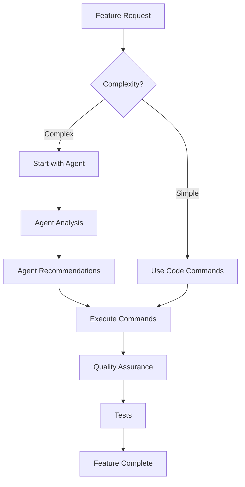

# Claude Agent System & Integrated Development Guide

## Overview

The Agent System provides specialized AI agents for different aspects of software development. Each agent has deep expertise in its domain and guides you to use the appropriate commands for implementation.

## How Agents and Commands Work Together



### Key Principle: Agents Guide, Commands Execute

- **Agents** (`/agent:*`) - Analyze, design, and recommend
- **Commands** (`/code:*`, `/spec:*`, `/utils:*`) - Generate code and execute tasks

## Available Agents

### 🏛️ Hexagonal Agent
**Command**: `/agent:hexagonal`
**Specialization**: Domain-Driven Design, Clean Architecture, Hexagonal Architecture

**Expertise**:
- Domain modeling with aggregates and value objects
- Application layer with gateways and use cases
- Infrastructure adapters and ports
- CQRS implementation
- Event-driven architecture

**Guides you to use**:
- `/code:ddd:entity` - Domain entities
- `/code:ddd:aggregate` - Aggregates with events
- `/code:ddd:gateway` - Gateway pattern
- `/code:ddd:migration` - Database migrations

### 🌐 API Agent
**Command**: `/agent:api`
**Specialization**: API Platform, REST, OpenAPI

**Expertise**:
- API resource design
- State providers and processors
- RESTful principles
- Filters and pagination
- API documentation

**Guides you to use**:
- `/code:api:resource` - API Platform resources
- `/code:api:behat` - API tests

### 🎨 Admin Agent
**Command**: `/agent:admin`
**Specialization**: Sylius Admin UI, CRUD interfaces

**Expertise**:
- Admin resource configuration
- Grid and form creation
- Menu integration
- UI/UX best practices
- Translation management

**Guides you to use**:
- `/code:admin:resource` - Admin CRUD
- `/code:admin:grid` - Data grids
- `/code:admin:form` - Form types
- `/code:admin:menu` - Menu items
- `/code:admin:behat` - Admin tests

### 🤝 Orchestrate Agent
**Command**: `/agent:orchestrate`
**Specialization**: Multi-agent coordination

**When to use**:
- Complex features requiring multiple domains
- Full-stack implementations
- Coordinating between contexts

### ℹ️ Help Agent
**Command**: `/agent:help`
**Specialization**: Project guidance and troubleshooting

## Complete Feature Development Workflows

### Example 1: Full Blog Feature Implementation

**Goal**: Implement article management with API and Admin interface

#### Step 1: Planning and Design
```bash
# Start with planning
/spec:plan "Blog article management with categories and authors"

# Define requirements for the feature
/spec:requirements blog-article-management

# Create technical design
/spec:design
```

#### Step 2: Domain Implementation
```bash
# Use hexagonal agent for domain design
/agent:hexagonal "Design article management domain with categories and authors"

# Agent will recommend:
# 1. Create aggregates
/code:ddd:aggregate BlogContext Article
/code:ddd:aggregate BlogContext Category
/code:ddd:aggregate BlogContext Author

# 2. Create gateways for use cases
/code:ddd:gateway BlogContext CreateArticle
/code:ddd:gateway BlogContext UpdateArticle
/code:ddd:gateway BlogContext PublishArticle
/code:ddd:gateway BlogContext ListArticles

# 3. Generate migrations
/code:ddd:migration BlogContext "Create article tables"
```

#### Step 3: API Implementation
```bash
# Use API agent for REST design
/agent:api "Create REST API for article management"

# Agent will recommend:
# 1. Generate API resources
/code:api:resource BlogContext Article
/code:api:resource BlogContext Category

# 2. Create API tests
/code:api:behat BlogContext article-api
/code:api:behat BlogContext category-api
```

#### Step 4: Admin Interface
```bash
# Use admin agent for UI
/agent:admin "Create admin interface for blog management"

# Agent will recommend:
# 1. Generate admin resources
/code:admin:resource BlogContext Article
/code:admin:resource BlogContext Category

# 2. Add to menu
/code:admin:menu "Blog/Articles" blog_admin_article_index
/code:admin:menu "Blog/Categories" blog_admin_category_index

# 3. Create admin tests
/code:admin:behat BlogContext article-admin
```

#### Step 5: Implementation and Testing
```bash
# Break down into TDD tasks
/act

# Run quality assurance
/utils:qa

# Run all tests
docker compose exec app bin/phpunit
docker compose exec app vendor/bin/behat
```

### Example 2: Simple CRUD Feature

**Goal**: Add a Tag entity to the blog

#### Direct Command Approach (No Agent Needed)
```bash
# 1. Generate domain entity
/code:ddd:entity BlogContext Tag

# 2. Create gateway
/code:ddd:gateway BlogContext ManageTags

# 3. Generate migration
/code:ddd:migration BlogContext "Add tags table"

# 4. Create API
/code:api:resource BlogContext Tag

# 5. Create admin
/code:admin:resource BlogContext Tag

# 6. Run QA
/utils:qa
```

### Example 3: Complex Business Logic

**Goal**: Implement article publishing workflow with approval

```bash
# Step 1: Use hexagonal agent for complex business logic
/agent:hexagonal "Design article publishing workflow with editorial approval"

# Step 2: Create detailed requirements
/spec:requirements article-publishing-workflow

# Step 3: Design technical solution
/spec:design

# Step 4: Break into TDD tasks
/act
```

## Command Reference

### Planning & Specification
- `/spec:plan` - Break down project into features
- `/spec:requirements` - Define EARS requirements
- `/spec:design` - Create technical design
- `/act` - Execute TDD implementation

### Domain (DDD) Commands
- `/code:ddd:entity` - Create domain entity
- `/code:ddd:aggregate` - Create aggregate with events
- `/code:ddd:gateway` - Create gateway pattern
- `/code:ddd:migration` - Generate migration

### API Commands
- `/code:api:resource` - Create API Platform resource
- `/code:api:behat` - Create API tests

### Admin Commands
- `/code:admin:resource` - Create admin CRUD
- `/code:admin:grid` - Create data grid
- `/code:admin:form` - Create form type
- `/code:admin:menu` - Add menu item
- `/code:admin:behat` - Create admin tests

### Utilities
- `/utils:qa` - Run quality assurance
- `/utils:debug` - Debug assistance
- `/utils:adr` - Create ADR document
- `/workflow:status` - Check status

## Best Practices

### 1. Choose the Right Starting Point
- **Complex features**: Start with agents (`/agent:*`)
- **Simple CRUD**: Use code commands directly (`/code:*`)
- **Planning needed**: Start with spec commands (`/spec:*`)
- **Debugging**: Use utils (`/utils:*`)

### 2. Follow the Architecture Order
```
Domain First → API Second → Admin Last
```

Always implement in this order:
1. Domain logic (entities, aggregates, gateways)
2. API endpoints (resources, processors)
3. Admin interface (forms, grids)

### 3. Test at Each Layer
```bash
# After domain implementation
docker compose exec app bin/phpunit tests/[Context]/Unit/

# After API implementation
docker compose exec app vendor/bin/behat features/api/

# After admin implementation
docker compose exec app vendor/bin/behat features/admin/
```

### 4. Use Agents for Guidance
Agents are best for:
- Understanding complex requirements
- Designing architecture
- Learning best practices
- Troubleshooting issues

### 5. Use Commands for Execution
Commands are best for:
- Generating specific code
- Running tools
- Creating documentation
- Executing workflows

## Common Workflows

### New Feature Workflow
```
/spec:plan → /spec:requirements → /spec:design → /agent:hexagonal → /code:ddd:* → /code:api:* → /code:admin:* → /act → /utils:qa
```

### Refactoring Workflow
```
/agent:hexagonal "Review X" → /utils:adr → /code:ddd:* → /act → /utils:qa
```

### Bug Fix Workflow
```
/utils:debug → /agent:help → [fix code] → /utils:qa
```

### Documentation Workflow
```
/utils:adr → /utils:prd → /utils:user-story
```

## Orchestration Patterns

### Sequential Pattern
```
Hexagonal → API → Admin
```
Each agent completes its work before the next begins. Best for linear workflows.

### Parallel Pattern
```
        ┌→ API ──┐
Gateway ┼→ Admin ┼→ Integration
        └→ Test ──┘
```
Multiple agents work simultaneously. Best for independent tasks.

### Collaborative Pattern
```
Hexagonal ←→ Test (TDD loop)
     ↓
API + Admin (parallel)
```
Agents work together with feedback loops. Best for complex features.

## Troubleshooting

### Agent Not Providing Commands
- Agents guide you to use commands, they don't execute them
- Copy the recommended commands and run them yourself
- Check agent documentation for supported commands

### Commands Not Found
- Ensure correct prefix: `/code:`, `/spec:`, `/utils:`, etc.
- Check exact command syntax in `.claude/commands/`
- Commands are case-sensitive

### Integration Issues
- Ensure consistent naming across contexts
- Verify gateways exist before creating APIs
- Check that domain models are complete

## Tips for Success

1. **Start with the big picture** - Use agents for complex tasks
2. **Execute with precision** - Use specific commands
3. **Test continuously** - Run QA after each step
4. **Document decisions** - Use ADRs for important choices
5. **Iterate and improve** - Refine as you go

## Getting Started

1. **Identify your need**: Determine what you want to build
2. **Choose your approach**:
   - Complex? → Start with an agent
   - Simple? → Use commands directly
3. **Follow the workflow**: Domain → API → Admin
4. **Test everything**: Use `/utils:qa` frequently
5. **Document**: Create ADRs for decisions

Remember: **Agents analyze and guide, commands generate and execute!**