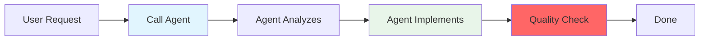

# Expert Agents System

## Overview

Expert agents are specialized AI assistants that handle complex aspects of software development. They work within the simplified command system to provide deep expertise without adding complexity.

## Core Philosophy

**"Let the experts handle the complexity"** - Each agent is a specialist in their domain, providing guidance and implementation directly without intermediate commands.

## How Agents Work



Agents are autonomous - they analyze, design, and implement without requiring you to run multiple commands.

## Available Agents

### 🚀 Primary Development Agents

These agents are called by the orchestrator automatically:

#### domain-expert
**Specialization**: Domain-Driven Design and architecture
- Domain modeling with aggregates and value objects
- Business logic design
- Event-driven architecture
- CQRS pattern implementation

#### maker-expert
**Specialization**: Code generation using DDD Makers
- Analyzes requirements and selects appropriate makers
- Executes makers in correct dependency order
- Generates consistent DDD structure across all layers
- Coordinates with tdd-expert for implementation

#### tdd-expert
**Specialization**: Test-Driven Development implementation
- Red-Green-Refactor cycle
- Complete test coverage
- Clean code practices
- Implementation of all concrete components

#### api-platform-expert
**Specialization**: REST API development
- API Platform resources
- State providers/processors
- OpenAPI documentation
- RESTful best practices

#### admin-ui-expert
**Specialization**: Sylius Admin interfaces
- CRUD interfaces
- Forms and grids
- Menu integration
- User experience

### 📋 Specification Agents

Used during the planning phase:

- **business-analyst**: Business requirement analysis
- **ears-expert**: EARS format requirements
- **story-decomposer**: User story breakdown
- **test-generator**: Test scenario creation
- **spec-validator**: Specification validation
- **domain-expert**: Ubiquitous language

### 🔍 Quality Agents

Called for code review and optimization:

- **code-reviewer**: Architecture compliance
- **refactoring-expert**: Code improvements
- **performance-optimizer**: Performance tuning
- **security-auditor**: Security analysis
- **architecture-validator**: DDD validation

## Using Agents

### Through Orchestration (Recommended)

The simplest way is to let orchestration handle everything:

```bash
# Plan your feature
/spec:plan "E-commerce platform"

# Create PRD
/spec:prd commerce checkout

# Define requirements
/spec:requirements checkout-process

# Design solution
/spec:design commerce

# Let agents implement
/orchestrate checkout-process --context commerce
```

The orchestrator will:
1. Analyze your user story
2. Select needed agents (domain, api, admin)
3. Coordinate their work
4. Run quality checks

### Direct Agent Invocation

For specific tasks, call agents directly:

```bash
# Domain modeling
> Use the domain-expert agent to design payment processing

# TDD implementation
> Use the tdd-expert agent to implement payment gateway

# API development
> Use the api-platform-expert agent to create payment API

# Admin interface
> Use the admin-ui-expert agent to create payment admin
```

## Agent Capabilities

### What Agents Do

✅ **Autonomous Implementation**
- Analyze requirements
- Design solutions
- Generate code
- Run tests
- Fix issues

✅ **Quality Assurance**
- Follow best practices
- Ensure test coverage
- Validate architecture
- Apply patterns correctly

✅ **Direct Execution**
- No intermediate commands needed
- Complete implementation cycles
- Integrated quality checks

### What Agents Don't Do

❌ **They don't replace thinking**
- You define requirements
- You make business decisions
- You approve designs

❌ **They don't work in isolation**
- Agents coordinate through orchestration
- They follow project patterns
- They respect architecture

## Simplified Workflows

### Feature Development

```
1. Plan → 2. PRD → 3. Requirements → 4. Design → 5. Orchestrate
```

Agents handle step 5 completely.

### Quick Implementation

For simple features, go directly to orchestration:

```bash
# If requirements are clear
/orchestrate user-profile --context user
```

### Code Quality Review

```bash
# Ask any quality agent
> Use the code-reviewer agent to review the payment implementation
> Use the security-auditor agent to check for vulnerabilities
```

## Best Practices

### 1. Trust the Experts
- Let agents handle their specialization
- Don't micromanage implementation details
- Focus on requirements and business logic

### 2. Use Orchestration
- It coordinates agents efficiently
- Ensures proper implementation order
- Runs quality checks automatically

### 3. Provide Clear Context
- Good requirements lead to good implementation
- Clear user stories help agents understand
- Proper PRD guides technical decisions

## Common Scenarios

### New Feature
```bash
/orchestrate article-management --context blog
```
Orchestrator handles everything: domain → API → admin → QA

### Domain Modeling Only
```bash
> Use the domain-expert agent to design inventory management
```
Agent creates complete domain model with all components

### API Development
```bash
> Use the api-platform-expert agent to expose product catalog API
```
Agent creates resources, providers, processors, and tests

### Code Review
```bash
> Use the code-reviewer agent to review recent changes
```
Agent analyzes code quality, patterns, and security

## Tips for Success

1. **Start with good specifications** - Use `/spec:*` commands
2. **Trust the orchestrator** - It knows which agents to use
3. **Let agents be autonomous** - They handle complexity
4. **Focus on business value** - Agents handle technical details

## Getting Help

- For methodology: `/help`
- For specifications: `/spec:help`
- For quality issues: `/qa`

Remember: **Agents are experts - let them do what they do best!**