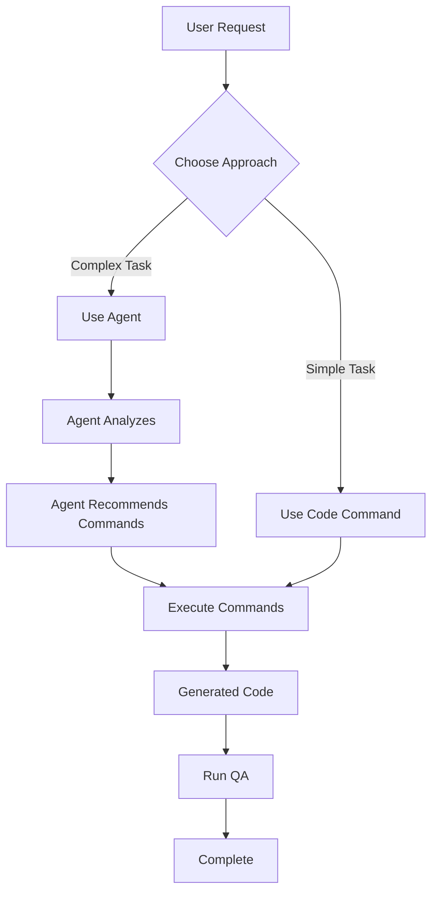

# Claude Commands Integration Guide

## Overview

This guide explains how the different command types work together in the Vibe PHP project.

## Command Hierarchy

```
.claude/commands/
├── agent/          # High-level orchestration agents
├── code/           # Code generation commands
├── spec/           # Specification commands
├── utils/          # Utility commands
├── workflow/       # Workflow commands
└── act.md          # TDD execution command
```

## Command Types

### 1. Agent Commands (`/agent:*`)

High-level orchestration agents that coordinate multiple tasks:

- **Purpose**: Guide complex implementations
- **Usage**: `/agent:hexagonal "Create article management"`
- **Output**: Comprehensive plans and guidance

**Available Agents:**
- `/agent:hexagonal` - DDD/Hexagonal architecture specialist
- `/agent:api` - API development specialist
- `/agent:admin` - Admin UI specialist
- `/agent:orchestrate` - Multi-agent coordinator
- `/agent:help` - Project assistance
- `/agent:status` - Project status checker

### 2. Code Commands (`/code:*`)

Direct code generation commands:

- **Purpose**: Generate specific code artifacts
- **Usage**: `/code:ddd:entity Article`
- **Output**: Generated code files

**Available Generators:**

**DDD Generators:**
- `/code:ddd:entity` - Create domain entity
- `/code:ddd:aggregate` - Create aggregate with events
- `/code:ddd:gateway` - Create gateway pattern
- `/code:ddd:migration` - Create database migration

**API Generators:**
- `/code:api:resource` - Create API Platform resource
- `/code:api:behat` - Create API test scenarios

**Admin Generators:**
- `/code:admin:resource` - Create admin CRUD
- `/code:admin:grid` - Create data grid
- `/code:admin:form` - Create form
- `/code:admin:menu` - Add menu item
- `/code:admin:behat` - Create admin tests

### 3. Specification Commands (`/spec:*`)

Planning and design commands:

- `/spec:plan` - Create feature plan
- `/spec:requirements` - Define requirements
- `/spec:design` - Technical design
- `/spec:prd` - Product requirements

### 4. Utility Commands (`/utils:*`)

Helper commands:

- `/utils:qa` - Run quality assurance
- `/utils:debug` - Debug issues
- `/utils:adr` - Create ADR document
- `/utils:user-story` - Create user story

### 5. Workflow Commands (`/workflow:*`)

Process automation:

- `/workflow:status` - Check project status
- `/workflow:qa` - Run QA workflow

### 6. Act Command (`/act`)

Special TDD execution command that follows tasks.md

## How Agents Use Commands

Agents should **guide** the use of commands, not execute them directly. Here's the correct pattern:

### ❌ Wrong (doesn't work):
```markdown
[Trying to use XML tags to invoke other commands doesn't work in command files]
```

### ✅ Correct (works):
```markdown
Now I'll create the entity using the DDD entity generator:

Use command: `/code:ddd:entity Article`

Or manually execute:
\`\`\`bash
# Generate entity
/code:ddd:entity Article
\`\`\`
```

## Integration Workflows

### Example 1: Creating a New Feature

1. **Start with an agent:**
   ```
   /agent:hexagonal "Create article management feature"
   ```

2. **Agent guides you to use:**
   - `/spec:requirements` - Define requirements first
   - `/spec:design` - Create technical design
   - `/code:ddd:aggregate` - Generate aggregate
   - `/code:api:resource` - Create API endpoint
   - `/act` - Implement with TDD

### Example 2: Adding Admin Interface

1. **Start with admin agent:**
   ```
   /agent:admin "Add article management to admin"
   ```

2. **Agent guides you to use:**
   - `/code:admin:resource` - Create CRUD resource
   - `/code:admin:menu` - Add to menu
   - `/code:admin:behat` - Create tests

## Command Execution Flow



## Best Practices

1. **Use agents for complex tasks** that require multiple steps
2. **Use code commands directly** for simple, specific generations
3. **Always run QA** after code generation: `/utils:qa`
4. **Follow TDD** with `/act` for implementations
5. **Document decisions** with `/utils:adr`

## Common Workflows

### DDD Implementation
```bash
# 1. Plan the feature
/spec:plan "Article management"

# 2. Design the architecture
/agent:hexagonal "Design article domain model"

# 3. Generate code
/code:ddd:aggregate Article
/code:ddd:gateway CreateArticle

# 4. Implement with TDD
/act

# 5. Check quality
/utils:qa
```

### API Development
```bash
# 1. Design API
/agent:api "Design article API"

# 2. Generate resources
/code:api:resource Article

# 3. Create tests
/code:api:behat Article

# 4. Run tests
/workflow:qa
```

### Admin Interface
```bash
# 1. Plan admin features
/agent:admin "Plan article admin"

# 2. Generate admin code
/code:admin:resource Article

# 3. Add to menu
/code:admin:menu Articles

# 4. Test
/code:admin:behat Article
```

## Troubleshooting

### Commands in agent files don't execute
- Agents provide guidance, not direct execution
- Copy the recommended commands and run them
- Or follow the manual steps provided

### Not sure which command to use
- Start with `/agent:help` for guidance
- Use `/agent:orchestrate` for complex multi-domain tasks
- Check this README for command descriptions

### Command not found
- Ensure you're using the correct prefix (`/agent:`, `/code:`, etc.)
- Check the exact command name in the respective directories
- Commands are case-sensitive

## Summary

- **Agents** = Orchestrators and guides
- **Code commands** = Direct generators
- **Spec commands** = Planning tools
- **Utils** = Helpers and tools
- **Act** = TDD execution

Always start with an agent for complex tasks, and let it guide you to the appropriate commands!