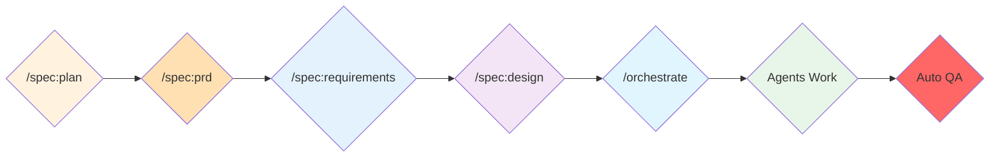

# 🚀 Simplified Command System

This directory contains the streamlined command system for efficient feature development using specialized agents.

## Core Philosophy

**Simplicity through expertise**: Let specialized agents handle complexity while you focus on business requirements.

## Command Structure

```
.claude/commands/
├── spec/              # Planning & Specifications
│   ├── plan.md        # Break down projects into features
│   ├── prd.md         # Create Product Requirements Document
│   ├── requirements.md # Define WHAT needs to be built (EARS format)
│   ├── design.md      # Define HOW it will be built
│   └── help.md        # Specification methodology help
├── orchestrate.md     # Smart agent coordination for implementation
├── qa.md              # Quality assurance checks
├── help.md            # This help system
└── archive/           # Old commands (for reference only)
    ├── code/          # Old code generation commands
    ├── act.md         # Old TDD command
    ├── agent/         # Old agent commands
    ├── workflow/      # Old workflow commands
    ├── utils/         # Old utility commands
    └── spec/          # Old spec commands (advanced, list, prd, status, tasks)
```

## Workflow Overview



## Quick Start

### 1. Plan Your Feature
```bash
/spec:plan "Blog platform with article management"
```

### 2. Create Product Requirements Document
```bash
/spec:prd blog article-management
```

### 3. Define Detailed Requirements
```bash
/spec:requirements article-management
```

### 4. Design Technical Solution
```bash
/spec:design blog
```

### 5. Implement with Orchestration
```bash
/orchestrate article-management --context blog
```

The orchestrator will:
- Analyze your user story
- Select only needed agents
- Coordinate their work
- Run quality checks

## Available Expert Agents

The orchestrator coordinates these specialized agents automatically:

- **domain-expert** - Domain modeling and DDD
- **maker-expert** - Code generation using DDD makers
- **tdd-expert** - Test-driven implementation
- **api-platform-expert** - REST API development
- **admin-ui-expert** - Admin interface creation
- **code-reviewer** - Code quality review
- **security-auditor** - Security checks
- **performance-optimizer** - Performance tuning
- **architecture-validator** - Architecture compliance

## Key Commands

### `/spec:*` - Specification Commands
- `plan` - Break down project into manageable features
- `prd` - Create Product Requirements Document with business vision
- `requirements` - Define detailed WHAT needs to be built using EARS format
- `design` - Define HOW it will be built technically
- `help` - Get help with the specification methodology

### `/orchestrate` - Smart Implementation
Coordinates multiple agents based on your user story needs.

### `/qa` - Quality Assurance
- `/qa` - Run all checks
- `/qa fix` - Auto-fix issues
- `/qa fix all` - Complete fix and verify

## Why This System?

1. **Simpler** - Only 3 command groups to remember
2. **Smarter** - Agents have built-in expertise
3. **Faster** - Automatic coordination and QA
4. **Better** - Consistent, high-quality results

## Migration Notes

### What Changed?
- `/code:*` commands → Now handled by agents
- `/act` → Now handled by `tdd-expert` agent
- `/agent:orchestrate` → Now `/orchestrate`
- `/utils:qa` → Now `/qa`

### Complete Workflow
The full specification workflow is now:
1. `/spec:plan` - Project breakdown
2. `/spec:prd` - Business requirements
3. `/spec:requirements` - Detailed EARS
4. `/spec:design` - Technical design
5. `/orchestrate` - Implementation

### Where Are Old Commands?
Archived in `archive/` directory for reference, but you shouldn't need them.

## Tips

- Trust the orchestrator's agent selection
- Let agents handle patterns and boilerplate
- Focus on your business requirements
- Run `/qa` anytime for quality checks

## Getting Help

- General help: `/help`
- Specifications: `/spec:help`
- Agents info: See `.claude/agents/README.md`

Remember: **Let the experts handle the complexity!**
