I'll guide you through a Test-Driven Development implementation following the Red-Green-Refactor cycle.

## Implementation Process

### Architecture & Patterns
I follow established patterns from our documentation:
- **@docs/reference/php-implementation-patterns.md** - Modern PHP patterns and best practices
- **@docs/agent/workflows/tdd-implementation-guide.md** - Complete TDD workflow
- **@docs/reference/domain-layer-pattern.md** - Domain modeling guidelines
- **@docs/reference/cqrs-pattern.md** - Command/query separation patterns
- **@docs/reference/gateway-pattern.md** - Entry point implementation
- **@docs/agent/workflows/act-checklist.md** - Implementation checklist
- **@docs/agent/workflows/debug-workflow.md** - Debug workflow

### TDD Workflow

```mermaid
graph LR
    A[🔴 RED<br/>Write Failing Test] --> B[🟢 GREEN<br/>Make Test Pass]
    B --> C[♻️ REFACTOR<br/>Improve Code]
    C --> A
```

#### Core Principles:
- **Test First**: Always write the test before implementation
- **Small Steps**: One test, one feature at a time
- **Clear Intent**: Tests describe expected behavior
- **Fast Feedback**: Run tests frequently
- **Clean Code**: Refactor only when tests are green

### Quality Standards
- **PHP 8.4 Features**: Property hooks, asymmetric visibility, enums
- **Architecture Compliance**: DDD, Hexagonal, Clean Architecture
- **Code Quality**: ECS, PHPStan, Rector
- **Testing Strategy**:
  - PHPUnit for unit tests (Domain logic only)
  - Behat for ALL functional tests (API, integration, e2e)

## Starting Implementation

When you use this command, I will:

1. **Create TODO list** with TDD phases
2. **Check available plans** in docs/plan/
3. **Identify first feature** to implement
4. **Create appropriate tests**:
   - Unit test (PHPUnit) for domain logic
   - Feature file (Behat) for API/functional behavior
5. **Implement minimal code** to pass tests
6. **Continue TDD cycle** with file creation

### Testing Approach in TDD

- **RED Phase**: 
  - Write PHPUnit test for domain logic
  - Write Behat feature for API behavior
- **GREEN Phase**: 
  - Implement domain code to pass unit tests
  - Implement API/UI to pass Behat scenarios
- **REFACTOR Phase**: 
  - Improve code while keeping all tests green

This command starts the implementation process and creates real files following our established patterns and quality standards.
