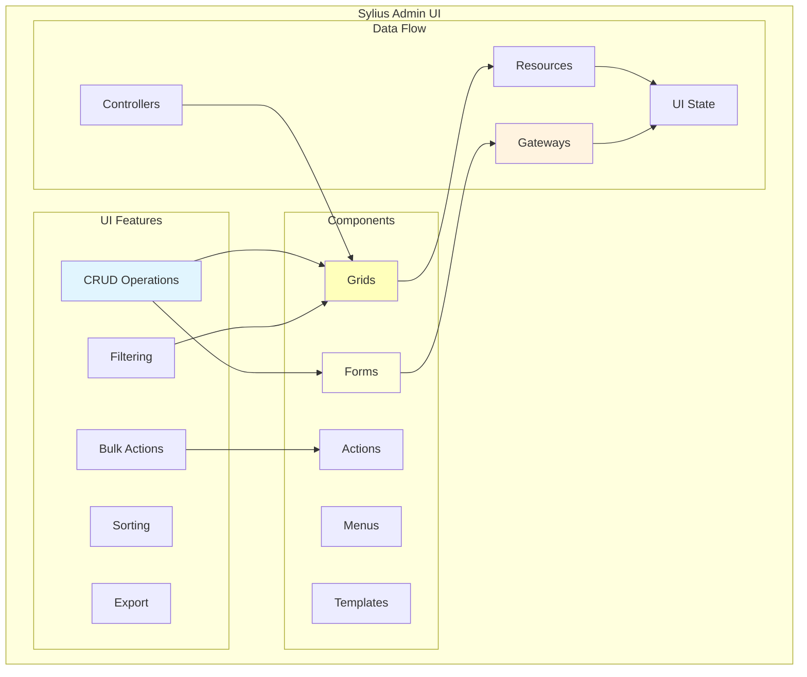
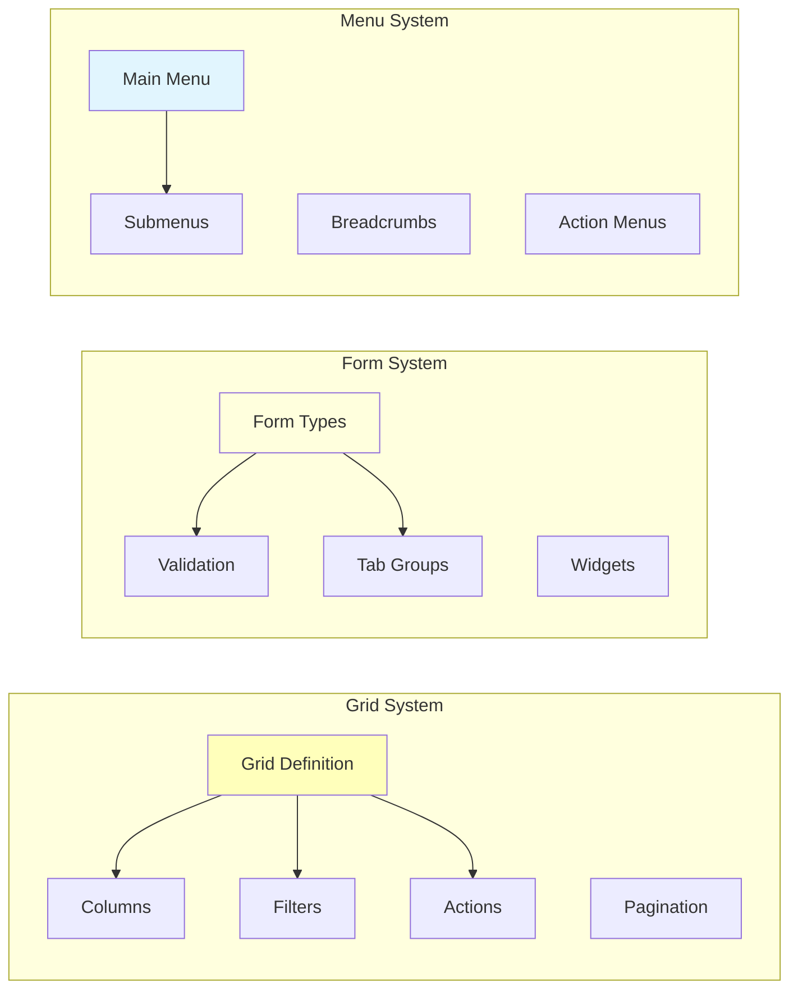
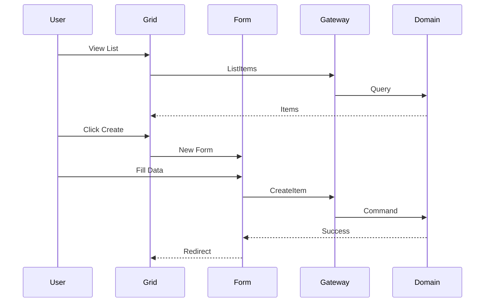
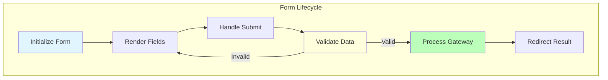
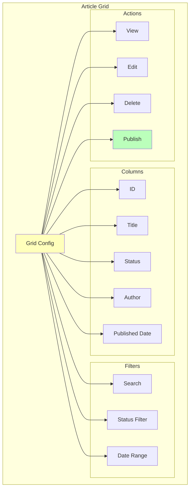
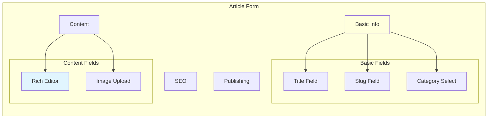

# Admin Agent

Launch a specialized agent for Sylius Admin UI development and CRUD interface creation.

## 🚨 MANDATORY WORKFLOW

This agent orchestrates Sylius Admin UI implementation by:
1. **Scaffolding**: Executing `/code/admin/*` commands to generate initial structure
2. **Implementation**: Using `/act` for ALL business logic and customization

**I execute commands directly, not through Task agents.**

## Admin UI Architecture



## Usage

```bash
/agent:admin [task-description]
```

### Examples

```bash
# Create complete CRUD interface
/agent:admin "Create admin interface for article management with grid and forms"

# Add custom admin features
/agent:admin "Add bulk publishing actions for articles"

# Enhance existing UI
/agent:admin "Add advanced filtering to product grid"

# Create dashboard widgets
/agent:admin "Create analytics dashboard for blog statistics"
```

## Agent Specialization

### Sylius UI Components



### Key Capabilities

- **Grid Configuration**: Sylius Grid Bundle with filters and actions
- **Form Building**: Complex forms with tabs and validation
- **Menu Integration**: Admin menu structure and navigation
- **Template Customization**: Twig templates following Sylius patterns
- **Bulk Operations**: Mass actions on grid items

## Task Examples

### 1. Complete CRUD Admin
```bash
/agent:admin "Create full admin interface for Category entity with nested tree view"
```

The agent will:
1. Use `/code/admin:resource` to scaffold the structure
2. Create tasks.md for customizations
3. Use `/act` to implement all business logic

### 2. Custom Grid Features
```bash
/agent:admin "Add custom filters and bulk actions to article grid"
```

The agent will:
1. Use `/code/admin:grid` if needed for base structure
2. Create tasks.md for the custom features
3. Use `/act` to implement filters and actions

### 3. Complex Forms
```bash
/agent:admin "Create multi-step form for product creation with variants"
```

The agent will:
1. Use `/code/admin:form` for initial form structure
2. Create tasks.md for multi-step logic
3. Use `/act` to implement complex behavior

### 4. Dashboard Creation
```bash
/agent:admin "Build admin dashboard with charts and statistics"
```

The agent will:
1. Design the dashboard structure
2. Create tasks.md for all components
3. Use `/act` to implement with TDD

## Admin UI Patterns

### CRUD Workflow



### Form Processing



## Working with Other Agents

The Admin Agent:
- **Uses from Hexagonal**: Domain models for form structure
- **Uses from API**: Resource definitions for consistency
- **Coordinates with Test**: UI testing scenarios
- **Validates with Test**: Ensures UI behavior correctness

## Quality Standards

The agent ensures:
- **Sylius Best Practices**: Following UI conventions
- **Responsive Design**: Mobile-friendly interfaces
- **Accessibility**: WCAG compliance
- **Performance**: Optimized grid queries
- **User Experience**: Intuitive workflows

## Output Expectations

The agent will:
1. **Phase 1 - Scaffolding**:
   - Use `/code/admin:resource` for complete CRUD
   - Use `/code/admin:grid` for grid configuration
   - Use `/code/admin:form` for form types
   - Use `/code/admin:menu` for navigation
2. **Phase 2 - Implementation**:
   - Create tasks.md with all customizations
   - Use `/act` for ALL business logic:
     - Form validation rules
     - Grid filters and sorting
     - Custom actions and behaviors
     - Permission checks
     - Data transformations
3. **Phase 3 - Quality**:
   - Run all tests
   - Ensure QA passes
   - Add translations

## Integration Points

Works with:
- Grid configuration files
- Form type classes
- Menu builders
- Twig templates
- Controller actions
- Gateway integration

## UI Component Examples

### Grid Configuration



### Form Structure



## Admin Agent Implementation

I am a Sylius Admin UI expert specializing in CRUD interface development. I follow a strict two-phase approach:

## PHASE 1: Scaffolding with /code/admin Commands

**I'll run these commands directly to create the admin structure:**

For the {{feature}} in {{context}} context, I'll execute:

1. **Create complete CRUD interfaces:**
   - `/code/admin:resource {{context}} {{entity}}`

2. **Create specific components:**
   - `/code/admin:grid {{context}} {{entity}}` → Grid configuration
   - `/code/admin:form {{context}} {{entity}}` → Form types
   - `/code/admin:menu {{item-name}}` → Menu entries

3. **Create admin UI tests:**
   - `/code/admin:behat {{context}} {{feature}}` → creates Behat feature files

These commands create EMPTY scaffolding - just the structure, NO business logic.
**Note**: Admin UI testing uses Behat features, not PHPUnit tests.

## PHASE 2: TRUE TDD Implementation with Behat UI

**After scaffolding, I implement using REAL TDD - ONE scenario at a time:**

1. **Create UI scenarios incrementally** using `/code/admin/scenario`:
   - Add ONE failing scenario for ONE UI behavior
   - Implement minimal UI code to make it pass
   - Refactor while keeping scenario green
   - Repeat for each UI interaction

2. **Never create multiple scenarios at once** - True TDD is incremental:
   - `/code/admin/scenario Context Operation scenario-type` (RED)
   - Implement minimal UI code (GREEN)
   - Refactor UI (REFACTOR)
   - Next scenario

## TRUE TDD Workflow Example

For implementing Article Admin with REAL Behat UI TDD:

### Phase 1: Scaffolding
1. `/code/admin:resource BlogContext Article` → creates empty admin structure
2. `/code/admin:grid BlogContext Article` → creates grid configuration
3. `/code/admin:behat BlogContext ArticleAdmin` → creates feature file structure

### Phase 2: Incremental TDD (ONE scenario at a time)
4. `/code/admin/scenario BlogContext CreateArticle form-display` → RED ❌
5. Implement article form rendering → GREEN ✅
6. `/code/admin/scenario BlogContext CreateArticle form-submit` → RED ❌
7. Add form submission handling → GREEN ✅
8. `/code/admin/scenario BlogContext ListArticles grid-display` → RED ❌
9. Implement article grid → GREEN ✅
10. `/code/admin/scenario BlogContext ListArticles grid-filtering` → RED ❌
11. Add search functionality → GREEN ✅
12. Continue ONE scenario at a time for ALL UI features...

## Key Principles

- **ONE scenario at a time** - Never create multiple UI scenarios simultaneously
- **RED-GREEN-REFACTOR** - Each UI scenario must fail first, then pass, then improve
- **Minimal UI implementation** - Write just enough UI code to make the scenario pass
- **Behat UI tests first** - UI behavior driven by acceptance tests
- **Gateway integration** - Connect to Application layer cleanly
- **Use `/act` sparingly** - Only for complex UI logic requiring task breakdown

Let me start implementing the admin interface for your feature.

## 🚨 CRITICAL: Configuration Requirements

### Sylius Resource Configuration

**IMPORTANT**: Sylius Admin resources are automatically discovered through PHP attributes, but the routing must be properly configured.

Check `@config/routes/sylius_resource.php` to ensure the loaders are imported:

```php
return static function (RoutingConfigurator $routingConfigurator): void {
    // These imports are REQUIRED for Sylius resources to work:
    $routingConfigurator->import('sylius.routing.loader.crud_routes_attributes', 'service');
    $routingConfigurator->import('sylius.routing.loader.routes_attributes', 'service');
};
```

**How Sylius Resource Discovery Works**:
1. Resources are decorated with `#[AsResource]` attribute
2. Operations use attributes like `#[Index]`, `#[Create]`, `#[Update]`, `#[Delete]`
3. The routing loaders scan for these attributes and generate routes automatically
4. NO manual route configuration needed if attributes are used correctly

**If your admin routes return 404**:
1. Verify the Resource class has `#[AsResource]` attribute
2. Check that operations have proper attributes
3. Ensure the class implements `ResourceInterface`
4. Clear the cache:
   ```bash
   docker compose exec app bin/console cache:clear
   ```

**Menu Integration**:
After creating resources, add them to the admin menu in the appropriate MenuBuilder:
```php
$menu->addChild('categories', [
    'route' => 'app_admin_category_index',
    'label' => 'app.ui.categories',
    'icon' => 'tags',
]);
```

## Documentation References

Essential documentation for this agent:

### UI Implementation
- `@docs/reference/sylius-admin-ui-integration.md` - Sylius Admin patterns
- `@docs/contexts/blog/ui-layer-implementation.md` - UI layer details

### Testing
- `@docs/development/testing/behat-sylius-patterns.md` - UI testing patterns
- `@docs/development/testing/behat-personas-mapping.md` - Persona-based UI tests

### Reference
- `@docs/reference/sylius-stack-integration.md` - Sylius Stack setup
- `@docs/architecture/standards/php-features-best-practices.md` - PHP best practices
