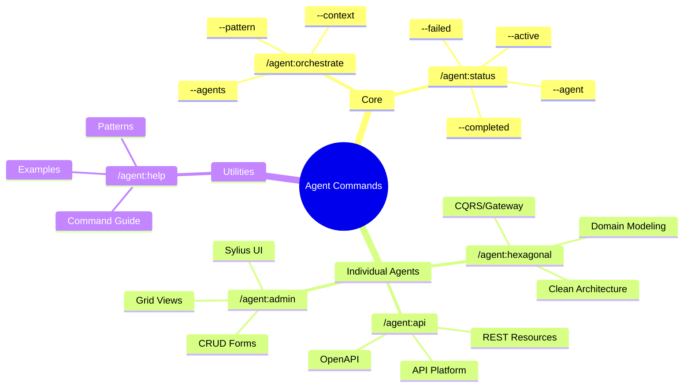

# Agent Commands Help

Commands for orchestrating specialized AI agents in your development workflow.

## Command Overview



## Available Commands

### Core Commands

| Command | Description | Example |
|---------|-------------|---------|
| `/agent:orchestrate` | Orchestrate multiple agents | `/agent:orchestrate feature:blog --agents all` |
| `/agent:status` | Monitor agent progress | `/agent:status --active` |

### Individual Agent Commands

| Command | Description | Specialization |
|---------|-------------|----------------|
| `/agent:hexagonal` | Launch DDD/Hexagonal agent | Domain modeling, Clean Architecture |
| `/agent:api` | Launch API agent | API Platform, REST |
| `/agent:admin` | Launch Admin agent | Sylius Admin UI |

## Quick Start

### 1. Full Feature Development
```bash
/agent:orchestrate feature:article-management \
  --agents hexagonal,api,admin \
  --pattern collaborative \
  --context blog
```

### 2. Domain Modeling Only
```bash
/agent:hexagonal "Design user authentication domain model"
```

### 3. API Development
```bash
/agent:api "Create REST API for user management"
```


## Orchestration Patterns

### Sequential (Default)
Agents work one after another:
```
Hexagonal → API → Admin
```

### Parallel
Agents work simultaneously:
```
        ┌→ API ──┐
Gateway ┤        ├→ Integration
        └→ Admin ┘
```

### Collaborative
Agents work together with feedback:
```
Hexagonal (with TDD)
     ↓
API + Admin (Parallel)
```

## Common Workflows

### New Feature from Scratch
```bash
# 1. Plan with orchestration
/agent:orchestrate feature:payment-system \
  --agents hexagonal,api,admin \
  --pattern collaborative \
  --context billing

# 2. Monitor progress
/agent:status --active

# 3. Check completion
/agent:status --completed
```

### Adding API to Existing Domain
```bash
# Use API agent alone
/agent:api "Create API for existing Article entity"
```


## Agent Capabilities

```mermaid
graph TB
    subgraph "Agent Specializations"
        H[Hexagonal Agent 🏛️]
        A[API Agent 🌐]
        AD[Admin Agent 🎨]
    end
    
    subgraph "Hexagonal Skills"
        H1[Domain Models]
        H2[Aggregates]
        H3[Value Objects]
        H4[Gateways]
        H5[CQRS]
    end
    
    
    subgraph "API Skills"
        A1[REST Design]
        A2[Resources]
        A3[Filters]
        A4[OpenAPI]
        A5[Security]
    end
    
    subgraph "Admin Skills"
        AD1[CRUD UI]
        AD2[Grid Views]
        AD3[Forms]
        AD4[Menus]
        AD5[UX Design]
    end
    
    H --> H1 & H2 & H3 & H4 & H5
    A --> A1 & A2 & A3 & A4 & A5
    AD --> AD1 & AD2 & AD3 & AD4 & AD5
    
    style H fill:#bbf
    style A fill:#fbf
    style AD fill:#ffb
```



### Hexagonal Agent 🏛️
- Domain model design
- Aggregate creation
- Value object implementation
- Gateway pattern
- CQRS implementation


### API Agent 🌐
- REST endpoint design
- API Platform resources
- Filter implementation
- Documentation generation
- Security configuration

### Admin Agent 🎨
- CRUD interface creation
- Grid configuration
- Form building
- Menu integration
- UI/UX optimization

## Options Reference

### `/agent:orchestrate` Options
- `--agents` - Comma-separated list of agents to use
- `--pattern` - Orchestration pattern (sequential, parallel, collaborative)
- `--context` - Business context for the feature

### `/agent:status` Options
- `--active` - Show only active orchestrations
- `--completed` - Show completed orchestrations
- `--failed` - Show failed orchestrations
- `--agent [name]` - Filter by specific agent

## Best Practices

1. **Domain First**: Always start with Hexagonal agent for new features
2. **TDD Throughout**: Use /act for test-driven development
3. **Monitor Progress**: Use `/agent:status` regularly
4. **Clear Requirements**: Provide detailed task descriptions
5. **Appropriate Pattern**: Choose pattern based on dependencies

## Troubleshooting

### Agent Blocked
```bash
# Check what's blocking
/agent:status --agent hexagonal --verbose
```

### Orchestration Failed
```bash
# View failures
/agent:status --failed

# Check specific agent
/agent:status --agent api --verbose
```

### Slow Progress
- Consider parallel pattern
- Break into smaller features
- Check agent logs

## Integration with Other Commands

Agents use existing commands internally:
- `/spec:*` - For planning
- `/ddd:*` - For DDD implementation
- `/api:*` - For API creation
- `/admin:*` - For admin UI
- `/workflow:qa` - For quality checks

## Examples by Use Case

### E-commerce Feature
```bash
/agent:orchestrate feature:product-catalog \
  --agents hexagonal,api,admin \
  --pattern collaborative \
  --context catalog
```

### User Authentication
```bash
/agent:orchestrate feature:user-auth \
  --agents hexagonal,api \
  --pattern sequential \
  --context security
```

### Admin Dashboard
```bash
/agent:orchestrate feature:analytics-dashboard \
  --agents hexagonal,admin \
  --pattern sequential \
  --context reporting
```

## Learn More

- Agent configuration: `.claude/agents/README.md`
- Individual agent details: `.claude/agents/[agent]/config.md`
- Implementation patterns: `.claude/agents/[agent]/patterns.md`

Need help with a specific agent? Try:
- `/agent:hexagonal --help`
- `/agent:api --help`
- `/agent:admin --help`
