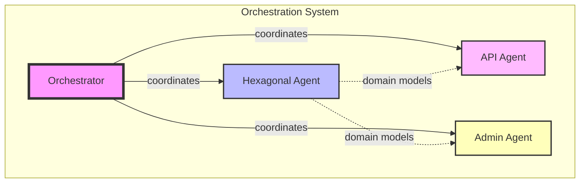
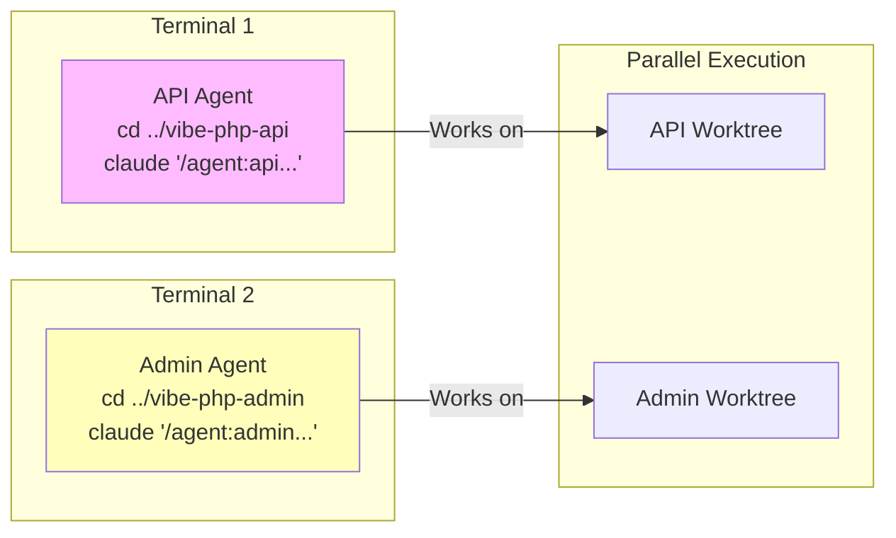
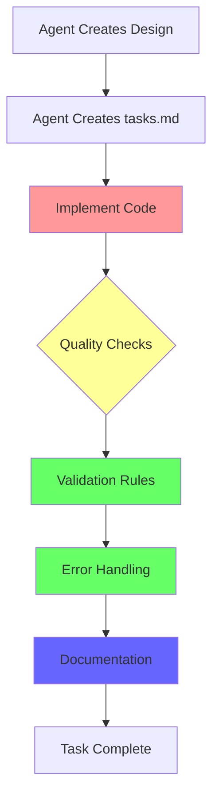
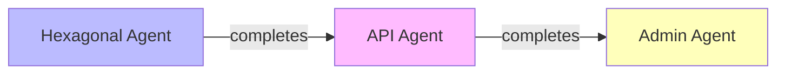
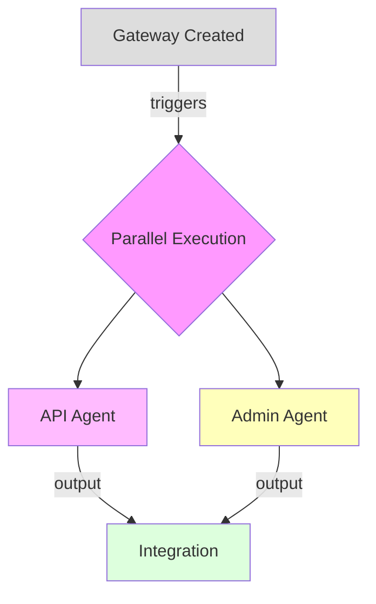
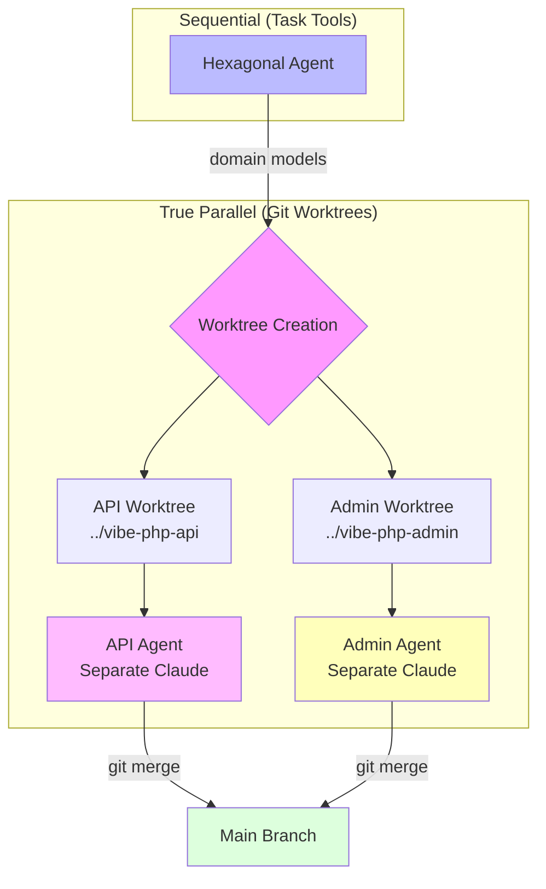
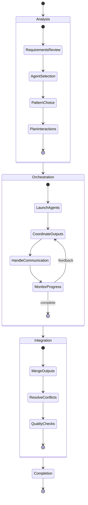
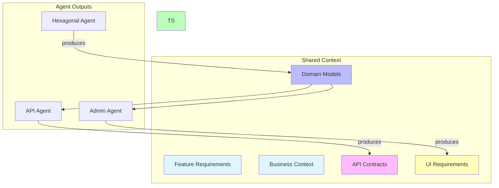

# Agent Orchestration for {{feature-name}}

I'll orchestrate multiple specialized agents to implement the {{feature-name}} feature in the {{context}} context.

## 🧠 Smart Agent Selection

This orchestrator now includes **intelligent agent selection** based on user story analysis:

1. **Reads User Story**: Analyzes `docs/contexts/{{context}}/requirements/user-stories/{{feature-name}}.md`
2. **Detects Components**: Parses the "Components Required" section to understand what's needed
3. **Smart Selection**: Only launches agents that are actually required:
   - If `UI: None` → Skips API and Admin agents
   - If API/Admin in different story → Skips those agents
   - If Foundation story → Typically only needs hexagonal
   - If Feature story → May need UI agents based on requirements

This prevents unnecessary work and focuses effort on what the story actually needs!

## Overview



## Pre-Orchestration: Docker Environment Check

Before starting the orchestration, I need to ensure Docker is properly running:

[Use Bash to ensure Docker environment:
Command: .claude/scripts/ensure-docker.sh
Description: Ensure Docker and services are running]

{{#if docker-startup-failed}}
### ❌ Docker Startup Failed

The Docker environment could not be started automatically. The orchestration cannot proceed without Docker.

**Next Steps:**
1. Start Docker manually:
   - **macOS**: Open Docker Desktop from Applications
   - **Linux**: Run `sudo systemctl start docker`
   - **Windows/WSL2**: Start Docker Desktop from Windows

2. Once Docker is running, run the orchestration command again:
   ```bash
   /agent:orchestrate {{feature-name}} --context {{context}}
   ```

3. If you continue to have issues, check:
   - Docker Desktop is installed and up to date
   - You have sufficient permissions to run Docker
   - No other processes are blocking Docker's ports

**Manual verification:**
```bash
# Check Docker status
docker info

# Check services
docker compose ps

# Start services manually if needed
docker compose up -d
```

[Orchestration aborted due to Docker unavailability]
{{/if}}

## Orchestration Setup

✅ Docker environment verified and ready!

Selected configuration:
- **Feature**: {{feature-name}}
- **Context**: {{context}}
- **Original Agents**: {{agents}}
- **Pattern**: {{pattern}}

{{#if smart-agent-selection}}
### 🧠 Smart Agent Selection Active

Based on analysis of the user story, I've intelligently adjusted the agent selection:

**Original Request**: {{agents}}
**Smart Selection**: {{smart-agent-selection}}

**Reasoning**:
{{#if ui-none-detected}}
- ❌ Skipping API and Admin agents because user story explicitly states "UI: None"
{{/if}}
{{#if api-in-different-story}}
- ❌ Skipping API agent because API endpoints are handled in {{api-story-reference}}
{{/if}}
{{#if admin-in-different-story}}
- ❌ Skipping Admin agent because Admin UI is handled in {{admin-story-reference}}
{{/if}}
{{#if needs-hexagonal}}
- ✅ Including Hexagonal agent for domain modeling and business logic
{{/if}}
{{#if needs-api}}
- ✅ Including API agent for REST endpoint implementation
{{/if}}
{{#if needs-admin}}
- ✅ Including Admin agent for Sylius UI implementation
{{/if}}
{{else}}
### ⚠️ Default Agent Selection

No user story found or unable to parse components. Using default agent selection.
{{/if}}

[Use TodoWrite to create orchestration tasks:
- 🐳 Docker environment check completed (orch-0, completed, high)
- 🎯 Analyze requirements for {{feature-name}} (orch-1, in_progress, high)
- 🏗️ Launch domain modeling agent (orch-2, pending, high)
- 🔧 Complete concrete implementations with /act (orch-2b, pending, high)
- 🌐 Launch API development agent (orch-3, pending, medium)
- 🖥️ Launch admin UI agent (orch-4, pending, medium)
- ✅ Integrate and verify outputs (orch-5, pending, low)
- 🔍 Run mandatory quality assurance (orch-6, pending, high)]

## Phase 1: Requirements Analysis

Let me first check the existing requirements and design:

[Use Read to check: docs/contexts/{{context}}/requirements/prd.md]
[Use Read to check: docs/contexts/{{context}}/design/technical-design.md]
[Use Read to check: docs/contexts/{{context-name}}/implementation/implementation-guide.md]

### User Story Analysis

[Use Read to check user story: docs/contexts/{{context}}/requirements/user-stories/{{feature-name}}.md]

Now I'll analyze the user story to determine which agents are actually needed:

{{#if user-story-exists}}
#### Component Analysis from User Story

Based on the user story analysis, I've identified:

**Story Type**: {{story-type}} (Foundation/Feature/Enhancement)

**Components Required**:
- **Domain**: {{has-domain-components}}
- **Application**: {{has-application-components}}
- **Infrastructure**: {{has-infrastructure-components}}
- **UI Components**: {{ui-components-description}}

**Agents Actually Needed**:
{{#if needs-hexagonal}}✅ **Hexagonal Agent** - Domain modeling and business logic required{{/if}}
{{#if needs-api}}✅ **API Agent** - REST API endpoints specified in story{{/if}}
{{#if needs-admin}}✅ **Admin Agent** - Admin UI components specified in story{{/if}}

{{#if ui-none-detected}}
⚠️ **Note**: This user story explicitly states "UI: None" - skipping API and Admin agents
{{/if}}

{{#if api-in-different-story}}
⚠️ **Note**: API endpoints are handled in {{api-story-reference}} - skipping API agent
{{/if}}

{{#if admin-in-different-story}}
⚠️ **Note**: Admin UI is handled in {{admin-story-reference}} - skipping Admin agent
{{/if}}

#### Adjusted Agent Selection

Based on the analysis, I'm adjusting the agent selection from the default to:
- **Original requested agents**: {{agents}}
- **Smart selection based on story**: {{smart-agent-selection}}

[Use TodoWrite to update agent selection:
- 📋 User story analysis completed (orch-analysis, completed, high)
- 🤖 Selected agents: {{smart-agent-selection}} (orch-selection, completed, high)]

{{else}}
⚠️ **Warning**: No user story found for {{feature-name}}. Using default agent selection: {{agents}}
{{/if}}

## Phase 2: Launching Agents

{{#if smart-agent-selection}}
Based on the {{pattern}} pattern and intelligently selected agents ({{smart-agent-selection}}), I'll now launch the appropriate agents:
{{else}}
Based on the {{pattern}} pattern and selected agents ({{agents}}), I'll now launch the appropriate agents:
{{/if}}

{{#if (eq pattern "collaborative")}}
### 🔄 Collaborative Pattern Execution

**Note**: In collaborative pattern, hexagonal agent runs first, then API and admin agents run in TRUE PARALLEL using git worktrees for maximum efficiency.

{{#if (or (includes agents "hexagonal") needs-hexagonal)}}
#### Phase 2.1: Domain Foundation (Sequential)

[Use Task to launch domain modeling agent:
Description: "Design and implement domain architecture for {{feature-name}}"
Prompt: "You are a Domain-Driven Design expert. Implement the {{feature-name}} feature for the {{context}} context following these principles:

1. **Analyze Requirements**: Review the user story to identify ALL components needed

2. **Create COMPLETE Domain Model**:
   - Create ALL value objects from requirements (not just 2!)
   - Create the aggregate with all its components
   - Create ALL domain services/creators
   - Create ALL domain events
   - Create repository interfaces
   - Create ALL gateways for each operation

3. **Follow Systematic Process**:
   - Use /code:hexagonal:* commands for ALL scaffolding
   - Don't stop after ArticleId and Title - continue with ALL components
   - Verify each component is created before moving on
   - If a command fails, create manually and continue

4. **Implementation Steps**:
   - FIRST: Create ALL domain structure using scaffolding commands
   - THEN: Create tasks.md for business logic customization
   - FINALLY: Implement business logic with proper validation
   - Never skip scaffolding steps

5. **MANDATORY Complete Implementation**:
   - The hexagonal agent MUST create ALL components identified
   - Ensure complete domain implementation
   - Verify complete domain structure before implementation
   - Use the execution checklist from the hexagonal agent command

Remember: 
- /code:* commands = Initial scaffolding ONLY
- Business logic = Implement with proper validation
- EVERY line of business code MUST be properly tested

IMPORTANT: Execute the implementation directly without creating a plan. The orchestrator manages the overall workflow."]
{{/if}}

#### Phase 2.2: Complete Concrete Implementations

[Use Task to execute TDD implementation:
Description: "Complete all concrete implementations using TDD methodology"
Prompt: "Execute the /act command to complete all concrete implementations for the {{feature-name}} feature in the {{context}} context:

1. **Review and Complete Implementation**:
   - Read the existing tasks.md file
   - Identify any unimplemented tasks
   - Complete ALL concrete implementations using TDD
   - Ensure 100% test coverage for business logic

2. **Quality Assurance**:
   - Run QA checks after each implementation
   - Fix any issues immediately
   - Ensure all tests pass

3. **Implementation Focus**:
   - Repository implementations
   - Event listeners if needed
   - Infrastructure adapters
   - Any missing business logic

IMPORTANT: Use the /act command directly to ensure proper TDD implementation of all remaining tasks."]

{{#if (or (and (or (includes agents "api") needs-api) (not ui-none-detected) (not api-in-different-story)) 
          (and (or (includes agents "admin") needs-admin) (not ui-none-detected) (not admin-in-different-story)))}}
#### Phase 2.3: UI Layer Implementation

{{#if (and (and (or (includes agents "api") needs-api) (not ui-none-detected) (not api-in-different-story)) 
           (and (or (includes agents "admin") needs-admin) (not ui-none-detected) (not admin-in-different-story)))}}
**🚀 REAL PARALLEL EXECUTION - API and Admin agents work simultaneously in separate Claude sessions**
{{else if (and (or (includes agents "api") needs-api) (not ui-none-detected) (not api-in-different-story))}}
**🌐 SINGLE UI AGENT - Only API agent needed for this story**
{{else if (and (or (includes agents "admin") needs-admin) (not ui-none-detected) (not admin-in-different-story))}}
**🖥️ SINGLE UI AGENT - Only Admin agent needed for this story**
{{/if}}

##### Setting up Parallel Worktrees

[Use Bash to create worktrees for parallel execution:
Command: .claude/scripts/parallel-agents.sh setup {{feature-name}} --context {{context}} --agents api,admin
Description: Create git worktrees for true parallel agent execution]

##### Launching Parallel Agents

**⚠️ MANUAL ACTION REQUIRED: Open 2 new terminal windows**

After the worktrees are created, you need to manually launch Claude in separate terminals:



**📋 Terminal 1 - API Agent:**
```bash
cd ../vibe-php-api
claude --prompt "/agent:api 'Create REST API endpoints for {{feature-name}} feature in {{context}} context following these requirements:

1. **API Design**:
   - Create API Platform resources in src/{{context}}Context/UI/Api/Rest/Resource/
   - Design RESTful endpoints following REST best practices
   - Implement proper HTTP status codes
   - Add comprehensive OpenAPI documentation

2. **Implementation**:
   - Create state providers for GET operations
   - Create state processors for POST/PUT/DELETE operations
   - Connect to Application layer via Gateways
   - Handle errors gracefully

3. **Validation & Security**:
   - Add Symfony validation constraints
   - Implement proper authorization
   - Use voters for complex permissions
   - Validate all inputs

4. **TDD Implementation**:
   - Use /code:api:* commands for initial scaffolding
   - Create tasks.md for all customizations
   - Use /act for ALL business logic implementation
   - Follow Behat-first development for API testing

Remember: Direct execution, no planning phase needed.'"
```

**📋 Terminal 2 - Admin Agent:**
```bash
cd ../vibe-php-admin
claude --prompt "/agent:admin 'Create admin interface for {{feature-name}} feature in {{context}} context following these requirements:

1. **Admin UI Components**:
   - Create CRUD interfaces in src/{{context}}Context/UI/Admin/
   - Design intuitive forms with proper validation
   - Create sortable and filterable grids
   - Add menu items for easy navigation

2. **Sylius Integration**:
   - Use Sylius UI components
   - Follow Sylius admin design patterns
   - Implement proper permissions
   - Add breadcrumbs and navigation

3. **User Experience**:
   - Responsive design for all screen sizes
   - Clear action buttons and feedback
   - Proper error handling and messages
   - Intuitive workflow

4. **TDD Implementation**:
   - Use /code:admin:* commands for initial scaffolding
   - Create tasks.md for all customizations
   - Use /act for ALL business logic implementation
   - Follow Behat-first development for UI testing

Remember: Direct execution, no planning phase needed.'"
```

##### Alternative: Use Launch Scripts

You can also use the provided launch scripts:

**Terminal 1:**
```bash
.claude/scripts/launch-api-agent.sh {{feature-name}} {{context}}
```

**Terminal 2:**
```bash
.claude/scripts/launch-admin-agent.sh {{feature-name}} {{context}}
```

##### Monitoring Progress

While the agents work in parallel, you can monitor their progress:

[Use TodoWrite to track parallel execution:
- 🌐 API Agent: Working in ../vibe-php-api (parallel-api, in_progress, high)
- 🖥️ Admin Agent: Working in ../vibe-php-admin (parallel-admin, in_progress, high)
- 🔄 Synchronize results when both complete (parallel-sync, pending, medium)]

##### Synchronization Point

**⏸️ WAIT: Continue only after both agents signal completion**

Once both agents have completed their work:

[Use Bash to check parallel agent status:
Command: .claude/scripts/parallel-agents.sh sync
Description: Check status and uncommitted changes in all worktrees]

##### Integration Steps

1. **Review Changes**: Check what each agent produced
2. **Commit in Worktrees**: Each agent should commit their changes
3. **Merge to Main**: Bring changes back to main worktree

```bash
# In main worktree
git merge feature/{{feature-name}}-api
git merge feature/{{feature-name}}-admin
```

##### Benefits of True Parallelization

- **Real Concurrency**: Both agents work simultaneously in separate Claude sessions
- **No Conflicts**: Each agent has its own git worktree
- **Independent Progress**: Agents don't block each other
- **Better Performance**: Significant time savings for UI layer development

{{/if}}

{{else}}
### Standard Sequential Execution

{{#if (or (includes agents "hexagonal") needs-hexagonal)}}
### 🏗️ Launching Hexagonal Architecture Agent

[Use Task to launch domain modeling agent:
Description: "Design and implement domain architecture for {{feature-name}}"
Prompt: "You are a Domain-Driven Design expert. Implement the {{feature-name}} feature for the {{context}} context following these principles:

1. **Analyze Requirements**: Review the user story to identify ALL components needed

2. **Create COMPLETE Domain Model**:
   - Create ALL value objects from requirements (not just 2!)
   - Create the aggregate with all its components
   - Create ALL domain services/creators
   - Create ALL domain events
   - Create repository interfaces
   - Create ALL gateways for each operation

3. **Follow Systematic Process**:
   - Use /code:hexagonal:* commands for ALL scaffolding
   - Don't stop after ArticleId and Title - continue with ALL components
   - Verify each component is created before moving on
   - If a command fails, create manually and continue

4. **Implementation Steps**:
   - FIRST: Create ALL domain structure using scaffolding commands
   - THEN: Create tasks.md for business logic customization
   - FINALLY: Implement business logic with proper validation
   - Never skip scaffolding steps

5. **MANDATORY Complete Implementation**:
   - The hexagonal agent MUST create ALL components identified
   - Ensure complete domain implementation
   - Verify complete domain structure before implementation
   - Use the execution checklist from the hexagonal agent command

Remember: 
- /code:* commands = Initial scaffolding ONLY
- Business logic = Implement with proper validation
- EVERY line of business code MUST be properly tested

IMPORTANT: Execute the implementation directly without creating a plan. The orchestrator manages the overall workflow."]
{{/if}}

### 🔧 Launching TDD Implementation Agent

[Use Task to complete concrete implementations:
Description: "Complete all concrete implementations using TDD"
Prompt: "Execute the /act command to complete all concrete implementations for the {{feature-name}} feature in the {{context}} context:

1. **Load Implementation Tasks**:
   - Read docs/contexts/{{context}}/features/{{feature-name}}/tasks.md
   - Identify ALL unimplemented tasks
   - Set up proper todo tracking

2. **TDD Implementation**:
   - Follow Red-Green-Refactor cycle for each task
   - Write failing tests first
   - Implement minimal code to pass tests
   - Refactor for quality

3. **Complete ALL Concrete Implementations**:
   - Repository implementations with proper mapping
   - Infrastructure adapters (if needed)
   - Event listeners (if domain events exist)
   - Any missing business logic validations

4. **Quality Standards**:
   - Run QA after each implementation
   - Ensure 100% test coverage for business logic
   - Follow project coding standards
   - Document any important decisions

IMPORTANT: This step ensures ALL concrete implementations are complete before moving to UI layer."]

{{#if (and (or (includes agents "api") needs-api) (not ui-none-detected) (not api-in-different-story))}}
### 🌐 Launching API Development Agent

[Use Task to launch API agent:
Description: "Create REST API endpoints for {{feature-name}}"
Prompt: "You are an API Platform expert. Create REST API endpoints for the {{feature-name}} feature in the {{context}} context:

1. **API Design**:
   - Create API Platform resources in src/{{context}}Context/UI/Api/Rest/Resource/
   - Design RESTful endpoints following REST best practices
   - Implement proper HTTP status codes
   - Add comprehensive OpenAPI documentation

2. **Implementation**:
   - Create state providers for GET operations
   - Create state processors for POST/PUT/DELETE operations
   - Connect to Application layer via Gateways
   - Handle errors gracefully

3. **Validation & Security**:
   - Add Symfony validation constraints
   - Implement proper authorization
   - Use voters for complex permissions
   - Validate all inputs

4. **Agent-Driven Implementation**:
   - The API agent directly executes /code:api:* commands for scaffolding
   - Then uses /spec:tasks to create implementation tasks
   - Finally implements ALL business logic with proper validation
   - Creates Behat tests for API testing

5. **Specialized Implementation**:
   - API agent handles all REST endpoint concerns
   - Integrates with Application layer via Gateways
   - Manages state providers/processors/filters
   - Ensures proper HTTP status codes and error handling

Remember: 
- API agent = Complete API expertise
- Direct command execution = No intermediate Task wrapper
- Quality implementation = All business logic properly validated

Follow the patterns in @docs/reference/agent/instructions/api-platform-integration.md

IMPORTANT: Execute the implementation directly without creating a plan. The orchestrator manages the overall workflow."]
{{/if}}

{{#if (and (or (includes agents "admin") needs-admin) (not ui-none-detected) (not admin-in-different-story))}}
### 🖥️ Launching Admin UI Agent

[Use Task to launch admin agent:
Description: "Create admin interface for {{feature-name}}"
Prompt: "You are a Sylius Admin UI expert. Create admin interfaces for the {{feature-name}} feature in the {{context}} context:

1. **Admin UI Components**:
   - Create CRUD interfaces in src/{{context}}Context/UI/Admin/
   - Design intuitive forms with proper validation
   - Create sortable and filterable grids
   - Add menu items for easy navigation

2. **Sylius Integration**:
   - Use Sylius UI components
   - Follow Sylius admin design patterns
   - Implement proper permissions
   - Add breadcrumbs and navigation

3. **User Experience**:
   - Responsive design for all screen sizes
   - Clear action buttons and feedback
   - Proper error handling and messages
   - Intuitive workflow

4. **Agent-Driven Implementation**:
   - The Admin agent directly executes /code:admin:* commands for scaffolding
   - Then uses /spec:tasks to create implementation tasks
   - Finally implements ALL business logic with proper validation
   - Creates Behat tests for UI testing

5. **Specialized Implementation**:
   - Admin agent handles all Sylius UI concerns
   - Integrates with Application layer via Gateways
   - Manages forms/grids/menus/actions
   - Ensures intuitive UX and proper permissions

Remember: 
- Admin agent = Complete Sylius UI expertise
- Direct command execution = No intermediate Task wrapper
- Quality implementation = All business logic properly validated

Follow the Sylius Admin UI patterns

IMPORTANT: Execute the implementation directly without creating a plan. The orchestrator manages the overall workflow."]
{{/if}}
{{/if}}

## Quality Implementation Standards

### 🚨 CRITICAL: All Code Must Follow Quality Standards

**The orchestrator ensures that ALL agents follow quality implementation standards:**



### Why This Is Important:

1. **Quality Assurance**: All code is properly validated and tested
2. **Consistency**: All agents follow the same quality standards
3. **Traceability**: Clear implementation with proper documentation
4. **Maintainability**: Clean code with proper structure
5. **Code Quality**: Automated QA checks validate implementation

### Agent Responsibilities:

- **Hexagonal Agent**: Creates domain design and ALL components with proper validation
- **API Agent**: Creates API design with comprehensive error handling
- **Admin Agent**: Creates UI design with user-friendly validation

## Phase 3: Coordination & Integration

{{#if (eq pattern "sequential")}}
### Sequential Execution Plan
1. Wait for Hexagonal agent to complete domain model implementation
2. API agent starts after domain is ready
3. Admin agent implements UI last
{{else}}{{#if (eq pattern "parallel")}}
### Parallel Execution Plan
1. Hexagonal agent creates complete domain model
2. API and Admin agents work simultaneously (if needed)
3. Regular synchronization points for integration

{{#if ui-none-detected}}
**📝 Note**: UI agents (API/Admin) are skipped because the user story explicitly states "UI: None"
{{/if}}
{{/if}}

{{else}}
### Collaborative Execution Plan
1. Hexagonal agent implements complete domain
2. TDD implementation agent completes all concrete implementations
3. API and Admin agents start in TRUE PARALLEL using git worktrees:
   - Separate Claude sessions in different terminals
   - Independent git branches for conflict-free development
   - Real concurrent execution
4. Synchronization points for integration
5. Merge parallel work back to main branch
{{/if}}
{{/if}}

## Phase 4: Quality Assurance

After all agents complete their tasks:

[Use Bash to run: docker compose exec app composer qa]

## Phase 5: Mandatory Final Quality Assurance

### 🚨 CRITICAL: Full QA Suite Execution (MANDATORY)

The orchestration MUST complete with a comprehensive quality assurance check using the `/utils:qa` command:

[Use utils:qa command with full suite:
Command: /utils:qa fix all
Description: Run complete QA suite with auto-fixes and verification]

**This final QA step will:**
1. **Auto-fix code style** (ECS) ✅
2. **Modernize code** (Rector) ✅
3. **Fix template formatting** (Twig CS Fixer) ✅
4. **Run all unit tests** (PHPUnit) 🧪
5. **Run all functional tests** (Behat) 🥒
6. **Perform static analysis** (PHPStan) 🔍

### QA Results Analysis

{{#if qa-all-pass}}
✅ **All Quality Checks Passed!**

The orchestration has completed successfully with all quality standards met:
- Code style is consistent
- Tests are passing
- Static analysis found no issues
- The feature is ready for review

{{else if qa-fixable-issues}}
⚠️ **Fixed Issues During QA**

The following issues were automatically fixed:
- Code style violations corrected by ECS
- Code modernized by Rector
- Template formatting fixed by Twig CS Fixer

All tests and static analysis now pass. The feature is ready for review.

{{else if qa-failures}}
❌ **Quality Checks Failed**

The following issues require manual intervention:
{{#each qa-failures}}
- {{this}}
{{/each}}

**Next Steps:**
1. Review the error messages above
2. Fix the issues manually or with agent help
3. Run `/utils:qa check all` to verify fixes
4. Once all checks pass, the orchestration is complete
{{/if}}

[Use TodoWrite to update orchestration completion:
- ✅ Quality assurance completed (orch-qa, completed, high)
- 🎉 Orchestration finished successfully (orch-complete, completed, high)]

## Monitoring & Next Steps

I'm now orchestrating the agents for {{feature-name}}. 

{{#if (eq pattern "collaborative")}}
**For Parallel API and Admin Agents:**
- Open the terminals as instructed above
- Monitor worktree progress with: `.claude/scripts/parallel-agents.sh status`
- Check individual worktrees:
  - API: `cd ../vibe-php-api && git status`
  - Admin: `cd ../vibe-php-admin && git status`
{{else}}
Each agent will work on their specialized area while I coordinate their outputs and ensure integration.
{{/if}}

You can:
1. Monitor progress with `/workflow:status`
2. Check agent status:
   {{#if (eq pattern "collaborative")}}
   - Check parallel agent status with `.claude/scripts/parallel-agents.sh sync`
   {{else}}
   - Check individual agent outputs as they complete
   {{/if}}
3. Review and approve integration points
4. Run quality checks at any time with `/utils:qa`
5. **Note**: Final QA will run automatically at the end

The agents are now working on your feature!

**Important**: The orchestration will complete with a mandatory quality assurance check to ensure all code meets project standards.

## Available Agents

### 1. **Hexagonal Agent** (`hexagonal`)
- Domain-Driven Design architecture
- Clean Architecture principles
- Gateway pattern implementation
- Business logic modeling


### 3. **API Agent** (`api`)
- API Platform resources
- RESTful endpoints
- State providers/processors
- OpenAPI documentation

### 4. **Admin Agent** (`admin`)
- Sylius Admin UI
- CRUD interfaces
- Forms and grids
- Menu integration

## Orchestration Patterns

### 1. **Sequential Pattern** (`sequential`)



Each agent completes before the next starts.

### 2. **Parallel Pattern** (`parallel`)



Multiple agents work concurrently.

### 3. **Collaborative Pattern** (`collaborative`)



Sequential domain development followed by TRUE parallel UI implementation.

## Process Flow



### 1. Analysis Phase
- Analyze feature requirements
- Determine needed agents
- Select orchestration pattern
- Plan agent interactions

### 2. Orchestration Phase
- Launch agents with specific tasks
- Coordinate agent outputs
- Handle inter-agent communication
- Monitor progress

### 3. Integration Phase
- Merge agent outputs
- Resolve conflicts
- Run quality checks
- Finalize implementation

## Agent Communication



### Shared Context
Each agent receives:
- Feature requirements
- Business context
- Domain models (from Hexagonal)
- API contracts (from API)
- UI requirements (from Admin)

### Output Coordination
- Hexagonal provides domain structure
- All implementations use TDD via /act
- API exposes endpoints
- Admin creates user interfaces

## Quality Standards

### Pre-Orchestration Checks
- [ ] Requirements clear
- [ ] Context identified
- [ ] Dependencies available
- [ ] Agents selected appropriately

### During Orchestration
- [ ] Agents follow their specializations
- [ ] Communication flows properly
- [ ] No conflicts between agents
- [ ] Progress tracked
- [ ] TDD methodology followed throughout

### Post-Orchestration
- [ ] All tests pass (PHPUnit for domain, Behat for UI)
- [ ] Code quality checks pass
- [ ] Documentation complete
- [ ] Integration verified

## Advanced Options

### Custom Agent Configuration
```bash
/agent:orchestrate feature:payment-system \
  --agents hexagonal,api \
  --pattern collaborative \
  --context billing \
  --config hexagonal:deep-modeling,api:graphql
```

### Partial Orchestration
```bash
# Only update API after domain changes
/agent:orchestrate feature:article-update \
  --agents api \
  --pattern single \
  --context blog \
  --skip-domain-modeling
```

## Monitoring and Status

Use `/agent:status` to check orchestration progress:
- Active agents
- Completed tasks
- Pending work
- Any conflicts or issues

## Best Practices

1. **Start with Hexagonal**: Let domain drive the design
2. **TDD Throughout**: Use /act for all implementation
3. **Parallel When Possible**: API and Admin can often work in parallel
4. **Iterate**: Use collaborative pattern for complex features
5. **Review Outputs**: Check each agent's work before proceeding

## Troubleshooting

### Docker Issues During Orchestration
If Docker stops or has issues during orchestration:

```bash
# Run the recovery script
.claude/scripts/docker-recovery.sh

# Or manually check and restart
docker info
docker compose ps
docker compose up -d
```

The recovery script will:
- Diagnose Docker status
- Check for port conflicts
- Clean up resources if needed
- Attempt automatic recovery
- Provide manual recovery steps

### Agent Conflicts
- Check for naming inconsistencies
- Verify shared interfaces match
- Ensure proper context boundaries

### Performance Issues
- Use parallel pattern when possible
- Break large features into smaller parts
- Monitor agent resource usage

### Integration Problems
- Verify all agents use same domain model
- Check gateway contracts match
- Ensure consistent validation rules

### Worktree Issues (Collaborative Pattern)
If you encounter issues with parallel execution:

#### Worktree Already Exists
```bash
# Check existing worktrees
git worktree list

# Remove specific worktree if needed
git worktree remove ../vibe-php-api --force
```

#### Merge Conflicts
```bash
# Update worktree with latest changes
cd ../vibe-php-api
git pull origin main
git rebase main

# Resolve conflicts if any
git status
# Edit conflicting files
git add .
git rebase --continue
```

#### Claude Session Not Starting
- Ensure you're in the correct worktree directory
- Verify Docker is running: `docker compose ps`
- Check that the agent command syntax is correct
- Try using the launch scripts: `.claude/scripts/launch-api-agent.sh`

#### Synchronization Issues
```bash
# Check all worktree statuses
.claude/scripts/parallel-agents.sh sync

# Manual cleanup if needed
.claude/scripts/parallel-agents.sh cleanup
```
