I'll guide you through executing the TDD implementation based on your approved task breakdown.

## 🚀 Implementation Execution

```mermaid
stateDiagram-v2
    [*] --> LoadTasks
    LoadTasks --> SelectTask
    SelectTask --> RedPhase
    RedPhase --> GreenPhase
    GreenPhase --> RefactorPhase
    RefactorPhase --> TaskComplete
    TaskComplete --> SelectTask: More tasks
    TaskComplete --> QualityCheck: All done
    QualityCheck --> Completion
    Completion --> [*]
    
    LoadTasks : 📋 Load Tasks
    LoadTasks : • Read tasks.md from docs/contexts/[context]/features/[feature-name]/
    LoadTasks : • Check prerequisites
    LoadTasks : • Set up todo list
    
    SelectTask : 📌 Select Task
    SelectTask : • Next unimplemented
    SelectTask : • Check dependencies
    SelectTask : • Prepare workspace
    
    RedPhase : 🔴 RED Phase
    RedPhase : • Write failing test
    RedPhase : • Run test (must fail)
    RedPhase : • Commit test
    
    GreenPhase : 🟢 GREEN Phase
    GreenPhase : • Minimal implementation
    GreenPhase : • Run test (must pass)
    GreenPhase : • Commit code
    
    RefactorPhase : ♻️ REFACTOR Phase
    RefactorPhase : • Improve code quality
    RefactorPhase : • Keep tests green
    RefactorPhase : • Commit improvements
    
    TaskComplete : ✅ Task Complete
    TaskComplete : • Update tasks.md
    TaskComplete : • Document completion
    TaskComplete : • Run QA checks
    
    QualityCheck : 🎯 Quality Check
    QualityCheck : • All tests pass
    QualityCheck : • QA tools pass
    QualityCheck : • Coverage check
```



## Prerequisites Check

[Use Read to load: docs/contexts/{{context}}/features/{{feature-name}}/tasks.md]

## Feature Context Loading

[Use Read to load: docs/contexts/{{context}}/features/{{feature-name}}/requirements.md]

[Use Read to load: docs/contexts/{{context}}/features/{{feature-name}}/design.md]

## Implementation Strategy

### Core TDD Principles
- **Test First**: Always write the test before implementation
- **Small Steps**: One test, one feature at a time
- **Clear Intent**: Tests describe expected behavior
- **Fast Feedback**: Run tests after each change
- **Clean Code**: Refactor only when tests are green

### Quality Assurance Integration
**IMPORTANT**: QA checks are run BEFORE every commit to ensure:
- Code style compliance (ECS)
- No type errors (PHPStan)
- All tests pass (PHPUnit/Behat)
- Modern PHP practices (Rector)
- Clean templates (Twig CS Fixer)

If QA checks fail, fix the issues before committing!

### Execution Flow

1. **Task Selection**
   - Read next unimplemented task from tasks.md
   - Verify dependencies are complete
   - Set up working context

2. **Red Phase** 🔴
   ```bash
   # Write failing test
   # Example: Create test file
   touch tests/{{Context}}/Unit/Domain/ValueObject/CategoryNameTest.php
   
   # Run test - MUST FAIL
   docker compose exec app bin/phpunit tests/{{Context}}/Unit/Domain/ValueObject/CategoryNameTest.php
   
   # Run QA checks before commit
   docker compose exec app composer qa
   
   # Commit failing test
   git add tests/
   git commit -m "test: add failing test for CategoryName value object"
   ```

3. **Green Phase** 🟢
   ```bash
   # Write minimal implementation
   # Example: Create implementation file
   touch src/{{Context}}/Domain/Shared/ValueObject/CategoryName.php
   
   # Run test - MUST PASS
   docker compose exec app bin/phpunit tests/{{Context}}/Unit/Domain/ValueObject/CategoryNameTest.php
   
   # Run QA checks before commit
   docker compose exec app composer qa
   
   # Commit working code
   git add src/
   git commit -m "feat: implement CategoryName value object"
   ```

4. **Refactor Phase** ♻️
   ```bash
   # Improve code quality
   # - Extract constants
   # - Improve naming
   # - Add documentation
   
   # Run tests - MUST STAY GREEN
   docker compose exec app bin/phpunit tests/{{Context}}/Unit/Domain/ValueObject/CategoryNameTest.php
   
   # Run QA tools (full suite)
   docker compose exec app composer qa
   
   # If all QA checks pass, commit improvements
   git add .
   git commit -m "refactor: improve CategoryName implementation"
   ```

## Task Tracking

[Use TodoWrite to create the following tasks:
- 📋 Load and analyze tasks.md (act-setup, in_progress, high)
- 🔴 Task 1: RED phase - Write failing test (act-task-1, pending, high)
- 🟢 Task 1: GREEN phase - Make test pass (act-task-1-green, pending, high)
- ♻️ Task 1: REFACTOR phase - Improve code (act-task-1-refactor, pending, medium)
- ✅ Run full QA suite after each task (act-qa, pending, high)]

## Task Completion Process

After completing each task:

1. **Update tasks.md**
   ```markdown
   ## Task 1: CategoryName Value Object [IMPLEMENTED]
   ```

2. **Create completion summary**
   ```bash
   # Create task completion file
   cat > docs/contexts/{{context}}/features/{{feature-name}}/task_1_completed.md << 'EOF'
   # Task 1 Completion Summary
   
   ## What was implemented
   - CategoryName value object with validation
   - Unit tests with 100% coverage
   
   ## Files created/modified
   - `src/{{Context}}/Domain/Shared/ValueObject/CategoryName.php`
   - `tests/{{Context}}/Unit/Domain/ValueObject/CategoryNameTest.php`
   
   ## Key decisions
   - Min length: 2 characters
   - Max length: 100 characters
   - UTF-8 support for international names
   EOF
   ```

3. **Run quality checks**
   ```bash
   # Full unit test suite
   docker compose exec app bin/phpunit
   
   # QA tools
   docker compose exec app composer qa
   ```

## Common Patterns

### Testing Value Objects
```php
// Red Phase Test
public function testValidCategoryName(): void
{
    $name = new CategoryName('Electronics');
    $this->assertEquals('Electronics', $name->getValue());
}

public function testEmptyNameThrowsException(): void
{
    $this->expectException(\InvalidArgumentException::class);
    new CategoryName('');
}
```

### Testing Command Handlers
```php
// Red Phase Test with Mocks
public function testHandleCreatesCategory(): void
{
    $repository = $this->createMock(CategoryRepositoryInterface::class);
    $repository->expects($this->once())
        ->method('save')
        ->with($this->isInstanceOf(Category::class));
    
    $handler = new CreateCategoryHandler($repository);
    $handler(new CreateCategoryCommand('Electronics'));
}
```

### Important: Behat Tests Scope
**Note**: This command focuses on PHPUnit unit tests for domain logic.
- API endpoints testing → Use `/agent:api` which creates Behat features
- Admin UI testing → Use `/agent:admin` which creates Behat features
- Domain logic testing → Use this command for PHPUnit tests

## Quality Standards

### Definition of Done
- [ ] All tests pass (unit, integration, functional)
- [ ] Code coverage ≥ 80% for new code
- [ ] No QA tool violations
- [ ] Documentation updated
- [ ] Commits follow conventional format
- [ ] PR ready for review

### QA Commands
```bash
# Quick check
docker compose exec app composer qa

# Individual tools
docker compose exec app vendor/bin/phpunit  # Unit tests only
docker compose exec app vendor/bin/phpstan analyse
docker compose exec app vendor/bin/ecs
```

## Completion Checklist

When all tasks are complete:

1. **Final Quality Check**
   ```bash
   docker compose exec app composer qa
   ```

2. **Update Documentation**
   - Update README if needed
   - Add architectural decision records (ADRs)
   - Update API documentation

3. **Create Summary**
   ```markdown
   # Feature Implementation Complete
   
   ## Implemented
   - [List all major components]
   
   ## Test Coverage
   - Unit tests: X%
   - Integration tests: Y%
   - Functional tests: Z scenarios
   
   ## Next Steps
   - [Any follow-up tasks]
   ```

## Ready to Execute

I'll now:
1. Load your tasks.md file
2. Guide you through each task using TDD
3. Ensure quality at every step
4. Track progress and completion

Let's begin implementing your feature with disciplined TDD!
