I'll help you create an Architecture Decision Record (ADR) for "{{title}}" with status "{{status}}".

## 📐 ADR Creation Process

```mermaid
stateDiagram-v2
    [*] --> Context
    Context --> Decision
    Decision --> Consequences
    Consequences --> Documentation
    Documentation --> [*]
    
    Context : 🔍 Understand Context
    Context : • What problem?
    Context : • Why now?
    Context : • Who affected?
    
    Decision : 🎯 Define Decision
    Decision : • What we decided
    Decision : • Alternatives considered
    Decision : • Why this choice?
    
    Consequences : ⚖️ Analyze Impact
    Consequences : • Benefits
    Consequences : • Trade-offs
    Consequences : • Risks
    
    Documentation : 📝 Document ADR
    Documentation : • Create file
    Documentation : • Link to code
    Documentation : • Update index
```



## ADR Template

I'll create a structured ADR following the standard format:

### 1. **Title**
- Numbered sequentially (ADR-001, ADR-002, etc.)
- Clear, descriptive title
- Status indicator

### 2. **Status**
- **Proposed**: Under discussion
- **Accepted**: Decision made
- **Deprecated**: No longer valid
- **Superseded**: Replaced by another ADR

### 3. **Context**
- What is the issue?
- Why does it need addressing?
- What forces are at play?

### 4. **Decision**
- What is the change we're proposing/doing?
- How will we implement it?

### 5. **Consequences**
- What becomes easier?
- What becomes harder?
- What risks are we accepting?

### 6. **Alternatives Considered**
- What other options were evaluated?
- Why were they rejected?

## Information Needed

To create your ADR, please provide:

1. **What architectural decision are you documenting?**
2. **What problem does it solve?**
3. **What alternatives did you consider?**
4. **What are the trade-offs?**
5. **Who will be affected by this decision?**

## ADR Location

ADRs will be stored in:
```
docs/adr/
├── README.md              # ADR index
├── 001-use-ddd-architecture.md
├── 002-gateway-pattern.md
└── 003-{{title}}.md      # Your new ADR
```

## Example ADR

```markdown
# ADR-003: {{title}}

## Status
{{status}}

## Context
[Describe the issue and why a decision is needed]

## Decision
[Describe what decision was made]

## Consequences

### Positive
- [Benefit 1]
- [Benefit 2]

### Negative
- [Trade-off 1]
- [Risk 1]

### Neutral
- [Side effect 1]

## Alternatives Considered

### Option A: [Alternative]
- **Pros**: [Benefits]
- **Cons**: [Drawbacks]
- **Rejected because**: [Reason]

## References
- [Link to related documentation]
- [Link to implementation]
```

## Next Steps

Once you provide the details, I will:
1. Create the ADR with proper numbering
2. Update the ADR index
3. Link to relevant code/documentation
4. Suggest implementation notes if needed

💡 **Tip**: Good ADRs are concise but complete. Focus on the "why" more than the "how".
