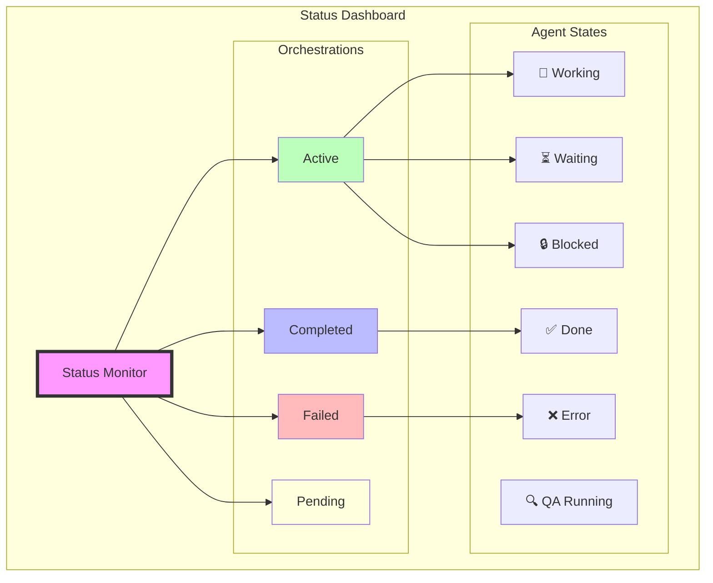
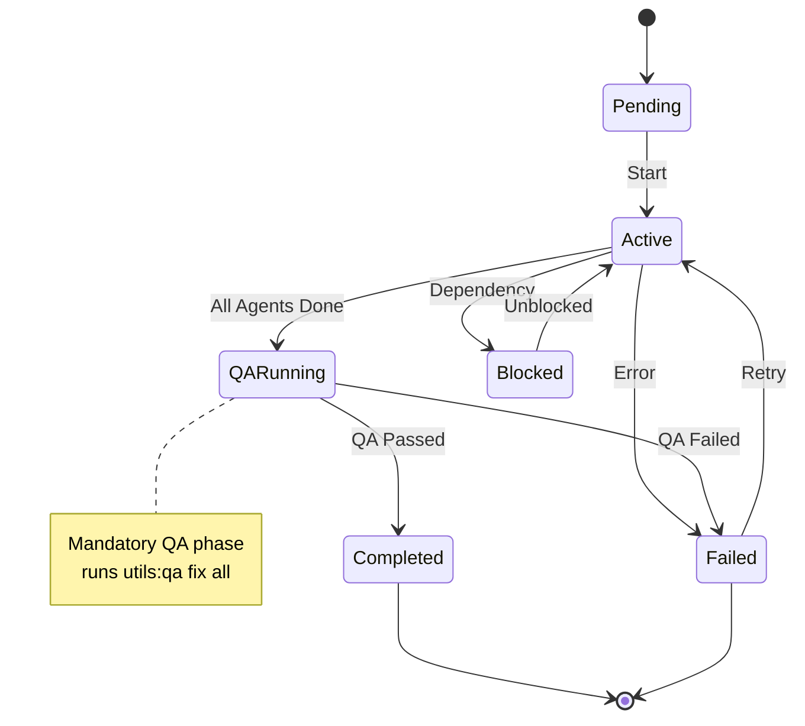

# Agent Status

Monitor and track the progress of agent orchestrations.

## Overview



## Usage

```bash
/agent:status [options]
```

### Options

- `--active` - Show only active orchestrations
- `--completed` - Show completed orchestrations
- `--failed` - Show failed orchestrations
- `--agent [name]` - Filter by specific agent

### Examples

```bash
# Show all agent activity
/agent:status

# Show only active orchestrations
/agent:status --active

# Check specific agent status
/agent:status --agent hexagonal

# Show failed operations
/agent:status --failed
```

## Status Information

### Agent State Transitions



### Progress Visualization

```mermaid
gantt
    title Agent Orchestration Timeline
    dateFormat HH:mm
    axisFormat %H:%M
    
    section Hexagonal
    Domain Model     :done,    hex1, 10:30, 15m
    Value Objects    :done,    hex2, after hex1, 10m
    Aggregates       :active,  hex3, after hex2, 20m
    
    
    section API
    Resources        :         api1, after hex3, 25m
    Endpoints        :         api2, after api1, 15m
    
    section Admin
    UI Forms         :         admin1, after hex3, 30m
    Grid Views       :         admin2, after admin1, 20m
```



### Orchestration Overview
- Feature being implemented
- Selected agents
- Orchestration pattern
- Start time
- Current phase

### Agent Status
- **Active**: Currently working
- **Completed**: Task finished successfully with QA passed
- **Failed**: Encountered errors or QA failed
- **Pending**: Waiting to start
- **Blocked**: Waiting for dependencies
- **QA Running**: 🚨 Mandatory quality assurance phase in progress

### Progress Tracking
- Tasks completed
- Tasks in progress
- Tasks pending
- Estimated completion

## Output Format

```
🔄 Active Orchestrations
========================

Feature: article-management
Pattern: collaborative
Context: blog
Started: 2024-01-11 10:30

Agents:
✅ Hexagonal Agent - Domain model complete
🔄 Hexagonal Agent - Implementing with TDD (75%)
⏳ API Agent - Pending
⏳ Admin Agent - Pending
🔍 QA Suite - Waiting for agents to complete

Progress: ████████░░ 45% (9/20 tasks)

Recent Activity:
- [10:45] Hexagonal: Created Article aggregate
- [10:50] Hexagonal: Added ArticleTest unit test via /act
- [10:52] Hexagonal: Testing value objects with TDD

🚨 Note: Orchestration will complete with mandatory QA phase

---

📊 Summary
==========
Active: 1
Completed: 3 (All passed QA)
Failed: 0
QA Pending: 1
Total Tasks: 45

🚨 Quality Status
================
Last QA Run: N/A
Auto-fixes Applied: 0
Tests Passing: TBD
Static Analysis: TBD
```

## Monitoring Features

### Real-time Updates
- Live progress tracking
- Agent communication logs
- Error notifications
- Completion alerts

### Historical Data
- Past orchestrations
- Success rates
- Common failures
- Performance metrics

### Agent Performance
- Tasks per agent
- Average completion time
- Success rate
- Error frequency

## Integration with TodoWrite

The status command integrates with the todo system:
- Tracks agent tasks
- Updates completion status
- Shows blocking issues
- Estimates remaining work

## Troubleshooting

### Common Issues

**Agent Blocked**
- Check dependencies
- Verify previous agent output
- Review error logs

**Slow Progress**
- Check agent configuration
- Review task complexity
- Consider parallel pattern

**Failed Tasks**
- Review error messages
- Check agent logs
- Verify requirements

### Debug Commands

```bash
# Show detailed agent logs
/agent:status --agent hexagonal --verbose

# Check orchestration configuration
/agent:status --show-config

# Export status report
/agent:status --export status-report.md
```

## Status Indicators

- ✅ **Completed**: Task finished successfully with QA passed
- 🔄 **In Progress**: Currently working
- ⏳ **Pending**: Waiting to start
- ❌ **Failed**: Task failed or QA failed
- 🔒 **Blocked**: Waiting for dependencies
- 🔍 **QA Running**: Mandatory quality assurance in progress
- ⚠️ **Warning**: Non-critical issues

### QA Phase Indicators
- 🎨 **ECS Running**: Code style fixes
- ♻️ **Rector Running**: Code modernization
- 📐 **Twig Running**: Template formatting
- 🧪 **PHPUnit Running**: Unit tests
- 🥒 **Behat Running**: Functional tests
- 🔍 **PHPStan Running**: Static analysis

## Best Practices

1. **Regular Monitoring**: Check status frequently
2. **Early Intervention**: Address blocks quickly
3. **Pattern Analysis**: Learn from failures
4. **Performance Tracking**: Optimize based on metrics
5. **Clear Communication**: Document issues

## Example Workflows

### During Development
```bash
# Start orchestration
/agent:orchestrate feature:user-auth --agents all

# Monitor progress
/agent:status --active

# Check specific agent
/agent:status --agent hexagonal

# Review on completion
/agent:status --completed
```

### Debugging Issues
```bash
# Check for failures
/agent:status --failed

# Get detailed logs
/agent:status --agent api --verbose

# Export for analysis
/agent:status --export debug-report.md
```
