# Admin Form Type Creation (TDD-First)

## 🔴 TDD-FIRST WORKFLOW

**⚠️ This command now follows TRUE Test-Driven Development: Tests BEFORE Implementation!**

See the complete workflow diagram: [Admin Form TDD Workflow](../workflow-graphs.md#adminform-tdd---test-driven-forms)

```mermaid
graph LR
    A[🔴 Write Form Tests] --> B[Run Tests - MUST FAIL]
    B --> C[🟢 Create Form Type]
    C --> D[🟢 Add Fields/Validation]
    D --> E[♻️ Refactor]
    
    style A fill:#ffcccc
    style B fill:#ffcccc
    style C fill:#ccffcc
    style D fill:#ccffcc
    style E fill:#ccffff
```



Create Symfony form types for use with Sylius Admin UI resources.

## Usage
`/admin:form [context] [form-name]`

Example: `/admin:form Blog CategoryType`

## TDD-First Implementation

I will now create the form type {{form-name}} in {{context}} context using Test-Driven Development.

### Step 1: 🔴 Write Form Tests FIRST (RED Phase)

#### Creating comprehensive test suite for form functionality

[Write tests/{{context}}/Unit/UI/Web/Admin/Form/{{form-name}}Test.php with:
- Test form has all required fields
- Test field types are correct
- Test validation constraints are applied
- Test field options (required, labels, placeholders)
- Test form data class is set correctly
- Test custom form logic (if any)]

[Write features/admin/{{resource}}_form.feature with:
- Scenario: Submit valid form data
- Scenario: Validation errors displayed for invalid data
- Scenario: Required fields are marked
- Scenario: Field help text is shown
- Scenario: Conditional fields work correctly
- Scenario: Form can be submitted and saved]

#### Verify tests fail

[Execute Bash: docker compose exec app bin/phpunit tests/{{context}}/Unit/UI/Web/Admin/Form/{{form-name}}Test.php]

**Expected result:** ❌ All tests should FAIL (form doesn't exist yet)

### Step 2: 🟢 Create Form Type Class (GREEN Phase)

[Create src/{{context}}Context/UI/Web/Admin/Form/{{form-name}}.php following the template structure]

### Step 3: 🟢 Add Fields and Validation

[Implement form fields to pass tests:
- Add all required fields with correct types
- Configure validation constraints
- Set labels and placeholders
- Add any custom logic]

### Step 4: Run Tests Again

[Execute Bash: docker compose exec app bin/phpunit tests/{{context}}/Unit/UI/Web/Admin/Form/{{form-name}}Test.php]

### Step 5: ♻️ Refactor (Keep Tests Green)

[Improve the implementation while ensuring all tests still pass:
- Extract validation to constants
- Group related fields
- Add field documentation
- Optimize form performance]

### Step 6: Run Quality Checks

[Execute Bash: docker compose exec app composer qa]

### Step 7: Add More Form Tests Incrementally

Now that the basic form works, add more specific tests:

```bash
# Add dynamic field test
/code:hexagonal:test {{context}} {{form-name}} conditional-fields
# Implement show/hide logic

# Add custom validation test
/code:hexagonal:test {{context}} {{form-name}} business-rule-validation
# Implement domain-specific rules

# Add data transformer test
/code:hexagonal:test {{context}} {{form-name}} slug-transformation
# Implement automatic slug generation
```

## Process

1. **Create Form Type Class** (After tests are written)
   ```php
   namespace App\[Context]Context\UI\Web\Admin\Form;
   
   use Symfony\Component\Form\AbstractType;
   use Symfony\Component\Form\FormBuilderInterface;
   use Symfony\Component\OptionsResolver\OptionsResolver;
   
   final class [FormName] extends AbstractType
   {
       public function buildForm(FormBuilderInterface $builder, array $options): void
       {
           // Form fields
       }
       
       public function configureOptions(OptionsResolver $resolver): void
       {
           // Form options
       }
       
       public function getBlockPrefix(): string
       {
           return 'app_admin_[resource]';
       }
   }
   ```

2. **Add Form Fields**
   ```php
   $builder
       ->add('name', TextType::class, [
           'label' => 'app.ui.name',
           'required' => true,
           'constraints' => [
               new Assert\NotBlank(message: 'app.[resource].name.not_blank'),
               new Assert\Length(
                   min: 2,
                   max: 100,
                   minMessage: 'app.[resource].name.min_length',
                   maxMessage: 'app.[resource].name.max_length',
               ),
           ],
           'attr' => [
               'placeholder' => 'app.ui.enter_name',
           ],
       ])
   ```

3. **Field Types**
   - **TextType**: Single line text
   - **TextareaType**: Multi-line text
   - **EmailType**: Email input with validation
   - **UrlType**: URL input with validation
   - **ChoiceType**: Dropdown/radio/checkboxes
   - **CheckboxType**: Single checkbox
   - **DateType**: Date picker
   - **DateTimeType**: Date and time picker
   - **NumberType**: Numeric input
   - **MoneyType**: Currency input
   - **FileType**: File upload
   - **EntityType**: Related entity selection

4. **Common Field Options**
   ```php
   ->add('status', ChoiceType::class, [
       'label' => 'app.ui.status',
       'required' => true,
       'choices' => [
           'app.ui.active' => 'active',
           'app.ui.inactive' => 'inactive',
           'app.ui.archived' => 'archived',
       ],
       'placeholder' => 'app.ui.choose_status',
       'constraints' => [
           new Assert\NotBlank(),
           new Assert\Choice(['active', 'inactive', 'archived']),
       ],
   ])
   ```

5. **Validation Constraints**
   - `Assert\NotBlank`: Field required
   - `Assert\Length`: String length limits
   - `Assert\Email`: Valid email format
   - `Assert\Url`: Valid URL format
   - `Assert\Choice`: Limited to specific values
   - `Assert\Regex`: Pattern matching
   - `Assert\Range`: Numeric range
   - `Assert\GreaterThan`: Minimum value
   - `Assert\LessThan`: Maximum value
   - `Assert\Date`: Valid date
   - `Assert\DateTime`: Valid datetime

6. **Hierarchical Forms**
   ```php
   ->add('parent', EntityType::class, [
       'label' => 'app.ui.parent_category',
       'class' => Category::class,
       'choice_label' => 'name',
       'placeholder' => 'app.ui.no_parent',
       'required' => false,
       'query_builder' => function (EntityRepository $er) {
           return $er->createQueryBuilder('c')
               ->where('c.level < :maxLevel')
               ->setParameter('maxLevel', 2)
               ->orderBy('c.name', 'ASC');
       },
   ])
   ```

7. **Dynamic Forms**
   ```php
   public function buildForm(FormBuilderInterface $builder, array $options): void
   {
       $builder->addEventListener(
           FormEvents::PRE_SET_DATA,
           function (FormEvent $event) {
               $data = $event->getData();
               $form = $event->getForm();
               
               if ($data && $data->hasChildren()) {
                   $form->add('moveChildren', CheckboxType::class, [
                       'label' => 'app.ui.move_children_to_parent',
                       'required' => false,
                   ]);
               }
           }
       );
   }
   ```

8. **Form Options**
   ```php
   public function configureOptions(OptionsResolver $resolver): void
   {
       $resolver->setDefaults([
           'data_class' => [Resource]Resource::class,
           'translation_domain' => 'messages',
           'validation_groups' => ['Default', 'admin'],
       ]);
   }
   ```

## Advanced Features

### Custom Form Types
```php
->add('description', RichTextType::class, [
    'label' => 'app.ui.description',
    'config' => [
        'toolbar' => 'basic',
        'height' => 200,
    ],
])
```

### Collection Forms
```php
->add('tags', CollectionType::class, [
    'entry_type' => TagType::class,
    'allow_add' => true,
    'allow_delete' => true,
    'by_reference' => false,
])
```

### Conditional Fields
```php
->add('publishedAt', DateTimeType::class, [
    'label' => 'app.ui.published_at',
    'required' => false,
    'widget' => 'single_text',
    'attr' => [
        'class' => 'js-published-at',
        'data-show-when' => 'status:published',
    ],
])
```

## Best Practices
- Always use translation keys for labels
- Add meaningful validation messages
- Use placeholders for better UX
- Group related fields together
- Add help text for complex fields
- Use appropriate HTML5 input types

## Test Examples Generated

### Unit Form Tests
```php
public function testFormHasNameField(): void
{
    $form = $this->factory->create(CategoryType::class);
    
    $this->assertTrue($form->has('name'));
    $this->assertInstanceOf(TextType::class, $form->get('name')->getConfig()->getType()->getInnerType());
}

public function testNameFieldHasValidationConstraints(): void
{
    $form = $this->factory->create(CategoryType::class);
    $config = $form->get('name')->getConfig();
    $constraints = $config->getOption('constraints');
    
    $this->assertCount(2, $constraints);
    $this->assertInstanceOf(NotBlank::class, $constraints[0]);
    $this->assertInstanceOf(Length::class, $constraints[1]);
    $this->assertEquals(2, $constraints[1]->min);
    $this->assertEquals(100, $constraints[1]->max);
}

public function testFormSubmitsValidData(): void
{
    $formData = [
        'name' => 'Technology',
        'description' => 'Tech articles',
        'status' => 'active',
    ];
    
    $form = $this->factory->create(CategoryType::class);
    $form->submit($formData);
    
    $this->assertTrue($form->isSynchronized());
    $this->assertTrue($form->isValid());
}
```

### Behat Form Tests
```gherkin
Feature: Category form validation
  In order to ensure data quality
  As an administrator
  I need form validation to work correctly

  Background:
    Given I am logged in as an administrator

  Scenario: Successful form submission
    When I visit "/admin/categories/new"
    And I fill in "Name" with "Technology"
    And I fill in "Description" with "Technology related articles"
    And I select "Active" from "Status"
    And I press "Create"
    Then I should see "Category has been successfully created"

  Scenario: Validation errors
    When I visit "/admin/categories/new"
    And I fill in "Name" with "A"
    And I press "Create"
    Then I should see "This value is too short. It should have 2 characters or more."
```

## Benefits of TDD for Forms

1. **Validation Coverage**: All constraints are tested
2. **Field Configuration**: Types and options verified
3. **User Experience**: Error messages tested
4. **Business Rules**: Custom validation tested
5. **Integration**: Form submission tested end-to-end

## Example TDD Workflow

```bash
# 1. Create form with TDD approach
/code:admin:form BlogContext CategoryType

# This will:
# - Write form tests first (RED)
# - Run tests to verify they fail
# - Create form type class
# - Add fields/validation to pass tests (GREEN)
# - Refactor while keeping tests green

# 2. Add specific features incrementally
/code:hexagonal:test BlogContext CategoryType parent-validation
# Implement circular reference prevention

/code:hexagonal:test BlogContext CategoryType slug-generation
# Add automatic slug from name

/code:hexagonal:test BlogContext CategoryType image-upload
# Implement file upload field

# 3. Each new requirement starts with a failing test
```

## 🚨 TDD Form Benefits

By writing tests first for forms:

1. **Field Design**: Tests drive field configuration
2. **Validation Logic**: All rules are verified
3. **Error Handling**: User feedback tested
4. **Dynamic Behavior**: Conditional logic tested
5. **Accessibility**: Can test form labels and help text

## Next Steps
1. Register form with resource
2. Add all translation keys
3. Test form validation
4. Style custom fields if needed