# Sylius Admin Resource Creation (TDD-First)

## 🔴 TDD-FIRST WORKFLOW

**⚠️ This command now follows TRUE Test-Driven Development: Tests BEFORE Implementation!**

See the complete workflow diagram: [Admin Resource TDD Workflow](../workflow-graphs.md#adminresource-tdd---test-driven-admin)

```mermaid
graph LR
    A[🔴 Write Behat Tests] --> B[Run Tests - MUST FAIL]
    B --> C[🔧 Run Maker]
    C --> D[🟢 Implement Admin Logic]
    D --> E[♻️ Refactor]
    
    style A fill:#ffcccc
    style B fill:#ffcccc
    style C fill:#ffffcc
    style D fill:#ccffcc
    style E fill:#ccffff
```



Create a complete admin interface for managing domain entities using Sylius Admin UI.

## Usage
`/admin:resource [context] [resource-name]`

Example: `/admin:resource Blog Category`


## TDD-First Implementation

I will now create the admin resource for {{resource-name}} in {{context}} context using Test-Driven Development.

### Step 1: 🔴 Write Behat Tests FIRST (RED Phase)

#### Creating comprehensive test suite for admin UI

[Write features/admin/{{resource-name}}_management.feature with:
- Background: Admin is logged in
- Scenario: List {{resource-name}} items with pagination
- Scenario: Create new {{resource-name}} with valid data
- Scenario: Validation errors when creating invalid {{resource-name}}
- Scenario: Update existing {{resource-name}}
- Scenario: Delete {{resource-name}} with confirmation
- Scenario: Filter and sort {{resource-name}} list
- Scenario: Bulk actions on multiple items]

[Write tests/{{context}}/Behat/Context/Admin/{{resource-name}}Context.php with:
- Step definitions for navigating admin UI
- Form filling helpers
- Grid interaction methods
- Assertion helpers for UI elements]

#### Verify tests fail

[Execute Bash: docker compose exec app vendor/bin/behat features/admin/{{resource-name}}_management.feature]

**Expected result:** ❌ All scenarios should FAIL (admin UI doesn't exist yet)

### Step 2: 🔧 Generate Admin Structure with Maker

[Execute Bash: docker compose exec app bin/console make:admin:resource {{context}} {{resource-name}}]

### Step 3: 🟢 Make Tests Pass (GREEN Phase)

#### Run tests again

[Execute Bash: docker compose exec app vendor/bin/behat features/admin/{{resource-name}}_management.feature]

#### Implement admin logic to pass tests

[Implement necessary logic:
- Connect providers to query gateways
- Connect processors to command gateways
- Add form validation rules
- Configure grid columns and filters
- Add menu entry]

### Step 4: ♻️ Refactor (Keep Tests Green)

[Improve the implementation while ensuring all tests still pass:
- Extract common form logic
- Improve grid performance
- Add custom actions
- Enhance UI/UX]

### Step 5: Run Quality Checks

[Execute Bash: docker compose exec app composer qa]

### Step 6: Add More Admin Tests Incrementally

Now that the basic admin works, add more specific tests:

```bash
# Add export functionality test
/code:hexagonal:test {{context}} {{resource-name}}Admin export-csv
# Implement CSV export

# Add bulk operations test
/code:hexagonal:test {{context}} {{resource-name}}Admin bulk-status-change
# Implement bulk status update

# Add advanced search test
/code:hexagonal:test {{context}} {{resource-name}}Admin advanced-filters
# Implement complex filtering
```

## Test Examples Generated

### Behat Admin Tests
```gherkin
Feature: Managing categories in admin panel
  In order to organize content
  As an administrator
  I want to manage categories

  Background:
    Given I am logged in as an administrator
    And there are 10 categories in the system

  Scenario: Viewing category list
    When I visit "/admin/categories"
    Then I should see 10 categories in the list
    And I should see pagination controls

  Scenario: Creating a new category
    When I visit "/admin/categories/new"
    And I fill in "Name" with "Technology"
    And I fill in "Description" with "Tech articles"
    And I press "Create"
    Then I should see "Category has been successfully created"
    And I should see "Technology" in the categories list

  Scenario: Validation errors
    When I visit "/admin/categories/new"
    And I press "Create"
    Then I should see "This value should not be blank" for "Name"
```

### Benefits of TDD for Admin UI

1. **User Flow**: Tests define complete user journeys
2. **UI Validation**: Form errors are tested upfront
3. **Grid Features**: Sorting/filtering tested from start
4. **Permissions**: Access control verified
5. **UX Quality**: User feedback messages tested

## Process

1. **Create Resource Structure**
   ```
   UI/Web/Admin/
   ├── Resource/
   │   └── CategoryResource.php
   ├── Grid/
   │   └── CategoryGrid.php
   ├── Form/
   │   └── CategoryType.php
   ├── Provider/
   │   ├── CategoryGridProvider.php
   │   └── CategoryItemProvider.php
   └── Processor/
       ├── CreateCategoryProcessor.php
       ├── UpdateCategoryProcessor.php
       └── DeleteCategoryProcessor.php
   ```

2. **Create Resource Class**
   ```php
   #[AsResource(
       alias: 'app.category',
       section: 'admin',
       formType: CategoryType::class,
       templatesDir: '@SyliusAdminUi/crud',
       routePrefix: '/admin',
       driver: 'doctrine/orm',
   )]
   #[Index(grid: CategoryGrid::class)]
   #[Create(
       processor: CreateCategoryProcessor::class,
       redirectToRoute: 'app_admin_category_index',
   )]
   #[Show(provider: CategoryItemProvider::class)]
   #[Update(
       provider: CategoryItemProvider::class,
       processor: UpdateCategoryProcessor::class,
       redirectToRoute: 'app_admin_category_index',
   )]
   #[Delete(
       provider: CategoryItemProvider::class,
       processor: DeleteCategoryProcessor::class,
   )]
   final class CategoryResource implements ResourceInterface
   ```

3. **Create Grid Configuration**
   - Define fields (string, date, boolean)
   - Add sorting capabilities
   - Configure actions (create, update, delete)
   - Set pagination limits

## Example TDD Workflow

```bash
# 1. Create admin resource with TDD approach
/code:admin:resource BlogContext Category

# This will:
# - Write Behat tests first (RED)
# - Run tests to verify they fail
# - Generate admin structure with maker
# - Implement logic to pass tests (GREEN)
# - Refactor while keeping tests green

# 2. Add specific features incrementally
/code:hexagonal:test BlogContext CategoryAdmin hierarchical-view
# Implement tree view for categories

/code:hexagonal:test BlogContext CategoryAdmin drag-drop-ordering
# Add drag & drop reordering

/code:hexagonal:test BlogContext CategoryAdmin image-upload
# Implement category image upload

# 3. Each new requirement starts with a failing test
```

## 🚨 TDD Admin Benefits

By writing tests first for admin UI:

1. **User Experience**: Tests ensure smooth workflows
2. **Form Behavior**: Validation is tested completely
3. **Grid Features**: All interactions verified
4. **Performance**: Can test loading times
5. **Accessibility**: Can include a11y tests

4. **Create Form Type**
   - Symfony form with validation
   - Translation labels
   - Custom field types as needed
   - Constraints for business rules

5. **Create Providers**
   - **GridProvider**: Lists with pagination using Pagerfanta
   - **ItemProvider**: Single item retrieval
   - Transform Gateway responses to Resources

6. **Create Processors**
   - **CreateProcessor**: Handle POST via Gateway
   - **UpdateProcessor**: Handle PUT via Gateway
   - **DeleteProcessor**: Handle DELETE via Gateway
   - Exception handling with proper HTTP codes

7. **Update Menu**
   - Add new menu item to MenuBuilder
   - Configure icon and translation key
   - Set proper route

8. **Configure Routes**
   - Resource auto-generates routes:
     - GET /admin/categories (index)
     - GET/POST /admin/categories/new (create)
     - GET /admin/categories/{id} (show)
     - GET/PUT /admin/categories/{id}/edit (update)
     - DELETE /admin/categories/{id} (delete)

## Integration Points
- Uses Application Gateways for all operations
- Transforms between Resources and Gateway requests/responses
- Handles validation at form level
- Manages translations for UI

## Quality Standards
- Follow @docs/reference/sylius-admin-ui-integration.md
- Implement all CRUD operations
- Use proper exception handling
- Add comprehensive validation
- Support translations

## Generated Routes
The resource will automatically generate:
- `app_admin_[resource]_index`
- `app_admin_[resource]_create`
- `app_admin_[resource]_show`
- `app_admin_[resource]_update`
- `app_admin_[resource]_delete`

## 🚨 IMPORTANT: Configuration Notes

### Automatic Route Discovery

Sylius Admin resources are **automatically discovered** through PHP attributes. No manual route configuration needed!

**How it works**:
1. Your Resource class uses `#[AsResource]` attribute
2. Operations use `#[Index]`, `#[Create]`, `#[Update]`, `#[Delete]` attributes
3. Sylius routing loaders scan and register routes automatically

**Verify routing is enabled** in `@config/routes/sylius_resource.php`:
```php
$routingConfigurator->import('sylius.routing.loader.crud_routes_attributes', 'service');
$routingConfigurator->import('sylius.routing.loader.routes_attributes', 'service');
```

### Menu Integration Required

**Don't forget** to add your resource to the admin menu! Find the appropriate MenuBuilder and add:
```php
$menu->addChild('{{resource_plural}}', [
    'route' => 'app_admin_{{resource}}_index',
    'label' => 'app.ui.{{resource_plural}}',
    'icon' => 'appropriate-icon',
]);
```

## Next Steps
1. Run migrations if new entity
2. Add translations in `translations/messages.en.yaml`
3. Add menu entry in MenuBuilder
4. Clear cache: `docker compose exec app bin/console cache:clear`
5. Test admin interface at `/admin/{{resource_plural}}`
