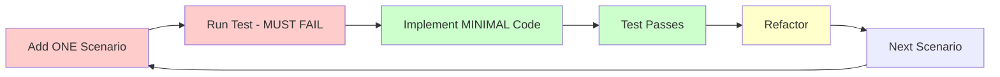

# API Scenario Creation

## 🔴 INCREMENTAL SCENARIO WORKFLOW

**This command implements incremental testing: ONE scenario at a time**



## Usage

`/code/api/scenario [context] [operation] [scenario-type]`

**Examples:**
```bash
# Add ONE scenario at a time
/code/api/scenario Blog CreateArticle success
/code/api/scenario Blog CreateArticle validation-error  
/code/api/scenario Blog CreateArticle duplicate-slug
/code/api/scenario Blog ListArticles pagination
/code/api/scenario Blog GetArticle not-found
```

## Scenario Types

### CRUD Operations
- **`success`** - Happy path for the operation
- **`validation-error`** - Input validation failures
- **`not-found`** - Resource doesn't exist
- **`unauthorized`** - Access denied
- **`duplicate`** - Unique constraint violation

### Query Operations  
- **`pagination`** - List with pagination
- **`filtering`** - Search/filter results
- **`sorting`** - Order results
- **`empty-result`** - No matching records

### Business Rules
- **`business-rule-1`**, **`business-rule-2`** - Custom business scenarios

## Implementation Process

### Step 1: Create the Scenario (RED Phase)

```bash
# This command adds ONE scenario to existing feature file
/code/api/scenario BlogContext CreateArticle success
```

**Generated scenario:**
```gherkin
Scenario: Successfully create a new article
  When I send a POST request to "/api/articles" with:
    """
    {
      "title": "My New Article",
      "content": "This is the content",
      "slug": "my-new-article"
    }
    """
  Then the response status code should be 201
  And the response should be JSON
  And the JSON node "id" should exist
  And the JSON node "title" should be equal to "My New Article"
  And the JSON node "status" should be equal to "draft"
```

### Step 2: Run Test (Must Fail)

```bash
# Run ONLY this scenario
docker compose exec app vendor/bin/behat features/blog/article-api.feature:15
```

**Expected result:** ❌ **FAILURE** (endpoint doesn't exist yet)

### Step 3: Implement Minimal Code (GREEN Phase)

Use `/act` to implement JUST enough code:
- Create the API resource
- Add the POST endpoint  
- Make the test pass (minimal implementation)

### Step 4: Refactor

Improve code quality while keeping the test green.

### Step 5: Next Scenario

Only after the current scenario is GREEN, add the next one:

```bash
/code/api/scenario BlogContext CreateArticle validation-error
```

## Scenario Templates

### Success Templates

**Create Operation:**
```gherkin
Scenario: Successfully create a new {entity}
  When I send a POST request to "/api/{entities}" with:
    """
    {json_payload}
    """
  Then the response status code should be 201
  And the JSON node "id" should exist
```

**Read Operation:**
```gherkin
Scenario: Successfully get an existing {entity}
  Given a {entity} exists with id "{{id}}"
  When I send a GET request to "/api/{entities}/{{id}}"
  Then the response status code should be 200
  And the JSON node "id" should be equal to "{{id}}"
```

### Error Templates

**Validation Error:**
```gherkin
Scenario: Create {entity} with validation errors
  When I send a POST request to "/api/{entities}" with:
    """
    {
      "title": ""
    }
    """
  Then the response status code should be 422
  And the JSON node "violations[0].propertyPath" should be equal to "title"
  And the JSON node "violations[0].message" should contain "required"
```

**Not Found:**
```gherkin
Scenario: Get non-existent {entity}
  When I send a GET request to "/api/{entities}/00000000-0000-0000-0000-000000000000"
  Then the response status code should be 404
```

## Command Implementation

The command will:

1. **Read existing feature file** (created by `/code/api/behat`)
2. **Generate ONE scenario** based on the operation and type
3. **Append to the feature file**
4. **Use smart templates** based on operation type
5. **Include proper Gherkin syntax**

## Implementation After Scenario

After adding a scenario:

```bash
# 1. Add ONE scenario
/code/api/scenario BlogContext CreateArticle success

# 2. Run test - identify missing functionality
docker compose exec app vendor/bin/behat features/blog/article-api.feature

# 3. Implement the functionality
# Create the API endpoint to satisfy the test
```

Implementation steps:
- Create the API endpoint
- Add proper validation
- Ensure test passes
- Refactor for quality

## Quality Standards

- **One scenario at a time** - Never add multiple scenarios
- **Descriptive names** - Clear business intent
- **Proper Gherkin** - Given/When/Then structure
- **Realistic data** - Use domain-appropriate test data
- **Edge cases** - Test boundaries and errors

## Example Test Session

```bash
# Session: Testing Article CRUD API

# 1. Add create success scenario
/code/api/scenario Blog CreateArticle success
# Run test to verify behavior

# 2. Implement create endpoint
# Add necessary code to make test pass

# 3. Add validation scenario  
/code/api/scenario Blog CreateArticle validation-error
# Verify validation works

# 4. Add validation logic
# Implement validation rules

# 5. Add get scenario
/code/api/scenario Blog GetArticle success
# Test retrieval functionality

# 6. Implement GET endpoint
# Create retrieval logic

# Continue one scenario at a time...
```

## Integration with Other Commands

**Setup (once):**
```bash
/code/api/behat BlogContext article-management  # Creates feature file structure
```

**Test Cycle (repeat):**
```bash
/code/api/scenario BlogContext CreateArticle success  # Add ONE scenario
# Implement functionality to make test pass
```

## Benefits of This Approach

✅ **Incremental Testing** - One test scenario at a time
✅ **Focused Implementation** - Only implement what's needed
✅ **Better Design** - Incremental API evolution  
✅ **Clear Progress** - See exactly what works
✅ **Less Overwhelming** - Small, manageable steps

## Next Steps

After implementing all scenarios for one operation:
- Move to next operation: `/code/api/scenario BlogContext UpdateArticle success`
- Add UI tests: `/code/admin/scenario BlogContext ArticleForm success`
- Integration testing: Ensure all scenarios pass together