# DDD Aggregate Creation

## 🏛️ Implementation Workflow

```mermaid
graph LR
    A[📋 Model Domain] --> B[🔧 Run Maker]
    B --> C[💼 Implement Logic]
    C --> D[📣 Add Events]
    D --> E[🧪 Create Tests]
    
    style A fill:#e1f5fe
    style B fill:#ffffcc
    style C fill:#ccffcc
    style D fill:#f3e5f5
    style E fill:#ffebee
```



Create a domain aggregate root with business logic and domain events following DDD principles.

## Usage
`/ddd:aggregate [context] [aggregate-name]`

Example: `/ddd:aggregate Blog Article`

## Implementation Process

I will now create the aggregate {{aggregate-name}} in {{context}} context.

### Step 1: 📋 Model the Domain

#### Check Prerequisites

[Use Glob to check: src/{{context}}/Domain/Shared/ValueObject/{{aggregate-name}}Id.php]

{{#unless id-value-object-exists}}
Creating required ID value object first:
[Execute /code:hexagonal:value-object {{context}} {{aggregate-name}}Id]
{{/unless}}

#### Analyze business requirements

[Determine:
- Aggregate boundaries
- Business invariants
- State transitions
- Domain events needed]

### Step 2: 🔧 Generate Aggregate Structure

[Execute Bash: docker compose exec app bin/console make:domain:aggregate {{context}} {{aggregate-name}}]

### Step 3: 💼 Implement Business Logic

[Implement the aggregate with:
- Business methods
- Invariant enforcement
- State management
- Validation rules]

### Step 4: 📣 Add Domain Events

[Implement event generation:
- Define event classes
- Emit events on state changes
- Store events for dispatch
- Ensure event immutability]

### Step 5: 🧪 Create Comprehensive Tests

[Create test coverage for:
- Construction scenarios
- Business method behavior
- Invariant violations
- State transitions
- Event generation]

### Step 6: Run Quality Checks

[Execute Bash: docker compose exec app composer qa]

### Step 7: Enhance Business Behavior

Implement additional business logic:

```bash
# Business behaviors to implement
- State transition methods (publish, archive, etc.)
- Business rule validations
- Complex calculations
- Event generation for all changes
- Aggregate reconstitution from events
```

## Test Examples

### Aggregate Test Scenarios
```php
// Basic construction and state
public function testCreateWithRequiredFields(): void
public function testCannotCreateWithInvalidData(): void

// Business behavior
public function testBusinessMethodChangesState(): void
public function testBusinessRulePreventsForbiddenAction(): void

// Event generation
public function testActionsGenerateAppropriateEvents(): void
public function testEventsContainCorrectData(): void
```

### Creator Tests
```php
// Successful creation
public function testCreatesAggregateSuccessfully(): void

// Business rules
public function testEnforcesUniqueConstraints(): void
public function testValidatesBusinessRules(): void

// Infrastructure interaction
public function testSavesViaRepository(): void
public function testReturnsCreatedAggregate(): void
```

## Benefits of Aggregate Pattern

1. **Business Logic Encapsulation**: All rules in one place
2. **Event Sourcing Ready**: Natural event generation
3. **Consistency Boundary**: Invariants always enforced
4. **Clear Domain Model**: Reflects business language
5. **Testability**: Easy to test business logic

## Architecture Patterns
- Follow @docs/reference/cqrs-pattern.md
- Apply @docs/reference/domain-layer-pattern.md
- Use event-driven communication

## Quality Standards
- Aggregates enforce all business rules
- Events represent business facts
- No infrastructure dependencies
- Complete test coverage

## 🚨 Aggregate Implementation Benefits

Well-designed aggregates provide:

1. **Domain Integrity**: Business rules always enforced
2. **Event Trail**: Complete audit of changes
3. **Consistency**: Transactional boundaries respected
4. **Clear API**: Methods reflect business operations
5. **Evolution Support**: Easy to add new behaviors

## Incremental Development

Continue enhancing the aggregate:

```bash
# Progressive enhancement
- Add new business methods
- Implement additional invariants
- Generate more detailed events
- Optimize performance
- Add domain services integration
```

### Example Implementation Workflow

```bash
# 1. Create aggregate structure
/code:hexagonal:aggregate BlogContext Article

# This will:
# - Generate aggregate with Creator
# - Implement core business logic
# - Add domain event generation
# - Create comprehensive tests
# - Ensure consistency boundaries

# 2. Implement business behaviors
- publish() with status validation
- schedule() for future publishing
- archive() with state checks
- updateContent() with validation
- addTags() with limits

# 3. Enhance based on requirements
```

## Prerequisites Check

Before creating an aggregate, ensure these components exist:

### Required Value Objects
```bash
# Create ID value object first
/code:hexagonal:value-object BlogContext ArticleId

# Create other value objects  
/code:hexagonal:value-object BlogContext Title
/code:hexagonal:value-object BlogContext Content
```

### Recommended ID Generator
```bash
# Create dedicated ID generator
/code:hexagonal:id-generator BlogContext Article
```

## Next Steps
1. Test aggregate behavior: `/code:hexagonal:test BlogContext Article create-with-fields`
2. Create gateway: `/code:hexagonal:gateway BlogContext CreateArticle`
3. Create API endpoints: `/code/api/resource BlogContext Article`
