# DDD Entity Creation

## 🏗️ Implementation Workflow

```mermaid
graph LR
    A[📋 Design Entity] --> B[🔧 Run Maker]
    B --> C[🗓️ Create Repository]
    C --> D[🗺️ Add Mapping]
    D --> E[🧪 Create Tests]
    
    style A fill:#e1f5fe
    style B fill:#ffffcc
    style C fill:#ccffcc
    style D fill:#f3e5f5
    style E fill:#ffebee
```



Create a domain entity with repository for domain persistence following DDD principles.

**Note**: For value objects, use the dedicated command: `/code:hexagonal:value-object`

## Entity vs Aggregate

**This command creates Doctrine entities for database persistence**:
- **Entity** (`/code:hexagonal:entity`): Creates Doctrine ORM entity for database mapping
- **Aggregate** (`/code:hexagonal:aggregate`): Creates domain aggregate with business logic

Both are needed for a complete DDD implementation:
1. First create the Doctrine entity (this command) for persistence
2. Then create the domain aggregate for business logic
3. The repository will map between them

## Usage
`/ddd:entity [context] [entity-name]`

Example: `/ddd:entity Blog Article`

## Implementation Process

I will now create the entity {{entity-name}} in {{context}} context.

### Step 1: 📋 Design Entity Structure

#### Check Prerequisites

Before creating the entity, ensure required value objects exist:

[Use Glob to check: src/{{context}}Context/Domain/Shared/ValueObject/{{entity-name}}Id.php]

{{#unless id-value-object-exists}}
Creating required ID value object:
[Execute /code:hexagonal:value-object {{context}} {{entity-name}}Id]
{{/unless}}

#### Analyze entity requirements

[Determine:
- Entity properties and types
- Value objects needed
- Relationships with other entities
- Database constraints]

### Step 2: 🔧 Generate Infrastructure

[Execute Bash: docker compose exec app bin/console make:infrastructure:entity {{context}}Context {{entity-name}}]

### Step 3: 🗓️ Implement Repository

[Implement repository with:
- Save/update operations
- Query methods
- Error handling
- Performance optimizations]

### Step 4: 🗺️ Configure Doctrine Mapping

[Configure ORM mapping:
- Property mappings
- Indexes for performance
- Constraints and validations
- Relationship mappings]

### Step 5: 🧪 Create Comprehensive Tests

[Create tests for:
- Repository operations
- Doctrine mapping validation
- Query performance
- Constraint enforcement]

### Step 6: Run Quality Checks

[Execute Bash: docker compose exec app composer qa]

### Step 6: Verify Generated Files

[Use Read to check: src/{{context}}Context/Infrastructure/Persistence/Doctrine/ORM/Entity/{{entity-name}}.php]
[Use Read to check: src/{{context}}Context/Infrastructure/Persistence/Doctrine/ORM/{{entity-name}}Repository.php]
[Use Read to check: src/{{context}}Context/Domain/Shared/Repository/{{entity-name}}RepositoryInterface.php]

### Step 7: Check for Migration

[Use Bash to check for new migration: ls -la migrations/ | tail -n 5]

### Step 8: Add Business-Specific Methods

Enhance repository with domain-specific queries:

```bash
# Repository enhancements
- findByStatus() for filtering
- existsBySlug() for uniqueness checks
- countByCriteria() for statistics
- Custom query methods
- Performance optimizations
```

### Step 9: Create Domain Layer

Implement the domain entity:

[Create domain components:
- Domain entity with value objects
- Business methods and invariants
- Domain event generation
- Repository interface
- Mapping between layers]

## Test Examples

### Repository Test Scenarios
```php
// Basic CRUD operations
public function testSaveStoresEntity(): void
public function testFindByIdReturnsEntity(): void
public function testFindByIdReturnsNullWhenNotFound(): void
public function testUpdateModifiesEntity(): void
public function testDeleteRemovesEntity(): void

// Business-specific queries
public function testFindByStatusReturnsFilteredResults(): void
public function testExistsBySlugReturnsBoolean(): void
public function testCountByCriteriaReturnsInteger(): void
```

### Integration Tests
```php
// Doctrine mapping
public function testEntityMappingIsValid(): void
public function testEntityCanBePersisted(): void
public function testRelationshipsAreMapped(): void
public function testConstraintsAreEnforced(): void
```

## Benefits of Entity Pattern

1. **Clean Separation**: Domain logic separate from persistence
2. **Repository Pattern**: Clear data access abstraction
3. **Type Safety**: Strong typing throughout
4. **Performance**: Optimized queries and indexes
5. **Flexibility**: Easy to change persistence strategy

## Process Summary

The entity creation provides:
- Doctrine entity with proper mapping
- Repository implementation
- Clean domain/infrastructure separation
- Comprehensive test coverage
- Performance optimizations

The implementation ensures:
- Domain integrity
- Persistence reliability
- Query efficiency
- Maintainability

## Quality Standards
- Follow @docs/reference/domain-layer-pattern.md
- Use @docs/reference/php-features-best-practices.md
- Apply TDD with PHPUnit for domain logic
- Run `composer qa` after implementation

## Template Integration
Use code snippets from `docs/agent/snippets/`:
- `domain/entity.md` for entity structure
- Repository interfaces follow standard patterns

## Prerequisites
Before creating an entity:
1. **Create necessary value objects** using `/code:hexagonal:value-object`
2. **Design your domain model** to identify required value objects
3. **Plan entity relationships** and aggregate boundaries

## 🚨 Implementation Guidelines

After generating the infrastructure:

1. **Implement domain layer** with business logic
2. **Add comprehensive validation** in value objects
3. **Create business methods** in domain entity
4. **Enforce invariants** at domain level
5. **Map between layers** in repository
6. **Test thoroughly** at all levels

### Example Implementation Workflow

```bash
# 1. Create value objects first
/code:hexagonal:value-object BlogContext ArticleId
/code:hexagonal:value-object BlogContext ArticleTitle
/code:hexagonal:value-object BlogContext ArticleContent
/code:hexagonal:value-object BlogContext ArticleStatus
/code:hexagonal:value-object BlogContext Slug

# 2. Create entity infrastructure
/code:hexagonal:entity BlogContext Article

# This will:
# - Generate Doctrine entity
# - Create repository implementation
# - Add repository interface
# - Configure ORM mapping
# - Create comprehensive tests

# 3. Enhance repository with domain queries
- findActive() for published articles
- findByAuthor() for author filtering
- findByDateRange() for archives
- searchByTitle() for searching

# 4. Implement domain layer
- Create domain Article entity
- Add business methods
- Generate domain events
- Map to/from infrastructure
```

## 🚨 Entity Implementation Benefits

Proper entity implementation provides:

1. **Clean Architecture**: Clear separation of concerns
2. **Persistence Abstraction**: Repository pattern benefits
3. **Type Safety**: Strong typing throughout layers
4. **Performance**: Optimized queries and caching
5. **Maintainability**: Easy to modify and extend

## Next Steps
After creating entity:
1. Create aggregate if needed: `/ddd:aggregate`
2. Create commands/queries: `/act`
3. Create API resource: `/api:resource`
