# DDD Value Object Creation

## 🏗️ Implementation Workflow

```mermaid
graph LR
    A[📋 Analyze Requirements] --> B[🔧 Run Maker]
    B --> C[✨ Implement Validation]
    C --> D[🧪 Create Tests]
    D --> E[♻️ Refactor & Optimize]
    
    style A fill:#e1f5fe
    style B fill:#ffffcc
    style C fill:#ccffcc
    style D fill:#f3e5f5
    style E fill:#ccffff
```



Create a domain value object with comprehensive validation and business logic following DDD principles.

## Usage
`/code:hexagonal:value-object [context] [name] [template?]`

Examples:
- `/code:hexagonal:value-object Blog Title` (uses generic template)
- `/code:hexagonal:value-object User Email email`
- `/code:hexagonal:value-object Payment Amount money`
- `/code:hexagonal:value-object Contact PhoneNumber phone`

## 📋 Implementation Process

## Available Templates

### 1. **generic** (default)
Basic value object template for custom validation:
```php
// Example: Title, Name, Description, Code
final class Title
{
    public function __construct(
        private(set) string $value,
    ) {
        $this->validate();
    }
}
```

### 2. **email**
Email address with built-in validation:
```php
// Validates email format, normalizes to lowercase
final class Email
{
    public function getDomain(): string { }
    public function getLocalPart(): string { }
}
```

### 3. **money**
Monetary values with currency:
```php
// Handles amounts with precision
final class Price
{
    public function __construct(
        private(set) int $amount,      // in cents
        private(set) string $currency,
    ) { }
}
```

### 4. **phone**
Phone numbers with formatting:
```php
// Validates and formats phone numbers
final class PhoneNumber
{
    public function getFormatted(): string { }
    public function getCountryCode(): ?string { }
}
```

### 5. **url**
URLs with validation and parsing:
```php
// Validates URL format
final class WebsiteUrl
{
    public function getHost(): string { }
    public function getScheme(): string { }
}
```

### 6. **percentage**
Percentage values (0-100):
```php
// Ensures value between 0 and 100
final class DiscountPercentage
{
    public function toDecimal(): float { }
}
```

## Implementation Process

I will now create the value object {{name}} in {{context}} context.

### Step 1: 📋 Analyze Requirements

[Determine validation rules and business constraints for {{name}}]

### Step 2: 🔧 Generate Value Object Structure

[Execute Bash: docker compose exec app bin/console make:domain:value-object {{context}} {{name}}{{#if template}} --template={{template}}{{/if}}]

### Step 3: ✨ Implement Business Logic

[Implement validation rules and business methods:
- Add validation constants
- Implement validation logic
- Add business-specific methods
- Ensure immutability]

### Step 4: 🧪 Create Comprehensive Tests

[Create test suite covering:
- Valid value scenarios
- Validation edge cases
- Business method behavior
- Equality comparisons
- String representations]

### Step 5: ♻️ Refactor and Optimize

[Improve the implementation:
- Extract complex logic
- Optimize performance
- Enhance documentation
- Ensure clean code principles]

### Step 6: Run Quality Checks

[Execute Bash: docker compose exec app composer qa]

## Process Summary

The value object has been created with:
- PHP 8.4 features (asymmetric visibility)
- Basic validation logic from the template
- Standard methods: `getValue()`, `equals()`, `toString()`
{{#if template}}
- Specialized {{template}} template methods
{{/if}}

## Test Coverage Guidelines

Ensure comprehensive test coverage for the {{template}} template:

### Basic Tests (All Templates)
```php
public function testValid{{name}}(): void
public function testEquals(): void
public function testToString(): void
```

### Template-Specific Tests
{{#if template=="email"}}
```php
public function testInvalidEmailThrows(): void
public function testGetDomain(): void
public function testGetLocalPart(): void
public function testNormalization(): void
```
{{/if}}

{{#if template=="money"}}
```php
public function testNegativeAmountThrows(): void
public function testInvalidCurrencyThrows(): void
public function testGetAmount(): void
public function testGetCurrency(): void
```
{{/if}}

{{#if template=="phone"}}
```php
public function testInvalidPhoneThrows(): void
public function testGetFormatted(): void
public function testGetCountryCode(): void
```
{{/if}}

{{#if template=="url"}}
```php
public function testInvalidUrlThrows(): void
public function testGetHost(): void
public function testGetScheme(): void
```
{{/if}}

{{#if template=="percentage"}}
```php
public function testOutOfRangeThrows(): void
public function testToDecimal(): void
```
{{/if}}

## Next Steps

{{#if is-id-value-object}}
Consider creating an ID generator:
[Execute /code:hexagonal:id-generator {{context}} {{entity-name}}]
{{/if}}

Use this value object in:
- Entities and aggregates
- API resources for validation
- Repositories for type safety

## Common Validation Patterns

### String Length
```php
private const int MIN_LENGTH = 2;
private const int MAX_LENGTH = 100;

if (strlen($this->value) < self::MIN_LENGTH) {
    throw ValidationException::withTranslationKey('validation.title.too_short');
}
```

### Pattern Matching
```php
private const string PATTERN = '/^[a-zA-Z0-9-]+$/';

if (!preg_match(self::PATTERN, $this->value)) {
    throw ValidationException::withTranslationKey('validation.slug.invalid_format');
}
```

### Range Validation
```php
private const int MIN_VALUE = 0;
private const int MAX_VALUE = 100;

if ($this->value < self::MIN_VALUE || $this->value > self::MAX_VALUE) {
    throw ValidationException::withTranslationKey('validation.percentage.out_of_range');
}
```

### Custom Business Rules
```php
// Example: SKU format validation
if (!$this->isValidSkuFormat($this->value)) {
    throw ValidationException::withTranslationKey('validation.sku.invalid_format');
}
```

## Quality Standards
- Follow @docs/reference/architecture/patterns/domain-layer-pattern.md
- Use PHP 8.4 features (asymmetric visibility)
- Immutable by design (no setters)
- Business validation in constructor
- Translation keys for error messages
- Consistent `getValue()` method across all value objects

## 🚨 Quality Benefits

Implementing with comprehensive validation provides:

1. **Domain Integrity**: Business rules enforced at the value level
2. **Type Safety**: Strong typing prevents invalid states
3. **Immutability**: Values cannot be corrupted after creation
4. **Clear Intent**: Self-documenting code through meaningful names
5. **Reusability**: Value objects can be used across the domain

## Validation Scenarios

Implement comprehensive validation covering:

```bash
# Core validations
- Required field validation
- Format validation (regex patterns)
- Length constraints
- Range validation
- Business rule enforcement

# Edge cases
- Boundary values
- Special characters
- Internationalization
- Performance considerations
```

### Example Implementation Workflow

```bash
# 1. Create value object with appropriate template
/code:hexagonal:value-object BlogContext ArticleTitle

# This will:
# - Generate value object structure
# - Implement validation logic
# - Add business methods
# - Create comprehensive tests
# - Ensure quality standards

# 2. Enhance with additional validations
- Minimum/maximum length
- Character restrictions
- Whitespace handling
- Unicode support

# 3. Add business-specific methods as needed
- toSlug() for URL generation
- truncate() for summaries
- contains() for searching
```

## Integration with Entities

Value objects are used in entities and aggregates:

```php
// In your entity
final class Article
{
    public function __construct(
        private ArticleId $id,
        private ArticleTitle $title,
        private ArticleContent $content,
        private ArticleStatus $status,
    ) {}
}
```

## Best Practices

1. **Single Responsibility**: One value object per concept
2. **Rich Validation**: Enforce all business rules
3. **Meaningful Errors**: Use translation keys with context
4. **No External Dependencies**: Pure PHP validation only
5. **Test Edge Cases**: Empty, null, boundary values

## Common Use Cases

### Identity Value Objects
```bash
/code:hexagonal:value-object Blog ArticleId
/code:hexagonal:value-object User UserId
/code:hexagonal:value-object Order OrderNumber
```

### Business Concepts
```bash
/code:hexagonal:value-object Product Sku
/code:hexagonal:value-object Inventory Quantity  
/code:hexagonal:value-object Shipping TrackingNumber
```

### Contact Information
```bash
/code:hexagonal:value-object Customer Email email
/code:hexagonal:value-object Customer Phone phone
/code:hexagonal:value-object Customer Address
```

## Next Steps
After creating value objects:

### For ID Value Objects
If you created an ID value object (e.g., ArticleId):
```bash
/code:hexagonal:id-generator BlogContext Article  # Create dedicated ID generator
```

### For Other Value Objects
1. Use them in entities: `/code:hexagonal:entity`
2. Reference in aggregates: `/code:hexagonal:aggregate`
3. Map in repositories for persistence
4. Use in API resources for validation

### Testing
Ensure comprehensive test coverage:
```bash
# Test valid cases and edge cases
- Valid title creation
- Empty value rejection
- Minimum/maximum length validation
- Special character handling
- Equality comparisons
- String representations
```