# Workflow Graphs for Code Commands

This document contains Mermaid graphs showing the mandatory workflow for each code generation command. Each command MUST use the appropriate `make` command before any file modifications.

## Complete Development Workflow with Mandatory QA


## Admin UI Commands

### /admin:resource - Complete Admin Resource


### /admin:form - Symfony Form Types

```mermaid
flowchart TD
    Start([User runs /admin:form]) --> Context["📁 Determine context and entity"]
    Context --> CheckEntity{Entity exists?}
    CheckEntity -->|No| ErrorEntity["❌ Create entity first with /ddd:entity"]
    CheckEntity -->|Yes| FormExists{Form type exists?}
    FormExists -->|Yes| ModifyExisting["✏️ Modify existing form type"]
    FormExists -->|No| CreateNew["📝 Create new form type<br/>(Manual - no maker available)"]
    CreateNew --> Template["📋 Use form type template:<br/>- Constructor injection<br/>- buildForm method<br/>- configureOptions<br/>- Data class mapping"]
    Template --> WriteFile["💾 Write form type file"]
    ModifyExisting --> EditFile["✏️ Edit form type"]
    WriteFile --> Configure["⚙️ Configure in services"]
    EditFile --> Configure
    Configure --> Test["🧪 Test form"]
    Test --> Complete([✅ Form type ready])
    
    style CreateNew fill:#ffcc99
    style ErrorEntity fill:#ffcccc
```

### /admin:grid - Sylius Grid Configuration

```mermaid
flowchart TD
    Start([User runs /admin:grid]) --> Context["📁 Determine context"]
    Context --> CheckResource{Resource configured?}
    CheckResource -->|No| ErrorResource["❌ Configure resource first"]
    CheckResource -->|Yes| GridExists{Grid config exists?}
    GridExists -->|Yes| ModifyGrid["✏️ Modify existing grid"]
    GridExists -->|No| CreateGrid["📝 Create grid configuration<br/>(Manual - no maker available)"]
    CreateGrid --> Template["📋 Use grid template:<br/>- Resource class<br/>- Fields configuration<br/>- Actions (show, edit, delete)<br/>- Filters<br/>- Sorting"]
    Template --> WriteConfig["💾 Write grid config file"]
    ModifyGrid --> EditConfig["✏️ Edit grid configuration"]
    WriteConfig --> RegisterGrid["📝 Register in grids.php"]
    EditConfig --> RegisterGrid
    RegisterGrid --> Test["🧪 Test grid in admin"]
    Test --> Complete([✅ Grid configured])
    
    style CreateGrid fill:#ffcc99
    style ErrorResource fill:#ffcccc
```

### /admin:menu - Admin Menu Configuration

```mermaid
flowchart TD
    Start([User runs /admin:menu]) --> Context["📁 Determine context"]
    Context --> MenuExists{Menu builder exists?}
    MenuExists -->|Yes| ModifyMenu["✏️ Modify existing menu"]
    MenuExists -->|No| CreateMenu["📝 Create menu builder<br/>(Manual - no maker available)"]
    CreateMenu --> Template["📋 Use menu builder template:<br/>- Implement MenuBuilderInterface<br/>- addChild for menu items<br/>- Set routes and labels<br/>- Configure icons"]
    Template --> WriteBuilder["💾 Write menu builder class"]
    ModifyMenu --> EditBuilder["✏️ Edit menu builder"]
    WriteBuilder --> TagService["🏷️ Tag as sylius.menu_builder"]
    EditBuilder --> TagService
    TagService --> ClearCache["🗑️ Clear cache"]
    ClearCache --> Test["🧪 Test menu in admin"]
    Test --> Complete([✅ Menu configured])
    
    style CreateMenu fill:#ffcc99
```

### /admin:behat - Behat Tests for Admin UI

```mermaid
flowchart TD
    Start([User runs /admin:behat]) --> Context["📁 Determine feature context"]
    Context --> FeatureFile["📝 Create/modify feature file"]
    FeatureFile --> Scenarios["📋 Write Gherkin scenarios:<br/>- Background<br/>- Scenario outlines<br/>- Given/When/Then steps"]
    Scenarios --> CheckContext{Context exists?}
    CheckContext -->|No| CreateContext["📝 Create Behat context<br/>(Manual creation)"]
    CheckContext -->|Yes| UseContext["✅ Use existing context"]
    CreateContext --> ImplementSteps["💻 Implement step definitions"]
    UseContext --> ImplementSteps
    ImplementSteps --> PageObjects["📄 Create/update page objects:<br/>- IndexPage<br/>- CreatePage<br/>- UpdatePage"]
    PageObjects --> RunTests["🧪 Run Behat tests"]
    RunTests --> Complete([✅ Admin tests ready])
    
    style CreateContext fill:#ffcc99
```

## API Commands

### /api:resource - API Platform Resources

```mermaid
flowchart TD
    Start([User runs /api:resource]) --> Check{Check if entity exists}
    Check -->|No| Error[Error: Entity must exist first]
    Check -->|Yes| MakeCmd["🔧 MANDATORY: Run make:api:resource<br/>docker compose exec app bin/console make:api:resource"]
    MakeCmd --> Generated["✅ Files generated by maker:<br/>- API Resource class<br/>- State Provider<br/>- State Processor<br/>- DTOs if needed"]
    Generated --> Review["📋 Review generated files"]
    Review --> Modify{Need modifications?}
    Modify -->|Yes| EditFiles["✏️ Edit generated files:<br/>- Add operations<br/>- Configure filters<br/>- Set validation<br/>- Security rules"]
    Modify -->|No| Complete
    EditFiles --> TestAPI["🧪 Test API endpoints"]
    TestAPI --> Complete([✅ API resource ready])
    
    style MakeCmd fill:#ff9999,stroke:#333,stroke-width:4px
    style Error fill:#ffcccc
```

### /api:behat - Behat Tests for API

```mermaid
flowchart TD
    Start([User runs /api:behat]) --> Context["📁 Determine API context"]
    Context --> FeatureFile["📝 Create API feature file"]
    FeatureFile --> Scenarios["📋 Write API scenarios:<br/>- Authentication<br/>- CRUD operations<br/>- Error handling<br/>- Pagination"]
    Scenarios --> CheckContext{API context exists?}
    CheckContext -->|No| CreateContext["📝 Create API Behat context<br/>(Manual creation)"]
    CheckContext -->|Yes| UseContext["✅ Use existing API context"]
    CreateContext --> ImplementSteps["💻 Implement API steps:<br/>- HTTP requests<br/>- JSON assertions<br/>- Authentication helpers"]
    UseContext --> ImplementSteps
    ImplementSteps --> Fixtures["💾 Prepare test fixtures"]
    Fixtures --> RunTests["🧪 Run API tests"]
    RunTests --> Complete([✅ API tests ready])
    
    style CreateContext fill:#ffcc99
```

## DDD Commands

### /ddd:aggregate - Domain Aggregates

```mermaid
flowchart TD
    Start([User runs /ddd:aggregate]) --> Context["📁 Determine bounded context"]
    Context --> MakeCmd["🔧 MANDATORY: Run make:domain:aggregate<br/>docker compose exec app bin/console make:domain:aggregate"]
    MakeCmd --> Generated["✅ Files generated by maker:<br/>- Aggregate root<br/>- Repository interface<br/>- Domain events<br/>- Value objects<br/>- Exceptions"]
    Generated --> Review["📋 Review generated files"]
    Review --> FixNamespaces["🔧 Fix namespaces if needed<br/>(Known issue with Context suffix)"]
    FixNamespaces --> Modify{Need modifications?}
    Modify -->|Yes| EditFiles["✏️ Edit generated files:<br/>- Add business methods<br/>- Define invariants<br/>- Emit domain events"]
    Modify -->|No| RunQA
    EditFiles --> RunQA["🧪 Run QA tools"]
    RunQA --> Tests["🧳 Write unit tests"]
    Tests --> Complete([✅ Aggregate ready])
    
    style MakeCmd fill:#ff9999,stroke:#333,stroke-width:4px
```

### /code:hexagonal:value-object - Domain Value Objects

```mermaid
flowchart TD
    Start([User runs /code:hexagonal:value-object]) --> Context["📁 Determine bounded context"]
    Context --> Template{Select template type}
    Template -->|generic| Generic["Use generic template"]
    Template -->|email| Email["Use email template"]
    Template -->|money| Money["Use money template"]
    Template -->|phone| Phone["Use phone template"]
    Template -->|url| URL["Use URL template"]
    Template -->|percentage| Percentage["Use percentage template"]
    
    Generic --> MakeCmd
    Email --> MakeCmd
    Money --> MakeCmd
    Phone --> MakeCmd
    URL --> MakeCmd
    Percentage --> MakeCmd
    
    MakeCmd["🔧 MANDATORY: Run make:domain:value-object<br/>docker compose exec app bin/console make:domain:value-object"]
    MakeCmd --> Generated["✅ Value object generated:<br/>- PHP 8.4 asymmetric visibility<br/>- Basic validation<br/>- getValue() method<br/>- equals() method"]
    Generated --> IsID{Is this an ID value object?}
    IsID -->|Yes| CreateIdGen["➡️ Recommend: Create ID Generator<br/>/code:hexagonal:id-generator Context Entity"]
    IsID -->|No| Review
    CreateIdGen --> Review["📋 Review generated file"]
    Review --> TDD["🔴 Add tests incrementally:<br/>/code:hexagonal:test Context ValueObject test-case"]
    TDD --> Implement["🟢 Implement one validation rule at a time"]
    Implement --> Tests["✅ All tests green"]
    Tests --> Complete([✅ Value object ready])
    
    style MakeCmd fill:#ff9999,stroke:#333,stroke-width:4px
    style CreateIdGen fill:#99ccff
```

### /code:hexagonal:id-generator - Domain ID Generators


### /ddd:entity - Domain Entities

```mermaid
flowchart TD
    Start([User runs /ddd:entity]) --> Context["📁 Determine bounded context"]
    Context --> Choice{Entity type?}
    Choice -->|Domain Entity| DomainPath
    Choice -->|Infrastructure Entity| InfraPath
    
    DomainPath --> ValueObjects["🔧 MANDATORY: Create value objects first<br/>Use /ddd:value-object command"]
    ValueObjects --> CreateDomain["📝 Create domain entity<br/>(Manual - compose with value objects)"]
    
    InfraPath --> MakeEntity["🔧 MANDATORY: Run make:infrastructure:entity<br/>docker compose exec app bin/console make:infrastructure:entity"]
    MakeEntity --> Generated["✅ Doctrine entity generated"]
    Generated --> Migration["🔄 Generate migration"]
    
    CreateDomain --> DomainTests["🧳 Write domain tests"]
    Migration --> RunMigration["📤 Run migration"]
    
    DomainTests --> Complete([✅ Entity ready])
    RunMigration --> Complete
    
    style ValueObjects fill:#ff9999,stroke:#333,stroke-width:4px
    style MakeEntity fill:#ff9999,stroke:#333,stroke-width:4px
```

### /ddd:gateway - Application Gateways

```mermaid
flowchart TD
    Start([User runs /ddd:gateway]) --> Context["📁 Determine use case"]
    Context --> MakeCmd["🔧 MANDATORY: Run make:application:gateway<br/>docker compose exec app bin/console make:application:gateway"]
    MakeCmd --> Generated["✅ Files generated by maker:<br/>- Gateway class<br/>- Request class<br/>- Response class<br/>- Middleware (Validation, Processor)"]
    Generated --> Review["📋 Review generated structure"]
    Review --> FixIssues["🔧 Fix known issues:<br/>- Remove Middleware interface<br/>- Fix GatewayException calls<br/>- Adjust validation"]
    FixIssues --> Implement["💻 Implement gateway logic:<br/>- Configure middleware pipeline<br/>- Add validation rules<br/>- Connect to CQRS handlers"]
    Implement --> RunQA["🧪 Run QA tools"]
    RunQA --> Tests["🧳 Write integration tests"]
    Tests --> Complete([✅ Gateway ready])
    
    style MakeCmd fill:#ff9999,stroke:#333,stroke-width:4px
```

### /ddd:migration - Doctrine Migrations

```mermaid
flowchart TD
    Start([User runs /ddd:migration]) --> EntityCheck{Entity changes exist?}
    EntityCheck -->|No| NoChanges["ℹ️ No entity changes to migrate"]
    EntityCheck -->|Yes| ValidateSchema["🔍 Validate schema<br/>doctrine:schema:validate"]
    ValidateSchema --> GenerateDiff["🔧 MANDATORY: Generate migration<br/>doctrine:migrations:diff"]
    GenerateDiff --> ReviewSQL["📋 Review generated SQL"]
    ReviewSQL --> SQLCorrect{SQL correct?}
    SQLCorrect -->|No| ModifyEntity["✏️ Modify entity mapping"]
    SQLCorrect -->|Yes| TestMigration["🧪 Test migration (dry-run)<br/>doctrine:migrations:migrate --dry-run"]
    ModifyEntity --> ValidateSchema
    TestMigration --> ApplyMigration["📤 Apply migration<br/>doctrine:migrations:migrate"]
    ApplyMigration --> UpdateTests["🧳 Update/create tests"]
    UpdateTests --> Complete([✅ Migration complete])
    
    style GenerateDiff fill:#ff9999,stroke:#333,stroke-width:4px
```

## Workflow Enforcement Rules

### 🚫 Mandatory Rules

1. **No Manual File Creation Before Make Commands**
   - All commands with available makers MUST use them first
   - Manual modifications only after maker generation
   - This ensures consistent structure and patterns

2. **Make Commands Are Not Optional**
   - Commands marked with 🔧 are MANDATORY
   - Skipping make commands will result in:
     - Inconsistent code structure
     - Missing boilerplate
     - Pattern violations
     - Failed QA checks

3. **QA Must Pass**
   - After any modification, QA tools must pass
   - No merging code that fails QA
   - Fix all issues before marking complete

### ✅ Benefits of This Workflow

- **Consistency**: All generated code follows project patterns
- **Speed**: Makers generate boilerplate instantly
- **Quality**: Generated code passes QA by default
- **Learning**: New developers learn patterns from generated code
- **Maintenance**: Easier to update patterns via maker templates

### 🛠️ Available Make Commands

```bash
# Domain Layer
make:domain:aggregate       # Complete aggregate with events, repository
make:domain:value-object    # Value objects with validation

# Application Layer  
make:application:gateway    # Gateway with request/response/middleware

# Infrastructure Layer
make:infrastructure:entity  # Doctrine entities

# UI Layer
make:admin:resource        # Complete admin CRUD
make:api:resource          # API Platform resources
```

### 🆕 Command Categories

**Structure Generation Commands:**
- Domain components (value objects, aggregates, entities)
- Application layer (gateways, commands, queries)
- Infrastructure (repositories, migrations)

**Testing Commands:**
- `/code:api:behat` - Create API test features
- `/code:admin:behat` - Create Admin UI test features
- `/code:api:scenario` - Add individual test scenarios
- `/code:admin:scenario` - Add individual UI test scenarios

### 📝 Implementation Workflow

All commands follow quality-focused approach:
- Generate clean structure
- Implement business logic
- Add comprehensive validation
- Write tests to verify behavior
- Refactor with confidence

## Agent Orchestration Workflow

### /agent:orchestrate - Complete Feature Orchestration

```mermaid
flowchart TD
    Start([User runs /agent:orchestrate]) --> Docker["🐳 Check Docker Environment"]
    Docker --> Analyze["📝 Analyze User Story"]
    Analyze --> SmartSelect["🧠 Smart Agent Selection<br/>Based on UI requirements"]
    SmartSelect --> Launch["🚀 Launch Selected Agents"]
    
    Launch --> Hex["🏗️ Hexagonal Agent<br/>Domain Implementation"]
    Hex --> UICheck{UI Needed?}
    UICheck -->|Yes| Parallel["🔄 Parallel Execution"]
    UICheck -->|No| Integration
    
    Parallel --> API["🌐 API Agent<br/>In worktree"]
    Parallel --> Admin["🖥️ Admin Agent<br/>In worktree"]
    
    API --> Integration["🔗 Merge Results"]
    Admin --> Integration
    
    Integration --> QA["🚨 MANDATORY QA PHASE<br/>utils:qa fix all"]
    
    QA --> AutoFix["🔧 Auto-fixes<br/>ECS + Rector + Twig"]
    AutoFix --> Tests["🧪 Run Tests<br/>PHPUnit + Behat"]
    Tests --> Analysis["🔍 Static Analysis<br/>PHPStan"]
    
    Analysis --> Result{All Pass?}
    Result -->|Yes| Success(["✅ Orchestration Complete<br/>Feature Ready for PR"])
    Result -->|No| Failed(["❌ Orchestration Failed<br/>Manual Intervention Required"])
    
    Failed --> ManualFix["🔨 Developer Fixes Issues"]
    ManualFix --> QA
    
    style QA fill:#ff9999,stroke:#333,stroke-width:4px
    style AutoFix fill:#ffcc99
    style Tests fill:#ccccff
    style Analysis fill:#ffccff
    style Success fill:#99ff99
    style Failed fill:#ff9999
```

### Key Points

1. **Docker Environment**: Must be running for orchestration
2. **Smart Agent Selection**: Analyzes user story to skip unnecessary agents
3. **Parallel UI Development**: API and Admin agents work in separate worktrees
4. **Mandatory QA**: ALWAYS runs at the end, no exceptions
5. **Auto-fixes First**: Style and modernization fixes applied automatically
6. **Tests Must Pass**: Both unit and functional tests required
7. **Static Analysis**: Final verification with PHPStan
8. **No Shortcuts**: Feature isn't complete until QA passes