# Quality Assurance Workflow

## 🚨 Overview: QA is MANDATORY

Quality Assurance is the final, mandatory phase of all development workflows. No feature is considered complete without passing QA.

```mermaid
graph TB
    subgraph "Development Lifecycle"
        Dev[Development] --> Test[Testing]
        Test --> Orch[Orchestration]
        Orch --> QA["🚨 MANDATORY QA"]
        QA --> Complete[✅ Feature Complete]
        
        QA -.->|Fails| Fix[Manual Fix Required]
        Fix --> QA
        
        style QA fill:#ff6666,stroke:#333,stroke-width:4px
        style Complete fill:#66ff66
    end
```



## QA Integration Points

### 1. **Manual Execution** (During Development)
```bash
# Check only
/utils:qa check all

# Fix and verify
/utils:qa fix all

# Debug issues
/utils:qa debug phpstan verbose:true
```

### 2. **Automatic Execution** (End of Orchestration)
- Automatically triggered by `/agent:orchestrate`
- Runs `/utils:qa fix all` without manual intervention
- Blocks feature completion if QA fails

## QA Suite Components

```mermaid
flowchart LR
    subgraph "QA Execution Order"
        subgraph "Auto-Fix Phase"
            ECS["🎨 ECS<br/>Code Style"]
            Rector["♻️ Rector<br/>Modernization"]
            Twig["📐 Twig CS<br/>Templates"]
        end
        
        subgraph "Verification Phase"
            PHPUnit["🧪 PHPUnit<br/>Unit Tests"]
            Behat["🥒 Behat<br/>Functional Tests"]
            PHPStan["🔍 PHPStan<br/>Static Analysis"]
        end
        
        ECS --> Rector
        Rector --> Twig
        Twig --> PHPUnit
        PHPUnit --> Behat
        Behat --> PHPStan
        
        style ECS fill:#e1f5fe
        style Rector fill:#e1f5fe
        style Twig fill:#e1f5fe
        style PHPUnit fill:#fff3e0
        style Behat fill:#fff3e0
        style PHPStan fill:#f3e5f5
    end
```



### Component Details

#### 🎨 **ECS (Easy Coding Standard)**
- **Purpose**: Enforces PSR-12 and Symfony coding standards
- **Action**: Automatically fixes code style issues
- **Command**: `vendor/bin/ecs --fix`

#### ♻️ **Rector**
- **Purpose**: Modernizes PHP code to latest standards
- **Action**: Applies safe automated refactorings
- **Command**: `vendor/bin/rector process`

#### 📐 **Twig CS Fixer**
- **Purpose**: Formats Twig templates consistently
- **Action**: Fixes template indentation and spacing
- **Command**: `vendor/bin/twig-cs-fixer lint templates --fix`

#### 🧪 **PHPUnit**
- **Purpose**: Runs unit tests for domain logic
- **Action**: Verifies code functionality
- **Command**: `bin/phpunit`

#### 🥒 **Behat**
- **Purpose**: Runs functional and acceptance tests
- **Action**: Validates API and UI behavior
- **Command**: `vendor/bin/behat`

#### 🔍 **PHPStan**
- **Purpose**: Static analysis at maximum level
- **Action**: Catches type errors and logic issues
- **Command**: `vendor/bin/phpstan analyse`

## QA States and Outcomes

```mermaid
stateDiagram-v2
    [*] --> QAStarted
    QAStarted --> AutoFixing : Start QA
    AutoFixing --> Testing : Fixes Applied
    Testing --> Analyzing : Tests Pass
    Testing --> Failed : Tests Fail
    Analyzing --> Passed : Analysis Clean
    Analyzing --> Failed : Issues Found
    Passed --> [*] : ✅ QA Complete
    Failed --> ManualFix : ❌ Intervention Required
    ManualFix --> QAStarted : Retry
```



### Success Criteria

All of the following must be true for QA to pass:
- ✅ Code style compliant (ECS)
- ✅ Code modernized (Rector)
- ✅ Templates formatted (Twig CS)
- ✅ All unit tests pass (PHPUnit)
- ✅ All functional tests pass (Behat)
- ✅ Static analysis clean (PHPStan)

### Failure Handling

When QA fails:
1. **Automatic fixes already applied**: ECS, Rector, Twig fixes are done
2. **Test failures**: Must be fixed manually
3. **Static analysis errors**: Must be resolved manually
4. **Orchestration marked as failed**: Until QA passes

## Common QA Scenarios

### Scenario 1: Clean Pass

```mermaid
sequenceDiagram
    participant O as Orchestration
    participant Q as QA Suite
    participant D as Developer
    
    O->>Q: Start QA
    Q->>Q: Run ECS (no issues)
    Q->>Q: Run Rector (no changes)
    Q->>Q: Run Twig CS (clean)
    Q->>Q: PHPUnit (all pass)
    Q->>Q: Behat (all pass)
    Q->>Q: PHPStan (no errors)
    Q->>O: ✅ QA Passed
    O->>D: Feature Complete!
```


### Scenario 2: Auto-fixes Applied

```mermaid
sequenceDiagram
    participant O as Orchestration
    participant Q as QA Suite
    participant D as Developer
    
    O->>Q: Start QA
    Q->>Q: Run ECS (fixes applied)
    Q->>Q: Run Rector (code modernized)
    Q->>Q: Run Twig CS (templates fixed)
    Q->>Q: PHPUnit (all pass)
    Q->>Q: Behat (all pass)
    Q->>Q: PHPStan (no errors)
    Q->>O: ✅ QA Passed (with fixes)
    O->>D: Feature Complete + Fixes Applied!
```


### Scenario 3: Manual Intervention Required

```mermaid
sequenceDiagram
    participant O as Orchestration
    participant Q as QA Suite
    participant D as Developer
    
    O->>Q: Start QA
    Q->>Q: Run ECS (fixes applied)
    Q->>Q: Run Rector (code modernized)
    Q->>Q: Run Twig CS (templates fixed)
    Q->>Q: PHPUnit (2 failures)
    Q->>O: ❌ QA Failed
    O->>D: Manual fix required!
    D->>D: Fix failing tests
    D->>Q: Re-run QA
    Q->>O: ✅ QA Passed
    O->>D: Feature Complete!
```


## Best Practices

### 1. **Run QA Early and Often**
- Don't wait for orchestration to finish
- Use `/utils:qa` during development
- Fix issues as they arise

### 2. **Understand QA Tools**
- Each tool has a specific purpose
- Auto-fixes are safe and recommended
- Manual fixes require understanding

### 3. **Common Issues and Solutions**

| Issue | Tool | Solution |
|-------|------|----------|
| Inconsistent spacing | ECS | Auto-fixed |
| Old PHP syntax | Rector | Auto-fixed |
| Type errors | PHPStan | Add type hints |
| Test failures | PHPUnit/Behat | Fix logic/assertions |
| Template formatting | Twig CS | Auto-fixed |

### 4. **QA Command Options**

```bash
# During development
/utils:qa check all          # Check without fixing
/utils:qa fix all            # Fix and verify
/utils:qa debug [tool]       # Debug specific tool

# Tool-specific
/utils:qa check phpstan      # Just static analysis
/utils:qa fix ecs            # Just code style
/utils:qa check tests        # Just PHPUnit

# Verbose output
/utils:qa check all verbose:true
```

## Integration with CI/CD

The same QA suite runs in:
1. **Local Development**: Via `/utils:qa`
2. **Agent Orchestration**: Automatically
3. **GitHub Actions**: On PR creation
4. **Pre-commit Hooks**: Optional local setup

## Summary

🚨 **Remember**: No feature is complete without passing QA. The orchestration process enforces this by running QA automatically at the end. This ensures:
- Consistent code quality
- Working tests
- Modern PHP practices
- Clean static analysis
- Professional standards

The QA phase is not optional—it's the final gatekeeper ensuring only quality code makes it into the project.