# Sylius Grid Configuration (TDD-First)

## 🔴 TDD-FIRST WORKFLOW

**⚠️ This command now follows TRUE Test-Driven Development: Tests BEFORE Implementation!**

See the complete workflow diagram: [Admin Grid TDD Workflow](../workflow-graphs.md#admingrid-tdd---test-driven-grids)

```mermaid
graph LR
    A[🔴 Write Grid Tests] --> B[Run Tests - MUST FAIL]
    B --> C[🟢 Create Grid Class]
    C --> D[🟢 Configure Fields/Filters]
    D --> E[♻️ Refactor]
    
    style A fill:#ffcccc
    style B fill:#ffcccc
    style C fill:#ccffcc
    style D fill:#ccffcc
    style E fill:#ccffff
```



Create or customize grid configurations for admin resource listings.

## Usage
`/admin:grid [context] [resource-name]`

Example: `/admin:grid Blog Category`

## TDD-First Implementation

I will now create the grid for {{resource-name}} in {{context}} context using Test-Driven Development.

### Step 1: 🔴 Write Grid Tests FIRST (RED Phase)

#### Creating comprehensive test suite for grid functionality

[Write features/admin/{{resource-name}}_grid.feature with:
- Background: Admin logged in with test data
- Scenario: Display all columns correctly
- Scenario: Sort by each sortable column
- Scenario: Filter by text field
- Scenario: Filter by status/select field
- Scenario: Filter by date range
- Scenario: Pagination works correctly
- Scenario: Bulk actions available
- Scenario: Export to CSV functionality]

[Write tests/{{context}}/Unit/UI/Web/Admin/Grid/{{resource-name}}GridTest.php with:
- Test grid has correct fields configured
- Test sortable fields are marked correctly
- Test filters are properly configured
- Test actions are available
- Test pagination limits
- Test grid provider integration]

#### Verify tests fail

[Execute Bash: docker compose exec app vendor/bin/behat features/admin/{{resource-name}}_grid.feature]

**Expected result:** ❌ All scenarios should FAIL (grid doesn't exist yet)

### Step 2: 🟢 Create Grid Class (GREEN Phase)

[Create src/{{context}}Context/UI/Web/Admin/Grid/{{resource-name}}Grid.php following the template structure]

### Step 3: 🟢 Configure Fields and Filters

[Implement grid configuration to pass tests:
- Add all required fields
- Configure sortable columns
- Add necessary filters
- Set up actions
- Configure pagination]

### Step 4: Run Tests Again

[Execute Bash: docker compose exec app vendor/bin/behat features/admin/{{resource-name}}_grid.feature]

### Step 5: ♻️ Refactor (Keep Tests Green)

[Improve the implementation while ensuring all tests still pass:
- Extract common field configurations
- Optimize filter queries
- Add custom field formatters
- Improve performance]

### Step 6: Run Quality Checks

[Execute Bash: docker compose exec app composer qa]

### Step 7: Add More Grid Tests Incrementally

Now that the basic grid works, add more specific tests:

```bash
# Add custom column test
/code:hexagonal:test {{context}} {{resource-name}}Grid thumbnail-preview
# Implement image preview column

# Add advanced filter test
/code:hexagonal:test {{context}} {{resource-name}}Grid composite-filter
# Implement multi-field search

# Add performance test
/code:hexagonal:test {{context}} {{resource-name}}Grid loads-under-200ms
# Optimize queries if needed
```

## Process

1. **Create Grid Class** (After tests are written)
   ```php
   namespace App\[Context]Context\UI\Web\Admin\Grid;
   
   final class [Resource]Grid extends AbstractGrid implements ResourceAwareGridInterface
   {
       public static function getName(): string
       {
           return self::class;
       }
       
       public function buildGrid(GridBuilderInterface $gridBuilder): void
       {
           // Grid configuration
       }
       
       public function getResourceClass(): string
       {
           return [Resource]Resource::class;
       }
   }
   ```

2. **Configure Fields**
   ```php
   ->addField(
       StringField::create('name')
           ->setLabel('app.ui.name')
           ->setSortable(true)
   )
   ->addField(
       DateTimeField::create('createdAt')
           ->setLabel('app.ui.created_at')
           ->setSortable(true)
   )
   ->addField(
       BooleanField::create('active')
           ->setLabel('app.ui.active')
   )
   ```

3. **Add Filters**
   ```php
   ->addFilter(
       StringFilter::create('name')
           ->setLabel('app.ui.search_by_name')
   )
   ->addFilter(
       SelectFilter::create('status')
           ->setLabel('app.ui.status')
           ->setChoices([
               'active' => 'app.ui.active',
               'inactive' => 'app.ui.inactive',
           ])
   )
   ->addFilter(
       DateFilter::create('createdAt')
           ->setLabel('app.ui.created_date')
   )
   ```

4. **Configure Actions**
   ```php
   // Main actions (above grid)
   ->addActionGroup(
       MainActionGroup::create(
           CreateAction::create()
               ->setLabel('app.ui.create_[resource]')
               ->setIcon('tabler:plus')
       )
   )
   
   // Item actions (per row)
   ->addActionGroup(
       ItemActionGroup::create(
           ShowAction::create()
               ->setIcon('tabler:eye'),
           UpdateAction::create()
               ->setIcon('tabler:pencil'),
           DeleteAction::create()
               ->setIcon('tabler:trash')
       )
   )
   ```

5. **Custom Actions**
   ```php
   Action::create('approve', 'update')
       ->setLabel('app.ui.approve')
       ->setIcon('tabler:check')
       ->setOptions([
           'link' => [
               'route' => 'app_admin_[resource]_approve',
               'parameters' => [
                   'id' => 'resource.id',
               ],
           ],
       ])
   ```

6. **Pagination Settings**
   ```php
   ->setLimits([10, 20, 50, 100])
   ->setDefaultLimit(20)
   ```

## Field Types Available

- **StringField**: Text display
- **DateTimeField**: Date/time with formatting
- **BooleanField**: Yes/No display
- **NumberField**: Numeric display
- **TwigField**: Custom Twig template
- **BadgeField**: Status badges
- **ImageField**: Image preview

## Filter Types Available

- **StringFilter**: Text search
- **SelectFilter**: Dropdown selection
- **DateFilter**: Date range
- **BooleanFilter**: Yes/No/All
- **EntityFilter**: Related entity selection
- **RangeFilter**: Numeric range

## Advanced Features

### Bulk Actions
```php
->addBulkActionGroup(
    BulkActionGroup::create(
        DeleteBulkAction::create(),
        Action::create('bulk_publish', 'update')
            ->setLabel('app.ui.publish_selected')
    )
)
```

### Custom Provider
```php
->setProvider([Resource]GridProvider::class)
```

### Conditional Actions
```php
UpdateAction::create()
    ->setEnabled('resource.status !== "published"')
```

## Best Practices
- Always add translations for labels
- Use icons from Tabler icon set
- Keep grids focused and performant
- Add appropriate indexes for sortable fields
- Limit default items per page for performance

## Test Examples Generated

### Behat Grid Tests
```gherkin
Feature: Category grid functionality
  In order to manage categories efficiently
  As an administrator
  I need advanced grid features

  Background:
    Given I am logged in as an administrator
    And there are 50 categories with various statuses

  Scenario: Sorting by name
    When I visit "/admin/categories"
    And I click on the "Name" column header
    Then I should see categories sorted by name ascending
    When I click on the "Name" column header again
    Then I should see categories sorted by name descending

  Scenario: Filtering by status
    When I visit "/admin/categories"
    And I select "Active" from "Status" filter
    And I click "Filter"
    Then I should see only active categories
    And the grid should show "25 results found"

  Scenario: Bulk delete action
    When I visit "/admin/categories"
    And I select first 5 categories
    And I select "Delete" from bulk actions
    And I confirm the action
    Then I should see "5 categories have been deleted"
```

### Unit Grid Tests
```php
public function testGridHasRequiredFields(): void
{
    $grid = new CategoryGrid();
    $builder = $this->createMock(GridBuilderInterface::class);
    
    $builder->expects($this->atLeastOnce())
        ->method('addField')
        ->with($this->callback(function ($field) {
            return $field instanceof StringField && 
                   $field->getName() === 'name';
        }));
    
    $grid->buildGrid($builder);
}

public function testGridHasStatusFilter(): void
{
    $grid = new CategoryGrid();
    $builder = $this->createMock(GridBuilderInterface::class);
    
    $builder->expects($this->atLeastOnce())
        ->method('addFilter')
        ->with($this->callback(function ($filter) {
            return $filter instanceof SelectFilter && 
                   $filter->getName() === 'status';
        }));
    
    $grid->buildGrid($builder);
}
```

## Benefits of TDD for Grids

1. **UI Behavior**: Tests ensure grid works as expected
2. **Performance**: Can test loading times
3. **Filters**: All filter combinations tested
4. **Sorting**: Column sorting verified
5. **Actions**: Bulk actions tested end-to-end

## Example TDD Workflow

```bash
# 1. Create grid with TDD approach
/code:admin:grid BlogContext Category

# This will:
# - Write grid tests first (RED)
# - Run tests to verify they fail
# - Create grid class structure
# - Configure fields/filters to pass tests (GREEN)
# - Refactor while keeping tests green

# 2. Add specific features incrementally
/code:hexagonal:test BlogContext CategoryGrid tree-view
# Implement hierarchical display

/code:hexagonal:test BlogContext CategoryGrid inline-edit
# Add inline editing for status

/code:hexagonal:test BlogContext CategoryGrid custom-export
# Implement custom export formats

# 3. Each new requirement starts with a failing test
```

## 🚨 TDD Grid Benefits

By writing tests first for grids:

1. **User Experience**: Grid behavior is verified
2. **Performance**: Loading times are tested
3. **Data Integrity**: Filters work correctly
4. **Accessibility**: Can include keyboard navigation tests
5. **Responsiveness**: Mobile view can be tested

## Next Steps
1. Register grid with resource
2. Create GridProvider if using custom logic
3. Add translations for all labels
4. Test filtering and sorting functionality