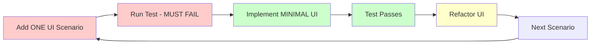

# Admin UI Scenario Creation

## 🔴 INCREMENTAL UI TESTING WORKFLOW

**This command implements incremental UI testing: ONE scenario at a time**



## Usage

`/code/admin/scenario [context] [operation] [scenario-type]`

**Examples:**
```bash
# Add ONE UI scenario at a time
/code/admin/scenario Blog CreateArticle form-display
/code/admin/scenario Blog CreateArticle form-submit
/code/admin/scenario Blog CreateArticle validation-errors
/code/admin/scenario Blog ListArticles grid-display
/code/admin/scenario Blog UpdateArticle form-prefilled
```

## Scenario Types

### Form Operations
- **`form-display`** - Form renders with correct fields
- **`form-submit`** - Happy path form submission
- **`validation-errors`** - Client-side validation display
- **`form-prefilled`** - Edit form shows existing data

### Grid Operations
- **`grid-display`** - List view shows data correctly
- **`grid-filtering`** - Search/filter functionality
- **`grid-sorting`** - Column sorting
- **`grid-pagination`** - Page navigation
- **`grid-actions`** - Row-level actions (edit, delete)

### Navigation
- **`menu-access`** - Menu item appears and works
- **`breadcrumbs`** - Navigation breadcrumbs
- **`back-navigation`** - Return to previous page

## Implementation Process

### Step 1: Create the UI Scenario (RED Phase)

```bash
# This command adds ONE scenario to existing feature file
/code/admin/scenario BlogContext CreateArticle form-display
```

**Generated scenario:**
```gherkin
Scenario: Display article creation form
  Given I am logged in as an admin
  When I am on "/admin/articles/new"
  Then I should see "Create Article"
  And I should see a "Title" field
  And I should see a "Content" field  
  And I should see a "Slug" field
  And I should see a "Status" field
  And I should see a "Create" button
```

### Step 2: Run Test (Must Fail)

```bash
# Run ONLY this scenario
docker compose exec app vendor/bin/behat features/blog/admin-article-management.feature:20
```

**Expected result:** ❌ **FAILURE** (form doesn't exist yet)

### Step 3: Implement Minimal UI (GREEN Phase)

Use `/act` to implement JUST enough:
- Create the form class
- Add the route
- Create the template
- Make the test pass

### Step 4: Refactor UI

Improve styling, accessibility, UX while keeping test green.

### Step 5: Next Scenario

Only after current scenario is GREEN:

```bash
/code/admin/scenario BlogContext CreateArticle form-submit
```

## Scenario Templates

### Form Templates

**Form Display:**
```gherkin
Scenario: Display {entity} creation form
  Given I am logged in as an admin
  When I am on "/admin/{entities}/new"  
  Then I should see "Create {Entity}"
  And I should see a "{field}" field
  And I should see a "Create" button
```

**Form Submit Success:**
```gherkin
Scenario: Successfully create {entity} via form
  Given I am logged in as an admin
  And I am on "/admin/{entities}/new"
  When I fill in "Title" with "Test Article"
  And I fill in "Content" with "Test content"
  And I press "Create"
  Then I should be on "/admin/{entities}"
  And I should see "successfully created"
  And I should see "Test Article"
```

**Form Validation:**
```gherkin
Scenario: Create {entity} form shows validation errors
  Given I am logged in as an admin
  And I am on "/admin/{entities}/new"
  When I fill in "Title" with ""
  And I press "Create"
  Then I should see "Title is required"
  And I should be on "/admin/{entities}/new"
```

### Grid Templates

**Grid Display:**
```gherkin
Scenario: Display {entities} grid
  Given I am logged in as an admin
  And the following {entities} exist:
    | title        | status    |
    | Article One  | published |
    | Article Two  | draft     |
  When I am on "/admin/{entities}"
  Then I should see "{Entities}"
  And I should see "Article One"
  And I should see "Article Two"
  And I should see "published"
  And I should see "draft"
```

**Grid Actions:**
```gherkin
Scenario: Grid shows action buttons
  Given I am logged in as an admin
  And a {entity} exists with title "Test Article"
  When I am on "/admin/{entities}"
  Then I should see a "Edit" link
  And I should see a "Delete" link
```

## Command Implementation

The command will:

1. **Read existing feature file** (created by `/code/admin/behat`)
2. **Generate ONE scenario** based on operation and type
3. **Append to feature file**
4. **Use Sylius/admin patterns**
5. **Include proper page selectors**

## Implementation After Scenario

After adding a scenario:

```bash
# 1. Add ONE scenario
/code/admin/scenario BlogContext CreateArticle form-display

# 2. Run test - identify missing UI components
docker compose exec app vendor/bin/behat features/blog/admin-article-management.feature

# 3. Implement the UI functionality
# Create the necessary components to satisfy the test
```

Implementation includes:
- Create Symfony form
- Add controller action
- Create Twig template
- Configure routing
- Ensure test passes
- Improve UI quality

## Quality Standards

- **One scenario per UI component** - Form, grid, action
- **User perspective** - Test what users see and do
- **Accessibility** - Include proper form labels
- **Responsive design** - Test on different viewports
- **Error handling** - Test validation and edge cases

## Example Testing Session

```bash
# Session: Testing Article Admin UI

# 1. Add form display test
/code/admin/scenario Blog CreateArticle form-display
# Run test to check UI components

# 2. Create basic form
# Implement form with necessary fields
# Test passes ✅

# 3. Add form submit test
/code/admin/scenario Blog CreateArticle form-submit  
# Test form processing

# 4. Add form processing
# Implement form submission logic
# Test passes ✅

# 5. Add validation test
/code/admin/scenario Blog CreateArticle validation-errors
# Test validation display

# 6. Add validation display
# Implement validation feedback
# Test passes ✅

# Continue one scenario at a time...
```

## Sylius Integration

Uses Sylius Admin UI components:
- **Sylius forms** - Standard form theming
- **Sylius grids** - Data tables with actions  
- **Sylius routing** - RESTful admin routes
- **Sylius security** - Admin authentication
- **Sylius flash messages** - User feedback

## Integration with Other Commands

**Setup (once):**
```bash
/code/admin/behat BlogContext article-management  # Creates feature structure
/code/admin/form BlogContext Article              # Creates form class
/code/admin/grid BlogContext Article              # Creates grid config
```

**Test Cycle (repeat):**
```bash
/code/admin/scenario BlogContext CreateArticle form-display  # Add ONE scenario
# Implement UI functionality to make test pass
```

## Benefits for UI Development

✅ **User-focused** - Test actual user interactions
✅ **Incremental UI** - Build interface piece by piece
✅ **Better UX** - Focus on one user flow at a time
✅ **Accessibility** - Test form labels and structure
✅ **Visual feedback** - See UI evolve with each test

## Advanced Scenarios

### Complex Form Interactions
```bash
/code/admin/scenario Blog CreateArticle conditional-fields
/code/admin/scenario Blog CreateArticle ajax-validation
/code/admin/scenario Blog CreateArticle file-upload
```

### Grid Features  
```bash
/code/admin/scenario Blog ListArticles bulk-actions
/code/admin/scenario Blog ListArticles export-csv
/code/admin/scenario Blog ListArticles inline-edit
```

### User Experience
```bash
/code/admin/scenario Blog UpdateArticle auto-save
/code/admin/scenario Blog DeleteArticle confirmation-modal
/code/admin/scenario Blog ListArticles keyboard-shortcuts
```

## Next Steps

After completing one operation:
- Move to next UI component
- Test integration between components
- Add accessibility tests
- Performance testing for large datasets