# API Platform Resource Creation (TDD-First)

## 🔴 TDD-FIRST WORKFLOW

**⚠️ This command now follows TRUE Test-Driven Development: Tests BEFORE Implementation!**

See the complete workflow diagram: [API Resource TDD Workflow](../workflow-graphs.md#apiresource-tdd---test-driven-api)

```mermaid
graph LR
    A[🔴 Write API Tests] --> B[Run Tests - MUST FAIL]
    B --> C[🔧 Run Maker]
    C --> D[🟢 Implement Providers/Processors]
    D --> E[♻️ Refactor]
    
    style A fill:#ffcccc
    style B fill:#ffcccc
    style C fill:#ffffcc
    style D fill:#ccffcc
    style E fill:#ccffff
```



Create a complete API Platform resource following DDD architecture.

## Usage
`/api:resource [context] [resource-name]`

Example: `/api:resource Blog Article`

## TDD-First Implementation

I will now create the API resource for {{resource-name}} in {{context}} context using Test-Driven Development.

### Step 1: 🔴 Write API Tests FIRST (RED Phase)

#### Creating comprehensive test suite for API endpoints

[Write tests/{{context}}/Functional/UI/Api/Rest/{{resource-name}}ResourceTest.php with:
- Test GET single resource returns correct data
- Test GET collection with pagination
- Test POST creates new resource
- Test PUT updates existing resource
- Test DELETE removes resource
- Test validation errors return 422
- Test not found returns 404
- Test unauthorized returns 403]

[Write tests/{{context}}/Unit/UI/Api/Rest/Provider/Get{{resource-name}}ProviderTest.php with:
- Test provider calls gateway correctly
- Test transforms gateway response to resource
- Test handles not found gracefully]

[Write tests/{{context}}/Unit/UI/Api/Rest/Processor/Create{{resource-name}}ProcessorTest.php with:
- Test processor validates input
- Test calls gateway with correct data
- Test returns created resource
- Test handles domain exceptions]

#### Verify tests fail

[Execute Bash: docker compose exec app bin/phpunit tests/{{context}}/Functional/UI/Api/Rest/]

**Expected result:** ❌ All tests should FAIL (API doesn't exist yet)

### Step 2: 🔧 Generate API Structure with Maker

[Execute Bash: docker compose exec app bin/console make:api:resource {{context}} {{resource-name}}]

### Step 3: 🟢 Make Tests Pass (GREEN Phase)

#### Run tests again

[Execute Bash: docker compose exec app bin/phpunit tests/{{context}}/Functional/UI/Api/Rest/]

#### Implement providers and processors to pass tests

[Implement necessary logic:
- Connect providers to query gateways
- Connect processors to command gateways
- Add proper error handling
- Transform data correctly]

### Step 4: ♻️ Refactor (Keep Tests Green)

[Improve the implementation while ensuring all tests still pass:
- Extract transformation logic
- Improve error messages
- Add logging
- Optimize queries]

### Step 5: Run Quality Checks

[Execute Bash: docker compose exec app composer qa]

### Step 6: Add More API Tests Incrementally

Now that the basic API works, add more specific tests:

```bash
# Add filtering tests
/code:hexagonal:test {{context}} {{resource-name}}API filter-by-status
# Implement status filtering

# Add search tests
/code:hexagonal:test {{context}} {{resource-name}}API full-text-search
# Implement search functionality

# Add bulk operations
/code:hexagonal:test {{context}} {{resource-name}}API bulk-delete
# Implement bulk operations
```

## Process

1. **Create Resource Structure**
   ```
   UI/Api/Rest/
   ├── Resource/
   │   └── ArticleResource.php
   ├── Provider/
   │   ├── GetArticleProvider.php      # Single item
   │   └── ListArticlesProvider.php    # Collection
   ├── Processor/
   │   ├── CreateArticleProcessor.php  # POST
   │   ├── UpdateArticleProcessor.php  # PUT/PATCH
   │   └── DeleteArticleProcessor.php  # DELETE
   └── Filter/
       └── ArticleSearchFilter.php      # Optional
   ```

2. **Create API Resource**
   ```php
   #[ApiResource(
       shortName: 'Article',
       operations: [
           new Get(
               uriTemplate: '/articles/{id}',
               provider: GetArticleProvider::class,
           ),
           new GetCollection(
               uriTemplate: '/articles',
               provider: ListArticlesProvider::class,
           ),
           new Post(
               uriTemplate: '/articles',
               processor: CreateArticleProcessor::class,
           ),
           new Put(
               uriTemplate: '/articles/{id}',
               provider: GetArticleProvider::class,
               processor: UpdateArticleProcessor::class,
           ),
           new Delete(
               uriTemplate: '/articles/{id}',
               processor: DeleteArticleProcessor::class,
           ),
       ],
   )]
   final class ArticleResource
   {
       public function __construct(
           public ?string $id = null,
           public ?string $title = null,
           public ?string $content = null,
           public ?string $status = null,
       ) {}
   }
   ```

3. **Create State Providers**
   - GetProvider: Fetch single resource via Gateway
   - ListProvider: Fetch collection with pagination
   - Transform Gateway responses to Resources
   - Handle not found cases

4. **Create State Processors**
   - Create: Handle POST requests
   - Update: Handle PUT/PATCH requests
   - Delete: Handle DELETE requests
   - Use Gateways for all operations
   - Transform exceptions to HTTP errors

5. **Add Validation**
   ```php
   final class ArticleResource
   {
       #[Assert\NotBlank]
       #[Assert\Length(min: 3, max: 200)]
       public ?string $title = null;
       
       #[Assert\NotBlank]
       #[Assert\Length(min: 10)]
       public ?string $content = null;
   }
   ```

6. **Create Behat Tests**
   ```gherkin
   Feature: Article API
     Scenario: Create new article
       When I send a POST request to "/api/articles" with:
         """
         {
           "title": "New Article",
           "content": "Article content"
         }
         """
       Then the response status code should be 201
       And the response should contain "New Article"
   ```

7. **Configure Security**
   - Add security attributes to operations
   - Create voters if needed
   - Test authorization scenarios

## Integration Points
- Uses Application Gateways
- Follows CQRS pattern
- Transforms domain objects to DTOs
- Handles errors gracefully

## Quality Standards
- Follow @docs/agent/instructions/api-platform-integration.md
- One provider/processor per operation
- Clear HTTP status codes
- Comprehensive error messages

## OpenAPI Documentation
- Resource properties become schema
- Validation rules appear in docs
- Examples in resource annotations
- Clear operation descriptions

## Test Examples Generated

### Functional API Tests
```php
// GET single resource
public function testGetArticle(): void
{
    $client = static::createClient();
    $client->request('GET', '/api/articles/123');
    
    $this->assertResponseIsSuccessful();
    $this->assertJsonContains(['title' => 'Test Article']);
}

// POST new resource
public function testCreateArticle(): void
{
    $client = static::createClient();
    $client->request('POST', '/api/articles', [
        'json' => [
            'title' => 'New Article',
            'content' => 'Article content',
        ],
    ]);
    
    $this->assertResponseStatusCodeSame(201);
    $this->assertJsonContains(['title' => 'New Article']);
}

// Validation error
public function testValidationError(): void
{
    $client = static::createClient();
    $client->request('POST', '/api/articles', [
        'json' => ['title' => ''], // Empty title
    ]);
    
    $this->assertResponseStatusCodeSame(422);
    $this->assertJsonContains(['violations' => []]);
}
```

### Provider Tests
```php
public function testProviderCallsGateway(): void
{
    $gateway = $this->createMock(GetArticleGateway::class);
    $gateway->expects($this->once())
        ->method('__invoke')
        ->willReturn(new GatewayResponse(['article' => $data]));
    
    $provider = new GetArticleProvider($gateway);
    $resource = $provider->provide($operation, ['id' => '123']);
    
    $this->assertInstanceOf(ArticleResource::class, $resource);
}
```

### Processor Tests
```php
public function testProcessorCreatesResource(): void
{
    $gateway = $this->createMock(CreateArticleGateway::class);
    $gateway->expects($this->once())
        ->method('__invoke')
        ->willReturn(new GatewayResponse(['articleId' => '123']));
    
    $processor = new CreateArticleProcessor($gateway);
    $resource = $processor->process($data, $operation);
    
    $this->assertEquals('123', $resource->id);
}
```

## Benefits of TDD for API Resources

1. **Contract First**: Tests define API contract clearly
2. **Error Handling**: All HTTP status codes tested
3. **Integration**: Gateway connections verified
4. **Performance**: Can test response times
5. **Documentation**: Tests serve as API examples

## Example TDD Workflow

```bash
# 1. Create API resource with TDD approach
/code:api:resource BlogContext Article

# This will:
# - Write API tests first (RED)
# - Run tests to verify they fail
# - Generate API structure with maker
# - Implement providers/processors to pass tests (GREEN)
# - Refactor while keeping tests green

# 2. Add specific features incrementally
/code:hexagonal:test BlogContext ArticleAPI advanced-search
# Implement search with filters

/code:hexagonal:test BlogContext ArticleAPI csv-export
# Add export functionality

/code:hexagonal:test BlogContext ArticleAPI rate-limiting
# Implement rate limits

# 3. Each new requirement starts with a failing test
```

## 🚨 TDD API Benefits

By writing tests first for APIs:

1. **API Design**: Tests drive clean REST design
2. **Status Codes**: All responses are verified
3. **Data Format**: JSON structure is tested
4. **Error Cases**: Edge cases handled from start
5. **Performance**: Response times can be tested

## 🚨 IMPORTANT: Configuration Check

After creating the API resource, **VERIFY** that your context is registered in API Platform configuration:

1. **Check** `@config/packages/api_platform.php`
2. **Find** the `'mapping' => ['paths' => [...]]` section
3. **Ensure** your context path is included:
   ```php
   '%kernel.project_dir%/src/{{Context}}/UI/Api/Rest/Resource',
   ```

**If missing**, add it and clear cache:
```bash
docker compose exec app bin/console cache:clear
```

Without this configuration, your API endpoints will return 404!

## Next Steps
1. Run full test suite to verify
2. Add custom filters with tests
3. Create admin UI: `/code:admin:resource`
4. Add integration tests
5. Monitor API performance