# CQRS Command Creation

## 🏗️ Implementation Workflow

```mermaid
graph LR
    A[📋 Design Command] --> B[🔧 Run Maker]
    B --> C[✨ Implement Handler]
    C --> D[🧪 Create Tests]
    D --> E[♻️ Refactor & Optimize]
    
    style A fill:#e1f5fe
    style B fill:#ffffcc
    style C fill:#ccffcc
    style D fill:#f3e5f5
    style E fill:#ccffff
```



Create a CQRS Command with Handler following Command pattern for write operations.

## Usage
`/code:hexagonal:command [context] [use-case]`

Example: `/code:hexagonal:command Blog CreateArticle`

## Implementation Process

I will now create the CQRS command for {{use-case}} in {{context}} context.

### Step 1: 📋 Design Command Structure

[Analyze the use case to determine:
- Required command parameters
- Validation rules
- Domain operations needed
- Events to be generated]

### Step 2: 🔧 Generate Command Structure

[Execute Bash: docker compose exec app bin/console make:application:command {{context}} {{use-case}}]

### Step 3: ✨ Implement Handler Logic

[Implement the handler with:
- Command validation
- Domain Creator integration
- Event collection from aggregate
- EventBus dispatching
- Error handling]

### Step 4: 🧪 Create Comprehensive Tests

[Create test suite covering:
- Successful command execution
- Validation scenarios
- Domain interaction verification
- Event dispatching
- Error conditions
- Edge cases]

### Step 5: ♻️ Refactor and Optimize

[Improve the implementation:
- Extract complex logic
- Enhance error messages
- Optimize performance
- Add logging/monitoring]

### Step 6: Run Quality Checks

[Execute Bash: docker compose exec app composer qa]

### Step 6: Verify Generated Files

[Use Read to check: src/{{context}}/Application/Operation/Command/{{use-case}}/Command.php]
[Use Read to check: src/{{context}}/Application/Operation/Command/{{use-case}}/Handler.php]

### Step 7: Check Domain Integration

Determining what domain components this command needs:

[Use Glob to check: src/{{context}}/Domain/{{use-case}}/Creator.php]

{{#unless creator-exists}}
Note: You may need to create the domain Creator:
[Execute /code:hexagonal:aggregate {{context}} {{entity-name}}]
{{/unless}}

### Step 8: Enhance with Business Logic

Implement additional business requirements:

```bash
# Business-specific scenarios
- Duplicate prevention logic
- Authorization checks
- Rate limiting if needed
- Audit trail generation
- Business rule validation
```

### Step 9: Create Implementation Tasks

The command is created and tested. Continue with domain implementation:

[Create tasks.md for {{use-case}} domain implementation with:
- Domain Creator business logic
- Aggregate methods and invariants
- Domain event generation
- Business rule enforcement]

### Step 10: Implement Domain Logic

[Implement the domain Creator and related components with comprehensive business logic]

## Test Examples

### Handler Test Scenarios
```php
// Successful execution
public function testHandleExecutesSuccessfully(): void
{
    $command = new Command('data');
    $this->creator->expects($this->once())->method('__invoke');
    $this->eventBus->expects($this->once())->method('dispatch');
    
    ($this->handler)($command);
}

// Validation
public function testHandleRejectsInvalidData(): void
{
    $this->expectException(\InvalidArgumentException::class);
    ($this->handler)(new Command(''));
}

// Event dispatching
public function testHandleDispatchesDomainEvents(): void
{
    $event = new ArticleCreated('123');
    $this->creator->method('__invoke')->willReturn($aggregate);
    $this->eventBus->expects($this->once())
        ->method('dispatch')
        ->with($event);
    
    ($this->handler)($command);
}

// Error handling
public function testHandleManagesDomainExceptions(): void
{
    $this->creator->method('__invoke')
        ->willThrowException(new DomainException());
    
    $this->expectException(DomainException::class);
    ($this->handler)($command);
}
```

## Benefits of Command Pattern

1. **Clear Intent**: Commands explicitly state write operations
2. **Event Sourcing Ready**: Natural event generation
3. **Audit Trail**: All changes are traceable
4. **Separation of Concerns**: Clear boundaries between layers
5. **Testability**: Easy to test in isolation

## Process Summary

The command creation provides:
- Well-structured command and handler
- Clear separation of concerns
- Comprehensive validation
- Event-driven architecture
- Full test coverage

The handler implementation:
1. Validates command data (tested)
2. Calls domain Creator (mocked in tests)
3. Retrieves and dispatches events (verified)
4. Returns void (Command pattern respected)

## 🚨 Command Implementation Benefits

Implementing commands properly provides:

1. **Explicit Operations**: Clear write intentions
2. **Event Generation**: Automatic audit trail
3. **Error Resilience**: Comprehensive error handling
4. **Clean Architecture**: Well-defined boundaries
5. **Maintainability**: Easy to modify and extend

## Architecture Patterns
- Follow @docs/reference/architecture/patterns/cqrs-pattern.md
- Commands return void
- Handlers orchestrate, domain has logic
- Events dispatched by handler, not domain
- Tests drive the design

### Example Implementation Workflow

```bash
# 1. Create command structure
/code:hexagonal:command BlogContext PublishArticle

# This will:
# - Generate command and handler structure
# - Implement core handler logic
# - Integrate with domain layer
# - Create comprehensive tests
# - Ensure quality standards

# 2. Enhance with specific features
- Scheduled publishing support
- Notification dispatching
- Concurrency handling
- Permission validation
- Audit logging

# 3. Iterate based on business requirements
```

## 🚨 Architecture Benefits

Well-implemented commands provide:

1. **Clear Contracts**: Explicit command/handler interface
2. **Event Trail**: Complete audit of all changes
3. **Error Handling**: Robust exception management
4. **Clean Dependencies**: Clear separation of concerns
5. **Evolution Support**: Easy to extend and modify

## Next Steps
1. Connect to gateway: `/code:hexagonal:gateway`
2. Add integration tests for full flow
3. Configure in service container
4. Test with real infrastructure