# Gateway Creation

## 🎯 Implementation Workflow

```mermaid
graph LR
    A[📋 Design API] --> B[🔧 Run Maker]
    B --> C[✨ Configure Pipeline]
    C --> D[🧪 Integration Tests]
    D --> E[🔒 Add Security]
    
    style A fill:#e1f5fe
    style B fill:#ffffcc
    style C fill:#ccffcc
    style D fill:#f3e5f5
    style E fill:#ffebee
```



Create an application gateway with middleware pipeline for clean API entry points.

## Usage
`/ddd:gateway [context] [use-case]`

Example: `/ddd:gateway Blog CreateArticle`

## Implementation Process

I will now create the gateway for {{use-case}} in {{context}} context.

### Step 1: 📋 Design Gateway API

[Define the gateway requirements:
- Request structure
- Response format
- Validation rules
- Error handling strategy]

### Step 2: 🔧 Generate Gateway Structure

[Execute Bash: docker compose exec app bin/console make:application:gateway {{context}} {{use-case}}]

### Step 3: ✨ Configure Middleware Pipeline

[Configure the middleware stack:
- DefaultLogger for instrumentation
- DefaultErrorHandler for exceptions
- Validation for business rules
- Processor for operation execution]

### Step 4: 🧪 Create Integration Tests

[Create comprehensive integration tests:
- Valid request processing
- Validation scenarios
- Error handling
- Response formatting
- Middleware behavior]

### Step 5: 🔒 Add Security and Monitoring

[Enhance the gateway with:
- Authentication/authorization
- Rate limiting
- Audit logging
- Performance monitoring]

### Step 5: Check CQRS Integration

Determining if this gateway needs Command or Query handlers:

{{#if is-write-operation}}
[Use Glob to check: src/{{context}}/Application/Operation/Command/{{use-case}}/Command.php]

{{#unless command-exists}}
Creating required Command handler (with TDD):
[Execute /code:hexagonal:command {{context}} {{use-case}}]
{{/unless}}
{{else}}
[Use Glob to check: src/{{context}}/Application/Operation/Query/{{use-case}}/Query.php]

{{#unless query-exists}}
Creating required Query handler (with TDD):
[Execute /code:hexagonal:query {{context}} {{use-case}}]
{{/unless}}
{{/if}}

### Step 6: Run Quality Checks

[Execute Bash: docker compose exec app composer qa]

### Step 7: Enhance Gateway Features

Add advanced gateway capabilities:

```bash
# Gateway enhancements
- Authorization middleware
- Rate limiting protection
- Audit trail logging
- Request/response transformation
- Caching strategies
```

## Test Examples

### Gateway Integration Test Scenarios
```php
// Valid request processing
public function testProcessValidRequest(): void
public function testReturnsExpectedResponse(): void

// Validation tests
public function testRejectsInvalidInput(): void
public function testValidationErrorsAreDescriptive(): void

// Error handling
public function testHandlesDomainExceptions(): void
public function testHandlesUnexpectedErrors(): void

// Middleware pipeline
public function testMiddlewareExecutionOrder(): void
public function testLoggingMiddlewareRecordsRequests(): void
```

### Benefits of Gateway Pattern

1. **Clean API**: Technology-agnostic entry points
2. **Middleware Pipeline**: Cross-cutting concerns handled centrally
3. **Validation Layer**: Business rules enforced at the boundary
4. **Error Handling**: Consistent error responses
5. **Instrumentation**: Built-in logging and monitoring

## Middleware Pipeline
1. DefaultLogger (instrumentation start)
2. DefaultErrorHandler (exception wrapper)
3. Validation (business rules)
4. Processor (operation execution)

## Integration Points
- Uses CQRS handlers for execution
- Integrates with EventBus for events
- Provides clean API for UI layer
- Supports instrumentation/monitoring

## Quality Standards
- Follow @docs/reference/gateway-pattern.md
- One gateway per use case
- Clear request/response contracts
- Comprehensive validation

## 🚨 Gateway Implementation Benefits

Well-designed gateways provide:

1. **Clean Architecture**: Clear separation from infrastructure
2. **Consistent API**: Uniform request/response handling
3. **Cross-cutting Concerns**: Centralized middleware handling
4. **Error Resilience**: Robust error management
5. **Observability**: Built-in instrumentation

## Performance Optimization

Enhance gateway performance:

```bash
# Performance considerations
- Handle concurrent requests efficiently
- Optimize large payload processing
- Implement request/response streaming
- Add caching where appropriate
- Monitor response times
```

### Example Implementation Workflow

```bash
# 1. Create gateway structure
/code:hexagonal:gateway BlogContext CreateArticle

# This will:
# - Generate gateway with middleware pipeline
# - Configure request/response handling
# - Integrate with CQRS handlers
# - Create comprehensive tests
# - Add instrumentation

# 2. Enhance with features
- Slug uniqueness validation
- Author permission checks
- Content sanitization
- Rate limiting
- Audit logging

# 3. Optimize based on usage
```

## Next Steps
1. Create UI integration (API/Web)
2. Add Behat tests for gateway
3. Configure dependency injection