# Domain ID Generator Creation

## 🆔 Implementation Workflow

```mermaid
graph LR
    A[📋 Design ID Strategy] --> B[🔧 Run Maker]
    B --> C[✨ Implement Logic]
    C --> D[🧪 Create Tests]
    D --> E[🔒 Add Validation]
    
    style A fill:#e1f5fe
    style B fill:#ffffcc
    style C fill:#ccffcc
    style D fill:#f3e5f5
    style E fill:#ffebee
```



Create a domain-specific ID generator that encapsulates entity identity creation following DDD principles.

## Usage

`/code:hexagonal:id-generator [context] [entity]`

**Examples:**
```bash
/code:hexagonal:id-generator Blog Article
/code:hexagonal:id-generator User Account  
/code:hexagonal:id-generator Order Payment
```

## When to Use ID Generators

### ✅ Use ID Generators When:
- **Domain-specific identity logic** - Special ID formats or business rules
- **Auditing requirements** - Need to track ID generation
- **Performance optimization** - Custom ID generation strategies  
- **Business constraints** - IDs must follow specific patterns
- **Testing isolation** - Need predictable IDs in tests

### ❌ Use Global Generator When:
- **Simple UUID generation** - Standard UUID v7 is sufficient
- **No special logic** - Just need a unique identifier
- **Cross-context IDs** - Shared identity across bounded contexts

## Implementation Process

I will now create the ID generator for {{entity}} in {{context}} context.

### Step 1: 📋 Design ID Strategy

#### Check Prerequisites

The ID value object must exist before creating the generator:

[Use Glob to check: src/{{context}}/Domain/Shared/ValueObject/{{entity}}Id.php]

{{#unless id-value-object-exists}}
❌ ERROR: {{entity}}Id value object does not exist!

Creating it now:
[Execute /code:hexagonal:value-object {{context}} {{entity}}Id]
{{/unless}}

#### Determine ID requirements

[Analyze:
- ID format (UUID, sequential, custom)
- Business constraints
- Performance needs
- Uniqueness guarantees]

### Step 2: 🔧 Generate ID Generator

[Execute Bash: docker compose exec app bin/console make:domain:id-generator {{context}} {{entity}}]

### Step 3: ✨ Implement Generation Logic

[Implement the generator with:
- ID generation strategy
- Format validation
- Business rules
- Performance optimizations]

### Step 4: 🧪 Create Comprehensive Tests

[Create tests for:
- Valid ID generation
- Uniqueness guarantees
- Format compliance
- Performance benchmarks
- Thread safety]

### Step 5: 🔒 Add Validation and Security

[Enhance with:
- Format validation
- Collision prevention
- Security considerations
- Error handling]

### Step 6: Run Quality Checks

[Execute Bash: docker compose exec app composer qa]

### Step 6: Verify Generated Files

[Use Read to check: src/{{context}}/Infrastructure/Identity/{{entity}}IdGenerator.php]

### Step 7: Enhance ID Generation

Implement advanced features:

```bash
# ID generation enhancements
- Custom format patterns
- Sequential numbering
- Prefix/suffix support
- Collision detection
- Performance optimization
```

## Process Summary

The ID generator provides:
- Encapsulated identity creation
- Testable ID generation
- Domain-specific logic capability
- Clean separation of concerns

**Generated class:**
```php
<?php

declare(strict_types=1);

namespace App\BlogContext\Infrastructure\Identity;

use App\BlogContext\Domain\Shared\ValueObject\ArticleId;
use App\Shared\Infrastructure\Generator\GeneratorInterface;

final readonly class ArticleIdGenerator
{
    public function __construct(
        private GeneratorInterface $generator,
    ) {
    }

    public function nextIdentity(): ArticleId
    {
        return new ArticleId($this->generator::generate());
    }
}
```

## Integration Patterns

### In Domain Creators

```php
namespace App\BlogContext\Domain\CreateArticle;

use App\BlogContext\Infrastructure\Identity\ArticleIdGenerator;

final readonly class Creator
{
    public function __construct(
        private ArticleIdGenerator $idGenerator,
        private ArticleRepositoryInterface $repository,
    ) {
    }

    public function __invoke(/* other params */): Article
    {
        $articleId = $this->idGenerator->nextIdentity();
        
        $article = new Article(
            id: $articleId,
            // other parameters...
        );
        
        $this->repository->save($article);
        return $article;
    }
}
```

### In Application Handlers

```php
namespace App\BlogContext\Application\Operation\Command\CreateArticle;

use App\BlogContext\Infrastructure\Identity\ArticleIdGenerator;

final readonly class Handler
{
    public function __construct(
        private ArticleIdGenerator $idGenerator,
        private Creator $creator,
    ) {
    }

    public function __invoke(Command $command): void
    {
        $articleId = $this->idGenerator->nextIdentity();
        
        ($this->creator)(
            $articleId,
            new Title($command->title),
            // other value objects...
        );
    }
}
```

### In Tests

```php
public function testGeneratesUniqueIds(): void
{
    $generator = $this->createMock(GeneratorInterface::class);
    $generator->method('generate')
        ->willReturn('550e8400-e29b-41d4-a716-446655440000');
    
    $idGenerator = new ArticleIdGenerator($generator);
    
    $articleId = $idGenerator->nextIdentity();
    
    $this->assertInstanceOf(ArticleId::class, $articleId);
    $this->assertEquals('550e8400-e29b-41d4-a716-446655440000', $articleId->toString());
}
```

## Advanced Use Cases

### Custom ID Format

```php
final readonly class OrderNumberGenerator
{
    public function __construct(
        private GeneratorInterface $generator,
        private string $prefix = 'ORD-',
    ) {
    }

    public function nextIdentity(): OrderNumber
    {
        $timestamp = date('Ymd');
        $uuid = substr($this->generator::generate(), 0, 8);
        
        return new OrderNumber($this->prefix . $timestamp . '-' . strtoupper($uuid));
    }
}
```

### Sequential IDs

```php
final class SequentialArticleIdGenerator
{
    public function __construct(
        private CounterRepositoryInterface $counter,
    ) {
    }

    public function nextIdentity(): ArticleId
    {
        $nextNumber = $this->counter->getNextSequence('article');
        
        return new ArticleId(sprintf('ART-%06d', $nextNumber));
    }
}
```

### Business Rule Validation

```php
final readonly class AccountIdGenerator
{
    public function nextIdentity(): AccountId
    {
        do {
            $id = new AccountId($this->generator::generate());
        } while ($this->repository->exists($id));
        
        return $id;
    }
}
```

## Test Examples

### ID Generator Test Scenarios
```php
// Basic generation
public function testGeneratesValidEntityId(): void
{
    $generator = new {{entity}}IdGenerator($this->uuidGenerator);
    $id = $generator->nextIdentity();
    
    $this->assertInstanceOf({{entity}}Id::class, $id);
    $this->assertNotEmpty($id->toString());
}

// Uniqueness
public function testGeneratesUniqueIds(): void
{
    $generator = new {{entity}}IdGenerator($this->uuidGenerator);
    $ids = [];
    
    for ($i = 0; $i < 100; $i++) {
        $ids[] = $generator->nextIdentity()->toString();
    }
    
    $this->assertCount(100, array_unique($ids));
}

// Format validation
public function testGeneratedIdMatchesFormat(): void
{
    $generator = new {{entity}}IdGenerator($this->uuidGenerator);
    $id = $generator->nextIdentity();
    
    $this->assertMatchesRegularExpression(
        '/^[0-9a-f]{8}-[0-9a-f]{4}-7[0-9a-f]{3}-[0-9a-f]{4}-[0-9a-f]{12}$/i',
        $id->toString()
    );
}

// Performance
public function testGeneratesManyIdsQuickly(): void
{
    $generator = new {{entity}}IdGenerator($this->uuidGenerator);
    $start = microtime(true);
    
    for ($i = 0; $i < 1000; $i++) {
        $generator->nextIdentity();
    }
    
    $duration = microtime(true) - $start;
    $this->assertLessThan(0.1, $duration); // 100ms for 1000 IDs
}
```

## Benefits of ID Generators

1. **Encapsulation**: ID creation logic in one place
2. **Type Safety**: Always returns valid ID value objects
3. **Business Rules**: Can enforce domain-specific constraints
4. **Testability**: Easy to mock for testing
5. **Performance**: Optimized generation strategies

## Quality Standards

- **Single Responsibility** - Only generates IDs for one entity type
- **Domain Focused** - Encapsulates identity generation business rules
- **Testable** - Easy to mock and test in isolation
- **Performance** - Efficient ID generation strategy
- **Thread Safe** - Safe for concurrent access

### Example Implementation Workflow

```bash
# 1. Create ID generator
/code:hexagonal:id-generator BlogContext Article

# This will:
# - Generate ID generator structure
# - Implement UUID v7 generation
# - Create ID value object integration
# - Add comprehensive tests
# - Ensure quality standards

# 2. Enhance with business logic
- Sequential numbering: ART-2024-0001
- Category prefixes: TECH-XXX, NEWS-XXX
- Collision prevention
- Custom formats
- Performance optimization

# 3. Integrate with domain
```

## 🚨 ID Generator Implementation Benefits

Well-designed ID generators provide:

1. **Domain Integrity**: IDs follow business rules
2. **Consistency**: Uniform ID generation
3. **Performance**: Optimized for your use case
4. **Flexibility**: Easy to change strategies
5. **Reliability**: Guaranteed unique identities

## Integration with Other Commands

**Prerequisites (in order):**
```bash
/code:hexagonal:value-object BlogContext ArticleId  # Create ID value object first
/code:hexagonal:id-generator BlogContext Article    # Then create generator
```

**Usage in other components:**
```bash
/code:hexagonal:aggregate BlogContext Article       # Uses the generator in Creator
/code:hexagonal:gateway BlogContext CreateArticle   # Injects generator in Handler
```

## Service Configuration

Add to `config/services.php`:

```php
use App\BlogContext\Infrastructure\Identity\ArticleIdGenerator;
use App\Shared\Infrastructure\Generator\UuidGenerator;

return static function (ContainerConfigurator $container): void {
    $services = $container->services();
    
    $services->set(ArticleIdGenerator::class)
        ->args([service(UuidGenerator::class)])
        ->tag('app.id_generator');
};
```

## Common Patterns

### Factory Service Pattern
```bash
/code:hexagonal:id-generator Blog Article
/code:hexagonal:id-generator Blog Category  
/code:hexagonal:id-generator Blog Tag
```

### Multi-Context Pattern
```bash
/code:hexagonal:id-generator User Account
/code:hexagonal:id-generator Billing Invoice
/code:hexagonal:id-generator Shipping Order
```

## Best Practices

1. **Create ID value object first** - Always prerequisite
2. **One generator per entity** - Don't create generic generators
3. **Inject via constructor** - Follow dependency injection patterns
4. **Test thoroughly** - ID generation is critical for data integrity
5. **Document business rules** - Explain any special ID formats
6. **Consider performance** - ID generation can be a bottleneck

## Next Steps

After creating an ID generator:
1. **Use in domain creators**: Inject and call `nextIdentity()`
2. **Add to application handlers**: Generate IDs before domain operations  
3. **Configure services**: Add proper DI configuration
4. **Create tests**: Ensure reliable ID generation
5. **Document usage**: Update domain documentation