# CQRS Query Creation

## 🏗️ Implementation Workflow

```mermaid
graph LR
    A[📋 Design Query] --> B[🔧 Run Maker]
    B --> C[✨ Implement Logic]
    C --> D[🧪 Create Tests]
    D --> E[🎯 Optimize Performance]
    
    style A fill:#e1f5fe
    style B fill:#ffffcc
    style C fill:#ccffcc
    style D fill:#f3e5f5
    style E fill:#ffebee
```



Create a CQRS Query with Handler for optimized read operations.

## Usage
`/code:hexagonal:query [context] [use-case]`

Examples:
- `/code:hexagonal:query Blog GetArticle`
- `/code:hexagonal:query Blog ListArticles`
- `/code:hexagonal:query Blog SearchArticles`

## Implementation Process

I will now create the CQRS query for {{use-case}} in {{context}} context.

### Step 1: 📋 Design Query Requirements

[Analyze the read operation needs:
- Query parameters required
- Data to be returned
- Performance requirements
- Filtering/sorting needs]

### Step 2: 🔧 Generate Query Structure

[Execute Bash: docker compose exec app bin/console make:application:query {{context}} {{use-case}}]

### Step 3: ✨ Implement Query Logic

[Implement the handler with:
- Repository integration
- Parameter handling
- View model transformation
- Result optimization]

### Step 4: 🧪 Create Comprehensive Tests

[Create test suite covering:
- Query with results
- Empty result handling
- Parameter validation
- View transformations
- Performance benchmarks]

### Step 5: 🎯 Optimize Performance

[Enhance query performance:
- Add database indexes
- Implement caching
- Optimize queries
- Reduce N+1 problems]

### Step 5: Check Repository Integration

Queries typically need repository access:

[Use Glob to check: src/{{context}}/Domain/Shared/Repository/*RepositoryInterface.php]

{{#unless repository-exists}}
Note: You may need to create the repository interface (with TDD):
[Execute /code:hexagonal:entity {{context}} {{entity-name}}]
{{/unless}}

### Step 6: Run Quality Checks

[Execute Bash: docker compose exec app composer qa]

### Step 7: Enhance Query Capabilities

Add advanced query features:

```bash
# Query enhancements
- Status filtering
- Pagination support
- Sorting options
- Search functionality
- Result aggregation
```

## Test Examples

### Query Handler Test Scenarios
```php
// Query with results
public function testHandleQueryWithResults(): void
{
    $query = new Query(['status' => 'active']);
    $repository = $this->createMock(RepositoryInterface::class);
    $repository->expects($this->once())
        ->method('findBy')
        ->willReturn([$entity1, $entity2]);
    
    $handler = new Handler($repository);
    $view = $handler($query);
    
    $this->assertCount(2, $view->getItems());
}

// Empty results
public function testHandleQueryWithNoResults(): void
public function testReturnsEmptyViewForNoResults(): void

// Parameter validation
public function testValidatesQueryParameters(): void

// View transformation
public function testTransformsEntitiesToViews(): void
public function testIncludesMetadataInView(): void
```

## Benefits of Query Pattern

1. **Read Optimization**: Queries optimized for read performance
2. **View Models**: Purpose-built response structures
3. **Caching Ready**: Easy to add caching layers
4. **Scalability**: Can use read replicas
5. **Flexibility**: Easy to add filters and sorting

## 🚨 Query Implementation Benefits

Well-designed queries provide:

1. **Clear Contracts**: Explicit query parameters
2. **Optimized Reads**: Performance-focused design
3. **View Models**: Purpose-built responses
4. **Scalability**: Ready for caching and read replicas
5. **Maintainability**: Easy to extend and modify

## Architecture Patterns
- Follow @docs/architecture/patterns/cqrs-pattern.md
- Queries are read-only
- Return view models, not entities
- Optimize for read performance
- Can bypass domain for efficiency
- Tests ensure correct transformations

### Example Implementation Workflow

```bash
# 1. Create query structure
/code:hexagonal:query BlogContext GetArticlesByAuthor

# This will:
# - Generate query and handler structure
# - Implement data retrieval logic
# - Create view model transformations
# - Add comprehensive tests
# - Optimize for performance

# 2. Enhance with features
- Date range filtering
- Draft inclusion options
- Pagination support
- Sorting capabilities
- Search functionality

# 3. Optimize based on usage patterns
```

## Next Steps
1. Connect to gateway: `/code:hexagonal:gateway`
2. Add performance tests
3. Implement caching strategy
4. Monitor query performance