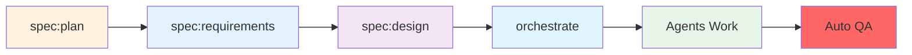

# 🚀 Simplified Command System

Welcome to the streamlined command system for efficient feature development!

## Core Commands

### 📋 Specification Commands (`/spec:*`)
Plan and design your features with structured specifications:

```bash
/spec:plan [project-description]     # Break down project into features
/spec:prd [context] [feature]       # Create Product Requirements Document
/spec:requirements [feature-name]    # Define WHAT needs to be built (EARS format)
/spec:design [context]              # Define HOW it will be built
/spec:help                         # Get help with specifications
```

**Workflow**: plan → prd → requirements → design → orchestrate

### 🎯 Orchestration Command (`/orchestrate`)
Smart coordination of specialized agents for implementation:

```bash
/orchestrate [feature-name] --context [context]
```

This command:
- Analyzes your user story to determine needed components
- Automatically selects appropriate agents (domain, API, admin)
- Coordinates their work in the most efficient pattern
- Runs mandatory QA at the end

### ✅ Quality Assurance (`/qa`)
Ensure code quality at any time:

```bash
/qa                    # Run all checks
/qa fix               # Fix auto-fixable issues
/qa fix all          # Fix all and run complete verification
```

## Simplified Workflow



## Available Expert Agents

The orchestrator automatically coordinates these specialized agents:

### 📐 Specification Agents
- **business-analyst** - Business requirement analysis
- **ears-expert** - EARS format requirements
- **story-decomposer** - User story breakdown
- **test-generator** - Test scenario generation
- **spec-validator** - Specification validation
- **domain-expert** - Domain language consistency

### 💻 Development Agents
- **domain-expert** - Domain modeling and DDD design
- **maker-expert** - Code generation using DDD makers
- **tdd-expert** - Test-driven development implementation
- **api-platform-expert** - REST API with API Platform
- **admin-ui-expert** - Sylius admin interfaces

### 🔍 Code Quality Agents
- **code-reviewer** - Code quality review
- **refactoring-expert** - Code improvement
- **performance-optimizer** - Performance analysis
- **security-auditor** - Security vulnerability detection
- **architecture-validator** - Architecture compliance

## How It Works

### 1. Planning Phase
```bash
# Break down your project
/spec:plan "E-commerce platform with inventory management"

# Detail requirements for a feature
/spec:requirements article-management

# Create technical design
/spec:design
```

### 2. Implementation Phase
```bash
# Let the orchestrator handle everything
/orchestrate article-management --context blog
```

The orchestrator will:
1. Analyze your user story
2. Select only the needed agents
3. Coordinate their work efficiently
4. Run quality checks automatically

### 3. Manual Agent Usage
You can also work with agents directly:

```bash
# For domain design
> Use the domain-expert agent to design article domain model

# For TDD implementation
> Use the tdd-expert agent to implement article management

# For API development
> Use the api-platform-expert agent to create article API

# For admin interface
> Use the admin-ui-expert agent to create article admin
```

## Key Benefits

### 🎯 Simplified Commands
- Only 3 main command groups to remember
- Agents handle all the complexity
- Smart selection prevents unnecessary work

### 🤖 Expert Agents
- Each agent is a specialist in their domain
- They know all the patterns and best practices
- Direct execution without intermediate commands

### 🔄 Integrated Workflow
- Smooth flow from planning to implementation
- Automatic quality assurance
- Consistent results every time

## Quick Start

1. **Plan your feature**:
   ```bash
   /spec:plan "User authentication system"
   ```

2. **Define requirements**:
   ```bash
   /spec:requirements user-authentication
   ```

3. **Design the solution**:
   ```bash
   /spec:design
   ```

4. **Implement with orchestration**:
   ```bash
   /orchestrate user-authentication --context security
   ```

## Tips

- Let agents do the heavy lifting - they know the patterns
- Trust the orchestrator's agent selection
- Run `/qa` anytime to check code quality
- Use agent help: `> Use the [agent-name] agent to help me understand...`

## Migration from Old System

### Old Commands → New Approach
- `/code:*` commands → Handled by expert agents
- `/act` command → Use `tdd-expert` agent
- `/agent:orchestrate` → Now just `/orchestrate`
- `/utils:qa` → Now just `/qa`
- `/workflow:*` → Integrated into orchestration

### Archived Commands
All old code generation commands are archived in `.claude/commands/archive/` for reference, but you shouldn't need them anymore. The expert agents have this knowledge built-in.

## Need More Help?

- For specifications: `/spec:help`
- For agents: Check `.claude/agents/README.md`
- For patterns: Agents know them all!

Remember: **Simplicity is power**. Let the agents handle the complexity while you focus on your business requirements!