I'll help you create a detailed technical architecture and implementation plan for the {{context-name}} context, fully integrated with the PRD and user stories.

<function_calls>
<invoke name="TodoWrite">
<parameter name="todos">[
  {
    "id": "1",
    "content": "📋 Analyze PRD - Review business requirements from PRD",
    "status": "in_progress",
    "priority": "high"
  },
  {
    "id": "2",
    "content": "🔍 System Analysis - Analyze existing architecture and patterns",
    "status": "pending",
    "priority": "high"
  },
  {
    "id": "3",
    "content": "🏗️ Technical Design - Design components and architecture",
    "status": "pending",
    "priority": "high"
  },
  {
    "id": "4",
    "content": "📐 Update User Stories - Add technical specs to each story",
    "status": "pending",
    "priority": "medium"
  },
  {
    "id": "5",
    "content": "📝 Create Roadmap - Define implementation phases",
    "status": "pending",
    "priority": "medium"
  }
]</parameter>
</invoke>
</function_calls>

## Technical Planning Process for {{context-name}}

### 🔄 Visual Planning Flow

```mermaid
graph TD
    subgraph "Analysis Phase"
        PRD[📋 Review PRD]
        AS[🔍 Analyze System]
        PRD --> AS
    end
    
    subgraph "Design Phase"
        ARCH[🏗️ Architecture Design]
        COMP[🧩 Component Design]
        API[🔌 API Design]
        DB[🗄️ Database Design]
        AS --> ARCH
        ARCH --> COMP
        ARCH --> API
        ARCH --> DB
    end
    
    subgraph "Planning Phase"
        US[📐 Update User Stories]
        TECH[⚙️ Technical Specs]
        PHASES[📅 Implementation Phases]
        COMP --> US
        API --> US
        DB --> US
        US --> TECH
        TECH --> PHASES
    end
    
    subgraph "Documentation"
        TP[📄 Technical Plan]
        RM[🗺️ Roadmap]
        PHASES --> TP
        PHASES --> RM
    end
    
    style PRD fill:#fff3e0
    style ARCH fill:#e1f5fe
    style US fill:#f3e5f5
    style TP fill:#e8f5e9
```



### Integration with PRD

First, I'll analyze the existing PRD to ensure technical alignment:

<function_calls>
<invoke name="Read">
<parameter name="file_path">docs/contexts/{{context-name}}/prd.md</parameter>
</invoke>
</function_calls>

### My Technical Approach

Following our architecture principles:
- **Domain-Driven Design**: Bounded contexts with clear boundaries
- **Hexagonal Architecture**: Separate domain from infrastructure
- **CQRS Pattern**: Command/Query separation
- **Gateway Pattern**: Standardized entry points
- **Event-Driven**: Domain events for loose coupling

### What I'll Deliver

1. **Technical Architecture Document** (`technical-plan.md`)
   - System design and component architecture
   - Technology stack and justifications
   - Integration patterns and APIs
   - Performance and security considerations

2. **Updated User Stories** (in `user-stories/`)
   - Technical implementation details added
   - Architecture components specified
   - Database changes defined
   - API endpoints documented

3. **Implementation Roadmap** (`iterations/`)
   - Phased delivery plan
   - Technical dependencies
   - Risk mitigation strategies

### Technical Plan Structure

```markdown
# Technical Architecture Plan - {{context-name}}

## Overview
- Link to PRD sections
- Technical goals and constraints

## Architecture Design
### Domain Model
- Aggregates and entities
- Value objects
- Domain events

### Application Layer
- Commands and handlers
- Queries and handlers
- Gateways and middleware

### Infrastructure
- Persistence strategy
- External integrations
- Security implementation

### API Design
- REST endpoints
- GraphQL schema (if applicable)
- API documentation

## Implementation Details
### For Each User Story
- Technical approach
- Component interactions
- Database migrations
- Performance considerations

## Technology Stack
- Languages and frameworks
- Libraries and tools
- Infrastructure requirements

## Testing Strategy
- Unit test approach
- Integration test plan
- Performance testing

## Deployment Architecture
- Environment setup
- CI/CD pipeline
- Monitoring and logging

## Risk Assessment
- Technical risks
- Mitigation strategies
- Contingency plans
```

### User Story Technical Integration

For each user story, I'll add:

```markdown
## Technical Implementation

### Architecture Components
- **Domain**: [Specific domain objects]
- **Application**: [Commands, Queries, Gateways]
- **Infrastructure**: [Repositories, Services]
- **UI**: [API endpoints, Controllers]

### Database Schema
- Tables affected
- Migrations required
- Indexes needed

### API Specification
- Endpoint: [HTTP method and path]
- Request/Response format
- Error handling

### Performance Requirements
- Expected load
- Response time targets
- Caching strategy

### Security Considerations
- Authentication required
- Authorization rules
- Data validation
```

### Process Flow

1. **Read PRD** → Extract business requirements
2. **Design Architecture** → Create technical solutions
3. **Update User Stories** → Add technical details to each story
4. **Create Roadmap** → Plan iterative implementation
5. **Document Risks** → Identify and plan mitigations

### Next Steps

I'll need to:
1. Access the PRD for {{context-name}} context
2. Analyze existing code structure
3. Create the technical plan document
4. Update each user story with technical details
5. Create iteration plans with technical milestones

<function_calls>
<invoke name="LS">
<parameter name="path">docs/contexts/{{context-name}}</parameter>
</invoke>
</function_calls>

Once I have access to the PRD and user stories, I'll create a comprehensive technical plan that integrates seamlessly with the business documentation.

Please confirm the context name and I'll begin the technical planning process.