I'll help you create a comprehensive Product Requirements Document for "{{feature-name}}" in the {{context-name}} context with integrated documentation structure.

## 📊 Visual PRD Creation Flow

```mermaid
stateDiagram-v2
    [*] --> GatherRequirements
    GatherRequirements --> DefinePersonas
    DefinePersonas --> DocumentRequirements
    DocumentRequirements --> CreateUserStories
    CreateUserStories --> OrganizeDocumentation
    OrganizeDocumentation --> Review
    Review --> [*]
    
    GatherRequirements : 📋 Gather Requirements
    GatherRequirements : • Problem identification
    GatherRequirements : • Business goals
    GatherRequirements : • Success metrics
    
    DefinePersonas : 👥 Define User Personas
    DefinePersonas : • Target users
    DefinePersonas : • User needs
    DefinePersonas : • Pain points
    
    DocumentRequirements : 🎯 Document Requirements
    DocumentRequirements : • Functional specs
    DocumentRequirements : • Non-functional specs
    DocumentRequirements : • Business rules
    
    CreateUserStories : 📝 Create User Stories
    CreateUserStories : • Story breakdown
    CreateUserStories : • Acceptance criteria
    CreateUserStories : • Priority mapping
    
    OrganizeDocumentation : 📁 Organize Documentation
    OrganizeDocumentation : • Context structure
    OrganizeDocumentation : • File creation
    OrganizeDocumentation : • Linking
    
    Review : ✅ Review & Validate
    Review : • Completeness check
    Review : • Stakeholder approval
```



<function_calls>
<invoke name="TodoWrite">
<parameter name="todos">[
  {
    "id": "1",
    "content": "📋 Gather requirements - Understand the feature context and goals",
    "status": "in_progress",
    "priority": "high"
  },
  {
    "id": "2", 
    "content": "👥 Define user personas - Identify target users and their needs",
    "status": "pending",
    "priority": "high"
  },
  {
    "id": "3",
    "content": "🎯 Document functional requirements - List all feature capabilities",
    "status": "pending", 
    "priority": "high"
  },
  {
    "id": "4",
    "content": "📝 Create user stories - Break down into implementable stories",
    "status": "pending",
    "priority": "medium"
  },
  {
    "id": "5",
    "content": "📁 Organize documentation - Create structured files in contexts/",
    "status": "pending",
    "priority": "medium"
  }
]</parameter>
</invoke>
</function_calls>

## PRD Creation Process for {{feature-name}}

### Information I Need

To create a comprehensive PRD with integrated user stories, please provide:

1. **What problem does {{feature-name}} solve?**
2. **Who are the primary users?**
3. **What are the key business goals?**
4. **Any business constraints?** (budget, timeline, regulations)
5. **What does success look like for this feature?**

### Documentation Structure I'll Create

```
docs/contexts/{{context-name}}/
├── README.md                    # Context overview
├── prd.md                       # Complete PRD
├── technical-plan.md            # Technical architecture (from plan command)
├── user-stories/
│   ├── US-001-[story-name].md  # Individual user stories
│   ├── US-002-[story-name].md
│   └── ...
└── iterations/
    ├── iteration-1.md           # Sprint/iteration planning
    └── ...
```

### PRD Sections

1. **Product Overview**
   - Purpose and problem statement
   - Key value propositions
   - Product scope and boundaries

2. **Goals and Success Metrics**
   - Business objectives
   - User goals
   - Measurable KPIs

3. **User Personas**
   - Target user profiles
   - User needs and pain points
   - Usage scenarios

4. **Functional Requirements**
   - Core features and capabilities
   - Business rules and constraints
   - User journey mapping

5. **User Stories Summary**
   - High-level story map
   - Story priorities and dependencies
   - Links to detailed stories

6. **Non-Functional Requirements**
   - Performance expectations
   - Security requirements
   - Compliance needs

7. **Success Criteria**
   - How to measure success
   - Key performance indicators
   - User satisfaction metrics

### User Story Integration

Each user story will be created as a separate file with:
- Business context from PRD
- Technical details (added by plan command)
- Acceptance criteria
- Test scenarios
- Implementation notes

### My Approach

- **Context-Driven**: All documentation organized by bounded context
- **Integrated**: PRD, technical plan, and user stories linked together
- **Iterative**: Support for phased development
- **Traceable**: Clear relationships between requirements and implementation

<function_calls>
<invoke name="Bash">
<parameter name="command">mkdir -p docs/contexts/{{context-name}}/{user-stories,iterations}</parameter>
<parameter name="description">Ensure context directory structure exists</parameter>
</invoke>
</function_calls>

### Business Rules Development

Following the **iterative approach** as documented:

1. **Start Simple**: Define basic business rules focusing on the happy path
2. **Identify Edge Cases**: List constraints and exceptional scenarios
3. **Create Dedicated User Stories**: One story per constraint
4. **Iterate**: Implement basic rules first, then add constraints

### Next Steps

Once you provide the requirements, I'll:
1. Create the context directory structure
2. Generate the comprehensive PRD
3. Break down requirements into user stories
4. Create individual user story files
5. Set up iteration planning documents

Please share the details about {{feature-name}} and I'll create the integrated documentation structure.