I'll create a comprehensive technical design for the {{context-name}} context based on the approved requirements.

## 🏗️ Technical Design Flow

```mermaid
graph TD
    subgraph "Analysis"
        REQ[📋 Analyze Requirements]
        ARCH[🏛️ Architecture Patterns]
        REQ --> ARCH
    end
    
    subgraph "Design"
        DOM[🎯 Domain Model]
        APP[⚙️ Application Layer]
        INFRA[🔧 Infrastructure]
        API[🔌 API Design]
        
        ARCH --> DOM
        DOM --> APP
        APP --> INFRA
        APP --> API
    end
    
    subgraph "Technical Specs"
        COMP[📦 Components]
        DATA[🗄️ Data Model]
        INT[🔗 Integrations]
        PERF[⚡ Performance]
        
        INFRA --> COMP
        INFRA --> DATA
        API --> INT
        API --> PERF
    end
    
    subgraph "Documentation"
        TECH[📄 Technical Plan]
        IMPL[📝 Implementation Guide]
        RISK[⚠️ Risk Assessment]
        
        COMP --> TECH
        DATA --> TECH
        INT --> TECH
        PERF --> TECH
        TECH --> IMPL
        TECH --> RISK
    end
    
    style REQ fill:#fff3e0
    style DOM fill:#e1f5fe
    style TECH fill:#e8f5e9
    style RISK fill:#ffebee
```



[Use TodoWrite to create the following tasks:
- 📋 Analyze PRD and requirements for {{context-name}} (plan-1, in_progress, high)
- 🏛️ Design architecture following DDD principles (plan-2, pending, high)
- 🎯 Create domain model with aggregates and value objects (plan-3, pending, high)
- 🔌 Design API endpoints and contracts (plan-4, pending, high)
- 🗄️ Design database schema and migrations (plan-5, pending, medium)
- ⚠️ Identify risks and mitigation strategies (plan-6, pending, medium)]

## Prerequisites Check

First, let me verify the requirements are approved:

[Use Read to load: docs/contexts/{{context-name}}/requirements/prd.md]

## Technical Design Approach

Following our unified methodology and architectural principles:

### Core Patterns
- **Domain-Driven Design (DDD)**: Bounded contexts with clear boundaries
- **Hexagonal Architecture**: Separate domain from infrastructure
- **CQRS Pattern**: Command/Query separation for scalability
- **Event-Driven**: Domain events for loose coupling
- **Gateway Pattern**: Standardized entry points with middleware

### Design Principles
- **Single Responsibility**: Each component has one reason to change
- **Interface Segregation**: Depend on abstractions, not concretions
- **Dependency Inversion**: High-level modules don't depend on low-level
- **Open/Closed**: Open for extension, closed for modification

## Technical Design Document Structure

```markdown
# Technical Design - {{context-name}}

## 1. Architecture Overview

### 1.1 System Context
- Bounded context boundaries
- External system integrations
- Communication patterns

### 1.2 Architecture Decisions
- Pattern choices and rationale
- Technology stack selection
- Trade-off analysis

## 2. Domain Model Design

### 2.1 Aggregates
- Aggregate boundaries
- Invariant rules
- Transaction boundaries

### 2.2 Entities and Value Objects
- Entity identification
- Value object definitions
- Domain services

### 2.3 Domain Events
- Event definitions
- Event flow diagrams
- Side effects mapping

## 3. Application Layer Design

### 3.1 Commands and Handlers
- Command definitions
- Business logic orchestration
- Transaction management

### 3.2 Queries and Handlers
- Query definitions
- Read model design
- Performance optimizations

### 3.3 Gateways
- Gateway definitions
- Middleware pipeline
- Request/Response contracts

## 4. Infrastructure Design

### 4.1 Persistence
- Repository implementations
- Database schema
- Migration strategy

### 4.2 External Services
- Integration patterns
- API clients
- Message queuing

### 4.3 Security
- Authentication implementation
- Authorization rules
- Data encryption

## 5. API Design

### 5.1 REST API
- Endpoint definitions
- Request/Response schemas
- Error handling

### 5.2 Event Contracts
- Event schemas
- Publishing patterns
- Subscription handling

## 6. Data Model

### 6.1 Database Schema
- Table definitions
- Relationships
- Indexes and constraints

### 6.2 Data Flow
- CRUD operations
- Data transformations
- Caching strategy

## 7. Performance Design

### 7.1 Scalability
- Horizontal scaling approach
- Load balancing
- Database optimization

### 7.2 Caching
- Cache layers
- Invalidation strategy
- Cache warming

## 8. Security Design

### 8.1 Authentication
- Token management
- Session handling
- Multi-factor auth

### 8.2 Authorization
- Role-based access
- Resource permissions
- API security

## 9. Testing Strategy

### 9.1 Unit Testing
- Domain logic tests
- Mocking strategies
- Coverage targets

### 9.2 Integration Testing
- API testing
- Database testing
- External service mocks

## 10. Deployment Architecture

### 10.1 Infrastructure
- Container strategy
- Environment configuration
- Monitoring setup

### 10.2 CI/CD Pipeline
- Build process
- Test automation
- Deployment stages

## 11. Risk Assessment

### 11.1 Technical Risks
- Performance bottlenecks
- Security vulnerabilities
- Integration failures

### 11.2 Mitigation Strategies
- Preventive measures
- Contingency plans
- Monitoring alerts
```

## Component Mapping

For each requirement from the PRD, I'll map to technical components:

```yaml
Requirement: REQ-XXX
Components:
  Domain:
    - Aggregate: [Name]
    - Value Objects: [List]
    - Events: [List]
  Application:
    - Commands: [List]
    - Queries: [List]
    - Gateways: [List]
  Infrastructure:
    - Repositories: [List]
    - Services: [List]
  API:
    - Endpoints: [List]
    - Events: [List]
```

## Technology Stack Recommendations

Based on the project's current stack:
- **PHP 8.4**: Latest features for modern development
- **Symfony 7.3**: Robust framework with DDD support
- **Doctrine ORM**: Flexible persistence layer
- **API Platform**: REST/GraphQL API generation
- **PostgreSQL/MySQL**: Reliable relational database
- **Redis**: Caching and session storage
- **RabbitMQ/Kafka**: Event streaming (if needed)

## Implementation Patterns

### Domain Layer
```php
// Value Object Example
final class CategoryName
{
    public function __construct(
        private(set) string $value
    ) {
        $this->validate();
    }
    
    private function validate(): void
    {
        if (mb_strlen($this->value) < 2 || mb_strlen($this->value) > 100) {
            throw new \InvalidArgumentException('Category name must be between 2 and 100 characters');
        }
    }
}
```

### Application Layer
```php
// Command Handler Example
final readonly class CreateCategoryHandler
{
    public function __construct(
        private CategoryRepositoryInterface $repository,
        private EventBusInterface $eventBus,
    ) {}
    
    public function __invoke(CreateCategoryCommand $command): void
    {
        $category = Category::create(
            CategoryId::generate(),
            CategoryName::fromString($command->name),
            CategorySlug::fromString($command->slug)
        );
        
        $this->repository->save($category);
        $this->eventBus->dispatch(...$category->releaseEvents());
    }
}
```

### Gateway Pattern
```php
// Gateway Example
final class CreateCategoryGateway extends DefaultGateway
{
    public function __construct(
        private readonly CreateCategoryHandler $handler,
        // ... other dependencies
    ) {
        parent::__construct(
            new DefaultLogger(),
            new DefaultErrorHandler(),
            new CreateCategoryValidation(),
            new CreateCategoryProcessor($this->handler)
        );
    }
}
```

## User Story Validation

Before finalizing the technical design, validate the user story structure:

### Foundation Story Checklist
For each iteration/feature set, verify:
- [ ] **The FIRST user story is marked as "Foundation"**
- [ ] Foundation story includes all necessary setup for subsequent stories:
  - [ ] Core domain entities and value objects
  - [ ] Basic CRUD operations (Create, Read, Update minimum)
  - [ ] Essential business rules and validations
  - [ ] Repository interfaces and implementations
  - [ ] Initial database schema/migrations
- [ ] All other stories have clear dependencies on the foundation story
- [ ] No circular dependencies between stories

### Story Sequencing Validation
- [ ] Stories are ordered by dependency (foundation → features → enhancements)
- [ ] Each story can be implemented independently once its dependencies are met
- [ ] Test scenarios don't assume features from later stories

## User Story Technical Updates

For each user story, I'll add:

```markdown
## Technical Implementation Details

### Story Type & Dependencies
- **Type**: Foundation / Feature / Enhancement
- **Depends On**: US-XXX (foundation story), US-YYY
- **Enables**: US-XXX, US-YYY (stories that depend on this)

### Components Required
- Domain: [List of domain objects]
- Application: [Commands/Queries/Gateways]
- Infrastructure: [Repositories/Services]
- UI: [Controllers/Resources]

### API Endpoints
- Method: [GET/POST/PUT/DELETE]
- Path: /api/[resource]
- Request: [Schema]
- Response: [Schema]

### Database Changes
- Tables: [List affected tables]
- Migrations: [Required migrations]

### Performance Considerations
- Expected load: [Requests/second]
- Response time: [Target milliseconds]
- Caching: [Strategy]
```

## Approval Gate Questions

After completing the technical design:

1. **Does the architecture address all functional requirements?**
2. **Are the performance requirements achievable with this design?**
3. **Have all security concerns been addressed?**
4. **Is the design maintainable and scalable?**
5. **Are there any unmitigated high-risk items?**
6. **Does the design follow established patterns and principles?**

## Next Steps

1. I'll analyze the approved requirements
2. Design the technical architecture
3. Update user stories with technical details
4. Create the comprehensive technical plan
5. Prepare risk assessment and mitigation strategies

Once approved, we'll proceed to implementation with `/orchestrate`.

[Use LS to check: docs/contexts/{{context-name}}/requirements]

## File Organization

I'll create the following files in the proper directories:

[Use Write to create: docs/contexts/{{context-name}}/design/technical-design.md with the technical architecture and design]

[Use Write to create: docs/contexts/{{context-name}}/design/risk-assessment.md with risk analysis and mitigation strategies]

[Use Write to create: docs/contexts/{{context-name}}/implementation/implementation-guide.md with step-by-step implementation instructions]

## Ready to Create Technical Design

I'll now create a comprehensive technical design for the {{context-name}} context following DDD principles and our architectural patterns.

I'll now begin creating the technical design based on the approved requirements.