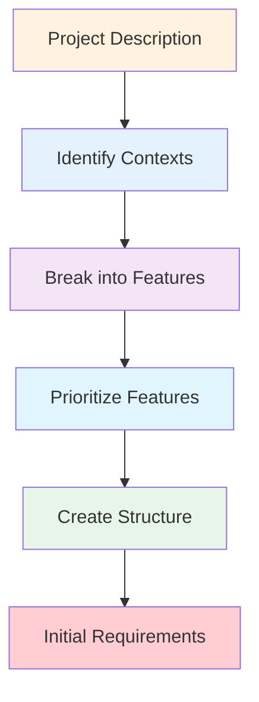

I'll help you plan and break down "{{project-description}}" into manageable features and contexts.

## 📊 Project Planning Flow



## Planning Process

[Use TodoWrite to create the following tasks:
- 🎯 Analyze project scope and identify bounded contexts (plan-1, in_progress, high)
- 📋 Break down into features/iterations (plan-2, pending, high)
- 🔢 Prioritize features by business value (plan-3, pending, high)
- 📁 Create directory structure (plan-4, pending, medium)
- 📝 Create initial requirements templates (plan-5, pending, medium)]

## Project Analysis

Based on "{{project-description}}", I'll:

1. **Identify Bounded Contexts**
   - Separate business domains
   - Clear boundaries between contexts
   - Shared concepts and integration points

2. **Feature Breakdown**
   - Core features (MVP)
   - Enhancement features
   - Nice-to-have features

3. **Prioritization**
   - Business value
   - Technical dependencies
   - Risk factors

## Directory Structure

I'll create the following structure:

```
docs/contexts/
├── [context-1]/
│   ├── requirements/
│   │   └── prd.md         # Product Requirements Document
│   ├── design/
│   └── implementation/
├── [context-2]/
│   └── ...
└── shared/
    └── integration.md     # Cross-context integration
```

## Feature Planning Template

For each feature, I'll define:

```markdown
## Feature: [Name]

### Context
Bounded context: [context-name]

### Priority
[High/Medium/Low]

### Description
Brief description of the feature

### Business Value
Why this feature is important

### Dependencies
- Technical dependencies
- Business dependencies

### Estimated Effort
[Small/Medium/Large]
```

## Example Breakdown

For a typical e-commerce project:

```
Contexts:
1. **ProductCatalog** - Product management
   - Feature: Product CRUD
   - Feature: Category management
   - Feature: Search & filtering

2. **ShoppingCart** - Cart and checkout
   - Feature: Add to cart
   - Feature: Checkout process
   - Feature: Payment integration

3. **UserAccount** - User management
   - Feature: Registration/login
   - Feature: Profile management
   - Feature: Order history
```

## Next Steps

After planning:
1. Run `/spec:prd [context-name] [feature-name]` to create detailed PRD
2. Run `/spec:requirements [feature-name]` to detail EARS requirements
3. Run `/spec:design` to create technical design
4. Run `/orchestrate` to implement

## Creating Initial Structure

[Use Bash to create directory structure based on identified contexts]

## Approval Gate

Once I've analyzed the project and created the breakdown, I'll ask:

"Project planning complete. Identified [N] contexts with [M] total features. Ready to proceed with PRD creation for the first feature?"

Let me analyze your project and create a comprehensive plan.