I'll help you create a comprehensive Product Requirements Document for "{{feature-name}}" in the {{context-name}} context, combining business vision with structured EARS requirements.

## 📊 Unified PRD Creation Flow

```mermaid
stateDiagram-v2
    [*] --> BusinessVision
    BusinessVision --> EARSRequirements
    EARSRequirements --> UserStories
    UserStories --> TechnicalConstraints
    TechnicalConstraints --> ApprovalGate
    ApprovalGate --> [*]
    
    BusinessVision : 🎯 Business Vision
    BusinessVision : • Problem & opportunity
    BusinessVision : • Target users & personas
    BusinessVision : • Success metrics
    
    EARSRequirements : 📋 EARS Requirements
    EARSRequirements : • Ubiquitous (SHALL)
    EARSRequirements : • Event-driven (WHEN/THEN)
    EARSRequirements : • State-driven (WHILE)
    EARSRequirements : • Conditional (IF/THEN)
    
    UserStories : 📝 User Stories
    UserStories : • Story breakdown
    UserStories : • Acceptance criteria
    UserStories : • Test scenarios
    
    TechnicalConstraints : ⚙️ Constraints
    TechnicalConstraints : • Performance needs
    TechnicalConstraints : • Security requirements
    TechnicalConstraints : • Integration points
    
    ApprovalGate : ✅ Approval Gate
    ApprovalGate : • Requirements review
    ApprovalGate : • Stakeholder sign-off
```



<function_calls>
<invoke name="TodoWrite">
<parameter name="todos">[
  {
    "id": "prd-1",
    "content": "🎯 Define business vision and objectives for {{feature-name}}",
    "status": "in_progress",
    "priority": "high"
  },
  {
    "id": "prd-2", 
    "content": "📋 Document requirements using EARS format",
    "status": "pending",
    "priority": "high"
  },
  {
    "id": "prd-3",
    "content": "📝 Create user stories with acceptance criteria",
    "status": "pending", 
    "priority": "high"
  },
  {
    "id": "prd-4",
    "content": "⚙️ Define technical constraints and NFRs",
    "status": "pending",
    "priority": "medium"
  },
  {
    "id": "prd-5",
    "content": "✅ Prepare for approval gate review",
    "status": "pending",
    "priority": "medium"
  }
]</parameter>
</invoke>
</function_calls>

## Information Gathering

To create a comprehensive PRD with structured requirements, I need to understand:

### 1. Business Context
- **What problem does {{feature-name}} solve?**
- **Who are the primary users and what are their pain points?**
- **What are the key business goals and success metrics?**
- **What is the expected impact on the business?**

### 2. Functional Scope
- **What are the core capabilities needed?**
- **What are the user workflows?**
- **What are the integration points with existing systems?**
- **What are the data requirements?**

### 3. Constraints & Requirements
- **What are the performance requirements?**
- **What are the security and compliance needs?**
- **What are the timeline and resource constraints?**
- **What are the technical limitations?**

## Document Structure

I'll create the following structure:

```
docs/contexts/{{context-name}}/
├── requirements/
│   ├── prd.md                          # This comprehensive PRD
│   └── user-stories/
│       ├── US-001-[story-name].md     # Individual user stories
│       ├── US-002-[story-name].md
│       └── ...
├── design/                             # (Created in next phase)
├── implementation/                     # (Created in implementation phase)
└── iterations/
    └── iteration-planning.md           # Release planning
```

## PRD Template

### 1. Executive Summary
- Product vision and value proposition
- Key objectives and success metrics
- High-level scope and timeline

### 2. Business Requirements

#### 2.1 Problem Statement
- Current state and pain points
- Opportunity analysis
- Expected outcomes

#### 2.2 User Personas
- Primary users and their goals
- User needs and expectations
- Usage scenarios

#### 2.3 Success Metrics
- Key Performance Indicators (KPIs)
- Measurement methods
- Target values

### 3. Functional Requirements (EARS Format)

#### 3.1 Core Requirements
Using EARS (Easy Approach to Requirements Syntax):

**Ubiquitous Requirements:**
- `REQ-001`: The system SHALL [provide capability]
- `REQ-002`: The system SHALL [maintain state]

**Event-Driven Requirements:**
- `REQ-010`: WHEN [user action] THEN the system SHALL [response]
- `REQ-011`: WHEN [system event] THEN the system SHALL [action]

**State-Driven Requirements:**
- `REQ-020`: WHILE [system state] the system SHALL [behavior]
- `REQ-021`: WHILE [process running] the system SHALL [constraint]

**Conditional Requirements:**
- `REQ-030`: IF [condition] THEN the system SHALL [action]
- `REQ-031`: IF [error state] THEN the system SHALL [recovery]

**Optional Requirements:**
- `REQ-040`: WHERE [feature enabled] the system SHALL [capability]

#### 3.2 Business Rules
- Validation rules and constraints
- Calculation formulas
- Decision logic

#### 3.3 User Interface Requirements
- UI/UX principles
- Accessibility requirements
- Responsive design needs

### 4. Non-Functional Requirements

#### 4.1 Performance
- Response time requirements
- Throughput expectations
- Scalability needs

#### 4.2 Security
- Authentication requirements
- Authorization model
- Data protection needs

#### 4.3 Reliability
- Availability targets
- Error handling
- Recovery procedures

#### 4.4 Compatibility
- Browser/device support
- API versioning
- Backward compatibility

### 5. User Stories Overview

Summary of user stories with:
- Story ID and title
- Priority (High/Medium/Low)
- Estimated effort
- Dependencies

### 6. Constraints and Assumptions

#### 6.1 Technical Constraints
- Technology stack limitations
- Infrastructure constraints
- Integration limitations

#### 6.2 Business Constraints
- Budget limitations
- Timeline requirements
- Resource availability

#### 6.3 Assumptions
- External dependencies
- Market conditions
- User behavior assumptions

### 7. Risks and Mitigation

- Technical risks
- Business risks
- Mitigation strategies

### 8. Appendices

- Glossary of terms
- Reference documents
- Mockups and diagrams

## EARS Format Guidelines

### Best Practices:
1. **Use SHALL for mandatory requirements** (not "should" or "will")
2. **Be specific and measurable** (e.g., "within 2 seconds" not "quickly")
3. **One requirement per statement**
4. **Avoid ambiguous terms** ("appropriate", "user-friendly", "reasonable")
5. **Make requirements testable**

### Examples:
- ✅ Good: "WHEN a user submits an order THEN the system SHALL send confirmation within 5 seconds"
- ❌ Bad: "The system should handle orders appropriately"

## User Story Template

Each user story will follow this structure:

```markdown
# US-XXX: [Story Title]

## Story
As a [user type]
I want to [action/feature]
So that [benefit/value]

## Acceptance Criteria
- [ ] Given [context] When [action] Then [outcome]
- [ ] Given [context] When [action] Then [outcome]

## Technical Notes
- Related requirements: REQ-XXX, REQ-YYY
- Dependencies: [List any dependencies]
- Considerations: [Technical considerations]

## Test Scenarios
1. **Happy Path**: [Description]
2. **Edge Case**: [Description]
3. **Error Case**: [Description]
```

## Next Steps

1. I'll gather the requirements information
2. Create the comprehensive PRD document
3. Break down into detailed user stories
4. Prepare for approval gate review

<function_calls>
<invoke name="Bash">
<parameter name="command">mkdir -p docs/contexts/{{context-name}}/{requirements/user-stories,design,implementation,iterations}</parameter>
<parameter name="description">Create directory structure for unified methodology</parameter>
</invoke>
</function_calls>

## Approval Gate

Once the PRD is complete, I'll present it for review with these questions:

1. **Do the requirements accurately capture the business needs?**
2. **Are all user scenarios covered?**
3. **Are the success metrics clear and measurable?**
4. **Are there any missing requirements or constraints?**
5. **Is the scope appropriate for the timeline and resources?**

After approval, we'll proceed to the technical design phase with `/spec:plan`.

Please provide the information about {{feature-name}} and I'll create the comprehensive PRD following this unified methodology.