# AI Development Workflow Help

## Available Commands

### Core Workflow Commands
- `/prd [feature-name]` - Create a Product Requirements Document
- `/plan` - Create an implementation plan from PRD  
- `/act` - Start implementation with checklist
- `/report` - Conduct retrospective

### Support Commands
- `/workflow-help` - Show this help
- `/workflow-status` - Check current workflow phase

## Workflow Overview

```mermaid
graph LR
    A[🎯 PRD<br/>Define] --> B[📋 Plan<br/>Design]
    B --> C[⚡ Act<br/>Build]
    C --> D[📊 Report<br/>Improve]
    D --> A
    
    A1[Problem Statement<br/>User Stories<br/>Acceptance Criteria] -.-> A
    B1[Technical Approach<br/>Architecture<br/>Implementation Steps] -.-> B
    C1[TDD Cycle<br/>Incremental Build<br/>Documentation] -.-> C
    D1[Retrospective<br/>Lessons Learned<br/>Process Updates] -.-> D
```



```
1. PRD (Define) → 2. Plan (Design) → 3. Act (Build) → 4. Report (Improve)
```

### 1. PRD Phase
Define WHAT needs to be built:
- Problem statement
- User stories  
- Acceptance criteria
- Scope boundaries

### 2. Plan Phase
Design HOW to build it:
- Technical approach
- Architecture decisions
- Implementation steps
- Time estimates

### 3. Act Phase
Build the solution:
- Follow checklist
- Implement incrementally
- Test as you go
- Document decisions

### 4. Report Phase
Capture insights:
- What went well
- What to improve
- Lessons learned
- Process updates

## Quick Start

```bash
# Start a new feature
/prd user-authentication

# After PRD is complete
/plan

# Start building
/act

# After implementation
/report
```

## Tips
- Complete each phase before moving to the next
- Use TodoWrite to track progress
- Review AI suggestions critically
- Document key decisions

For detailed templates, see `/docs/agent/workflows/`
