# AI Development Workflow Help

## Available Commands

### Core Workflow Commands
- `/prd [context] [feature]` - Create a Product Requirements Document
- `/plan [context]` - Create technical implementation plan
- `/act` - Start TDD implementation with checklist
- `/qa [action] [tool]` - Run quality checks and fixes

### Support Commands
- `/workflow-help` - Show this help
- `/workflow-status` - Check current workflow phase
- `/user-story [context] [id] [title]` - Create detailed user stories
- `/adr [title] [status]` - Document architecture decisions

## Workflow Overview

```mermaid
graph LR
    A[🎯 PRD<br/>Define] --> B[📋 Plan<br/>Design]
    B --> C[⚡ Act<br/>Build]
    C --> D[✅ QA<br/>Verify]
    
    A1[Problem Statement<br/>User Stories<br/>Acceptance Criteria] -.-> A
    B1[Technical Approach<br/>Architecture<br/>Implementation Steps] -.-> B
    C1[TDD Cycle<br/>Incremental Build<br/>Documentation] -.-> C
    D1[Code Quality<br/>Tests Pass<br/>Standards Met] -.-> D
    
    E[📝 User Story] -.-> A
    F[📐 ADR] -.-> B
    
    style A fill:#fff3e0
    style B fill:#f3e5f5
    style C fill:#e8f5e9
    style D fill:#ffebee
    style E fill:#e3f2fd
    style F fill:#f3e5f5
```



```
Main Flow: PRD → Plan → Act → QA
Support: User Stories & ADRs
```

### 1. PRD Phase
Define WHAT needs to be built:
- Problem statement
- User stories  
- Acceptance criteria
- Scope boundaries

### 2. Plan Phase
Design HOW to build it:
- Technical approach
- Architecture decisions
- Implementation steps
- Time estimates

### 3. Act Phase
Build the solution:
- Follow checklist
- Implement incrementally
- Test as you go
- Document decisions

### 4. QA Phase
Ensure quality:
- Run code quality checks
- Fix style issues
- Pass all tests
- Meet standards

## Quick Start

```bash
# Start a new feature
/prd blog article-management

# Create implementation plan
/plan blog

# Start building with TDD
/act

# Run quality checks
/qa

# Document decisions
/adr "Use CQRS for article operations"
```

## Tips
- Complete each phase before moving to the next
- Use TodoWrite to track progress
- Review AI suggestions critically
- Document key decisions

For detailed templates, see `/docs/agent/workflows/`
