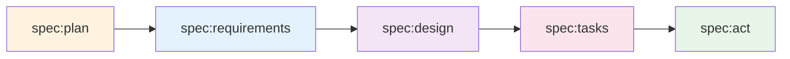

# Workflow Help - Complete Command Reference

## 🚀 Quick Navigation

### Core Development Workflows
- **Spec-Driven Development**: `/spec:*` commands for structured feature development
- **Domain-Driven Design**: `/ddd:*` commands for DDD implementation
- **API Development**: `/api:*` commands for API resources and testing
- **Admin UI**: `/admin:*` commands for Sylius Admin interface
- **Quality & Utils**: `/workflow:*` and `/utils:*` for support tasks

## 📋 Command Categories

### 1️⃣ Spec-Driven Development (`/spec:*`)

The main methodology for structured feature development:



| Command | Purpose | Example |
|---------|---------|---------|
| `/spec:plan` | Break project into features | `/spec:plan "Blog management system"` |
| `/spec:requirements` | Define EARS requirements | `/spec:requirements blog-posts` |
| `/spec:design` | Create technical design | `/spec:design` |
| `/spec:tasks` | Generate TDD tasks | `/spec:tasks` |
| `/spec:act` | Start TDD implementation | `/spec:act` |
| `/spec:help` | Get spec methodology help | `/spec:help` |

### 2️⃣ Domain-Driven Design (`/ddd:*`)

Commands for implementing DDD patterns:

| Command | Purpose | Example |
|---------|---------|---------|
| `/ddd:entity` | Create domain entity | `/ddd:entity Blog Article` |
| `/ddd:aggregate` | Create aggregate root | `/ddd:aggregate Blog Article` |
| `/ddd:gateway` | Create application gateway | `/ddd:gateway Blog CreateArticle` |
| `/ddd:migration` | Manage database migrations | `/ddd:migration Blog add-categories` |

### 3️⃣ API Development (`/api:*`)

Commands for API and testing:

| Command | Purpose | Example |
|---------|---------|---------|
| `/api:resource` | Create API Platform resource | `/api:resource Blog Article` |
| `/api:behat` | Create Behat feature tests | `/api:behat Blog article-api` |

### 4️⃣ Admin UI (`/admin:*`)

Commands for Sylius Admin UI:

| Command | Purpose | Example |
|---------|---------|---------|
| `/admin:resource` | Create complete admin interface | `/admin:resource Blog Category` |
| `/admin:grid` | Configure admin listing grid | `/admin:grid Blog Category` |
| `/admin:form` | Create admin form | `/admin:form Blog CategoryType` |
| `/admin:menu` | Add items to admin menu | `/admin:menu` |
| `/admin:behat` | Create Behat tests for admin UI | `/admin:behat Blog managing-categories` |

### 5️⃣ Workflow Management (`/workflow:*`)

| Command | Purpose | Example |
|---------|---------|---------|
| `/workflow:help` | Show this help (you are here) | `/workflow:help` |
| `/workflow:status` | Check project status & todos | `/workflow:status` |
| `/workflow:qa` | Run quality assurance | `/workflow:qa` |

### 6️⃣ Utility Commands (`/utils:*`)

| Command | Purpose | Example |
|---------|---------|---------|
| `/utils:debug` | Debug assistance | `/utils:debug error "Class not found"` |
| `/utils:adr` | Create Architecture Decision Record | `/utils:adr "Use CQRS pattern"` |
| `/utils:user-story` | Create user story | `/utils:user-story blog 001 create-article` |

## 🔄 Common Workflows

### New Feature Development (Spec-Driven)
```bash
1. /spec:plan "My new project"        # Break into features
2. /spec:requirements feature-name    # Define requirements
3. /spec:design                       # Technical design
4. /spec:tasks                        # Task breakdown
5. /spec:act                          # TDD implementation
6. /workflow:qa                       # Quality checks
```

### DDD Component Creation
```bash
1. /ddd:entity Blog Article          # Create entity & value objects
2. /ddd:aggregate Blog Article       # Add aggregate behavior
3. /ddd:gateway Blog CreateArticle   # Create use case gateway
4. /api:resource Blog Article        # Expose via API
5. /api:behat Blog article-api       # Add tests
```

### Admin Interface Creation
```bash
1. /admin:resource Blog Category     # Complete admin CRUD
2. /admin:grid Blog Category         # Customize listing
3. /admin:form Blog CategoryType     # Create/edit forms
4. /admin:menu                       # Add to navigation
5. /admin:behat Blog managing-categories  # Add UI tests
```

### Quick Implementation
```bash
1. /spec:act                         # Jump to TDD if plan exists
2. /workflow:qa                      # Run quality checks
3. /utils:adr "Decision made"        # Document decisions
```

## 📁 Project Structure

```
.claude/
├── commands/
│   ├── spec/           # Spec-driven methodology
│   ├── ddd/            # Domain-driven design
│   ├── api/            # API development
│   ├── admin/          # Admin UI development
│   ├── workflow/       # Workflow management
│   └── utils/          # Utilities
├── templates/          # Code generation templates
└── CLAUDE.md          # Main methodology guide

docs/
├── agent/             # AI agent instructions
├── contexts/          # Business contexts (Blog, Security, etc.)
├── reference/         # Technical patterns
├── testing/           # Testing guides
└── examples/          # Implementation examples
```

## 🎯 Best Practices

### 1. **Follow the Flow**
- Start with `/spec:plan` for new projects
- Use `/spec:requirements` before jumping to code
- Always run `/workflow:qa` before committing

### 2. **Use Templates**
- Methodology templates in `docs/agent/templates/`
- Code snippets in `docs/agent/snippets/`
- Maintain consistency across components

### 3. **Document Decisions**
- Use `/utils:adr` for architectural choices
- Keep requirements up to date
- Update design docs as you learn

### 4. **Test-Driven Development**
- `/spec:act` enforces TDD methodology
- Write tests first, implementation second
- Use `/api:behat` for functional tests

## 💡 Quick Tips

- **Context Matters**: Most DDD/API commands need `[context]` (e.g., Blog, Security)
- **Check Status**: Use `/workflow:status` to see active tasks
- **Get Specific Help**: Each category has its own help (e.g., `/spec:help`)
- **Quality First**: Always run `/workflow:qa` before creating PRs

## 📚 More Resources

- **Methodology Guide**: `.claude/CLAUDE.md`
- **Architecture Patterns**: `docs/reference/`
- **Testing Strategies**: `docs/testing/`
- **Business Contexts**: `docs/contexts/`

---

Need help with a specific command? Try:
- `/spec:help` for spec-driven methodology
- `/[command] --help` for command-specific options
- Check `docs/agent/instructions/` for detailed guides