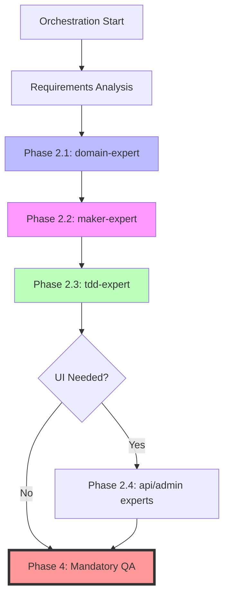

# Shared References for All Agents

This file contains common references used by all agents to avoid duplication and optimize context window usage.

## 🏗️ Architecture & Patterns

### Core Architecture
- **DDD Principles**: @docs/reference/architecture/principles/ddd-principles.md
- **Architecture Patterns**: @docs/reference/agent/instructions/architecture.md
- **Domain Layer Pattern**: @docs/reference/architecture/patterns/domain-layer-pattern.md
- **Gateway Pattern**: @docs/reference/architecture/patterns/gateway-pattern.md
- **CQRS Pattern**: @docs/reference/architecture/patterns/cqrs-pattern.md
- **Generator Pattern**: @docs/reference/architecture/patterns/generator-pattern.md
- **Specification Pattern**: @docs/reference/architecture/patterns/specification-pattern.md

### Implementation Patterns
- **PHP Standards**: @docs/reference/architecture/standards/php-features-best-practices.md
- **PSR Standards**: @docs/reference/architecture/standards/psr-standards.md
- **Pattern Recognition**: @docs/reference/development/pattern-recognition-guide.md

## 📖 Core Instructions

### Development Guidelines
- **Global Instructions**: @docs/reference/agent/instructions/global.md
- **Cognitive Preservation**: @docs/reference/agent/instructions/cognitive-preservation.md
- **Error Handling**: @docs/reference/agent/instructions/error-handling.md
- **Documentation Navigation**: @docs/reference/agent/instructions/documentation-navigation.md

### Technical Standards
- **Docker Best Practices**: @docs/reference/agent/instructions/docker.md
- **Symfony Best Practices**: @docs/reference/agent/instructions/symfony.md
- **Doctrine Migrations**: @docs/reference/agent/instructions/doctrine-migrations.md
- **API Platform Integration**: @docs/reference/agent/instructions/api-platform-integration.md

### Workflow Standards
- **Git Workflow**: @docs/reference/agent/instructions/git-workflow.md
- **PR Management**: @docs/reference/agent/instructions/pr-management.md
- **TDD Implementation**: @docs/reference/development/workflows/tdd-implementation-guide.md
- **Database Migrations**: @docs/reference/development/workflows/database-migration-workflow.md

## ✅ Quality Standards

### QA Tools
- **QA Tools Guide**: @docs/reference/development/tools/qa-tools.md
- **Mandatory checks**: PHPUnit, Behat, ECS, PHPStan, Rector, Twig CS Fixer

### Testing
- **Testing Strategy**: @docs/reference/development/testing/README.md
- **Behat Guide**: @docs/reference/development/testing/behat-guide.md
- **Behat Sylius Patterns**: @docs/reference/development/testing/behat-sylius-patterns.md
- **DDD Test Organization**: @docs/reference/development/testing/ddd-test-organization.md

## 🛠️ Development Tools

### Makers
- **DDD Makers Guide**: @docs/reference/development/tools/makers/ddd-makers-guide.md
- **Quick Reference**: @docs/reference/development/tools/makers/quick-reference.md
- **Maker Expert Agent**: @.claude/agents/maker-expert.md

### External Tools
- **Symfony Components**: @docs/reference/development/tools/external/
- **GitHub CLI**: @docs/reference/development/tools/external/github-cli-reference.md

## 🔗 Integration References

### UI Integrations
- **Sylius Admin UI**: @docs/reference/integrations/sylius-admin-ui-integration.md
- **Sylius Stack**: @docs/reference/integrations/sylius-stack-integration.md

### Other Integrations
- **Doctrine ORM**: @docs/reference/integrations/doctrine-orm.md
- **Translations**: @docs/reference/integrations/symfony-translation-icu.md

## 📋 Templates & Examples

### Code Examples
- **Gateway Generator Usage**: @docs/reference/development/examples/gateway-generator-usage.md
- **Specification Pattern Usage**: @docs/reference/development/examples/specification-pattern-usage.md
- **Value Object Creation**: @docs/reference/development/examples/value-object-creation.md

### Agent Templates
- **PRD Template**: @docs/reference/agent/templates/prd-template.md
- **Requirements Template**: @docs/reference/agent/templates/requirements.md
- **Design Template**: @docs/reference/agent/templates/design.md

## 🔄 Agent Orchestration Workflow

### Collaborative Pattern (Recommended)
The orchestrator MUST follow this exact order:



**CRITICAL**: Never skip phases. Each phase depends on the previous one.

### Phase Dependencies
1. **domain-expert** → Creates the domain model
2. **maker-expert** → Generates code structure based on domain model
3. **tdd-expert** → Implements business logic in generated structure
4. **api/admin-expert** → Creates UI layers (only if needed)

## 🚨 Important Notes

### Configuration
- **ALL configuration uses PHP files**, not YAML
- Behat config: `behat.dist.php` (not `.yml`)
- Config directory: `@config/` contains PHP files exclusively

### Language Policy
- **ALL documentation and code MUST be in English**
- User conversations can be in any language

### Project Structure
```
src/                         # Business contexts (DDD)
├── [Context]Context/        # e.g., Blog
│   ├── Application/         # Use cases and gateways
│   │   ├── Gateway/        # Gateway pattern
│   │   │   └── {Entity}/   # Grouped by entity
│   │   │       └── {Operation}/
│   │   │           ├── Gateway.php
│   │   │           ├── Request.php
│   │   │           ├── Response.php
│   │   │           └── Middleware/
│   │   │               └── Processor.php
│   │   ├── Operation/      # CQRS
│   │   │   ├── Command/    # Write operations
│   │   │   │   └── {Entity}/{Command}/
│   │   │   │       ├── Command.php
│   │   │   │       └── Handler.php
│   │   │   └── Query/      # Read operations
│   │   │       └── {Entity}/{Query}/
│   │   │           ├── Query.php
│   │   │           ├── Handler.php
│   │   │           └── View.php
│   │   └── Shared/         # Application shared
│   │       ├── Generator/  # ID generator interfaces
│   │       ├── ReadModel/  # Read models
│   │       └── Exception/
│   ├── Domain/             # Business logic
│   │   ├── {Entity}/       # Entity-centric
│   │   │   ├── {Entity}Creator.php     # Domain service
│   │   │   ├── {Entity}Updater.php     # Domain service
│   │   │   ├── {Entity}Deleter.php     # Domain service
│   │   │   ├── {Entity}Getter.php      # Domain service
│   │   │   └── Shared/     # Shared within entity
│   │   │       ├── Model/
│   │   │       ├── Repository/         # Repository interfaces (Read/Write separation)
│   │   │       │   ├── {Entity}WriteRepositoryInterface.php
│   │   │       │   └── {Entity}ReadRepositoryInterface.php
│   │   │       ├── Identifier/
│   │   │       ├── ValueObject/
│   │   │       ├── Event/
│   │   │       └── Exception/
│   │   └── Shared/         # Shared across entities
│   │       ├── ValueObject/
│   │       ├── Service/
│   │       └── Exception/
│   ├── Infrastructure/     # External adapters
│   │   ├── Identity/       # ID generators
│   │   ├── Persistence/    # Data persistence
│   │   │   └── Doctrine/
│   │   │       └── ORM/
│   │   │           ├── Entity/         # Doctrine entities
│   │   │           ├── {Entity}WriteRepository.php # Write operations (extends DoctrineRepository)
│   │   │           └── {Entity}ReadRepository.php  # Read operations (extends DoctrineRepository)
│   │   ├── Service/        # Service implementations
│   │   └── Shared/
│   │       └── Mapper/     # Infrastructure mappers (Entity -> ReadModel)
│   └── UI/                # User interfaces
│       ├── API/           # REST API
│       │   └── Rest/      # RESTful controllers
│       ├── Admin/         # Admin panel
│       ├── Front/         # Frontend controllers
│       └── CLI/           # Console commands
```

### Testing Structure
```
tests/                       # Mirror source structure
├── [Context]Context/
│   ├── Unit/
│   │   ├── Domain/
│   │   │   ├── {Entity}/   # Entity-centric
│   │   │   │   ├── {Entity}CreatorTest.php
│   │   │   │   ├── {Entity}UpdaterTest.php
│   │   │   │   ├── {Entity}DeleterTest.php
│   │   │   │   └── Shared/ # Model, VO, Event tests
│   │   │   └── Shared/
│   │   ├── Application/
│   │   │   ├── Gateway/{Entity}/{Operation}/
│   │   │   └── Operation/
│   │   │       ├── Command/{Entity}/{Command}/
│   │   │       └── Query/{Entity}/{Query}/
│   │   └── Infrastructure/
│   │       └── Persistence/
│   │           └── Mapper/     # Test query mappers
│   ├── Integration/        # Integration tests
│   │   └── Infrastructure/
│   │       └── Persistence/
│   │           ├── {Entity}WriteRepositoryTest.php # Test write operations
│   │           └── {Entity}ReadRepositoryTest.php  # Test read operations & fluent interface
│   │       └── Operation/
│   │           ├── Command/{Entity}/{Command}/
│   │           └── Query/{Entity}/{Query}/
│   ├── Integration/
│   ├── Functional/
│   └── Behat/
└── Shared/
```

### Development Workflow
```
Write test → Run QA → Implement → Run QA → Refactor → Run QA → Commit
```

## 🔍 Quick Navigation

When agents need specific information:
1. Check this file first for common references
2. Use @docs/reference/agent/instructions/documentation-navigation.md for navigation help
3. Consult specific pattern documentation as needed

Remember: This file is the single source of truth for shared references. All agents should reference this instead of duplicating content.