# CLAUDE.md

This file provides guidance to Claude Code (claude.ai/code) when working with code in this repository.

## Important Configuration Notes

### PHP Configuration Format
- **ALL configuration in this project uses PHP files**, not YAML
- Configuration directory: `@config/` contains PHP files exclusively
- **NEVER** look for `.yml` or `.yaml` files in this project
- Examples:
  - `config/services.php` (not services.yaml)
  - `config/packages/*.php` (not *.yaml)
  - `config/routes.php` (not routes.yaml)

### Behat Configuration
- The Behat configuration file is `behat.dist.php` (NOT `behat.yml` or `behat.yaml`)
- This uses PHP configuration format with the Behat Config objects
- Suite configurations are imported from `config/behat/suites.php`

## 🚀 Quick Start Guide

```mermaid
graph TB
    subgraph "🎯 Quick Commands"
        QS1["/spec:plan<br/>📋 Plan features"]
        QS2["/spec:requirements<br/>🎯 Define requirements"]
        QS3["/spec:design<br/>📐 Design solution"]
        QS4["/act<br/>⚡ Implement tasks"]
        QS5["/workflow:qa<br/>✅ Verify quality"]
        QS6["/workflow:status<br/>📊 Check progress"]
    end
    
    subgraph "🏗️ DDD Commands"
        DD1["/ddd:entity<br/>📦 Create entity"]
        DD2["/ddd:gateway<br/>🚪 Create gateway"]
        DD3["/api:resource<br/>🌐 Create API"]
    end
    
    subgraph "📚 Essential Docs"
        D1["🧭 Navigation Guide<br/>@docs/agent/instructions/documentation-navigation.md"]
        D2["🏗️ Architecture<br/>@docs/agent/instructions/architecture.md"]
        D3["🔧 Patterns<br/>@docs/architecture/patterns/"]
        D4["🧪 Testing<br/>@docs/development/testing/"]
        D5["💡 Examples<br/>@docs/development/examples/"]
        D6["🔍 Pattern Recognition<br/>@docs/archive/implementation-summaries/pattern-recognition-guide.md"]
    end
    
    subgraph "📦 Business Contexts"
        C1["📝 Blog<br/>@docs/contexts/blog/"]
        C2["🔐 Security<br/>@docs/contexts/security/"]
        C3["💰 Billing<br/>@docs/contexts/billing/"]
    end
    
    QS1 --> D1
    QS2 --> C1
    QS2 --> C2
    QS2 --> C3
    QS3 --> D2
    QS4 --> D6
    QS4 --> D3
    QS4 --> D4
    QS5 --> D5
    
    DD1 --> D2
    DD2 --> D3
    DD3 --> D1
    
    style QS1 fill:#e1f5fe
    style QS2 fill:#fff3e0
    style QS3 fill:#f3e5f5
    style QS4 fill:#e8f5e9
    style QS5 fill:#ffebee
    style QS6 fill:#fce4ec
    style D6 fill:#fff9c4
    style DD1 fill:#e3f2fd
    style DD2 fill:#f3e5f5
    style DD3 fill:#e8f5e9
```



## License

This project is licensed under the European Union Public Licence v1.2 (EUPL-1.2). See the [LICENSE](LICENSE) file for details.

## Instructions

### 🌍 Language Policy
- **ALL documentation, code comments, and technical artifacts MUST be written in English**
- User conversations can be in any language, but generated files are ALWAYS in English
- This includes: PRDs, technical designs, user stories, test scenarios, commit messages, and code

### 🧭 Navigation & Getting Started
- **Start here**: Documentation navigation guide in @docs/agent/instructions/documentation-navigation.md
- **Quick reference**: Check the visual guide above for common tasks

### 📖 Core Instructions
- Follow global instructions in @docs/agent/instructions/global.md
- Follow cognitive preservation principles in @docs/agent/instructions/cognitive-preservation.md
- Follow Git workflow standards in @docs/agent/instructions/git-workflow.md
- Follow PR management standards in @docs/agent/instructions/pr-management.md
- Follow QA tools standards in @docs/development/tools/qa-tools.md

### 🛠️ Technical Guidelines
- Follow Docker best practices in @docs/agent/instructions/docker.md
- Follow Symfony best practices in @docs/agent/instructions/symfony.md
- Follow architecture patterns in @docs/agent/instructions/architecture.md
- Follow Doctrine Migrations standards in @docs/agent/instructions/doctrine-migrations.md
- Follow API Platform integration patterns in @docs/agent/instructions/api-platform-integration.md

### 📚 References & Resources
- Reference implementation patterns in @docs/architecture/patterns/ for specific patterns
- External documentation references in @docs/reference/external-docs.md
- Available commands are in @composer.json scripts section

## Project Overview

PHP 8.4+ application with Domain-Driven Design structure running in Docker.

### Key Components
- **Framework**: Symfony 7.3
- **Architecture**: Domain-Driven Design with bounded contexts
- **Environment**: Docker (development and test services)
- **Development URL**: http://localhost (port 80)

### Directory Structure
```
src/                    # Business contexts (DDD)
├── ExampleContext/     # Example bounded context
│   └── UI/Controller/  # Controllers for this context
└── Kernel.php         # Application kernel

etc/docker/           # Docker configurations
├── entrypoints/      # Container entrypoints
└── php/conf.d/       # PHP configurations
```

## Development Environment

- **Services**: `app` (dev) and `app_test` (test environment)
- **Xdebug**: Disabled by default, enable with `XDEBUG_MODE=debug`
- **Web Profiler**: Available in dev environment with toolbar enabled
- **Profiler**: Collects performance data and debug information

## Current Status

- ✅ **Testing**: PHPUnit 12.2 configured and integrated
- ✅ **Code Quality**: ECS, PHPStan, Rector, Twig CS Fixer integrated
- ✅ **Development Tools**: Web Profiler, Debug Bundle available
- ✅ **Database**: Doctrine ORM with migrations strategy
- ✅ **Architecture**: DDD with CQRS and Gateway patterns
- ℹ️ **Dependencies**: Uses custom mformono packages

## AI Agent Best Practices

When working with AI agents in this codebase, follow the two-step approach documented in `docs/ai-agent-best-practices.md`:

1. **Suggestion Phase**: Use a reasoning model to analyze and plan
2. **Implementation Phase**: Use a coding model to execute the plan

This separation ensures better control, higher quality results, and easier debugging.

### 🚨 CRITICAL: Quality Implementation Standards

**ALL code in this project MUST be built with high quality standards.**
- Follow `@.claude/commands/act.md` for structured implementation
- Write comprehensive tests to ensure code reliability
- Direct implementation without validation is STRICTLY FORBIDDEN
- See the "Quality Implementation Protocol" section below for detailed requirements

## Quality Implementation Protocol

**For ALL code development, quality implementation is MANDATORY**.

### 1. Structured Implementation Approach
- **DESIGN Phase**: Plan the implementation structure
- **IMPLEMENT Phase**: Write clean, well-structured code
- **VALIDATE Phase**: Add comprehensive validation and error handling
- **TEST Phase**: Write tests to verify behavior

### 2. Implementation Flow
```bash
# Design phase - Plan the approach
git commit -m "docs: plan implementation for [feature]"

# Implementation phase - Clean code
git commit -m "feat: implement [feature] with validation"

# Test phase - Verify behavior
git commit -m "test: add tests for [feature]"
```

### 3. Cognitive Preservation Questions
Before using `exit_plan_mode`, ALWAYS ask:
- "Quality is mandatory. Should I review the implementation approach with you?"
- "What specific validation rules should this feature include?"
- "Are there any special business requirements I should be aware of?"

### 4. Plan Structure Requirements
All plans MUST explicitly include:
- **Phase 1: DESIGN** - Architecture and structure planning
- **Phase 2: IMPLEMENT** - Clean implementation with validation
- **Phase 3: TEST** - Comprehensive test coverage
- **Validation Points** - Where to pause for developer confirmation

### 5. Never Skip Quality
- **NEVER write code without proper validation**
- **ALL code must include error handling**
- **Business rules must be properly implemented**
- NEVER use `exit_plan_mode` without quality checks in the plan
- ALWAYS ensure code follows project standards
- Implementation must be clean and maintainable

This ensures code quality and prevents technical debt.

## Mandatory Development Workflow

### Continuous Quality Assurance

When implementing ANY feature or fixing ANY bug, you MUST:

1. **Follow the Quality Implementation Protocol** for ALL code development
   - Quality implementation is the ONLY acceptable approach
   - Use @.claude/commands/act.md for structured workflow
   - Direct implementation without validation is FORBIDDEN

2. **Run QA continuously during development**:
   ```bash
   # After EVERY significant change
   docker compose exec app composer qa
   
   # NOT just at the end of implementation
   ```

3. **QA validation rules**:
   - **NEVER** consider a task complete if ANY QA check fails
   - **NEVER** mark a todo as "completed" if QA is failing
   - **ALWAYS** fix QA errors immediately before continuing
   - **NEVER** commit code that fails QA checks

4. **Development cycle**:
   ```
   Write test → Run QA → Implement → Run QA → Refactor → Run QA → Commit
   ```

### QA Failure Protocol

When QA fails:
1. **STOP** current implementation
2. **FIX** the QA issues immediately
3. **VERIFY** all QA passes before continuing
4. **ONLY THEN** proceed with next task

### Example Workflow

```bash
# ❌ WRONG: Implement everything then check QA at the end
implement_feature()
implement_another_feature()
run_qa()  # Too late!

# ✅ CORRECT: Check QA continuously
write_test()
run_qa()
implement_minimal_code()
run_qa()
refactor()
run_qa()
commit()
```

This ensures code quality is maintained throughout development, not just checked at the end.

## Error Handling

- Follow error handling protocol in @docs/agent/instructions/error-handling.md
- Maximum 3 attempts for any failing operation
- Document persistent errors in @docs/agent/errors.md

## Coding Standards and Best Practices

### PHP Coding Standards
- Follow PSR-4 autoloading standard (MANDATORY)
- Follow PSR-12 coding standard
- Use strict typing: `declare(strict_types=1);` at the beginning of each PHP file
- Naming conventions:
  - PascalCase for classes and interfaces
  - camelCase for methods and variables
  - UPPER_CASE_SNAKE_CASE for constants
- Classes should be `final` by default
- Use `private` visibility by default for properties and methods

### PSR-4 Autoloading Compliance
This project strictly follows PSR-4 autoloading standard:
- **Namespace prefix**: `App\` maps to `src/` directory
- **Test namespace**: `App\Tests\` maps to `tests/` directory
- **File naming**: Class name MUST match filename exactly (case-sensitive)
- **Directory structure**: Namespace path MUST match directory path exactly
- **One class per file**: Each PHP file contains exactly one class/interface/trait

Example:
- Class: `App\BlogContext\Domain\CreateArticle\Creator`
- File: `src/BlogContext/Domain/CreateArticle/Creator.php`

### Modern PHP Features
- Use PHP 8.4+ features: property hooks, asymmetric visibility, readonly classes
- Use PHP 8.3+ features: typed properties, constructor property promotion, attributes, #[\Override]
- Prefer immutability when possible (use readonly keyword)
- See @docs/architecture/standards/php-features-best-practices.md for comprehensive guidelines

### Project Structure (DDD/Hexagonal Architecture)
- Organize code by business contexts following Domain-Driven Design
- **Never** create Controller/, Entity/, Repository/ directories at the root of src/
- **Always** organize code within context directories:
  ```
  src/
  ├── UserContext/
  │   ├── Application/
  │   ├── Domain/
  │   ├── Infrastructure/
  │   └── UI/
  └── BillingContext/
      ├── Application/
      ├── Domain/
      ├── Infrastructure/
      └── UI/
  ```

### Shared Code Restrictions
- **CRITICAL**: The `src/Shared/` and `tests/Shared/` directories contain core framework code
- **NEVER** modify any file in `src/Shared/` or `tests/Shared/` unless explicitly requested by the user
- **ALWAYS** ask for confirmation before making changes to `src/Shared/` or `tests/Shared/`
- The `src/Shared/` directory includes:
  - Gateway infrastructure (DefaultGateway, middleware, etc.)
  - Message Bus interfaces and implementations
  - Core abstractions (Specifications, Generators, etc.)
  - Infrastructure utilities (Slugger, Paginator, etc.)
- The `tests/Shared/` directory includes:
  - Base test classes and abstractions (AbstractIndexPage, AbstractCreatePage, etc.)
  - Common Behat contexts and services
  - Shared testing utilities and helpers
- When implementing features, use the existing Shared components, don't modify them

### Testing Structure
- Tests should be in the `tests/` directory
- The structure of `tests/` should mirror that of `src/`
- Use PHPUnit for testing (needs to be installed)
