# 🤖 AI Agent Central Index

This is your one-stop reference for all commands, patterns, and workflows in the Vibe PHP project.

## 🎯 Quick Command Reference

```mermaid
graph LR
    subgraph "📋 Planning"
        CMD1["/prd<br/>Define requirements"]
        CMD2["/plan<br/>Design solution"]
        CMD3["/user-story<br/>Create user stories"]
    end
    
    subgraph "⚡ Implementation"
        CMD4["/act<br/>TDD implementation"]
        CMD5["/qa<br/>Quality checks"]
        CMD6["/adr<br/>Document decisions"]
    end
    
    subgraph "📊 Support"
        CMD7["/workflow-status<br/>Check progress"]
        CMD8["/workflow-help<br/>Get guidance"]
    end
    
    CMD1 --> CMD2
    CMD2 --> CMD3
    CMD3 --> CMD4
    CMD4 --> CMD5
    CMD5 --> CMD6
    
    style CMD1 fill:#fff3e0
    style CMD2 fill:#f3e5f5
    style CMD4 fill:#e8f5e9
    style CMD5 fill:#ffebee
    style CMD6 fill:#e3f2fd
```



## 📚 Pattern Quick Reference Cards

### 🔧 Gateway Pattern

**Location**: `@docs/reference/gateway-pattern.md`  
**Example**: `@docs/examples/gateway-generator-usage.md`

### 📐 CQRS Pattern

**Location**: `@docs/reference/cqrs-pattern.md`  
**Testing**: `@docs/testing/README.md`

### 🏗️ Domain Layer Pattern

**Location**: `@docs/reference/domain-layer-pattern.md`  
**PHP Guidelines**: `@docs/reference/php-features-best-practices.md`

## 🛠️ Essential Workflows

### TDD Red-Green-Refactor

```mermaid
graph LR
    RED[🔴 Write Failing Test] --> GREEN[🟢 Make Test Pass]
    GREEN --> REFACTOR[♻️ Improve Code]
    REFACTOR --> RED
```

**Guide**: `@docs/agent/workflows/tdd-implementation-guide.md`  
**Checklist**: `@docs/agent/workflows/act-checklist.md`

### PR Management Flow

**Guide**: `@docs/agent/workflows/github-pr-management.md`  
**Standards**: `@docs/agent/instructions/pr-management.md`

## 📍 Decision Trees

### Where to Start?
```mermaid
graph TD
    Start{Have a task?}
    Start -->|No| WS[/workflow-status]
    Start -->|Yes| Type{Task type?}
    
    Type -->|New Feature| PRD[/prd]
    Type -->|Bug Fix| ACT[/act]
    Type -->|Architecture| PLAN[/plan]
    Type -->|Decision| ADR[/adr]
    
    WS --> Type
    PRD --> PLAN
    PLAN --> ACT
    ACT --> QA[/qa]
```

### Which Pattern to Use?
```mermaid
graph TD
    Q{What are you building?}
    
    Q -->|Entry Point| GW[Gateway Pattern]
    Q -->|Business Logic| DDD[Domain Pattern]
    Q -->|Read/Write Split| CQRS[CQRS Pattern]
    Q -->|ID Generation| GEN[Generator Pattern]
    Q -->|Business Rules| SPEC[Specification Pattern]
    
    GW --> D1[@docs/reference/gateway-pattern.md]
    DDD --> D2[@docs/reference/domain-layer-pattern.md]
    CQRS --> D3[@docs/reference/cqrs-pattern.md]
    GEN --> D4[@docs/reference/generator-pattern.md]
    SPEC --> D5[@docs/reference/specification-pattern.md]
```

## 🚀 Quick Wins for Agents

### Copy-Paste Commands

```bash
# Check project status
/workflow-status

# Start new feature
/prd blog article-management
/plan blog
/user-story blog 001 create-article

# Implementation
/act

# Run quality checks
/qa
/qa fix
/qa check phpstan

# Document decisions
/adr "Use CQRS pattern" accepted

# Git workflow
git checkout -b feature/your-feature-name
git add -A
git commit -m "feat: implement feature"

# Docker commands
docker compose exec app composer qa
docker compose exec app bin/phpunit
docker compose exec app vendor/bin/behat
```

### Common File Paths

- **Commands**: `.claude/commands/*.md`
- **Contexts**: `docs/contexts/[context-name]/`
- **Patterns**: `docs/reference/*-pattern.md`
- **Examples**: `docs/examples/*.md`
- **Tests**: `tests/[Context]/`
- **Source**: `src/[Context]/`

### Architecture Quick Reference

```
src/[Context]/
├── Application/     # Use cases, Commands, Queries, Gateways
├── Domain/         # Entities, Value Objects, Services
├── Infrastructure/ # Repositories, External services
└── UI/            # Controllers, API Resources, CLI
```

## 📊 Progress Tracking

### Visual Workflow Status


## 🔍 Search Tips

### Find by Pattern
- Gateway implementations: `grep -r "extends DefaultGateway" src/`
- Commands: `find src -name "*Command.php"`
- Value Objects: `find src -path "*/Domain/*/ValueObject/*.php"`

### Find by Feature
- Blog features: `@docs/contexts/blog/user-stories/`
- Security features: `@docs/contexts/security/`
- API endpoints: `grep -r "@Route" src/*/UI/Controller/`

## 📝 Notes for Agents

1. **Always check** `@docs/agent/errors.md` before attempting complex tasks
2. **Run QA** before any PR: `docker compose exec app composer qa`
3. **Use TDD**: Write tests first, implementation second
4. **Follow patterns**: Don't reinvent, use established patterns
5. **Ask questions**: Use cognitive preservation principles

## 🔗 Quick Links

- [CLAUDE.md](../CLAUDE.md) - Main agent instructions
- [Documentation Navigation](agent/instructions/documentation-navigation.md) - Detailed navigation guide
- [Architecture Overview](agent/instructions/architecture.md) - System architecture
- [Error Log](agent/errors.md) - Learn from past issues
- [External Docs](reference/external-docs.md) - Links to Symfony, PHP, etc.

---

💡 **Pro Tip**: Use `Ctrl+F` to search this page for specific commands or patterns!