# 🤖 AI Agent Central Index

This is your one-stop reference for all commands, patterns, and workflows in the Vibe PHP project.

## 🚀 Unified Spec-Driven Methodology

We use a unified approach that combines business vision with technical rigor:


### 🎯 Quick Command Reference

#### Core Workflow Commands
| Command | Purpose | Approval Gate |
|---------|---------|---------------|
| `/spec:prd [context] [feature]` | Create PRD with business vision & EARS requirements | ✅ Required |
| `/spec:plan [context]` | Create technical architecture & design | ✅ Required |
| `/spec:act` | Start TDD implementation with task breakdown | ✅ Required |
| `/qa` | Run comprehensive quality checks | ✅ Final |

#### Support Commands
| Command | Purpose | When to Use |
|---------|---------|-------------|
| `/user-story [context] [id] [title]` | Create detailed user story | During requirements |
| `/adr [title] [status]` | Document architecture decision | During design |
| `/spec:advanced` | Add security & risk analysis | High-stakes features |
| `/spec:status` | Check workflow progress | Anytime |
| `/spec:help` | Get methodology help | Learning |

#### Legacy Aliases (Backward Compatible)
- `/prd` → `/spec:prd`
- `/plan` → `/spec:plan`
- `/act` → `/spec:act`

## 📚 Pattern Quick Reference Cards

### 🔧 Gateway Pattern

**Location**: `@docs/architecture/patterns/gateway-pattern.md`  
**Example**: `@docs/examples/gateway-generator-usage.md`

### 📐 CQRS Pattern

**Location**: `@docs/architecture/patterns/cqrs-pattern.md`  
**Testing**: `@docs/testing/README.md`

### 🏗️ Domain Layer Pattern

**Location**: `@docs/architecture/patterns/domain-layer-pattern.md`  
**PHP Guidelines**: `@docs/reference/php-features-best-practices.md`

## 📋 EARS Requirements Format

### Quick Reference
```
🔹 Ubiquitous:   "The system SHALL [capability]"
🔹 Event-Driven: "WHEN [trigger] THEN the system SHALL [response]"
🔹 State-Driven: "WHILE [state] the system SHALL [behavior]"
🔹 Conditional:  "IF [condition] THEN the system SHALL [action]"
🔹 Optional:     "WHERE [feature] the system SHALL [capability]"
```

### Examples
- ✅ Good: "WHEN a user submits a valid order THEN the system SHALL send confirmation within 5 seconds"
- ❌ Bad: "The system should handle orders quickly"

**Guide**: `@docs/agent/methodologies/unified-spec-driven.md`

## 🛠️ Essential Workflows

### TDD Red-Green-Refactor

```mermaid
graph LR
    RED[🔴 Write Failing Test] --> GREEN[🟢 Make Test Pass]
    GREEN --> REFACTOR[♻️ Improve Code]
    REFACTOR --> RED
```

**Guide**: `@docs/agent/workflows/tdd-implementation-guide.md`  
**Checklist**: `@docs/agent/workflows/act-checklist.md`

### PR Management Flow

**Guide**: `@docs/agent/workflows/github-pr-management.md`  
**Standards**: `@docs/agent/instructions/pr-management.md`

## 🎉 New: Unified Methodology Benefits

### Why Use Unified Spec-Driven?

1. **🎯 Business + Technical**: Combines business vision with technical precision
2. **✅ Approval Gates**: Catch issues early with explicit checkpoints
3. **📝 EARS Format**: Write testable, unambiguous requirements
4. **🔄 Backward Compatible**: Your existing commands still work!
5. **🔒 Enhanced Security**: Optional threat modeling and risk analysis

### Quick Start Examples

#### Simple Feature
```bash
# Use familiar commands - they're enhanced!
/prd blog comment-system     # Creates spec:prd with EARS
/plan blog                   # Creates comprehensive design
/act                         # Structured TDD implementation
/qa                          # Quality verification
```

#### Complex Feature
```bash
# Use full power for critical features
/spec:prd payment gateway-integration
# [Review and approve requirements]
/spec:plan payment
# [Review and approve design]
/spec:advanced              # Add security analysis
/spec:act                   # Implement with confidence
/qa
```

**Full Guide**: `@docs/agent/methodologies/comparison-guide.md`

## 📍 Decision Trees

### Where to Start?


### Which Pattern to Use?
```mermaid
graph TD
    Q{What are you building?}
    
    Q -->|Entry Point| GW[Gateway Pattern]
    Q -->|Business Logic| DDD[Domain Pattern]
    Q -->|Read/Write Split| CQRS[CQRS Pattern]
    Q -->|ID Generation| GEN[Generator Pattern]
    Q -->|Business Rules| SPEC[Specification Pattern]
    
    GW --> D1[@docs/architecture/patterns/gateway-pattern.md]
    DDD --> D2[@docs/architecture/patterns/domain-layer-pattern.md]
    CQRS --> D3[@docs/architecture/patterns/cqrs-pattern.md]
    GEN --> D4[@docs/architecture/patterns/generator-pattern.md]
    SPEC --> D5[@docs/architecture/patterns/specification-pattern.md]
```

## 🚀 Quick Wins for Agents

### Copy-Paste Commands

```bash
# Check project status
/workflow-status

# Start new feature
/prd blog article-management
/plan blog
/user-story blog 001 create-article

# Implementation
/act

# Run quality checks
/qa
/qa fix
/qa check phpstan

# Document decisions
/adr "Use CQRS pattern" accepted

# Git workflow
git checkout -b feature/your-feature-name
git add -A
git commit -m "feat: implement feature"

# Docker commands
docker compose exec app composer qa
docker compose exec app bin/phpunit
docker compose exec app vendor/bin/behat
```

### Common File Paths

- **Commands**: `.claude/commands/*.md`
- **Contexts**: `docs/contexts/[context-name]/`
- **Patterns**: `docs/reference/*-pattern.md`
- **Examples**: `docs/examples/*.md`
- **Tests**: `tests/[Context]/`
- **Source**: `src/[Context]/`

### Architecture Quick Reference

```
src/[Context]/
├── Application/     # Use cases, Commands, Queries, Gateways
├── Domain/         # Entities, Value Objects, Services
├── Infrastructure/ # Repositories, External services
└── UI/            # Controllers, API Resources, CLI
```

## 📊 Progress Tracking

### Visual Workflow Status


## 🔍 Search Tips

### Find by Pattern
- Gateway implementations: `grep -r "extends DefaultGateway" src/`
- Commands: `find src -name "*Command.php"`
- Value Objects: `find src -path "*/Domain/*/ValueObject/*.php"`

### Find by Feature
- Blog features: `@docs/contexts/blog/user-stories/`
- Security features: `@docs/contexts/security/`
- API endpoints: `grep -r "@Route" src/*/UI/Controller/`

## 📝 Notes for Agents

1. **Always check** `@docs/agent/errors.md` before attempting complex tasks
2. **Run QA** before any PR: `docker compose exec app composer qa`
3. **Use TDD**: Write tests first, implementation second
4. **Follow patterns**: Don't reinvent, use established patterns
5. **Ask questions**: Use cognitive preservation principles

## 🔗 Quick Links

### 🆕 New Unified Methodology
- **[Unified Spec-Driven Guide](agent/methodologies/unified-spec-driven.md)** - Complete methodology
- **[Migration Summary](agent/methodologies/migration-summary.md)** - Quick migration guide
- **[Comparison Guide](agent/methodologies/comparison-guide.md)** - Detailed comparison

### 📖 Essential Documentation
- [CLAUDE.md](../CLAUDE.md) - Main agent instructions
- [Documentation Navigation](agent/instructions/documentation-navigation.md) - Detailed navigation guide
- [Architecture Overview](agent/instructions/architecture.md) - System architecture
- [Error Log](agent/errors.md) - Learn from past issues
- [External Docs](reference/external-docs.md) - Links to Symfony, PHP, etc.

## 🎆 What's New?

### Unified Spec-Driven Methodology
We've unified the PRD-Plan-Act workflow with Spec-Driven development:
- **Same commands, enhanced features** - Your workflow doesn't change
- **EARS requirements** - More precise, testable requirements  
- **Approval gates** - Better quality control between phases
- **Backward compatible** - All your existing commands still work

### Quick Upgrade Path
```bash
# Your existing workflow still works!
/prd blog feature    # Now enhanced with EARS
/plan blog          # Now includes risk assessment
/act                # Now with structured tasks
/qa                 # Same comprehensive checks

# Try new features when ready
/spec:advanced      # Security & risk analysis
/spec:status        # Workflow progress
/spec:help          # Methodology guidance
```

---

💡 **Pro Tip**: Use `Ctrl+F` to search this page for specific commands or patterns!
