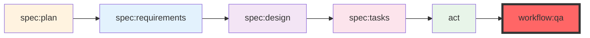

# AI Tools Usage Guide for the Team

## 📑 Table of Contents

- [🎯 Purpose of this document](#-purpose-of-this-document)
- [⚠️ Important warning](#️-important-warning)
- [🛠️ Available tools](#️-available-tools)
  - [1. Claude Code - AI Development Assistant](#1-claude-code---ai-development-assistant)
    - [Access](#access)
    - [Project-specific Configuration](#project-specific-configuration)
    - [Slash Commands](#slash-commands)
    - [Recommended usage](#recommended-usage)
    - [Usage examples](#usage-examples)
  - [2. Local development methodology](#2-local-development-methodology)
    - [Spec-driven development](#spec-driven-development)
    - [Available commands](#available-commands)
    - [Command workflow](#command-workflow)
- [📋 Recommended workflow](#-recommended-workflow)
  - [For a new feature](#for-a-new-feature)
  - [For maintenance/debugging](#for-maintenancedebugging)
- [🚀 Integration with existing tools](#-integration-with-existing-tools)
  - [With Docker Compose](#with-docker-compose)
  - [With project QA tools](#with-project-qa-tools)
  - [With Git and PRs](#with-git-and-prs)
- [📝 Team best practices](#-team-best-practices)
  - [Do's ✅](#dos-)
  - [Don'ts ❌](#donts-)
- [🔒 Security and privacy](#-security-and-privacy)
  - [Data to NEVER share with AI](#data-to-never-share-with-ai)
  - [Data OK to share](#data-ok-to-share)
- [📊 Measuring effectiveness](#-measuring-effectiveness)
  - [Positive metrics](#positive-metrics)
  - [Warning signs](#warning-signs)
- [🎓 Continuous learning](#-continuous-learning)
  - [Resources](#resources)
  - [Skill evolution](#skill-evolution)
- [🤝 Support and mutual aid](#-support-and-mutual-aid)
- [💡 Conclusion](#-conclusion)

---

## 🎯 Purpose of this document

This guide explains how to use artificial intelligence tools available to the team to improve your development productivity. These tools are designed to **assist** you in your daily tasks, **not to replace you**.

## ⚠️ Important warning

> **AI tools are assistants, not replacements**
> 
> - They can make mistakes
> - They don't always understand the complete business context
> - Their code must **always** be reviewed and tested
> - Your human expertise remains **irreplaceable**
> - Never blindly trust AI suggestions

## 🛠️ Available tools

### 1. Claude Code - AI Development Assistant

[Claude Code](https://claude.ai/code) is Anthropic's official development assistant that understands your codebase and provides contextual assistance.

#### Access

Claude Code is available at: https://claude.ai/code

**Requirements:**
- Claude Pro subscription
- Modern web browser
- Project files accessible locally

#### Project-specific Configuration

The project includes comprehensive documentation and methodology:

**📁 Key files:**
- `CLAUDE.md` - Main project instructions and standards
- `.claude/CLAUDE.md` - Spec-driven development methodology
- `.claude/commands/` - Slash command definitions
- `docs/reference/` - Architecture and development guidelines

**🏗️ Architecture:**
- Domain-Driven Design (DDD)
- Hexagonal Architecture
- CQRS pattern
- Gateway pattern
- Test-Driven Development (TDD)

#### Slash Commands

The project uses a command-driven workflow with custom slash commands:

**Specification workflow:**
- `/spec:plan` - Break down project into features
- `/spec:requirements` - Detail EARS-formatted requirements
- `/spec:design` - Generate technical design
- `/spec:tasks` - Create TDD implementation tasks
- `/act` - Execute TDD implementation

**Code generation:**
- `/code:hexagonal:value-object` - Create value objects
- `/code:hexagonal:entity` - Create domain entities
- `/code:hexagonal:aggregate` - Create aggregate roots
- `/code:hexagonal:gateway` - Create application gateways
- `/code:hexagonal:command` - Create CQRS commands
- `/code:hexagonal:query` - Create CQRS queries

**Quality assurance:**
- `/workflow:qa` - Run quality checks
- `/utils:qa` - Quality assurance utilities
- `/utils:debug` - Debug assistance

**Documentation:**
- `/utils:adr` - Create Architecture Decision Records
- `/utils:prd` - Create Product Requirements Documents
- `/utils:user-story` - Create user stories

#### Recommended usage

**✅ Best practices:**
- Use spec-driven workflow for new features
- Follow TDD methodology with Red-Green-Refactor
- Provide business context in requirements
- Reference existing files with `@` notation
- Run QA checks continuously during development

**❌ Avoid:**
- Implementing without tests
- Skipping quality assurance
- Accepting code without review
- Making architectural decisions without validation
- Sharing sensitive information

#### Usage examples

```bash
# Start a new feature with planning
/spec:plan Add category management to blog system

# Define requirements
/spec:requirements blog-categories

# Create technical design
/spec:design

# Break down into TDD tasks
/spec:tasks

# Implement with TDD
/act

# Run quality assurance
/workflow:qa
```

### 2. Local development methodology

The project follows a structured spec-driven development methodology defined in `.claude/CLAUDE.md`.

#### Spec-driven development

The methodology provides a structured approach with explicit approval gates:

1. **Planning** - Break down into manageable features
2. **Requirements** - Define WHAT needs to be built (EARS format)
3. **Design** - Define HOW it will be built
4. **Tasks** - Break down into TDD steps
5. **Implementation** - Code following Red-Green-Refactor
6. **Quality Assurance** - Mandatory validation

#### Available commands

All commands are defined in `.claude/commands/` with specific purposes:

**Core workflow commands:**
- Planning and requirements definition
- Technical design generation
- Task breakdown for TDD
- Implementation execution
- Quality assurance

**Domain-specific commands:**
- Value object creation
- Entity and aggregate implementation
- Gateway pattern implementation
- CQRS command/query handlers

#### Command workflow



## 📋 Recommended workflow

### For a new feature

1. **Planning** (with human input)
   - Define business needs
   - Assess impact on existing architecture
   - Decide on technical constraints

2. **AI-assisted specification**
   ```
   /spec:plan Add email notification system for article publishing
   ```

3. **Requirements definition**
   ```
   /spec:requirements article-notifications
   ```

4. **Technical design** (mandatory human validation)
   ```
   /spec:design
   ```

5. **TDD implementation**
   ```
   /spec:tasks
   /act
   ```

6. **Quality assurance** (mandatory)
   ```
   /workflow:qa
   ```

7. **Human review** (mandatory)
   - Comprehensive testing
   - Code review
   - Business validation

### For maintenance/debugging

1. **Problem analysis**
   ```
   /utils:debug error "Class not found exception in ArticleRepository"
   ```

2. **Solution research**
   - AI suggests approaches
   - You validate business relevance

3. **Controlled implementation**
   - Minimal changes
   - Test coverage maintained
   - QA validation

## 🚀 Integration with existing tools

### With Docker Compose

```bash
# Run commands in Docker environment
docker compose exec app composer qa
docker compose exec app bin/phpunit
docker compose exec app bin/console doctrine:migrations:migrate
```

### With project QA tools

The project enforces strict quality standards:

```bash
# Run full QA suite
docker compose exec app composer qa

# Individual tools
docker compose exec app composer qa:ecs      # Code style
docker compose exec app composer qa:phpstan   # Static analysis
docker compose exec app composer qa:rector    # Code modernization
docker compose exec app composer qa:phpunit   # Unit tests
docker compose exec app composer qa:behat     # Functional tests
```

**QA is MANDATORY** - No feature is complete without passing all checks.

### With Git and PRs

Follow semantic commit conventions:
```bash
# Feature
git commit -m "feat(blog): add category management"

# Bug fix
git commit -m "fix: resolve memory leak in cache service"

# With breaking change
git commit -m "feat!: restructure API response format

BREAKING CHANGE: API responses now use envelope format"
```

## 📝 Team best practices

### Do's ✅

- **Collaborate** with AI, don't delegate entirely
- **Explain business context** in your prompts
- **Always validate** suggestions before applying
- **Follow TDD** methodology strictly
- **Run QA continuously** during development
- **Document** decisions made with AI assistance
- **Share** effective prompts with the team

### Don'ts ❌

- **Never** push unreviewed AI-generated code
- **Never** skip tests or QA processes
- **Never** use AI with sensitive data
- **Never** trust architectural suggestions without validation
- **Never** implement without understanding the code
- **Never** mark tasks complete if QA fails

## 🔒 Security and privacy

### Data to NEVER share with AI

- Passwords or API keys
- Real client data
- Sensitive financial information
- Production database contents
- Security vulnerability details
- Complete production configuration

### Data OK to share

- Code structure (without secrets)
- Architecture patterns
- Error messages (sanitized)
- Technical documentation
- Unit tests
- Development configurations

## 📊 Measuring effectiveness

### Positive metrics

- Reduced development time for standard features
- Improved test coverage
- More consistent code patterns
- Better documentation quality
- Faster onboarding for new developers

### Warning signs

- Increased production bugs
- Decreased team code understanding
- Excessive dependence on AI
- Reduced human code reviews
- Skipping QA processes

## 🎓 Continuous learning

### Resources

- Project documentation in `docs/reference/`
- Methodology guide in `.claude/CLAUDE.md`
- Command definitions in `.claude/commands/`
- Architecture patterns in `docs/reference/architecture/patterns/`
- Team experience sharing sessions

### Skill evolution

1. **Novice**: Use AI to understand existing code patterns
2. **Intermediate**: Use AI for test generation and documentation
3. **Advanced**: Use spec-driven workflow for complete features
4. **Expert**: Create custom commands and train the team

## 🤝 Support and mutual aid

### In case of problems

1. **Check** project documentation and guides
2. **Review** error documentation in `docs/reference/agent/errors.md`
3. **Ask** the team for help
4. **Document** solutions found
5. **Share** learnings with the team

### Continuous improvement

- Suggest improvements to workflows
- Document effective prompts
- Share project-specific use cases
- Organize knowledge sharing sessions

---

## 💡 Conclusion

AI tools are **force multipliers** for our development team. Used correctly, they can:

- Accelerate feature development
- Improve code quality and consistency
- Enhance test coverage
- Reduce repetitive tasks
- Maintain high standards

But they never replace:

- Your business expertise
- Your technical judgment
- Your responsibility for code quality
- Your understanding of the codebase
- Your collaboration with the team

**Use them as intelligent assistants, not as autonomous developers.**

Remember: **Quality is mandatory**. No feature is complete without passing all QA checks.

---

*This guide will evolve with our collective experience. Feel free to suggest improvements!*