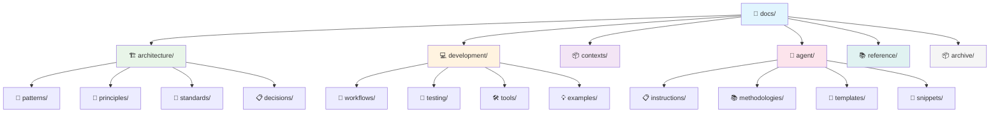

# Vibe PHP Project Documentation

This directory contains all project documentation organized by logical domains for better navigation and maintenance.

## 🗺️ Documentation Structure



```
docs/
├── architecture/       # Architecture and technical patterns
│   ├── patterns/      # Implementation patterns (CQRS, Gateway, etc.)
│   ├── principles/    # Architectural principles (DDD, Hexagonal)
│   ├── standards/     # Coding standards (PSR, PHP 8.4)
│   └── decisions/     # Architecture Decision Records
├── development/        # Developer guides and tools
│   ├── workflows/     # Development workflows
│   ├── testing/       # Testing guides and strategies
│   ├── tools/         # Development tools (makers, external, QA)
│   └── examples/      # Implementation examples
├── contexts/          # Business domain documentation
│   ├── blog/          # Blog context (requirements, design, etc.)
│   ├── security/      # Security context
│   └── billing/       # Billing context
├── agent/             # AI agent specific documentation
│   ├── instructions/  # Agent behavior guidelines
│   ├── methodologies/ # Spec-driven methodology
│   ├── templates/     # Document templates
│   └── snippets/      # Code snippets
├── reference/         # Quick references and integrations
│   ├── integration/   # Integration guides (Sylius, API Platform)
│   └── external-docs.md # External documentation links
└── archive/          # Historical documents
    ├── implementation-summaries/
    └── old-plans/
```

## Documentation Types

### 🏗️ Architecture (`/architecture`)
**Purpose**: Technical architecture and patterns
- **Patterns**: CQRS, Gateway, Domain Layer, etc.
- **Principles**: DDD, Hexagonal Architecture, Clean Architecture  
- **Standards**: PSR compliance, PHP 8.4 features
- **Decisions**: Architecture Decision Records (ADRs)

### 💻 Development (`/development`)
**Purpose**: Developer guides and workflows
- **Workflows**: TDD, database migrations, GitHub PR management
- **Testing**: PHPUnit, Behat, testing patterns
- **Tools**: Code generators (makers), external tools, QA tools
- **Examples**: Implementation examples and usage patterns

### 📦 Contexts (`/contexts`)
**Purpose**: Business domain documentation
- **Requirements**: Product requirements per context
- **Design**: Technical designs and user stories
- **Implementation**: Implementation notes and lessons learned

### 🤖 Agent (`/agent`)
**Purpose**: AI agent instructions and methodologies
- **Instructions**: Behavior guidelines for AI agents
- **Methodologies**: Spec-driven development methodology
- **Templates**: Document templates for various purposes
- **Snippets**: Reusable code snippets

### 📚 Reference (`/reference`)
**Purpose**: Quick references and integrations
- **Integration**: Sylius, API Platform integration guides
- **External Docs**: Links to external documentation

### 📦 Archive (`/archive`)
**Purpose**: Historical documentation
- **Implementation Summaries**: Past implementation lessons
- **Old Plans**: Historical planning documents

## Quick Navigation

### 🎯 I want to implement a feature
1. Start with: `@docs/contexts/[context]/` for requirements
2. Check patterns: `@docs/architecture/patterns/`
3. Follow workflows: `@docs/development/workflows/`
4. See examples: `@docs/development/examples/`

### 🔧 I need to understand architecture
1. Principles: `@docs/architecture/principles/`
2. Patterns: `@docs/architecture/patterns/`
3. Standards: `@docs/architecture/standards/`

### 🧪 I want to write tests
1. Testing guide: `@docs/development/testing/`
2. TDD workflow: `@docs/development/workflows/tdd-implementation-guide.md`

### 🛠️ I need help with tools
1. Code generators: `@docs/development/tools/makers/`
2. External tools: `@docs/development/tools/external/`
3. QA tools: `@docs/development/tools/qa-tools.md`

### 🤖 I'm an AI agent
1. Instructions: `@docs/agent/instructions/`
2. Navigation guide: `@docs/agent/instructions/documentation-navigation.md`
3. Error tracking: `@docs/agent/errors.md`

## Best Practices

### 📁 Organization
- **Logical grouping**: Related docs are together
- **Clear separation**: Agent instructions vs developer guides
- **Consistent structure**: Each domain follows same patterns

### 🔗 Cross-References  
- Use `@docs/path/to/file.md` format for internal links
- Link related documents for easy navigation
- Update links when moving files

### 🔄 Maintenance
- Keep documentation current with code changes
- Archive outdated documents instead of deleting
- Review regularly and consolidate when needed

### 🏷️ Naming Conventions
- Use descriptive filenames
- Follow kebab-case for consistency  
- Include context in filenames when needed

## Contributing to Documentation

1. **Follow the structure**: Place docs in the appropriate domain folder
2. **Use templates**: Check `@docs/agent/templates/` for document templates
3. **Link appropriately**: Reference related documentation
4. **Update navigation**: Update this README when adding new sections

---

🤖 Generated with [Claude Code](https://claude.ai/code)

Co-Authored-By: Claude <noreply@anthropic.com>