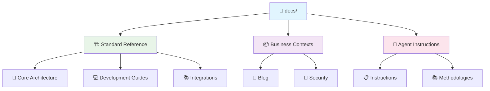
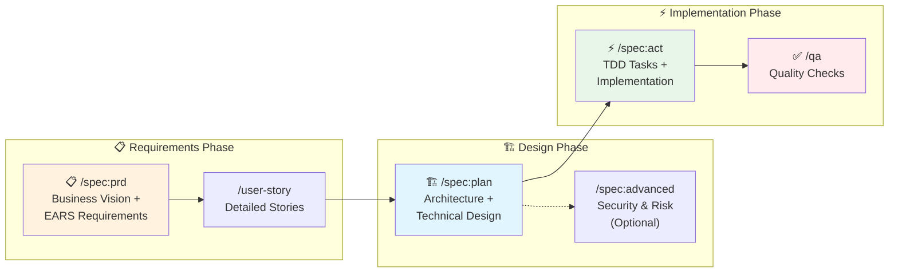

# Vibe PHP Project Documentation

This directory contains all project documentation, organized to guide both human developers and AI agents.

## 🗺️ Documentation Structure



```
docs/
├── reference/         # Standard architecture, patterns, and workflows for ALL projects.
│   ├── CLAUDE.md      # Entry point for the standard reference.
│   ├── architecture/  # Core architectural patterns (DDD, Hexagonal).
│   ├── development/   # Standard development guides (TDD, Git, Testing).
│   └── reference/     # Standard external documentation links.
├── contexts/          # Business-specific documentation for THIS project.
│   ├── blog/
│   └── security/
└── agent/             # Global instructions for AI agents.
```

## 🚀 Unified Spec-Driven Methodology

We use a unified approach that combines business vision with technical rigor.



### Quick Command Reference
| Command | Purpose | Approval Gate |
|---|---|---|
| `/spec:prd [context] [feature]` | Create PRD with business vision & EARS requirements | ✅ Required |
| `/spec:plan [context]` | Create technical architecture & design | ✅ Required |
| `/spec:act` | Start TDD implementation with task breakdown | ✅ Required |
| `/qa` | Run comprehensive quality checks | ✅ Final |


## 📍 Quick Navigation

### 🤖 I'm an AI agent
1.  **Start Here**: Read the root `CLAUDE.md` file for project-specific instructions.
2.  **Architecture & Patterns**: `@docs/reference/CLAUDE.md` is the entry point for all standard patterns and workflows.
3.  **Business Context**: `@docs/contexts/[context-name]/` contains the requirements for the specific feature you are working on.
4.  **Global Instructions**: `@docs/agent/instructions/` contains your general operating instructions.
5.  **Error Log**: Check `@docs/agent/errors.md` before attempting complex tasks.

### 🧑‍💻 I'm a Human Developer
1.  **Project Overview**: Start with this `README.md`.
2.  **To implement a feature**:
    -   Understand requirements in `@docs/contexts/[context-name]/`.
    -   Follow patterns from `@docs/reference/architecture/patterns/`.
    -   Use workflows from `@docs/reference/development/workflows/`.
3.  **To understand architecture**:
    -   Principles: `@docs/reference/architecture/principles/`
    -   Patterns: `@docs/reference/architecture/patterns/`
    -   Standards: `@docs/reference/architecture/standards/`

---
*This document is the single source of truth for navigating the project's documentation.*
