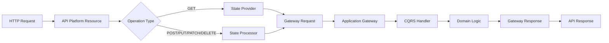

# API Platform Integration Instructions

## Overview

This document defines how to integrate API Platform with our DDD/Hexagonal architecture, treating the API as a UI layer that communicates with the Application layer through Gateways.

## Integration Architecture

### Data Flow



### Key Principles

1. **API Platform as UI Adapter**: API Platform is purely a presentation layer
2. **Gateways as Entry Points**: All API operations go through Application Gateways
3. **State Providers/Processors**: Bridge between API Platform and our architecture
4. **No Business Logic in API Layer**: All business logic remains in Domain layer
5. **Clean Data Transformation**: Clear separation between API DTOs and Domain objects

## Implementation Structure

### Directory Organization

```
src/
└── [Context]Context/
    └── UI/
        └── Api/
            └── Rest/
                ├── Resource/
                │   ├── ArticleResource.php
                │   └── AuthorResource.php
                ├── Provider/
                │   ├── GetArticleProvider.php       # Single article retrieval
                │   ├── ListArticlesProvider.php     # Collection listing
                │   ├── GetAuthorProvider.php
                │   └── ListAuthorsProvider.php
                ├── Processor/
                │   ├── CreateArticleProcessor.php   # POST operations
                │   ├── UpdateArticleProcessor.php   # PUT/PATCH operations
                │   ├── DeleteArticleProcessor.php   # DELETE operations
                │   ├── CreateAuthorProcessor.php
                │   ├── UpdateAuthorProcessor.php
                │   └── DeleteAuthorProcessor.php
                └── Filter/
                    └── ArticleSearchFilter.php
```

#### Single Responsibility Principle for API Layer

Each Provider and Processor should handle **only one operation**:
- **Providers**: One per read operation (Get, List)
- **Processors**: One per write operation (Create, Update, Delete)

This ensures:
- Clear separation of concerns
- Easier testing and maintenance
- Better code organization
- Simpler dependency injection

## Implementation Patterns

### 1. API Resource Definition

Resources define the API endpoints and their operations:

```php
namespace App\BlogContext\UI\Api\Rest\Resource;

use ApiPlatform\Metadata\ApiResource;
use ApiPlatform\Metadata\Get;
use ApiPlatform\Metadata\GetCollection;
use ApiPlatform\Metadata\Post;
use ApiPlatform\Metadata\Put;
use ApiPlatform\Metadata\Delete;
use App\BlogContext\UI\Api\Rest\Provider\GetArticleProvider;
use App\BlogContext\UI\Api\Rest\Provider\ListArticlesProvider;
use App\BlogContext\UI\Api\Rest\Processor\CreateArticleProcessor;
use App\BlogContext\UI\Api\Rest\Processor\UpdateArticleProcessor;
use App\BlogContext\UI\Api\Rest\Processor\DeleteArticleProcessor;

#[ApiResource(
    shortName: 'Article',
    operations: [
        new Get(
            uriTemplate: '/articles/{id}',
            provider: GetArticleProvider::class,  // Dedicated provider for GET
        ),
        new GetCollection(
            uriTemplate: '/articles',
            provider: ListArticlesProvider::class,  // Dedicated provider for LIST
        ),
        new Post(
            uriTemplate: '/articles',
            processor: CreateArticleProcessor::class,  // Dedicated processor for CREATE
        ),
        new Put(
            uriTemplate: '/articles/{id}',
            provider: GetArticleProvider::class,  // Reuse GET provider for data loading
            processor: UpdateArticleProcessor::class,  // Dedicated processor for UPDATE
        ),
        new Delete(
            uriTemplate: '/articles/{id}',
            processor: DeleteArticleProcessor::class,  // Dedicated processor for DELETE
        ),
    ],
)]
final class ArticleResource
{
    public function __construct(
        public ?string $id = null,
        public ?string $title = null,
        public ?string $content = null,
        public ?string $slug = null,
        public ?string $status = null,
        public ?\DateTimeImmutable $publishedAt = null,
    ) {}
}
```

### 2. State Provider Pattern (Read Operations)

State Providers handle GET operations by calling Query Gateways. Each provider handles a single operation:

#### GetArticleProvider (Single Item)

```php
namespace App\BlogContext\UI\Api\Rest\Provider;

use ApiPlatform\Metadata\Operation;
use ApiPlatform\State\ProviderInterface;
use App\BlogContext\Application\Gateway\GetArticle\Gateway as GetArticleGateway;
use App\BlogContext\Application\Gateway\GetArticle\Request as GetArticleRequest;
use App\BlogContext\UI\Api\Rest\Resource\ArticleResource;
use App\Shared\Application\Gateway\GatewayException;

final readonly class GetArticleProvider implements ProviderInterface
{
    public function __construct(
        private GetArticleGateway $getArticleGateway,
    ) {}

    public function provide(Operation $operation, array $uriVariables = [], array $context = []): object|array|null
    {
        if (!isset($uriVariables['id'])) {
            return null;
        }

        try {
            $request = GetArticleRequest::fromData(['id' => $uriVariables['id']]);
            $response = ($this->getArticleGateway)($request);
            
            $data = $response->data();
            return isset($data['article']) ? $this->transformToResource($data['article']) : null;
        } catch (GatewayException | \RuntimeException $e) {
            if (str_contains($e->getMessage(), 'not found')) {
                return null; // API Platform will return 404
            }
            throw $e;
        }
    }
    
    private function transformToResource(array $data): ArticleResource
    {
        return new ArticleResource(
            id: $data['id'],
            title: $data['title'],
            content: $data['content'],
            slug: $data['slug'],
            status: $data['status'],
            publishedAt: isset($data['published_at']) && $data['published_at']
                ? new \DateTimeImmutable($data['published_at'])
                : null,
        );
    }
}
```

#### ListArticlesProvider (Collection)

```php
namespace App\BlogContext\UI\Api\Rest\Provider;

use ApiPlatform\Metadata\Operation;
use ApiPlatform\State\ProviderInterface;
use App\BlogContext\Application\Gateway\ListArticles\Gateway as ListArticlesGateway;
use App\BlogContext\Application\Gateway\ListArticles\Request as ListArticlesRequest;
use App\BlogContext\UI\Api\Rest\Resource\ArticleResource;

final readonly class ListArticlesProvider implements ProviderInterface
{
    public function __construct(
        private ListArticlesGateway $listArticlesGateway,
    ) {}

    public function provide(Operation $operation, array $uriVariables = [], array $context = []): object|array|null
    {
        $filters = $context['filters'] ?? [];
        
        $request = ListArticlesRequest::fromData([
            'page' => (int) ($filters['page'] ?? 1),
            'limit' => (int) ($filters['itemsPerPage'] ?? 20),
            'status' => $filters['status'] ?? null,
        ]);
        
        $response = ($this->listArticlesGateway)($request);
        
        $data = $response->data();
        $articles = $data['articles'] ?? [];
        
        return array_map(
            fn (array $article) => $this->transformToResource($article),
            $articles
        );
    }
    
    private function transformToResource(array $data): ArticleResource
    {
        return new ArticleResource(
            id: $data['id'],
            title: $data['title'],
            content: $data['content'],
            slug: $data['slug'],
            status: $data['status'],
            publishedAt: isset($data['published_at']) && $data['published_at']
                ? new \DateTimeImmutable($data['published_at'])
                : null,
        );
    }
}
```

### 3. State Processor Pattern (Write Operations)

State Processors handle POST/PUT/PATCH/DELETE operations by calling Command Gateways. Each processor handles a single operation:

#### CreateArticleProcessor

```php
namespace App\BlogContext\UI\Api\Rest\Processor;

use ApiPlatform\Metadata\Operation;
use ApiPlatform\State\ProcessorInterface;
use App\BlogContext\Application\Gateway\CreateArticle\Gateway as CreateArticleGateway;
use App\BlogContext\Application\Gateway\CreateArticle\Request as CreateArticleRequest;
use App\BlogContext\Domain\CreateArticle\Exception\ArticleAlreadyExists;
use App\BlogContext\UI\Api\Rest\Resource\ArticleResource;
use App\Shared\Application\Gateway\GatewayException;
use Symfony\Component\HttpKernel\Exception\ConflictHttpException;

final readonly class CreateArticleProcessor implements ProcessorInterface
{
    public function __construct(
        private CreateArticleGateway $createArticleGateway,
    ) {}

    public function process(mixed $data, Operation $operation, array $uriVariables = [], array $context = []): mixed
    {
        /** @var ArticleResource $data */
        try {
            $request = CreateArticleRequest::fromData([
                'title' => $data->title,
                'content' => $data->content,
                'slug' => $data->slug,
                'status' => $data->status ?? 'draft',
                'createdAt' => new \DateTimeImmutable()->format(\DateTimeInterface::ATOM),
            ]);

            $response = ($this->createArticleGateway)($request);
            $responseData = $response->data();

            return new ArticleResource(
                id: $responseData['articleId'],
                title: $data->title,
                content: $data->content,
                slug: $responseData['slug'],
                status: $responseData['status'],
                publishedAt: null,
            );
        } catch (\InvalidArgumentException $e) {
            throw new \InvalidArgumentException($e->getMessage(), 422, $e);
        } catch (ArticleAlreadyExists | GatewayException | \RuntimeException $e) {
            if (str_contains($e->getMessage(), 'already exists')) {
                throw new ConflictHttpException('Article with this slug already exists', $e);
            }
            throw $e;
        }
    }
}
```

#### UpdateArticleProcessor

```php
namespace App\BlogContext\UI\Api\Rest\Processor;

use ApiPlatform\Metadata\Operation;
use ApiPlatform\State\ProcessorInterface;
use App\BlogContext\Application\Gateway\UpdateArticle\Gateway as UpdateArticleGateway;
use App\BlogContext\Application\Gateway\UpdateArticle\Request as UpdateArticleRequest;
use App\BlogContext\UI\Api\Rest\Resource\ArticleResource;

final readonly class UpdateArticleProcessor implements ProcessorInterface
{
    public function __construct(
        private UpdateArticleGateway $updateArticleGateway,
    ) {}

    public function process(mixed $data, Operation $operation, array $uriVariables = [], array $context = []): mixed
    {
        /** @var ArticleResource $data */
        try {
            $request = UpdateArticleRequest::fromData([
                'articleId' => $uriVariables['id'],
                'title' => $data->title,
                'content' => $data->content,
                'slug' => $data->slug,
                'status' => $data->status,
            ]);

            $response = ($this->updateArticleGateway)($request);
            $responseData = $response->data();

            return new ArticleResource(
                id: $responseData['articleId'],
                title: $responseData['title'],
                content: $responseData['content'],
                slug: $responseData['slug'],
                status: $responseData['status'],
                publishedAt: $data->publishedAt,
            );
        } catch (\InvalidArgumentException $e) {
            throw new \InvalidArgumentException($e->getMessage(), 422, $e);
        } catch (\RuntimeException $e) {
            if (str_contains($e->getMessage(), 'not found')) {
                throw new \RuntimeException('Article not found', 404, $e);
            }
            throw $e;
        }
    }
}
```

### 4. Custom Filters

Filters provide search and filtering capabilities:

```php
namespace App\BlogContext\UI\Api\Rest\Filter;

use ApiPlatform\Doctrine\Orm\Filter\AbstractFilter;
use ApiPlatform\Doctrine\Orm\Util\QueryNameGeneratorInterface;
use ApiPlatform\Metadata\Operation;
use Doctrine\ORM\QueryBuilder;

final class ArticleSearchFilter extends AbstractFilter
{
    protected function filterProperty(
        string $property,
        mixed $value,
        QueryBuilder $queryBuilder,
        QueryNameGeneratorInterface $queryNameGenerator,
        string $resourceClass,
        Operation $operation = null,
        array $context = []
    ): void {
        if ($property === 'search') {
            $alias = $queryBuilder->getRootAliases()[0];
            $queryBuilder
                ->andWhere("{$alias}.title LIKE :search OR {$alias}.content LIKE :search")
                ->setParameter('search', "%{$value}%");
        }
    }

    public function getDescription(string $resourceClass): array
    {
        return [
            'search' => [
                'property' => 'search',
                'type' => 'string',
                'required' => false,
                'description' => 'Search in title and content',
            ],
        ];
    }
}
```

## Service Configuration

### Dependency Injection

```yaml
# config/services.yaml
services:
    # API Resources
    App\BlogContext\UI\Api\Rest\Resource\:
        resource: '../src/BlogContext/UI/Api/Rest/Resource/'
        tags: ['api_platform.resource']

    # State Providers
    App\BlogContext\UI\Api\Rest\Provider\:
        resource: '../src/BlogContext/UI/Api/Rest/Provider/'
        tags: ['api_platform.state_provider']

    # State Processors
    App\BlogContext\UI\Api\Rest\Processor\:
        resource: '../src/BlogContext/UI/Api/Rest/Processor/'
        tags: ['api_platform.state_processor']

    # Filters
    App\BlogContext\UI\Api\Rest\Filter\:
        resource: '../src/BlogContext/UI/Api/Rest/Filter/'
        tags: ['api_platform.filter']
```

## Error Handling

### Gateway Exception Transformation

Transform Gateway exceptions to API Platform exceptions:

```php
namespace App\BlogContext\UI\Api\Rest\Provider;

use ApiPlatform\Metadata\Exception\ItemNotFoundException;
use App\Shared\Application\Gateway\GatewayException;

trait ExceptionTransformerTrait
{
    private function transformException(\Throwable $exception): \Throwable
    {
        if ($exception instanceof GatewayException) {
            return match ($exception->getCode()) {
                404 => new ItemNotFoundException($exception->getMessage()),
                400 => new \InvalidArgumentException($exception->getMessage()),
                403 => new \RuntimeException('Access denied', 403),
                default => $exception,
            };
        }
        
        return $exception;
    }
}
```

## Validation Integration

### Using Symfony Validator

```php
#[ApiResource]
final class ArticleResource
{
    #[Assert\NotBlank]
    #[Assert\Length(min: 3, max: 200)]
    public ?string $title = null;

    #[Assert\NotBlank]
    #[Assert\Length(min: 10)]
    public ?string $content = null;

    #[Assert\Regex(pattern: '/^[a-z0-9-]+$/')]
    public ?string $slug = null;
}
```

## Security Integration

### Using Voters

```php
#[ApiResource(
    operations: [
        new Put(
            security: "is_granted('ARTICLE_EDIT', object)",
        ),
        new Delete(
            security: "is_granted('ARTICLE_DELETE', object)",
        ),
    ],
)]
```

## Testing API Resources

### Functional Tests

```php
namespace App\Tests\BlogContext\Functional\UI\Api\Rest;

use ApiPlatform\Symfony\Bundle\Test\ApiTestCase;

final class ArticleResourceTest extends ApiTestCase
{
    public function testGetArticle(): void
    {
        $client = static::createClient();
        
        $client->request('GET', '/api/articles/550e8400-e29b-41d4-a716-446655440000');
        
        $this->assertResponseIsSuccessful();
        $this->assertJsonContains([
            'id' => '550e8400-e29b-41d4-a716-446655440000',
            'title' => 'Test Article',
        ]);
    }
    
    public function testCreateArticle(): void
    {
        $client = static::createClient();
        
        $client->request('POST', '/api/articles', [
            'json' => [
                'title' => 'New Article',
                'content' => 'Article content',
                'slug' => 'new-article',
            ],
        ]);
        
        $this->assertResponseStatusCodeSame(201);
        $this->assertJsonContains(['title' => 'New Article']);
    }
}
```

## Best Practices

### 1. Resource Design
- Keep resources focused on API representation
- Use DTOs, not domain entities
- Include only necessary fields
- Use proper HTTP status codes

### 2. State Provider/Processor
- Keep them thin - delegate to Gateways
- Handle data transformation only
- Use dependency injection for Gateways
- Transform exceptions appropriately

### 3. Performance
- Use pagination for collections
- Implement proper caching strategies
- Optimize Gateway queries
- Use eager loading when necessary

### 4. Documentation
- Use OpenAPI annotations
- Document all operations
- Provide clear error messages
- Include example requests/responses

## Common Patterns

### Pagination Pattern

```php
public function provide(Operation $operation, array $uriVariables = [], array $context = []): object|array|null
{
    $page = $context['filters']['page'] ?? 1;
    $itemsPerPage = $context['filters']['itemsPerPage'] ?? 30;
    
    $request = ListArticlesRequest::fromData([
        'page' => $page,
        'limit' => $itemsPerPage,
    ]);
    
    $response = ($this->listArticlesGateway)($request);
    
    // Return Paginator object for API Platform
    return new Paginator(
        $this->transformCollection($response->data()['articles']),
        $response->data()['total'],
        $page,
        $itemsPerPage
    );
}
```

### Async Operations Pattern

For long-running operations, return 202 Accepted:

```php
private function processAsync(ArticleResource $resource): ArticleResource
{
    $request = ProcessArticleRequest::fromData([
        'id' => $resource->id,
    ]);
    
    // Queue the operation
    ($this->processArticleGateway)($request);
    
    // Return with processing status
    $resource->status = 'processing';
    
    return $resource;
}
```

## Migration from Controllers

When migrating from traditional controllers to API Platform:

1. **Identify Operations**: Map controller actions to API Platform operations
2. **Extract Business Logic**: Move to Domain/Application layers if needed
3. **Create Resources**: Define API resources for each entity
4. **Implement Providers/Processors**: Bridge to existing Gateways
5. **Add Tests**: Ensure functionality is preserved

Remember: API Platform is just another UI adapter. All business logic stays in the Domain layer, orchestration in Application layer, and API Platform handles only HTTP concerns.