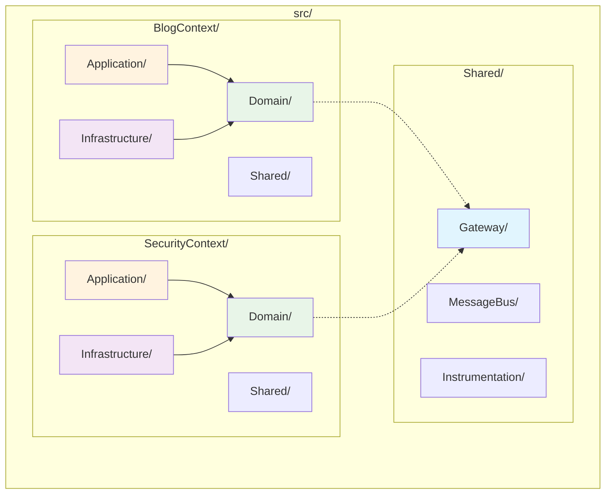

# Architecture Instructions

## Overview

This document defines architectural patterns and constraints for implementing Domain-Driven Design (DDD) with Hexagonal and Clean Architecture principles in this project.

**Note**: For detailed pattern implementations and examples, refer to:
- Pattern documentation: @docs/architecture/patterns/
- Implementation examples: @docs/development/examples/
- Testing guidelines: @docs/development/testing/
- Navigation guide: @docs/agent/instructions/documentation-navigation.md

## Core Architectural Patterns

### Domain-Driven Design (DDD)

#### Bounded Context Structure



```
src/                         # Root namespace: App\
├── [Context]Context/        # Each bounded context (e.g., App\BlogContext\)
│   ├── Application/         # Use cases and gateways
│   ├── Domain/             # Business logic (pure PHP)
│   ├── Infrastructure/     # External adapters
│   ├── UI/                # User interfaces (Web, API, CLI)
│   └── Shared/            # Context-specific shared code
└── Shared/                # Global shared across all contexts (App\Shared\)
```

**PSR-4 Compliance**: All namespaces follow PSR-4 autoloading standard:
- Namespace `App\BlogContext\Domain\CreateArticle` → File `src/BlogContext/Domain/CreateArticle/`
- Class names match filenames exactly (case-sensitive)
- One class per file requirement

#### Domain Layer Organization
Organize by use cases, not technical layers:
```
Domain/
├── CreateUser/             # Use case folder
│   ├── Creator.php         # Entry point with __invoke()
│   ├── DataProvider/       # Input models
│   ├── DataPersister/      # Output models  
│   ├── Event/             # Domain events
│   └── Exception/         # Business exceptions
├── AuthenticateUser/      # Another use case
└── Shared/               # Context shared components
    ├── ValueObject/      # Shared value objects
    └── Repository/       # Repository interfaces
```

### Hexagonal Architecture (Ports & Adapters)

#### Dependency Rules (MANDATORY)
- **Domain**: Zero dependencies on other layers
- **Application**: Depends only on Domain, uses Gateway pattern for entry points
- **Infrastructure**: Implements Domain interfaces, contains concrete implementations
- **UI**: Uses Application through Gateways exclusively

#### Port Definition
- Repository interfaces in `Domain/Shared/Repository/`
- Service interfaces in `Domain/[UseCase]/`
- Pure business logic with no framework dependencies

#### Adapter Implementation
- All adapters in `Infrastructure/` layer
- Doctrine entities separate from Domain models
- Framework-specific code only in Infrastructure

### Clean Architecture

#### Layer Responsibilities
1. **Domain**: Business rules, entities, value objects
2. **Application**: Use cases, orchestration, gateways
3. **Infrastructure**: Database, security, external services
4. **UI**: User interfaces - Web controllers, REST/GraphQL APIs, CLI commands

### CQRS Pattern

**See @docs/architecture/patterns/cqrs-pattern.md for complete CQRS implementation patterns.**

#### Command Side (Write Operations)
```php
// Command structure (MANDATORY)
Application/Operation/Command/[UseCase]/
├── Command.php          # Data transfer object with constructor promotion
└── Handler.php         # Business logic orchestration with EventBus
```

**Example Structure**:
```php
// CreateArticle command
Application/Operation/Command/CreateArticle/
├── Command.php          # readonly class with all operation data
└── Handler.php         # orchestrates Creator + EventBus dispatch
```

#### Query Side (Read Operations)  
```php
// Query structure (MANDATORY)
Application/Operation/Query/[UseCase]/
├── Query.php           # Query parameters (readonly)
├── Handler.php         # Data retrieval logic only
└── View.php            # Response model (readonly)
```

**Example Structure**:
```php
// GetArticle query
Application/Operation/Query/GetArticle/
├── Query.php           # ArticleId parameter
├── Handler.php         # retrieves from repository
└── View.php            # ArticleView response model
```

#### CQRS Rules (MANDATORY)
- **Commands**: Write operations that return void and emit domain events
- **Queries**: Read-only operations that return view models
- **EventBus**: Commands use EventBus for clean event dispatching
- **Events**: Emitted by aggregates, dispatched by Application handlers
- **No Business Logic**: Handlers orchestrate only, domain logic in Domain Creators
- **Domain Purity**: Domain layer has no infrastructure dependencies

#### EventBus Integration
- **EventBusInterface**: Clean abstraction for event dispatching
- **Domain Events**: Emitted by aggregates during business operations
- **Handler Responsibility**: Retrieve events from aggregates and dispatch via EventBus
- **Infrastructure**: EventBus implementation can be synchronous or asynchronous

### Gateway Pattern

#### Purpose
- Technology-agnostic entry points to Application layer
- Transform primitive arrays to/from domain objects via GatewayRequest/GatewayResponse
- Handle cross-cutting concerns via middleware pipeline
- Orchestrate use case execution with instrumentation
- One gateway per use case or tightly related operations

**See @docs/architecture/patterns/gateway-pattern.md for complete implementation guide.**

#### Implementation Rules (MANDATORY)
```php
// Gateway signature (MANDATORY)
public function __invoke(GatewayRequest $request): GatewayResponse

// Gateway structure per use case
Application/Gateway/[UseCase]/
├── Gateway.php                  # Extends DefaultGateway
├── Request.php                  # Implements GatewayRequest
├── Response.php                 # Implements GatewayResponse
└── Middleware/                  # Use case specific middlewares
    ├── Validation.php           # Business validation
    └── Processor.php            # Operation execution
```

#### Complete Gateway Directory Structure
```php
// Example: CreateArticle Gateway
Application/Gateway/CreateArticle/
├── Gateway.php                  # Main gateway extending DefaultGateway
├── Request.php                  # CreateArticleRequest implementing GatewayRequest
├── Response.php                 # CreateArticleResponse implementing GatewayResponse
└── Middleware/
    ├── Validation.php           # Article-specific validation
    └── Processor.php            # Creates command and executes via handler
```

#### Gateway Components Responsibilities

**Gateway.php** (MANDATORY):
- Extends DefaultGateway
- Configures middleware pipeline in constructor
- Uses dependency injection for all middlewares
- Order: DefaultLogger → DefaultErrorHandler → Validation → Processor

**Request.php** (MANDATORY):
- Implements GatewayRequest interface
- readonly class with validation in constructor
- Factory method: `fromData(array $data): self`
- Serialization method: `data(): array`
- Business validation in constructor or dedicated methods

**Response.php** (MANDATORY):
- Implements GatewayResponse interface
- readonly class with all output data
- Serialization method: `data(): array`
- Getters for all properties

**Middleware/Validation.php** (Business-specific):
- Custom validation logic for the specific use case
- Validates Request object
- Throws meaningful exceptions on validation failure

**Middleware/Processor.php** (Operation execution):
- Creates Command/Query from Request
- Executes via appropriate Handler
- Transforms result to Response
- Handles domain events if needed

#### Middleware Pipeline (MANDATORY Order)
```php
Gateway Execution Flow:
1. DefaultLogger (start instrumentation)
2. DefaultErrorHandler (exception handling wrapper)
3. Validation (business-specific input validation)
4. Processor (operation execution via CQRS handlers)
```

#### Shared Gateway Infrastructure
```php
// Shared components in src/Shared/Application/Gateway/
├── DefaultGateway.php          # Base gateway class
├── GatewayRequest.php          # Request interface
├── GatewayResponse.php         # Response interface
├── GatewayException.php        # Error handling
├── Attribute/
│   └── AsGateway.php          # Configuration attribute
├── Middleware/                 # Shared middlewares
│   ├── Pipe.php               # Middleware orchestrator
│   ├── DefaultLogger.php      # Logging middleware
│   └── DefaultErrorHandler.php # Error handling middleware
└── Instrumentation/           # Observability
    ├── GatewayInstrumentation.php
    ├── AbstractGatewayInstrumentation.php
    └── DefaultGatewayInstrumentation.php
```

## Implementation Rules

### Domain Layer (STRICT)

**See @docs/architecture/patterns/domain-layer-pattern.md for domain modeling guidelines.**

#### Entry Points
- Use `__invoke()` method for single responsibility
- Pure PHP with no external dependencies
- Business logic only, no infrastructure concerns

#### Value Objects
- Immutable objects with validation
- Business rules embedded in the object
- Strong typing throughout

#### Domain Events
- Emitted by aggregates during business operations
- Events represent business state changes
- Used for inter-context communication
- Events stored in aggregates until released by Application layer

#### Domain Creators
- Entry points with `__invoke()` method for single responsibility
- Pure PHP with no external dependencies
- Business logic orchestration
- Return aggregates with unreleased events

#### Repository Interfaces
- Define business operations, not CRUD
- Return domain objects, not arrays
- Located in `Domain/Shared/Repository/`

### Application Layer

#### Command Handlers
- Orchestrate domain operations via Creators
- Dispatch domain events via EventBus
- Return void (pure Command pattern)
- No business logic (delegate to Domain Creators)

#### Query Handlers  
- Optimized for read operations
- Return view objects, not domain entities
- Can bypass domain for performance

#### Gateways (MANDATORY Rules)
- **One gateway per use case**: CreateArticle, UpdateArticle, GetArticle, etc.
- **Always extend DefaultGateway**: Never implement gateway logic from scratch
- **Implement GatewayRequest/GatewayResponse pattern**: Use interfaces for type safety
- **Use middleware pipeline**: DefaultLogger → DefaultErrorHandler → Validation → Processor
- **Orchestrate CQRS handlers**: Processor middleware executes Command/Query handlers
- **Provide instrumentation**: All operations logged via DefaultLogger
- **Handle errors consistently**: DefaultErrorHandler wraps all exceptions
- **Validate at gateway level**: Business validation in Validation middleware
- **Transform data**: Request transforms arrays → domain objects, Response transforms domain → arrays

### Infrastructure Layer

#### Generator Pattern
- Identity generation abstraction in `Infrastructure/Generator/`
- GeneratorInterface defines the contract
- UuidGenerator implements Symfony UID v7 generation
- Used for entity identity creation in Domain layer

#### Doctrine Integration
- Entities in `Infrastructure/Persistence/Doctrine/ORM/Entity/`
- Repositories implement domain interfaces
- Separate from domain models (no shared inheritance)
- Use Symfony UID types for UUID storage

#### Security Integration
- Symfony Security components
- LexikJWTAuthenticationBundle for tokens
- Password hashing via Symfony PasswordHasher

#### EventBus Integration
- EventBusInterface in `Shared/Infrastructure/MessageBus/`
- Clean abstraction for event dispatching
- Can be implemented with Symfony Messenger or EventDispatcher
- Used by Application handlers to dispatch domain events

#### Event Listeners
- Event listeners created only when needed for real business logic
- Located in `Infrastructure/EventListener/`
- Handle side effects like notifications, caching, logging

#### Instrumentation Infrastructure
- LoggerInstrumentation in `Infrastructure/Instrumentation/`
- Implements base Instrumentation interface
- Provides PSR-3 logger integration for Gateway instrumentation

### UI Layer

#### UI Layer Organization
The UI layer contains all user interfaces, organized by interface type:

```
UI/
├── Web/              # Web interface (future)
│   └── Controller/   # Symfony controllers for web pages
├── Api/              # API interfaces
│   ├── Rest/         # REST API with API Platform
│   │   ├── Resource/     # API Platform resources
│   │   ├── Processor/    # State processors (write operations)
│   │   ├── Provider/     # State providers (read operations)
│   │   └── Filter/       # Custom filters
│   └── GraphQL/      # GraphQL API (if needed)
│       ├── Resolver/     # GraphQL resolvers
│       └── Type/         # GraphQL types
└── Cli/              # Command Line Interface
    └── Command/      # Symfony Console commands
```

#### API Platform Integration
- **Resources**: Define API endpoints as API Platform resources in `UI/Api/Rest/Resource/`
- **State Providers**: Implement read operations using Application Queries
- **State Processors**: Implement write operations using Application Commands via Gateways
- **Filters**: Custom filters for search and filtering capabilities
- **Validation**: Leverage Symfony Validator with API Platform
- **Security**: Use voters and API Platform security attributes

#### UI Layer Rules
- **No business logic**: UI layer only handles presentation and input transformation
- **Use Gateways**: All operations go through Application Gateways
- **Transform data**: Convert HTTP requests to Gateway requests, Gateway responses to HTTP responses
- **Framework-specific**: This is the only layer where framework-specific UI code is allowed
- **Stateless**: UI components should be stateless
- **Documentation**: Use OpenAPI/Swagger annotations for REST APIs

## Code Organization Rules

### File Naming
- **Entry points**: Use business terms (Creator, Authenticator, Updater)
- **Value objects**: Business concepts (Email, UserId, UserStatus, ArticleId, Title, Content)
- **Events**: Past tense (UserCreated, AuthenticationFailed, ArticleCreated, ArticlePublished)
- **Generators**: Descriptive purpose (UuidGenerator, SequentialGenerator)
- **Gateways**: Action-oriented (CreateUserGateway, AuthenticateUserGateway, CreateArticleGateway)
- **Commands**: Action-oriented (CreateUserCommand, CreateArticleCommand)
- **Queries**: Get/List/Search pattern (GetUserQuery, ListArticlesQuery, SearchArticlesQuery)
- **Views**: Descriptive (UserView, ArticleView, ArticleListView)
- **Handlers**: Match operation (CreateUserHandler, GetUserHandler, CreateArticleHandler)

### Class Structure
- All classes should be `final` by default
- Use constructor property promotion
- Strict typing: `declare(strict_types=1);`

### Testing Structure
- Mirror `src/` structure in `tests/`
- Domain tests: Pure unit tests, no dependencies
- Application tests: Integration with mocked infrastructure
- Infrastructure tests: Real dependencies

## Security Architecture

### Authentication Flow
1. Gateway receives credentials array
2. Domain validates and creates tokens
3. Infrastructure persists attempt records
4. Events notify other contexts

### Authorization Pattern
- Role-based access control in Domain
- Permissions as value objects
- Authorization middleware in gateways

### Audit Trail
- All actions tracked via domain events
- Immutable event log in Infrastructure
- Cross-context event correlation

## Quality Standards

### Architecture Validation
- PHPStan max level with strict rules
- Architecture tests to enforce layer boundaries
- Dependency analysis in CI/CD

### Test Coverage
- Domain layer: >95% coverage required
- Application layer: >90% coverage required
- Infrastructure layer: Integration tests required

### Code Quality
- ECS for style enforcement
- Rector for PHP modernization
- Twig CS Fixer for templates

## Implementation Guidelines

### Starting New Use Cases (MANDATORY Process)
1. **Create domain entry point** with business logic (aggregate methods)
2. **Define value objects and events** in Domain layer
3. **Create CQRS operations**:
   - Command/Handler/Event for write operations
   - Query/Handler/View for read operations
4. **Implement infrastructure adapters** (repositories, event listeners)
5. **Add gateway with complete structure**:
   - Gateway extending DefaultGateway
   - Request implementing GatewayRequest
   - Response implementing GatewayResponse
   - Validation middleware for business rules
   - Processor middleware for operation execution
6. **Configure service container** for dependency injection
7. **Write comprehensive tests** for all layers
8. **Run QA tools** to ensure code quality

### Adding New Contexts
1. Follow same structure as SecurityContext
2. Define clear boundaries and interfaces
3. Use events for inter-context communication
4. Keep contexts independent

### Database Design
- Domain-driven database schema
- Aggregate boundaries respected
- Event sourcing for audit requirements

## Common Patterns

### Factory Pattern
- Domain model creation in `DataPersister/[Name]Builder.php`
- Infrastructure factories for test data
- Separate creation logic from business logic

### Repository Pattern
- Interfaces in Domain layer
- Implementations in Infrastructure layer
- Business-focused method names

### Event Sourcing
- Optional for complex domains
- Required for audit trail
- Events as first-class citizens

## Anti-Patterns to Avoid

### Domain Layer Violations
- ❌ Framework dependencies in Domain
- ❌ Database entities in Domain
- ❌ Infrastructure concerns in business logic

### Application Layer Violations  
- ❌ Business logic in command handlers
- ❌ Direct database access
- ❌ Framework-specific code

### Infrastructure Layer Violations
- ❌ Business logic in repositories
- ❌ Domain logic in event listeners
- ❌ Tight coupling to specific technologies

## Remember

- **Domain First**: Start with business rules, add infrastructure later
- **Test Driven**: Write tests before implementation
- **Event Driven**: Use events for loose coupling
- **Interface Driven**: Define contracts before implementations
- **Single Responsibility**: One class, one reason to change

This architecture ensures maintainable, testable, and scalable code that reflects business requirements accurately.