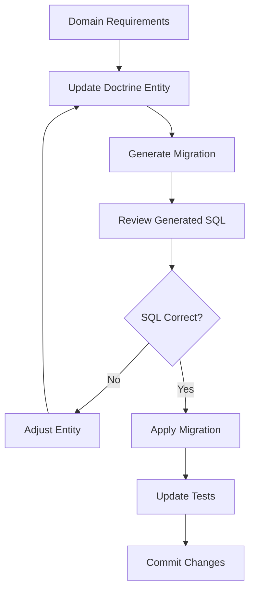

# Doctrine Migrations Instructions

## Overview

This document defines standards and best practices for using Doctrine Migrations in this project, following Symfony recommendations for database schema management in Domain-Driven Design architecture.

## Core Principles

### 1. Entity-First Approach

- **Never write SQL directly**: Always start with Doctrine entities
- **Domain models inform infrastructure**: Business requirements define entity structure
- **Migrations are generated**: Use `doctrine:migrations:diff` to create migrations
- **Review before apply**: Always inspect generated SQL before execution

### 2. Migration Workflow



## Project Structure

### Migration Files Location
```
migrations/
├── Version20250712120000.php    # Initial blog_articles table
├── Version20250712130000.php    # Add blog_authors table
├── Version20250712140000.php    # Add author_id to articles
└── ...                          # Subsequent iterations
```

### Entity Location
```
src/{Context}/Infrastructure/Persistence/Doctrine/Entity/
├── BlogArticle.php              # Articles entity
├── BlogAuthor.php               # Authors entity
├── BlogCategory.php             # Categories entity (Iteration 3)
└── ...                          # Future entities
```

## Command Reference

### Essential Commands

```bash
# 1. Check current migration status
docker compose exec app bin/console doctrine:migrations:status

# 2. Generate migration from entity changes
docker compose exec app bin/console doctrine:migrations:diff

# 3. Execute pending migrations
docker compose exec app bin/console doctrine:migrations:migrate

# 4. Execute specific migration
docker compose exec app bin/console doctrine:migrations:execute --up Version20250712120000

# 5. Rollback last migration (use with caution)
docker compose exec app bin/console doctrine:migrations:execute --down Version20250712120000
```

### Development Commands

```bash
# Dry run - see what SQL will be executed without applying
docker compose exec app bin/console doctrine:migrations:migrate --dry-run

# Show all migrations and their status
docker compose exec app bin/console doctrine:migrations:list

# Get detailed information about specific migration
docker compose exec app bin/console doctrine:migrations:version --add Version20250712120000

# Validate schema against mapping
docker compose exec app bin/console doctrine:schema:validate
```

## Entity Definition Standards

### Base Entity Structure

```php
<?php

declare(strict_types=1);

namespace App\BlogContext\Infrastructure\Persistence\Doctrine\Entity;

use Doctrine\DBAL\Types\Types;
use Doctrine\ORM\Mapping as ORM;
use Symfony\Bridge\Doctrine\Types\UuidType;
use Symfony\Component\Uid\Uuid;

#[ORM\Entity]
#[ORM\Table(name: 'blog_articles')]
#[ORM\Index(columns: ['status'], name: 'idx_articles_status')]
#[ORM\Index(columns: ['slug'], name: 'idx_articles_slug')]
#[ORM\Index(columns: ['published_at'], name: 'idx_articles_published_at')]
class BlogArticle
{
    #[ORM\Id]
    #[ORM\Column(type: UuidType::NAME, unique: true)]
    private Uuid $id;

    #[ORM\Column(type: Types::STRING, length: 200)]
    private string $title;

    #[ORM\Column(type: Types::TEXT)]
    private string $content;

    #[ORM\Column(type: Types::STRING, length: 250, unique: true)]
    private string $slug;

    #[ORM\Column(type: Types::STRING, length: 20)]
    private string $status;

    #[ORM\Column(type: Types::DATETIME_IMMUTABLE)]
    private \DateTimeImmutable $createdAt;

    #[ORM\Column(type: Types::DATETIME_IMMUTABLE, nullable: true)]
    private ?\DateTimeImmutable $publishedAt = null;

    #[ORM\Column(type: Types::DATETIME_IMMUTABLE)]
    private \DateTimeImmutable $updatedAt;

    public function __construct(
        Uuid $id,
        string $title,
        string $content,
        string $slug,
        string $status,
        \DateTimeImmutable $createdAt,
        \DateTimeImmutable $updatedAt,
        ?\DateTimeImmutable $publishedAt = null
    ) {
        $this->id = $id;
        $this->title = $title;
        $this->content = $content;
        $this->slug = $slug;
        $this->status = $status;
        $this->createdAt = $createdAt;
        $this->updatedAt = $updatedAt;
        $this->publishedAt = $publishedAt;
    }

    // Getters and setters...
}
```

### Required Standards

1. **Strict typing**: `declare(strict_types=1);` in all files
2. **UUID as primary key**: Use `UuidType::NAME` for all IDs
3. **Proper indexing**: Add indexes for frequently queried columns
4. **Immutable dates**: Use `DATETIME_IMMUTABLE` for all timestamps
5. **Table naming**: Use `{context}_{entity}` pattern (e.g., `blog_articles`)
6. **Constructor required**: Initialize all properties in constructor

## Migration Patterns

### 1. Creating New Table

When adding a new entity:

```bash
# 1. Create the entity file
# 2. Generate migration
docker compose exec app bin/console doctrine:migrations:diff

# Expected migration output:
# CREATE TABLE blog_articles (
#     id CHAR(36) NOT NULL,
#     title VARCHAR(200) NOT NULL,
#     content LONGTEXT NOT NULL,
#     ...
# )
```

### 2. Adding Column

When adding a property to existing entity:

```php
// Add to entity
#[ORM\Column(type: UuidType::NAME, nullable: true)]
private ?Uuid $authorId = null;
```

```bash
# Generate migration
docker compose exec app bin/console doctrine:migrations:diff

# Expected migration output:
# ALTER TABLE blog_articles ADD author_id CHAR(36) DEFAULT NULL
```

### 3. Adding Relations

```php
// In BlogArticle entity
#[ORM\ManyToOne(targetEntity: BlogAuthor::class)]
#[ORM\JoinColumn(name: 'author_id', referencedColumnName: 'id')]
private ?BlogAuthor $author = null;
```

```bash
# Generate migration
docker compose exec app bin/console doctrine:migrations:diff

# Expected migration output:
# ALTER TABLE blog_articles ADD CONSTRAINT FK_... 
# FOREIGN KEY (author_id) REFERENCES blog_authors (id)
```

### 4. Adding Indexes

```php
// Add to entity class annotation
#[ORM\Index(columns: ['author_id'], name: 'idx_articles_author_id')]
```

## Integration with Development Workflow

### With Act (TDD)

```bash
# 1. Write failing test for new entity/property
# 2. Create/modify Doctrine entity
# 3. Generate migration
docker compose exec app bin/console doctrine:migrations:diff
# 4. Apply migration
docker compose exec app bin/console doctrine:migrations:migrate
# 5. Run tests - should now pass
docker compose exec app composer qa:tests
```

### With PR Creation

Before creating any PR with database changes:

```bash
# 1. Ensure all migrations are applied
docker compose exec app bin/console doctrine:migrations:migrate

# 2. Validate schema consistency
docker compose exec app bin/console doctrine:schema:validate

# 3. Run all QA checks
docker compose exec app composer qa

# 4. Commit migration files with entity changes
git add migrations/ src/
git commit -m "feat(blog): add BlogAuthor entity with migration"
```

### With Git Workflow

Migration files **MUST** be committed together with:
- Entity modifications
- Domain model changes
- Related tests

```bash
# Correct commit structure
git add migrations/Version20250712120000.php
git add src/BlogContext/Infrastructure/Persistence/Doctrine/Entity/BlogAuthor.php
git add src/BlogContext/Domain/Author/
git add tests/BlogContext/Unit/Domain/Author/
git commit -m "feat(blog): implement Author entity and domain model

- Add BlogAuthor Doctrine entity
- Implement Author domain aggregate
- Create migration for blog_authors table
- Add comprehensive test coverage

Closes #123"
```

## Environment-Specific Considerations

### Development Environment

```bash
# Reset database for clean development
docker compose exec app bin/console doctrine:database:drop --force
docker compose exec app bin/console doctrine:database:create
docker compose exec app bin/console doctrine:migrations:migrate

# Load test data (if fixtures exist)
docker compose exec app bin/console doctrine:fixtures:load
```

### Test Environment

```bash
# Fast test database setup
docker compose exec app_test bin/console doctrine:database:create --env=test
docker compose exec app_test bin/console doctrine:migrations:migrate --env=test --no-interaction
```

### Production Environment

```bash
# ALWAYS backup before production migration
# Run with dry-run first
docker compose exec app bin/console doctrine:migrations:migrate --dry-run

# Apply with explicit confirmation
docker compose exec app bin/console doctrine:migrations:migrate --no-interaction
```

## Troubleshooting

### Common Issues

1. **"Migration already exists"**
   ```bash
   # Check status
   docker compose exec app bin/console doctrine:migrations:status
   
   # Mark as executed if needed
   docker compose exec app bin/console doctrine:migrations:version --add Version20250712120000
   ```

2. **"Schema is not in sync"**
   ```bash
   # Validate current schema
   docker compose exec app bin/console doctrine:schema:validate
   
   # Generate diff migration
   docker compose exec app bin/console doctrine:migrations:diff
   ```

3. **"Foreign key constraint fails"**
   - Check entity relationships
   - Ensure referenced tables exist
   - Verify column types match

### Migration Rollback Strategy

**WARNING**: Rollbacks can cause data loss. Use with extreme caution.

```bash
# Safe approach: Create new migration to revert changes
# 1. Modify entity to desired state
# 2. Generate new migration
docker compose exec app bin/console doctrine:migrations:diff

# Dangerous approach: Execute down migration (development only)
docker compose exec app bin/console doctrine:migrations:execute --down Version20250712120000
```

## Quality Standards

### Migration Review Checklist

Before applying any migration:

- [ ] Migration generates expected SQL
- [ ] No data loss in production-bound changes
- [ ] Proper indexes for performance
- [ ] Foreign key constraints are correct
- [ ] Column types match domain requirements
- [ ] Migration is reversible (when possible)

### Performance Considerations

1. **Index Strategy**: Add indexes for:
   - Foreign keys
   - Frequently searched columns
   - Sorting criteria
   - Unique constraints

2. **Column Types**: Use appropriate types:
   - `Types::STRING` with length for short text
   - `Types::TEXT` for long content
   - `UuidType::NAME` for all IDs
   - `Types::DATETIME_IMMUTABLE` for timestamps

3. **Migration Timing**: 
   - Large tables: Consider maintenance windows
   - Add columns as nullable first, then populate
   - Change to NOT NULL in separate migration

## Integration with DDD Architecture

**See @docs/reference/doctrine-orm.md for complete ORM patterns and best practices.**

### Entity vs Domain Model Separation

```php
// Domain Model (src/BlogContext/Domain/CreateArticle/DataPersister/Article.php)
final class Article
{
    private readonly ArticleId $id;
    private readonly Title $title;
    // ... business logic
}

// Infrastructure Entity (src/BlogContext/Infrastructure/Persistence/Doctrine/Entity/BlogArticle.php)
class BlogArticle
{
    private Uuid $id;
    private string $title;
    // ... persistence mapping
}
```

### Repository Implementation

```php
// Repository maps between domain and infrastructure
final class ArticleRepository implements ArticleRepositoryInterface
{
    public function save(Article $article): void
    {
        $entity = $this->mapToEntity($article);
        $this->entityManager->persist($entity);
        $this->entityManager->flush();
    }

    private function mapToEntity(Article $domainArticle): BlogArticle
    {
        return new BlogArticle(
            id: Uuid::fromString($domainArticle->id()->toString()),
            title: $domainArticle->title()->toString(),
            // ... mapping logic
        );
    }
}
```

## Future Considerations

### Schema Evolution Strategy

1. **Additive Changes**: New columns, tables, indexes
2. **Modification Changes**: Column type changes, constraint updates
3. **Removal Changes**: Drop columns, tables (with deprecation period)

### Multi-Context Dependencies

When BlogContext references SecurityContext:

```php
// Avoid foreign key to other contexts
#[ORM\Column(type: UuidType::NAME)]
private Uuid $userId; // Reference only, no FK constraint

// Document the relationship
/**
 * @var Uuid Reference to SecurityContext User ID
 */
private Uuid $userId;
```

Remember: Migrations are the single source of truth for database schema evolution. Always generate them from entity changes and review before applying.

## Related Documentation

- **Complete Workflow**: @docs/agent/workflows/database-migration-workflow.md
- **ORM Patterns**: @docs/reference/doctrine-orm.md
- **Architecture Guidelines**: @docs/agent/instructions/architecture.md