# Documentation Navigation Guide for AI Agents

## Overview

This guide helps AI agents navigate the project documentation efficiently. Different types of documentation are organized in specific locations for clarity and purpose.

## 🗺️ Interactive Documentation Map

```mermaid
mindmap
  root((🏠 Vibe PHP<br/>Documentation))
    🤖 Agent Docs
      📖 Instructions
        Architecture
        Git Workflow
        QA Tools
        Docker
        Symfony
        API Platform
        Doctrine
      🔄 Workflows
        TDD Guide
        PR Management
        Migration Flow
        Act Checklist
      ⚠️ Errors
        Error Log
        Solutions
    📦 Contexts
      📝 Blog
        PRD
        User Stories
        Architecture
        Tech Plan
      🔐 Security
        Authentication
        Authorization
      💰 Billing
        Payments
        Subscriptions
    🔧 Reference
      📐 Patterns
        CQRS
        Gateway
        Domain Layer
        Generator
        Specification
      🐘 PHP 8.4
        Features
        Best Practices
    💡 Examples
      Gateway Usage
      Specification Usage
    🧪 Testing
      PHPUnit Guide
      Behat Guide
      Generator Testing
    🛠️ External Tools
      Symfony Components
      Foundry Bundle
      GitHub CLI
```



## Documentation Structure Map

```
docs/
├── agent/              # YOUR instructions and workflows
├── contexts/           # Business domain documentation
│   └── blog/          # Blog context documentation
│       └── ui-layer-implementation.md  # NEW: UI layer details
├── reference/          # Technical patterns and standards
│   ├── sylius-admin-ui-integration.md  # NEW: Sylius Admin UI
│   └── sylius-stack-integration.md     # NEW: Sylius Stack setup
├── testing/            # Testing strategies and guides
│   └── behat-sylius-patterns.md        # NEW: Behat with Sylius
├── examples/           # Implementation examples
├── external-tools/     # External tool documentation
├── plan/              # Historical planning documents
└── prd/               # Historical product requirements
```

## Where to Find What

### 🤖 For Agent-Specific Instructions

**Location**: `@docs/agent/`

- **Instructions** (`@docs/agent/instructions/`):
  - How to behave and work
  - Coding standards to follow
  - Tool-specific guidelines
  
- **Workflows** (`@docs/agent/workflows/`):
  - Step-by-step processes
  - Command templates
  - Implementation guides

- **Errors** (`@docs/agent/errors.md`):
  - Learn from past mistakes
  - Check before attempting similar tasks

### 📋 For Business Context and Requirements

**Location**: `@docs/contexts/[context-name]/`

When working on a specific feature:
1. **Start here** to understand the business domain
2. Check the context's:
   - `architecture-overview.md` - Technical architecture
   - `prd.md` - Business requirements
   - `user-stories/` - Detailed feature specs
   - `technical-plan.md` - Implementation roadmap

Example: For blog features → `@docs/contexts/blog/`
- **UI Layer Implementation**: `@docs/contexts/blog/ui-layer-implementation.md` *(NEW)*

### 🔧 For Technical Patterns and Standards

**Location**: `@docs/reference/`

Consult when implementing:
- **CQRS**: `@docs/reference/cqrs-pattern.md`
- **Gateways**: `@docs/reference/gateway-pattern.md`
- **Domain Layer**: `@docs/reference/domain-layer-pattern.md`
- **Doctrine ORM**: `@docs/reference/doctrine-orm.md`
- **PHP Best Practices**: `@docs/reference/php-features-best-practices.md`
- **Sylius Admin UI**: `@docs/reference/sylius-admin-ui-integration.md` *(NEW)*
- **Sylius Stack**: `@docs/reference/sylius-stack-integration.md` *(NEW)*

### 🧪 For Testing Guidelines

**Location**: `@docs/testing/`

Before writing tests:
- **Testing Strategy**: `@docs/testing/README.md`
- **Behat Tests**: `@docs/testing/behat-guide.md`
- **Behat with Sylius Patterns**: `@docs/testing/behat-sylius-patterns.md` *(NEW)*
- **Generator Pattern in Tests**: `@docs/testing/generator-pattern-testing.md`

### 💡 For Implementation Examples

**Location**: `@docs/examples/`

See concrete examples:
- **Gateway Generator**: `@docs/examples/gateway-generator-usage.md`
- **Specification Pattern**: `@docs/examples/specification-pattern-usage.md`

### 🔧 For External Tool Documentation

**Location**: `@docs/external-tools/`

Tool-specific guides:
- **Symfony Components**: Messenger, Serializer, Validator, etc.
- **Testing Tools**: Foundry Bundle
- **Security Tools**: LexikJWT Authentication
- **Development Tools**: GitHub CLI

## Quick Decision Tree

```
Need to understand WHAT to build?
└── Go to: @docs/contexts/[context-name]/

Need to know HOW to implement a pattern?
└── Go to: @docs/reference/[pattern-name].md

Need to see an EXAMPLE?
└── Go to: @docs/examples/

Need to write TESTS?
└── Go to: @docs/testing/

Need EXTERNAL TOOL help?
└── Go to: @docs/external-tools/

Need AGENT-SPECIFIC guidance?
└── Go to: @docs/agent/instructions/

Encountered an ERROR before?
└── Check: @docs/agent/errors.md
```

## Common Scenarios

### Scenario 1: Implementing a New Feature
1. Read the PRD: `@docs/contexts/[context]/prd.md`
2. Check architecture: `@docs/contexts/[context]/architecture-overview.md`
3. Find the user story: `@docs/contexts/[context]/user-stories/US-XXX-*.md`
4. Apply patterns from: `@docs/reference/`
5. Follow workflows from: `@docs/agent/workflows/`

### Scenario 2: Creating a Gateway
1. Read pattern: `@docs/reference/gateway-pattern.md`
2. See example: `@docs/examples/gateway-generator-usage.md`
3. Follow architecture: `@docs/agent/instructions/architecture.md`

### Scenario 3: Writing Tests
1. Check strategy: `@docs/testing/README.md`
2. For Behat: `@docs/testing/behat-guide.md`
3. For Sylius patterns: `@docs/testing/behat-sylius-patterns.md`
4. Follow TDD: `@docs/agent/workflows/tdd-implementation-guide.md`

### Scenario 4: Database Changes
1. Read guidelines: `@docs/agent/instructions/doctrine-migrations.md`
2. Check patterns: `@docs/reference/doctrine-orm.md`
3. Follow workflow: `@docs/agent/workflows/database-migration-workflow.md`

### Scenario 5: Adding Admin UI *(NEW)*
1. Read Sylius Admin UI guide: `@docs/reference/sylius-admin-ui-integration.md`
2. Check UI implementation: `@docs/contexts/[context]/ui-layer-implementation.md`
3. Follow architecture patterns: `@docs/agent/instructions/architecture.md`

## Important References to Memorize

These are the most frequently needed documents:

1. **Architecture Rules**: `@docs/agent/instructions/architecture.md`
2. **CQRS Pattern**: `@docs/reference/cqrs-pattern.md`
3. **Gateway Pattern**: `@docs/reference/gateway-pattern.md`
4. **QA Tools**: `@docs/agent/instructions/qa-tools.md`
5. **Git Workflow**: `@docs/agent/instructions/git-workflow.md`

## Pro Tips

1. **Always check the context first**: Business requirements drive technical decisions
2. **Reference before implementing**: Patterns exist for consistency
3. **Examples clarify patterns**: When in doubt, check examples
4. **Errors are learning**: Check `@docs/agent/errors.md` to avoid repeated mistakes
5. **Cross-reference**: Documents often link to related resources

## Navigation Commands

You can use these phrases to quickly access documentation:

- "Check the CQRS pattern documentation"
- "Show me the blog context architecture"
- "What does the gateway pattern say about..."
- "Find the testing guide for..."
- "Look up the PHP best practices for..."

Remember: When in doubt, start with the business context (`@docs/contexts/`) and work your way to technical details (`@docs/reference/`).