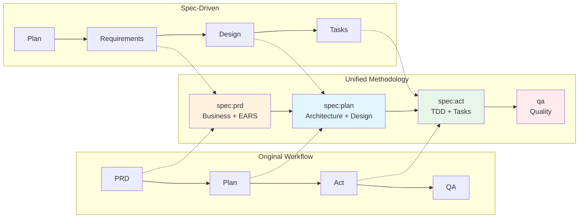
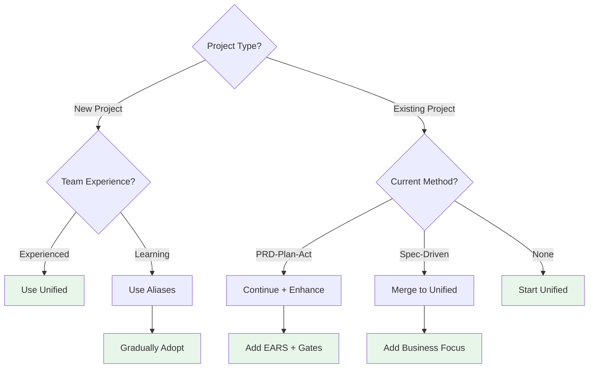

# Methodology Comparison Guide

## Overview

This guide helps you understand the evolution from the original PRD-Plan-Act workflow to the Unified Spec-Driven methodology, and when to use each approach.

## Evolution Timeline



## Methodology Comparison

### Original PRD-Plan-Act

**Strengths:**
- Business-focused approach
- User story driven
- Simple workflow
- Good for straightforward features

**Limitations:**
- Less structured requirements
- No formal approval gates
- Limited risk assessment
- Manual task breakdown

**Best For:**
- Small to medium features
- Well-understood domains
- Rapid prototyping
- Teams familiar with agile

### Pure Spec-Driven

**Strengths:**
- Highly structured process
- EARS format precision
- Explicit approval gates
- Comprehensive analysis

**Limitations:**
- Can be overly rigid
- More upfront planning
- Less business context
- Separate from existing workflow

**Best For:**
- Complex systems
- High-risk projects
- Regulatory compliance
- Large teams

### Unified Spec-Driven (Recommended)

**Strengths:**
- Best of both approaches
- Business vision + technical rigor
- Flexible approval gates
- Integrated workflow
- Backward compatible

**Best For:**
- All project types
- Teams transitioning
- Enterprise applications
- Long-term maintenance

## Feature Comparison Table

| Feature | PRD-Plan-Act | Spec-Driven | Unified |
|---------|--------------|-------------|---------|
| Business Focus | ✅ High | ⚪ Medium | ✅ High |
| Technical Precision | ⚪ Medium | ✅ High | ✅ High |
| Requirements Format | User Stories | EARS | Both |
| Approval Gates | ❌ None | ✅ Explicit | ✅ Flexible |
| Risk Assessment | ⚪ Basic | ✅ Comprehensive | ✅ Comprehensive |
| TDD Integration | ✅ Yes | ✅ Yes | ✅ Enhanced |
| Learning Curve | ✅ Low | ❌ High | ⚪ Medium |
| Flexibility | ✅ High | ❌ Low | ✅ High |
| Documentation | ⚪ Good | ✅ Excellent | ✅ Excellent |
| Tool Support | ✅ Yes | ✅ Yes | ✅ Yes |

## Command Mapping

### Legacy to Unified

| Legacy Command | Unified Command | What Changed |
|----------------|-----------------|--------------|
| `/prd` | `/spec:prd` | Added EARS format, approval gates |
| `/plan` | `/spec:plan` | Integrated design phase, risk assessment |
| `/act` | `/spec:act` | Structured task breakdown, TDD emphasis |
| `/qa` | `/qa` | No change - already comprehensive |
| `/user-story` | `/user-story` | Enhanced with technical details |
| `/adr` | `/adr` | No change - still valuable |

### New Capabilities

| Command | Purpose | When to Use |
|---------|---------|-------------|
| `/spec:advanced` | Security & risk analysis | High-stakes projects |
| `/spec:status` | Workflow progress tracking | During implementation |
| `/spec:help` | Methodology guidance | Learning the system |

## Migration Strategies

### From PRD-Plan-Act

1. **Gradual Migration**
   ```bash
   # Continue using familiar commands
   /prd blog new-feature  # Automatically uses spec:prd
   /plan blog            # Automatically uses spec:plan
   /act                  # Automatically uses spec:act
   ```

2. **Enhancement Approach**
   - Keep existing PRDs
   - Add EARS requirements gradually
   - Introduce approval gates for new features
   - Maintain backward compatibility

3. **Training Path**
   - Start with aliases
   - Learn EARS format
   - Practice approval gates
   - Adopt advanced features

### From Pure Spec-Driven

1. **Integration Approach**
   - Merge business context into requirements
   - Combine design documents
   - Unify task structures
   - Leverage existing patterns

## Decision Tree



## Best Practices

### When Starting New Projects
1. Use unified methodology from the start
2. Define clear approval gates
3. Write EARS requirements
4. Plan iteratively

### When Enhancing Existing Projects
1. Keep what works
2. Add structure gradually
3. Document decisions
4. Train the team

### When Under Time Pressure
1. Use aliases for speed
2. Skip optional analyses
3. Focus on core workflow
4. Add rigor later

## Common Scenarios

### Scenario 1: Simple CRUD Feature
```bash
/prd blog category-management  # Quick business overview
/plan blog                     # Basic technical design
/act                          # Start implementation
/qa                           # Verify quality
```

### Scenario 2: Complex Integration
```bash
/spec:prd payment gateway-integration  # Detailed requirements
/spec:plan payment                     # Comprehensive design
/spec:advanced                         # Security analysis
/spec:act                             # Structured implementation
/qa                                   # Thorough testing
```

### Scenario 3: Regulatory Compliance
```bash
/spec:prd compliance audit-trail      # Precise requirements
/spec:plan compliance                 # Traceable design
/spec:advanced                        # Risk assessment
/spec:act                            # Documented implementation
/qa                                  # Compliance verification
```

## Key Takeaways

1. **Unified is Best**: Combines strengths of both approaches
2. **Backward Compatible**: Existing workflows continue to work
3. **Flexible Adoption**: Use what you need, when you need it
4. **Enhanced Quality**: Better requirements lead to better code
5. **Team Friendly**: Gradual learning curve with aliases

## Recommended Reading Order

1. Start: This comparison guide
2. Next: `unified-spec-driven.md` - Full methodology
3. Then: `AGENT_INDEX.md` - Updated workflow
4. Practice: Use aliases first, then full commands
5. Master: Add advanced features as needed

Remember: The goal is better software, not perfect process. Use what helps your team deliver quality.