# Unified Spec-Driven Development Methodology

## Overview

This methodology combines the business-focused PRD-Plan-Act workflow with the structured Spec-Driven approach, creating a comprehensive framework for feature development that ensures both business alignment and technical rigor.

## Core Workflow

```mermaid
graph LR
    subgraph "📋 Requirements Phase"
        PRD[Business Vision<br/>& EARS Requirements]
        US[User Stories<br/>with Acceptance Criteria]
        PRD --> US
    end
    
    subgraph "🏗️ Design Phase"
        TECH[Technical Architecture<br/>& Design Patterns]
        API[API Specifications<br/>& Data Models]
        TECH --> API
    end
    
    subgraph "⚡ Implementation Phase"
        TASKS[TDD Task Breakdown<br/>with Test Scenarios]
        CODE[Red-Green-Refactor<br/>Implementation]
        TASKS --> CODE
    end
    
    subgraph "✅ Quality Phase"
        QA[Automated QA<br/>& Code Review]
        DEPLOY[Deployment<br/>& Monitoring]
        QA --> DEPLOY
    end
    
    US -->|Approval Gate| TECH
    API -->|Approval Gate| TASKS
    CODE -->|Approval Gate| QA
    
    style PRD fill:#fff3e0
    style TECH fill:#e1f5fe
    style TASKS fill:#e8f5e9
    style QA fill:#ffebee
```



## Key Principles

### 1. Business-Driven Requirements
- Start with clear business objectives and user needs
- Use EARS (Easy Approach to Requirements Syntax) for precision
- Create traceable user stories with acceptance criteria

### 2. Explicit Approval Gates
- Requirements approval before design
- Design approval before implementation
- Implementation approval before deployment
- Each gate ensures alignment and quality

### 3. Test-Driven Development
- Red-Green-Refactor cycle for all implementations
- Tests describe expected behavior
- Comprehensive test coverage at all levels

### 4. Iterative Refinement
- Allow multiple iterations within each phase
- Continuous improvement based on feedback
- Flexible enough to accommodate changes

## Phase Details

### Phase 1: Requirements (/spec:prd)

Combines business vision with structured requirements:

```markdown
# Product Requirements Document

## Business Overview
- Problem statement and market opportunity
- Target users and personas
- Success metrics and KPIs

## Requirements (EARS Format)
- **Ubiquitous**: "The system SHALL [requirement]"
- **Event-Driven**: "WHEN [trigger] THEN the system SHALL [response]"
- **State-Driven**: "WHILE [state] the system SHALL [requirement]"
- **Conditional**: "IF [condition] THEN the system SHALL [requirement]"

## User Stories
- Story mapping with priorities
- Detailed acceptance criteria
- Test scenarios for each story
```

**Approval Gate**: "Are these requirements complete and aligned with business goals?"

### Phase 2: Design (/spec:plan)

Technical architecture with implementation design:

```markdown
# Technical Design Document

## Architecture Overview
- System components and boundaries
- Technology stack justification
- Integration patterns

## Domain Model
- Aggregates and entities
- Value objects and events
- Repository interfaces

## API Design
- REST/GraphQL endpoints
- Request/response schemas
- Error handling patterns

## Implementation Approach
- Component interactions
- Database schema
- Performance considerations
```

**Approval Gate**: "Does this design address all requirements effectively?"

### Phase 3: Implementation (/spec:act)

Structured TDD implementation:

```markdown
# Implementation Tasks

## Task Breakdown
1. **Task**: [Description]
   - **Red**: Write failing test
   - **Green**: Minimal implementation
   - **Refactor**: Improve code quality
   - **Acceptance**: Criteria to verify

## Test Strategy
- Unit tests for domain logic
- Integration tests for APIs
- Functional tests for user flows
```

**Approval Gate**: "Are all tests passing and code quality standards met?"

### Phase 4: Quality Assurance (/qa)

Comprehensive quality checks:

- Code style (ECS)
- Static analysis (PHPStan)
- Automated refactoring (Rector)
- Test coverage verification
- Performance benchmarks

## Enhanced Features

### Advanced Analysis Options

When deeper analysis is needed:

1. **Security Analysis** (/spec:advanced)
   - STRIDE threat modeling
   - Vulnerability assessment
   - Security controls mapping

2. **Risk Assessment**
   - Technical risks and mitigations
   - Business impact analysis
   - Contingency planning

3. **Scalability Planning**
   - Performance bottleneck identification
   - Scaling strategies
   - Resource optimization

### Integration Patterns

1. **Cross-Reference Support**
   - Link requirements to design decisions
   - Trace user stories to implementation
   - Connect tests to requirements

2. **Version Control Integration**
   - Branch strategy per feature
   - Commit conventions
   - PR templates with checklists

3. **Documentation Generation**
   - Auto-generate API docs from specs
   - Create test reports
   - Build architecture diagrams

## Command Reference

### Core Workflow Commands

```bash
# Phase 1: Requirements
/spec:prd [context] [feature]     # Create PRD with EARS requirements

# Phase 2: Design  
/spec:plan [context]              # Create technical design from requirements

# Phase 3: Implementation
/spec:act                         # Start TDD implementation with tasks

# Phase 4: Quality
/qa                              # Run all quality checks
/qa fix                          # Auto-fix correctable issues
```

### Support Commands

```bash
/spec:status                     # Check current phase and progress
/spec:advanced                   # Add security/risk analysis
/user-story [context] [id]       # Create detailed user story
/adr [title] [status]            # Document architecture decision
```

## File Structure

```
project/
├── docs/
│   ├── contexts/
│   │   └── [context]/
│   │       ├── requirements/
│   │       │   ├── prd.md              # Business + EARS requirements
│   │       │   └── user-stories/       # Individual stories
│   │       ├── design/
│   │       │   ├── technical-plan.md   # Architecture + design
│   │       │   └── api-spec.md         # API specifications
│   │       ├── implementation/
│   │       │   ├── tasks.md            # TDD breakdown
│   │       │   └── test-plan.md        # Test strategy
│   │       └── iterations/
│   │           └── iteration-*.md      # Sprint planning
│   └── agent/
│       └── methodologies/
│           └── unified-spec-driven.md  # This document
└── .claude/
    └── commands/
        └── spec/                       # Unified commands
```

## Migration from Legacy Workflows

### From PRD-Plan-Act
1. Existing PRDs remain valid
2. Enhance with EARS requirements
3. Add approval gates between phases
4. Use structured task breakdown

### From Original Spec-Driven
1. Requirements map to PRD section
2. Design maps to technical plan
3. Tasks integrate with TDD workflow
4. Same approval gate structure

## Best Practices

1. **Start with Why**: Always begin with business objectives
2. **Be Specific**: Use EARS format for testable requirements  
3. **Design First**: Think through architecture before coding
4. **Test Everything**: No code without tests
5. **Iterate Quickly**: Small, frequent improvements
6. **Document Decisions**: Use ADRs for important choices
7. **Review Regularly**: Each approval gate is a quality checkpoint

## Example Usage

```bash
# New feature development
/spec:prd blog comment-system
# Review and approve requirements

/spec:plan blog  
# Review and approve design

/spec:act
# Implement with TDD

/qa
# Verify quality

# Advanced analysis when needed
/spec:advanced
# Add security and risk assessment
```

## Benefits

1. **Comprehensive Coverage**: From business vision to deployment
2. **Quality Gates**: Catch issues early with approval checkpoints
3. **Flexibility**: Adapt to project needs while maintaining structure
4. **Traceability**: Clear links from requirements to implementation
5. **Team Alignment**: Shared understanding through structured docs
6. **Risk Reduction**: Early identification and mitigation
7. **Maintainability**: Well-documented decisions and rationale

This unified methodology provides the structure needed for complex projects while maintaining the agility required for iterative development.